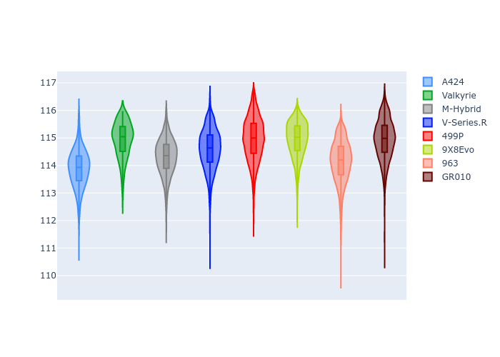
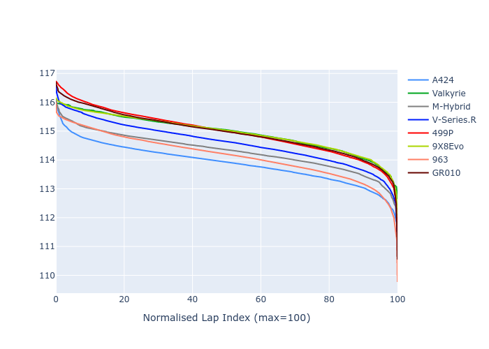

# Combined Plots

## Metadata

- BoP Accuracy: 99.20%
- Overall BoP Grade: A1
- Track: USA
- Threshhold: 210.0kph

## BoP Table
| Manufacturer   | Car        | Weight   | Power   | PINC   | E/Stint   | FDS    |
|:---------------|:-----------|:---------|:--------|:-------|:----------|:-------|
| Alpine         | A424       | 1057kg   | 520.0kw | -1.00% | 916MJ     | -      |
| Aston Martin   | Valkyrie   | 1040kg   | 505.0kw | +0.40% | 900MJ     | -      |
| BMW            | M-Hybrid   | 1051kg   | 512.0kw | +1.00% | 912MJ     | -      |
| Cadillac       | V-Series.R | 1044kg   | 510.0kw | +1.00% | 905MJ     | -      |
| Ferrari        | 499P       | 1073kg   | 508.0kw | -1.00% | 902MJ     | 190kph |
| Peugeot        | 9X8Evo     | 1051kg   | 510.0kw | -1.00% | 905MJ     | 190kph |
| Porsche        | 963        | 1057kg   | 516.0kw | -1.00% | 909MJ     | -      |
| Toyota         | GR010      | 1090kg   | 512.0kw | +1.00% | 912MJ     | 190kph |

## Performance Table
| Manufacturer   | Car        | RP      | QP      | Vavg      |   RDLC | BOP-Grade   | Match   |
|:---------------|:-----------|:--------|:--------|:----------|-------:|:------------|:--------|
| Alpine         | A424       | 1:54.96 | 1:50.97 | 304.44kph |   1.04 | ~A1         | 99.69%  |
| Aston Martin   | Valkyrie   | 1:56.16 | 1:51.31 | 303.18kph |   1.04 | ~A1         | 99.84%  |
| BMW            | M-Hybrid   | 1:55.03 | 1:50.68 | 303.96kph |   1.04 | ~A1         | 99.34%  |
| Cadillac       | V-Series.R | 1:55.29 | 1:51.02 | 300.89kph |   1.04 | ~A1         | 99.83%  |
| Ferrari        | 499P       | 1:56.07 | 1:51.55 | 302.85kph |   1.04 | ~A1         | 99.37%  |
| Peugeot        | 9X8Evo     | 1:56.16 | 1:51.75 | 304.84kph |   1.04 | ~A1         | 95.82%  |
| Porsche        | 963        | 1:55.31 | 1:51.01 | 302.68kph |   1.04 | ~A1         | 99.84%  |
| Toyota         | GR010      | 1:56.05 | 1:51.43 | 304.20kph |   1.04 | ~A1         | 99.90%  |

## Race Laptimes

## Quali Laptimes

## Topspeeds

## Laptimes Lineplot

