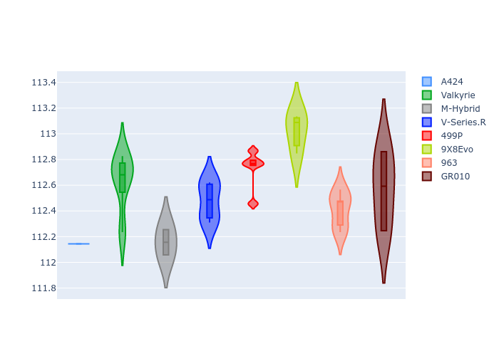
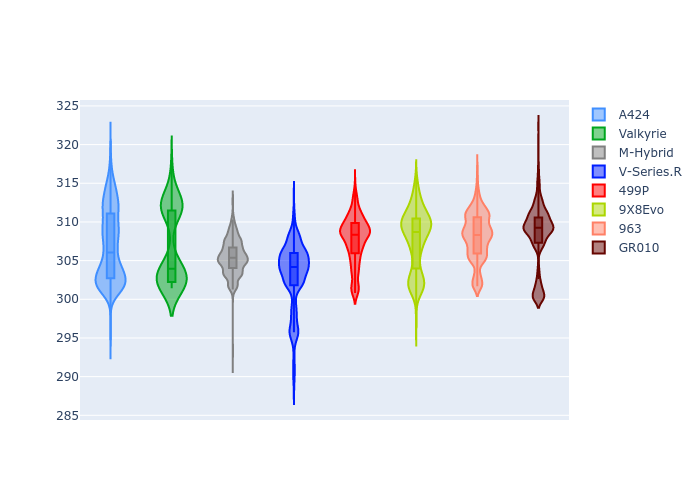

# Combined Plots

## Metadata

- BoP Accuracy: 99.27%
- Overall BoP Grade: A1
- Track: USA
- Threshhold: 250.0kph
- Average Laptime: 1:54.59
- Average Quali Laptime: 1:52.52
- Average Topspeed: 306.77kph

## BoP Table
| Manufacturer   | Car        | Weight   | Power   | PINC   | E/Stint   | FDS    | RDP    | QDP    | TDP    |
|:---------------|:-----------|:---------|:--------|:-------|:----------|:-------|:-------|:-------|:-------|
| Alpine         | A424       | 1057kg   | 520.0kw | -0.10% | 918MJ     | -      | 51.64% | 59.31% | 26.80% |
| Aston Martin   | Valkyrie   | 1042kg   | 514.0kw | -      | 907MJ     | -      | 53.50% | 53.33% | 21.51% |
| BMW            | M-Hybrid   | 1051kg   | 512.0kw | +0.10% | 909MJ     | -      | 52.89% | 56.22% | 33.41% |
| Cadillac       | V-Series.R | 1044kg   | 510.0kw | +0.10% | 903MJ     | -      | 48.63% | 60.80% | 19.01% |
| Ferrari        | 499P       | 1072kg   | 508.0kw | -0.10% | 904MJ     | 190kph | 51.38% | 44.98% | 9.83%  |
| Peugeot        | 9X8Evo     | 1048kg   | 511.0kw | -      | 908MJ     | 190kph | 48.87% | 52.78% | 15.41% |
| Porsche        | 963        | 1057kg   | 516.0kw | -0.10% | 911MJ     | -      | 50.70% | 44.30% | 29.51% |
| Toyota         | GR010      | 1082kg   | 512.0kw | -0.10% | 908MJ     | 190kph | 51.09% | 52.71% | 11.46% |

## Performance Table
| Manufacturer   | Car        | RP      | QP      | Vavg      |   RDLC | BOP-Grade   | Match   |
|:---------------|:-----------|:--------|:--------|:----------|-------:|:------------|:--------|
| Alpine         | A424       | 1:53.88 | 1:52.14 | 306.90kph |   1.02 | ~A1         | 99.97%  |
| Aston Martin   | Valkyrie   | 1:54.94 | 1:52.63 | 306.74kph |   1.02 | ~A1         | 100.00% |
| BMW            | M-Hybrid   | 1:54.31 | 1:52.16 | 305.40kph |   1.02 | ~A1         | 100.00% |
| Cadillac       | V-Series.R | 1:54.59 | 1:52.48 | 303.19kph |   1.02 | ~A1         | 99.65%  |
| Ferrari        | 499P       | 1:54.96 | 1:52.73 | 307.73kph |   1.02 | ~A1         | 96.44%  |
| Peugeot        | 9X8Evo     | 1:54.94 | 1:53.02 | 307.74kph |   1.02 | ~A1         | 100.00% |
| Porsche        | 963        | 1:54.15 | 1:52.41 | 308.13kph |   1.02 | ~A1         | 99.83%  |
| Toyota         | GR010      | 1:54.95 | 1:52.57 | 308.32kph |   1.02 | ~A1         | 98.25%  |

## Race Laptimes

## Quali Laptimes

## Topspeeds

## Laptimes Lineplot

