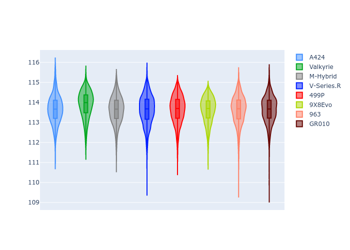
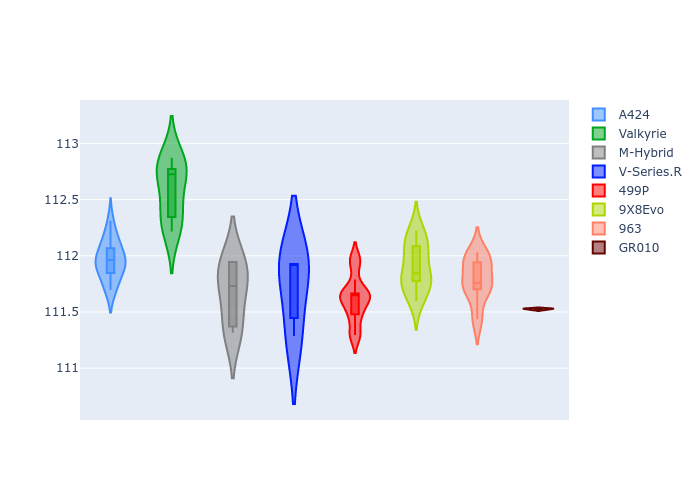
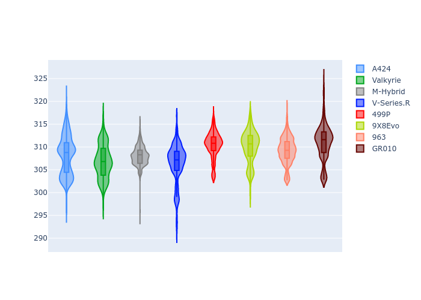
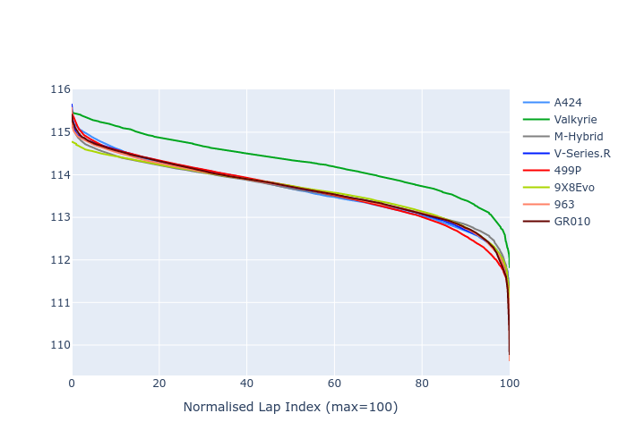

# Combined Plots

## Metadata

- BoP Accuracy: 99.88%
- Overall BoP Grade: A1
- Track: USA
- Threshhold: 250.0kph
- Average Laptime: 1:53.83
- Average Quali Laptime: 1:51.97
- Laptime Std Dev: 0.14 seconds
- Filtered Average Topspeed: 308.85kph

## BoP Table
| Manufacturer   | Car        | Weight   | Power   | PINC   | E/Stint   | FDS    | RDP    | QDP    | TDP    |
|:---------------|:-----------|:---------|:--------|:-------|:----------|:-------|:-------|:-------|:-------|
| Alpine         | A424       | 1037kg   | 503.0kw | +3.30% | 910MJ     | -      | 51.45% | 55.09% | 24.89% |
| Aston Martin   | Valkyrie   | 1030kg   | 520.0kw | -      | 911MJ     | -      | 53.07% | 48.70% | 24.00% |
| BMW            | M-Hybrid   | 1037kg   | 505.0kw | +2.90% | 909MJ     | -      | 52.63% | 52.34% | 34.06% |
| Cadillac       | V-Series.R | 1040kg   | 520.0kw | -      | 911MJ     | -      | 48.80% | 57.26% | 18.10% |
| Ferrari        | 499P       | 1055kg   | 520.0kw | -2.40% | 907MJ     | 190kph | 51.39% | 44.34% | 9.89%  |
| Peugeot        | 9X8Evo     | 1030kg   | 520.0kw | -1.70% | 910MJ     | 200kph | 49.16% | 50.25% | 18.00% |
| Porsche        | 963        | 1031kg   | 511.0kw | -0.90% | 902MJ     | -      | 50.61% | 41.90% | 27.68% |
| Toyota         | GR010      | 1056kg   | 520.0kw | -2.40% | 906MJ     | 190kph | 51.33% | 51.71% | 14.89% |

## Performance Table
| Manufacturer   | Car        | RP      | QP      | Vavg      |   RDLC | BOP-Grade   | Match   |
|:---------------|:-----------|:--------|:--------|:----------|-------:|:------------|:--------|
| Alpine         | A424       | 1:53.78 | 1:52.10 | 308.46kph |   1.01 | ~A1         | 99.88%  |
| Aston Martin   | Valkyrie   | 1:54.19 | 1:52.69 | 308.49kph |   1.01 | ~A1         | 100.00% |
| BMW            | M-Hybrid   | 1:53.76 | 1:51.82 | 308.00kph |   1.02 | ~A1         | 100.00% |
| Cadillac       | V-Series.R | 1:53.80 | 1:51.81 | 306.19kph |   1.02 | ~A1         | 99.87%  |
| Ferrari        | 499P       | 1:53.78 | 1:51.69 | 310.09kph |   1.02 | ~A1         | 99.92%  |
| Peugeot        | 9X8Evo     | 1:53.77 | 1:52.08 | 310.26kph |   1.02 | ~A1         | 100.00% |
| Porsche        | 963        | 1:53.78 | 1:52.10 | 309.10kph |   1.01 | ~A1         | 99.93%  |
| Toyota         | GR010      | 1:53.80 | 1:51.48 | 310.18kph |   1.02 | ~A1         | 99.43%  |

## Race Laptimes

## Quali Laptimes

## Topspeeds

## Laptimes Lineplot

