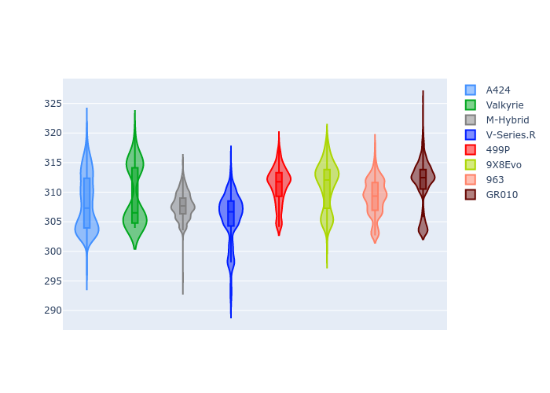

# Combined Plots

## Metadata

- BoP Accuracy: 99.90%
- Overall BoP Grade: A1
- Track: USA
- Threshhold: 250.0kph

## BoP Table
| Manufacturer   | Car        | Weight   | Power   | PINC   | E/Stint   | FDS    | RDP    | QDP    | TDP    |
|:---------------|:-----------|:---------|:--------|:-------|:----------|:-------|:-------|:-------|:-------|
| Alpine         | A424       | 1039kg   | 503.0kw | +2.30% | 908MJ     | -      | 52.35% | 61.85% | 27.84% |
| Aston Martin   | Valkyrie   | 1030kg   | 520.0kw | -0.60% | 909MJ     | -      | 53.59% | 53.33% | 21.51% |
| BMW            | M-Hybrid   | 1040kg   | 500.0kw | +4.00% | 908MJ     | -      | 53.26% | 57.23% | 34.54% |
| Cadillac       | V-Series.R | 1046kg   | 520.0kw | -      | 911MJ     | -      | 47.80% | 56.73% | 19.63% |
| Ferrari        | 499P       | 1063kg   | 518.0kw | -1.40% | 909MJ     | 190kph | 53.02% | 42.32% | 9.88%  |
| Peugeot        | 9X8Evo     | 1030kg   | 520.0kw | -1.70% | 910MJ     | 190kph | 48.47% | 51.26% | 16.02% |
| Porsche        | 963        | 1038kg   | 498.0kw | +4.10% | 905MJ     | -      | 50.87% | 45.25% | 30.77% |
| Toyota         | GR010      | 1061kg   | 520.0kw | -3.00% | 905MJ     | 190kph | 52.43% | 57.12% | 12.82% |

## Performance Table
| Manufacturer   | Car        | RP      | QP      | Vavg      |   RDLC | BOP-Grade   | Match   |
|:---------------|:-----------|:--------|:--------|:----------|-------:|:------------|:--------|
| Alpine         | A424       | 1:54.90 | 1:50.76 | 305.34kph |   1.04 | ~A1         | 99.75%  |
| Aston Martin   | Valkyrie   | 1:54.89 | 1:50.12 | 306.60kph |   1.04 | ~A1         | 100.00% |
| BMW            | M-Hybrid   | 1:54.89 | 1:50.36 | 305.11kph |   1.04 | ~A1         | 100.00% |
| Cadillac       | V-Series.R | 1:54.90 | 1:50.40 | 301.73kph |   1.04 | ~A1         | 100.00% |
| Ferrari        | 499P       | 1:54.90 | 1:49.86 | 305.55kph |   1.05 | ~A1         | 99.83%  |
| Peugeot        | 9X8Evo     | 1:54.88 | 1:50.54 | 308.56kph |   1.04 | ~A1         | 100.00% |
| Porsche        | 963        | 1:54.88 | 1:50.42 | 305.56kph |   1.04 | ~A1         | 99.86%  |
| Toyota         | GR010      | 1:54.89 | 1:49.74 | 305.77kph |   1.05 | ~A1         | 99.76%  |

## Race Laptimes

## Quali Laptimes

## Topspeeds

## Laptimes Lineplot

