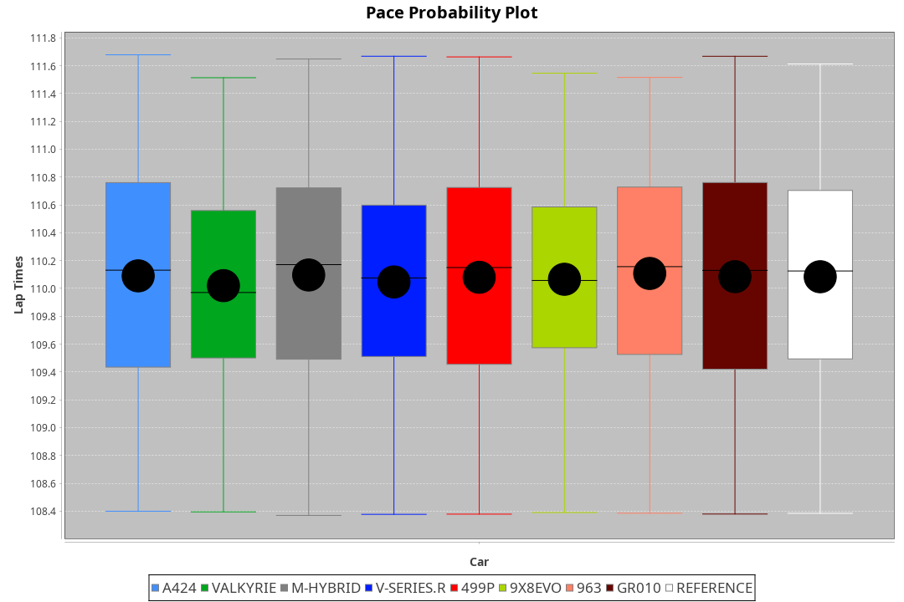
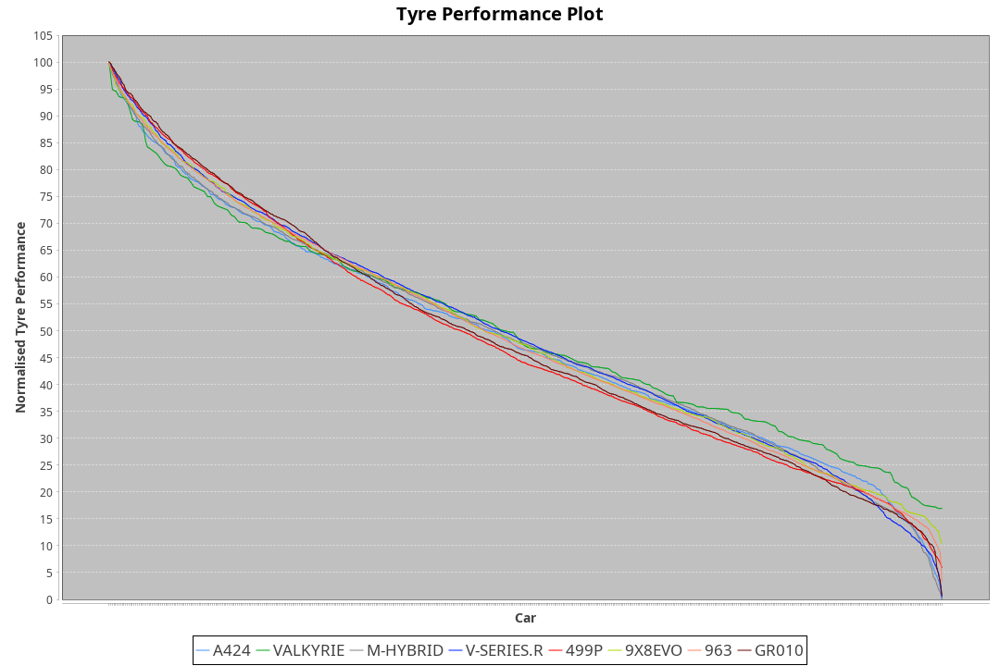

| Manufacturer | Car        | Weight | Power   | PINC    | E/Stint | FDS     |
|:-|:-|:-|:-|:-|:-|:-|
| Alpine       | A424       | 1064kg | 518.0kw | 0.30%   | 918MJ   |    -    |
| Aston Martin | Valkyrie   | 1031kg | 502.0kw | 3.50%   | 904MJ   |    -    |
| BMW          | M-Hybrid   | 1060kg | 518.0kw | 0.30%   | 916MJ   |    -    |
| Cadillac     | V-Series.R | 1058kg | 513.0kw | 1.30%   | 910MJ   |    -    |
| Ferrari      | 499P       | 1087kg | 519.0kw | 0.10%   | 917MJ   | 190kph  |
| Peugeot      | 9X8Evo     | 1030kg | 506.0kw |    -    | 902MJ   | 190kph  |
| Porsche      | 963        | 1060kg | 508.0kw | 2.30%   | 911MJ   |    -    |
| Toyota       | GR010      | 1090kg | 520.0kw |    -    | 918MJ   | 190kph  |

### BoP Accuracy: 94.27%; Overall BoP Grade: A2
| Manufacturer | Car        | Type  | RP      | QP      | Weight | Power¹  | Threshhold | PINC    | Power²   | E/Stint | AVG Vmax  | FDS     | RDLC | L/Stint | BOP-Grade | Model Accuracy | Model Points | Match%  | SimDiff |
|:-|:-|:-|:-|:-|:-|:-|:-|:-|:-|:-|:-|:-|:-|:-|:-|:-|:-|:-|:-|
| Alpine       | A424       | LMDH  | 1:50.29 | 1:46.21 | 1064kg | 518.0kw | 250.0kph   | 0.30%   | 519.60kw |  918MJ  | 278.01kph |    -    | 1.01 | 33      | ~A1       | 99.37%         | 2056         | 96.35%  | +0.34   |
| Aston Martin | Valkyrie   | LMHNH | 1:50.28 | 1:45.94 | 1031kg | 502.0kw | 250.0kph   | 3.50%   | 519.60kw |  904MJ  | 271.55kph |    -    | 1.06 | 33      | +D1       | 100.00%        | 247          | 69.77%  | #       |
| BMW          | M-Hybrid   | LMDH  | 1:50.27 | 1:45.77 | 1060kg | 518.0kw | 250.0kph   | 0.30%   | 519.60kw |  916MJ  | 280.79kph |    -    | 1.01 | 33      | ~A1       | 99.20%         | 3081         | 100.00% | +0.57   |
| Cadillac     | V-Series.R | LMDH  | 1:50.29 | 1:45.95 | 1058kg | 513.0kw | 250.0kph   | 1.30%   | 519.70kw |  910MJ  | 282.29kph |    -    | 1.01 | 33      | +A2       | 99.22%         | 5358         | 92.59%  | +0.91   |
| Ferrari      | 499P       | LMHHU | 1:50.29 | 1:45.70 | 1087kg | 519.0kw | 250.0kph   | 0.10%   | 519.50kw |  917MJ  | 280.54kph | 190kph  | 1.02 | 33      | ~A1       | 99.93%         | 6954         | 100.00% | +0.15   |
| Peugeot      | 9X8Evo     | LMHHU | 1:50.27 | 1:46.16 | 1030kg | 506.0kw | 250.0kph   |    -    | 506.00kw |  902MJ  | 292.37kph | 190kph  | 1.02 | 33      | ~A1       | 100.00%        | 1458         | 95.49%  | +0.85   |
| Porsche      | 963        | LMDH  | 1:50.28 | 1:45.86 | 1060kg | 508.0kw | 250.0kph   | 2.30%   | 519.70kw |  911MJ  | 279.90kph |    -    | 1.01 | 33      | ~A1       | 99.87%         | 14199        | 100.00% | +0.53   |
| Toyota       | GR010      | LMHHU | 1:50.28 | 1:45.48 | 1090kg | 520.0kw | 250.0kph   |    -    | 520.00kw |  918MJ  | 277.62kph | 190kph  | 1.01 | 33      | ~A1       | 99.92%         | 5012         | 100.00% | +0.14   |

## Power below Threshhold
| N/Nmax    | A424    | VALKYRIE | M-HYBRID | V-SERIES.R | 499P    | 9X8EVO  | 963     | GR010   |
|:-|:-|:-|:-|:-|:-|:-|:-|:-|
|  0.550    |  255    |  247     |  255     |  253       |  256    |  249    |  250    |  256    |
|  0.575    |  278    |  270     |  278     |  276       |  279    |  272    |  273    |  279    |
|  0.600    |  299    |  290     |  299     |  296       |  299    |  292    |  293    |  300    |
|  0.625    |  321    |  310     |  321     |  317       |  321    |  313    |  314    |  322    |
|  0.650    |  342    |  331     |  342     |  338       |  342    |  334    |  335    |  343    |
|  0.675    |  364    |  352     |  364     |  360       |  364    |  355    |  357    |  365    |
|  0.700    |  386    |  374     |  386     |  382       |  386    |  377    |  378    |  387    |
|  0.725    |  407    |  395     |  407     |  403       |  408    |  398    |  399    |  409    |
|  0.750    |  428    |  415     |  428     |  424       |  429    |  418    |  420    |  430    |
|  0.775    |  447    |  434     |  447     |  443       |  448    |  437    |  439    |  449    |
|  0.800    |  465    |  451     |  465     |  461       |  466    |  454    |  456    |  467    |
|  0.825    |  480    |  466     |  480     |  476       |  481    |  469    |  471    |  482    |
|  0.850    |  492    |  477     |  492     |  487       |  493    |  481    |  483    |  494    |
|  0.875    |  503    |  487     |  503     |  498       |  504    |  491    |  493    |  505    |
|  0.900    |  510    |  494     |  510     |  505       |  511    |  498    |  500    |  512    |
|  0.925    |  515    |  499     |  515     |  510       |  516    |  503    |  505    |  517    |
| **0.950** | **518** | **502**  | **518**  | **513**    | **519** | **506** | **508** | **520** |
|  0.975    |  516    |  500     |  516     |  511       |  517    |  504    |  506    |  518    |
|  1.000    |  512    |  497     |  512     |  507       |  513    |  501    |  503    |  514    |
|  1.025    |  442    |  429     |  442     |  438       |  443    |  432    |  434    |  444    |

## Power above Threshhold
| N/Nmax    | A424       | VALKYRIE   | M-HYBRID   | V-SERIES.R | 499P       | 9X8EVO  | 963        | GR010   |
|:-|:-|:-|:-|:-|:-|:-|:-|:-|
|  0.550    |  256.27    |  256.28    |  256.27    |  256.33    |  256.26    |  249    |  256.34    |  256    |
|  0.575    |  279.30    |  279.31    |  279.30    |  279.36    |  279.28    |  272    |  279.37    |  279    |
|  0.600    |  299.32    |  299.33    |  299.32    |  299.39    |  299.30    |  292    |  299.39    |  300    |
|  0.625    |  321.34    |  321.35    |  321.34    |  321.41    |  321.32    |  313    |  321.42    |  322    |
|  0.650    |  342.37    |  342.38    |  342.37    |  342.44    |  342.34    |  334    |  342.45    |  343    |
|  0.675    |  364.39    |  364.40    |  364.39    |  364.47    |  364.36    |  355    |  364.48    |  365    |
|  0.700    |  386.41    |  386.42    |  386.41    |  386.50    |  386.39    |  377    |  386.51    |  387    |
|  0.725    |  408.44    |  408.45    |  408.44    |  408.53    |  408.41    |  398    |  408.54    |  409    |
|  0.750    |  429.46    |  429.47    |  429.46    |  429.55    |  429.43    |  418    |  429.57    |  430    |
|  0.775    |  448.48    |  448.49    |  448.48    |  448.58    |  448.45    |  437    |  448.59    |  449    |
|  0.800    |  466.50    |  466.51    |  466.50    |  466.60    |  466.47    |  454    |  466.61    |  467    |
|  0.825    |  481.51    |  481.53    |  481.51    |  481.62    |  481.48    |  469    |  481.63    |  482    |
|  0.850    |  493.53    |  493.54    |  493.53    |  493.64    |  493.49    |  481    |  493.65    |  494    |
|  0.875    |  504.54    |  504.55    |  504.54    |  504.65    |  504.50    |  491    |  504.66    |  505    |
|  0.900    |  511.55    |  511.56    |  511.55    |  511.66    |  511.51    |  498    |  511.67    |  512    |
|  0.925    |  516.55    |  516.57    |  516.55    |  516.67    |  516.52    |  503    |  516.68    |  517    |
| **0.950** | **519.55** | **519.57** | **519.55** | **519.67** | **519.52** | **506** | **519.68** | **520** |
|  0.975    |  517.55    |  517.57    |  517.55    |  517.67    |  517.52    |  504    |  517.68    |  518    |
|  1.000    |  513.55    |  513.56    |  513.55    |  513.66    |  513.51    |  501    |  513.68    |  514    |
|  1.025    |  443.47    |  443.49    |  443.47    |  443.57    |  443.44    |  432    |  443.58    |  444    |
