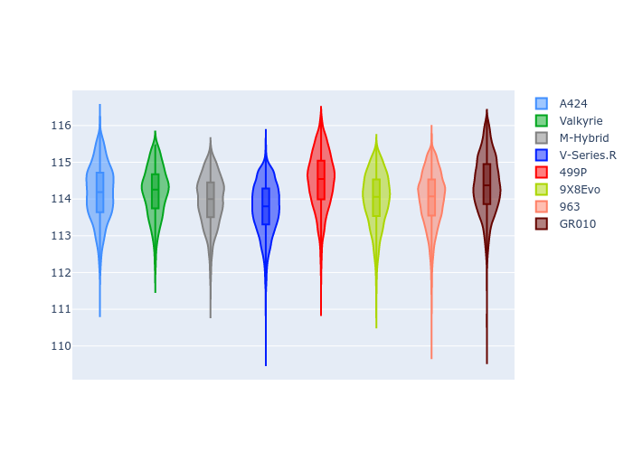
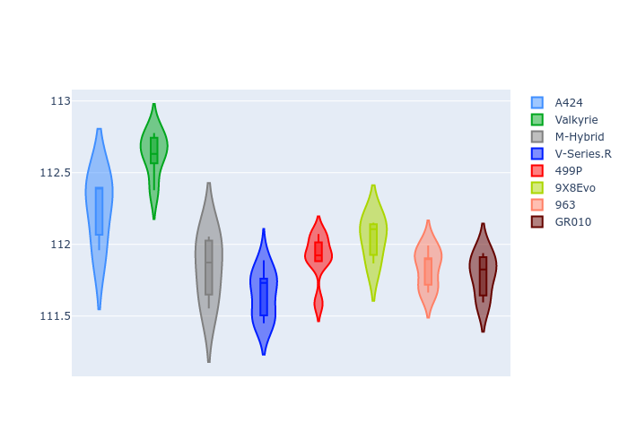
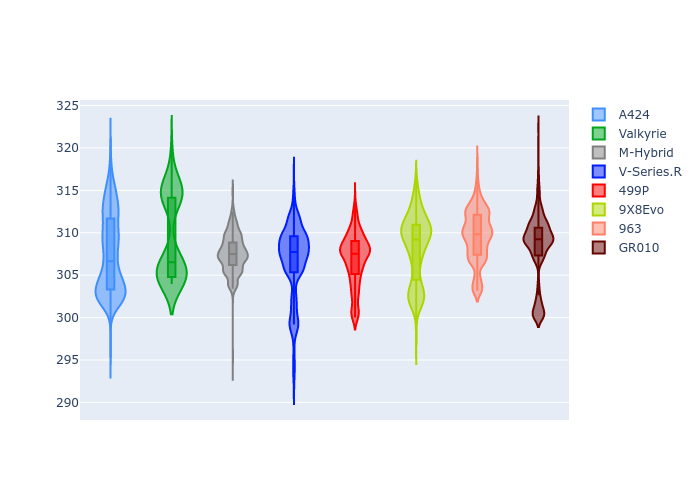
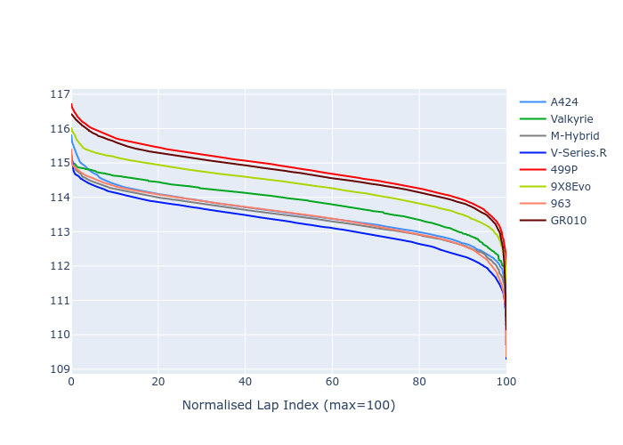

# Combined Plots

## Metadata

- BoP Accuracy: 99.67%
- Overall BoP Grade: A1
- Track: USA
- Threshhold: 250.0kph
- Average Laptime: 1:54.04
- Average Quali Laptime: 1:52.14
- Laptime Std Dev: 0.21 seconds
- Filtered Average Topspeed: 307.94kph

## BoP Table
| Manufacturer   | Car        | Weight   | Power   | PINC   | E/Stint   | FDS    | RDP    | QDP    | TDP    |
|:---------------|:-----------|:---------|:--------|:-------|:----------|:-------|:-------|:-------|:-------|
| Alpine         | A424       | 1046kg   | 511.0kw | +0.50% | 911MJ     | -      | 52.20% | 54.51% | 24.58% |
| Aston Martin   | Valkyrie   | 1030kg   | 520.0kw | -      | 911MJ     | -      | 53.39% | 54.11% | 23.71% |
| BMW            | M-Hybrid   | 1040kg   | 513.0kw | -      | 909MJ     | -      | 53.47% | 52.95% | 33.73% |
| Cadillac       | V-Series.R | 1037kg   | 519.0kw | -      | 910MJ     | -      | 49.22% | 60.31% | 18.04% |
| Ferrari        | 499P       | 1052kg   | 503.0kw | -0.60% | 896MJ     | 190kph | 51.56% | 44.72% | 9.86%  |
| Peugeot        | 9X8Evo     | 1042kg   | 518.0kw | -      | 914MJ     | 190kph | 50.17% | 49.36% | 17.73% |
| Porsche        | 963        | 1046kg   | 511.0kw | +0.60% | 908MJ     | -      | 50.78% | 41.25% | 27.61% |
| Toyota         | GR010      | 1061kg   | 502.0kw | +1.50% | 902MJ     | 190kph | 51.68% | 51.25% | 14.48% |

## Performance Table
| Manufacturer   | Car        | RP      | QP      | Vavg      |   RDLC | BOP-Grade   | Match   |
|:---------------|:-----------|:--------|:--------|:----------|-------:|:------------|:--------|
| Alpine         | A424       | 1:54.10 | 1:52.39 | 306.41kph |   1.02 | ~A1         | 99.79%  |
| Aston Martin   | Valkyrie   | 1:54.29 | 1:52.58 | 306.86kph |   1.02 | ~A1         | 100.00% |
| BMW            | M-Hybrid   | 1:53.94 | 1:51.95 | 306.78kph |   1.02 | ~A1         | 100.00% |
| Cadillac       | V-Series.R | 1:53.63 | 1:51.67 | 306.49kph |   1.02 | ~A1         | 99.98%  |
| Ferrari        | 499P       | 1:54.32 | 1:52.26 | 308.39kph |   1.02 | ~A1         | 98.08%  |
| Peugeot        | 9X8Evo     | 1:53.91 | 1:52.14 | 309.59kph |   1.02 | ~A1         | 100.00% |
| Porsche        | 963        | 1:53.96 | 1:52.08 | 309.11kph |   1.02 | ~A1         | 99.92%  |
| Toyota         | GR010      | 1:54.18 | 1:52.01 | 309.89kph |   1.02 | ~A1         | 99.62%  |

## Race Laptimes

## Quali Laptimes

## Topspeeds

## Laptimes Lineplot

