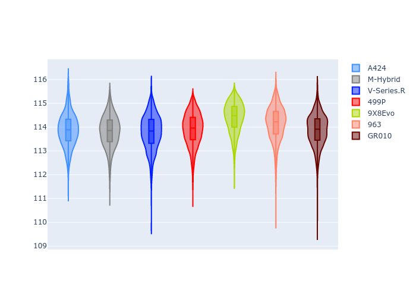
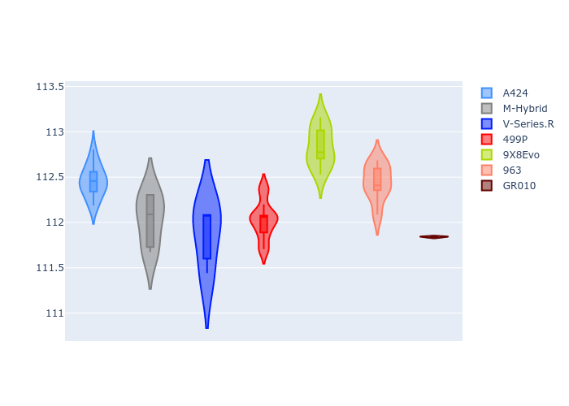
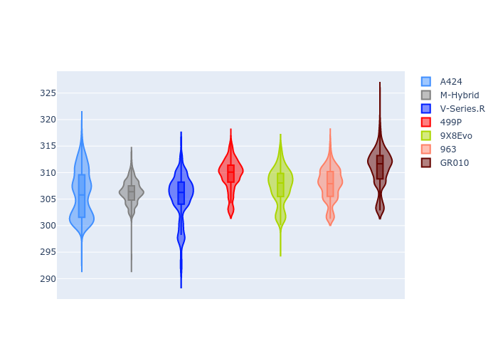
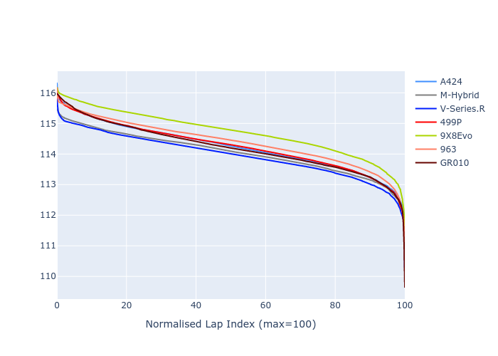

# Combined Plots

## Metadata

- BoP Accuracy: 99.86%
- Overall BoP Grade: A1
- Track: USA
- Threshhold: 250.0kph
- Average Laptime: 1:54.26
- Average Quali Laptime: 1:52.32
- Laptime Std Dev: 0.23 seconds
- Filtered Average Topspeed: 307.61kph

## BoP Table
| Manufacturer   | Car        | Weight   | Power   | PINC   | E/Stint   | FDS    | RDP    | QDP    | TDP    |
|:---------------|:-----------|:---------|:--------|:-------|:----------|:-------|:-------|:-------|:-------|
| Alpine         | A424       | 1041kg   | 515.0kw | -1.90% | 907MJ     | -      | 51.45% | 55.09% | 24.89% |
| BMW            | M-Hybrid   | 1037kg   | 513.0kw | -0.90% | 906MJ     | -      | 52.63% | 52.34% | 34.06% |
| Cadillac       | V-Series.R | 1037kg   | 518.0kw | -0.60% | 907MJ     | -      | 48.80% | 57.26% | 18.10% |
| Ferrari        | 499P       | 1055kg   | 500.0kw | +1.90% | 901MJ     | 190kph | 51.39% | 44.34% | 9.89%  |
| Peugeot        | 9X8Evo     | 1037kg   | 509.0kw | -1.20% | 902MJ     | 190kph | 49.16% | 50.25% | 18.00% |
| Porsche        | 963        | 1053kg   | 509.0kw | +0.70% | 907MJ     | -      | 50.61% | 41.90% | 27.68% |
| Toyota         | GR010      | 1065kg   | 497.0kw | +4.60% | 906MJ     | 190kph | 51.33% | 51.71% | 14.89% |

## Performance Table
| Manufacturer   | Car        | RP      | QP      | Vavg      |   RDLC | BOP-Grade   | Match   |
|:---------------|:-----------|:--------|:--------|:----------|-------:|:------------|:--------|
| Alpine         | A424       | 1:54.24 | 1:52.54 | 306.00kph |   1.02 | ~A1         | 99.88%  |
| BMW            | M-Hybrid   | 1:54.04 | 1:52.08 | 306.35kph |   1.02 | ~A1         | 100.00% |
| Cadillac       | V-Series.R | 1:53.96 | 1:51.97 | 305.54kph |   1.02 | ~A1         | 99.97%  |
| Ferrari        | 499P       | 1:54.25 | 1:52.13 | 309.60kph |   1.02 | ~A1         | 99.94%  |
| Peugeot        | 9X8Evo     | 1:54.71 | 1:52.98 | 307.57kph |   1.02 | ~A1         | 99.47%  |
| Porsche        | 963        | 1:54.39 | 1:52.69 | 307.75kph |   1.02 | ~A1         | 99.90%  |
| Toyota         | GR010      | 1:54.21 | 1:51.86 | 310.45kph |   1.02 | ~A1         | 99.85%  |

## Race Laptimes

## Quali Laptimes

## Topspeeds

## Laptimes Lineplot

