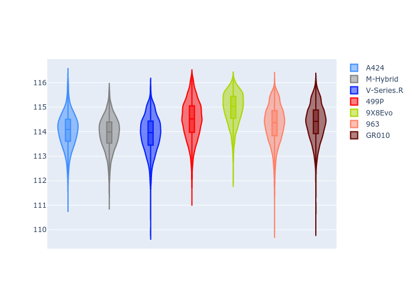
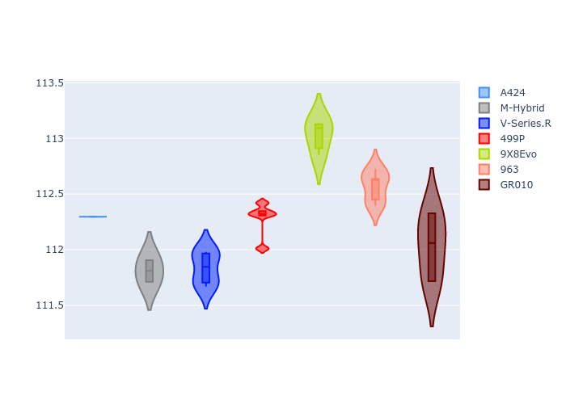
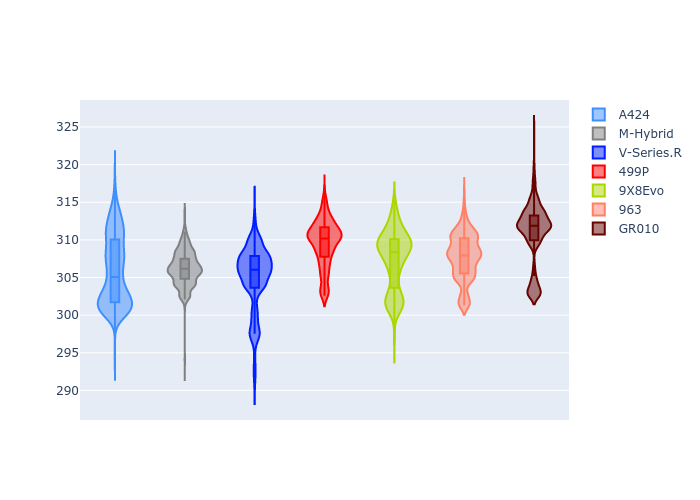
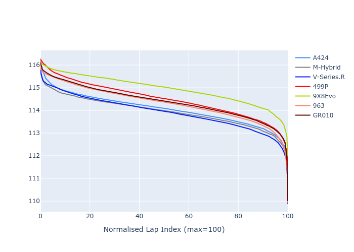

# Combined Plots

## Metadata

- BoP Accuracy: 99.39%
- Overall BoP Grade: A1
- Track: USA
- Threshhold: 250.0kph

## BoP Table
| Manufacturer   | Car        | Weight   | Power   | PINC   | E/Stint   | FDS    |
|:---------------|:-----------|:---------|:--------|:-------|:----------|:-------|
| Alpine         | A424       | 1041kg   | 515.0kw | -1.90% | 907MJ     | -      |
| BMW            | M-Hybrid   | 1037kg   | 513.0kw | -0.90% | 906MJ     | -      |
| Cadillac       | V-Series.R | 1037kg   | 518.0kw | -0.60% | 907MJ     | -      |
| Ferrari        | 499P       | 1055kg   | 500.0kw | +1.90% | 901MJ     | 190kph |
| Peugeot        | 9X8Evo     | 1037kg   | 509.0kw | -1.20% | 902MJ     | 190kph |
| Porsche        | 963        | 1053kg   | 509.0kw | +0.70% | 907MJ     | -      |
| Toyota         | GR010      | 1065kg   | 497.0kw | +4.60% | 906MJ     | 190kph |

## Performance Table
| Manufacturer   | Car        | RP      | QP      | Vavg      |   RDLC | BOP-Grade   | Match   |
|:---------------|:-----------|:--------|:--------|:----------|-------:|:------------|:--------|
| Alpine         | A424       | 1:54.93 | 1:50.95 | 304.21kph |   1.04 | ~A1         | 100.00% |
| BMW            | M-Hybrid   | 1:54.83 | 1:50.49 | 304.01kph |   1.04 | ~A1         | 99.84%  |
| Cadillac       | V-Series.R | 1:54.78 | 1:50.54 | 301.96kph |   1.04 | ~A1         | 99.81%  |
| Ferrari        | 499P       | 1:55.36 | 1:50.90 | 305.49kph |   1.04 | ~A1         | 99.98%  |
| Peugeot        | 9X8Evo     | 1:55.76 | 1:51.38 | 305.88kph |   1.04 | ~A1         | 96.23%  |
| Porsche        | 963        | 1:55.30 | 1:51.01 | 303.06kph |   1.04 | ~A1         | 99.89%  |
| Toyota         | GR010      | 1:55.40 | 1:50.83 | 306.66kph |   1.04 | ~A1         | 99.98%  |

## Race Laptimes

## Quali Laptimes

## Topspeeds

## Laptimes Lineplot

