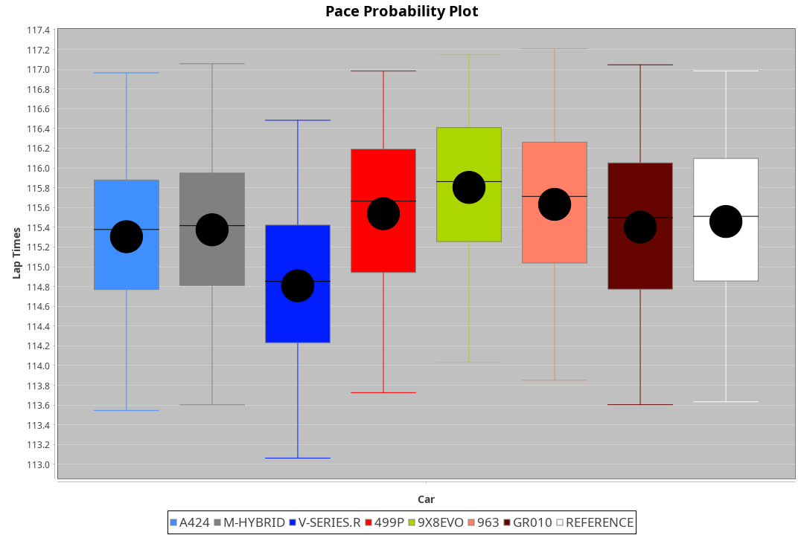
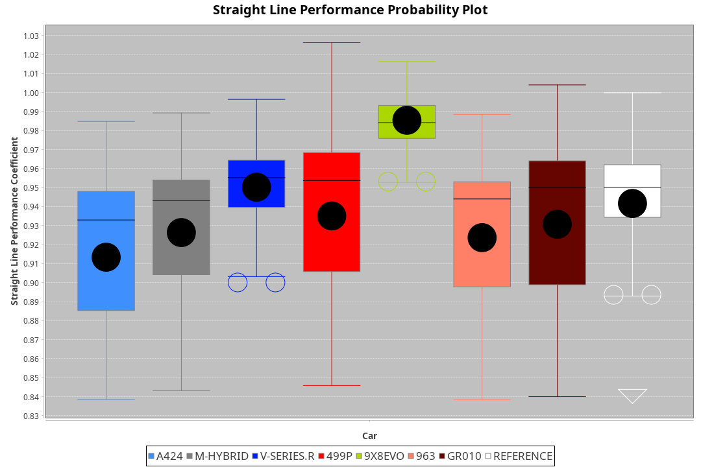
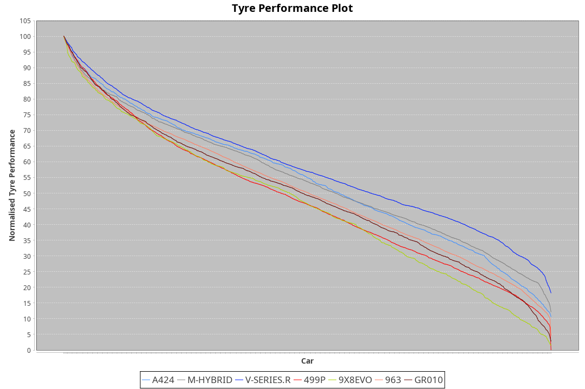

| Manufacturer | Car        | Weight | Power   | PINC   | E/Stint | FDS     |
|:-|:-|:-|:-|:-|:-|:-|
| Alpine       | A424       | 1041kg | 515.0kw | -1.90% | 907MJ   |    -    |
| BMW          | M-Hybrid   | 1037kg | 513.0kw | -0.90% | 906MJ   |    -    |
| Cadillac     | V-Series.R | 1037kg | 518.0kw | -0.60% | 907MJ   |    -    |
| Ferrari      | 499P       | 1055kg | 500.0kw | 1.90%  | 901MJ   | 190kph  |
| Peugeot      | 9X8Evo     | 1037kg | 509.0kw | -1.20% | 902MJ   | 190kph  |
| Porsche      | 963        | 1053kg | 509.0kw | 0.70%  | 907MJ   |    -    |
| Toyota       | GR010      | 1065kg | 497.0kw | 4.60%  | 906MJ   | 190kph  |

### BoP Accuracy: 90.84%; Overall BoP Grade: A2
| Manufacturer | Car        | Type  | RP      | QP      | Weight | Power¹  | Threshhold | PINC   | Power²   | E/Stint | AVG Vmax  | FDS     | RDLC | L/Stint | BOP-Grade | Model Accuracy | Model Points | Match%  | SimDiff |
|:-|:-|:-|:-|:-|:-|:-|:-|:-|:-|:-|:-|:-|:-|:-|:-|:-|:-|:-|:-|
| Alpine       | A424       | LMDH  | 1:50.34 | 1:46.91 | 1041kg | 515.0kw | 250.0kph   | -1.90% | 505.20kw |  907MJ  | 292.15kph |    -    | 1.01 | 33      | +B1       | 99.49%         | 1360         | 87.00%  | -0.45   |
| BMW          | M-Hybrid   | LMDH  | 1:50.15 | 1:45.80 | 1037kg | 513.0kw | 250.0kph   | -0.90% | 508.40kw |  906MJ  | 291.75kph |    -    | 1.02 | 33      | ~A1       | 98.62%         | 2363         | 100.00% | -0.11   |
| Cadillac     | V-Series.R | LMDH  | 1:49.42 | 1:45.48 | 1037kg | 518.0kw | 250.0kph   | -0.60% | 514.90kw |  907MJ  | 288.61kph |    -    | 1.03 | 33      | -C2       | 98.50%         | 4201         | 72.28%  | +0.47   |
| Ferrari      | 499P       | LMHHU | 1:50.07 | 1:45.94 | 1055kg | 500.0kw | 250.0kph   | 1.90%  | 509.50kw |  901MJ  | 291.44kph | 190kph  | 1.04 | 33      | ~A1       | 100.00%        | 4441         | 100.00% | -0.25   |
| Peugeot      | 9X8Evo     | LMHHU | 1:50.19 | 1:46.44 | 1037kg | 509.0kw | 250.0kph   | -1.20% | 502.90kw |  902MJ  | 292.27kph | 190kph  | 1.01 | 33      | +B2       | 100.00%        | 808          | 80.68%  | +0.55   |
| Porsche      | 963        | LMDH  | 1:50.23 | 1:45.83 | 1053kg | 509.0kw | 250.0kph   | 0.70%  | 512.60kw |  907MJ  | 289.56kph |    -    | 1.00 | 33      | ~A1       | 99.87%         | 12613        | 100.00% | -0.04   |
| Toyota       | GR010      | LMHHU | 1:49.94 | 1:45.62 | 1065kg | 497.0kw | 250.0kph   | 4.60%  | 519.90kw |  906MJ  | 289.55kph | 190kph  | 1.02 | 33      | ~A1       | 99.73%         | 2956         | 95.93%  | -0.18   |

## Power below Threshhold
| N/Nmax    | A424    | M-HYBRID | V-SERIES.R | 499P    | 9X8EVO  | 963     | GR010   |
|:-|:-|:-|:-|:-|:-|:-|:-|
|  0.550    |  254    |  253     |  255       |  246    |  251    |  251    |  245    |
|  0.575    |  277    |  276     |  278       |  269    |  274    |  274    |  267    |
|  0.600    |  297    |  296     |  299       |  289    |  294    |  294    |  287    |
|  0.625    |  319    |  317     |  321       |  309    |  315    |  315    |  307    |
|  0.650    |  340    |  338     |  342       |  330    |  336    |  336    |  328    |
|  0.675    |  362    |  360     |  364       |  351    |  357    |  357    |  349    |
|  0.700    |  383    |  382     |  386       |  372    |  379    |  379    |  370    |
|  0.725    |  405    |  403     |  407       |  393    |  400    |  400    |  391    |
|  0.750    |  426    |  424     |  428       |  413    |  421    |  421    |  411    |
|  0.775    |  445    |  443     |  447       |  432    |  440    |  440    |  429    |
|  0.800    |  463    |  461     |  465       |  449    |  457    |  457    |  446    |
|  0.825    |  478    |  476     |  480       |  464    |  472    |  472    |  461    |
|  0.850    |  489    |  487     |  492       |  475    |  484    |  484    |  472    |
|  0.875    |  500    |  498     |  503       |  485    |  494    |  494    |  482    |
|  0.900    |  507    |  505     |  510       |  492    |  501    |  501    |  489    |
|  0.925    |  512    |  510     |  515       |  497    |  506    |  506    |  494    |
| **0.950** | **515** | **513**  | **518**    | **500** | **509** | **509** | **497** |
|  0.975    |  513    |  511     |  516       |  498    |  507    |  507    |  495    |
|  1.000    |  509    |  507     |  512       |  495    |  504    |  504    |  492    |
|  1.025    |  440    |  438     |  442       |  427    |  435    |  435    |  424    |

## Power above Threshhold
| N/Nmax    | A424       | M-HYBRID   | V-SERIES.R | 499P       | 9X8EVO     | 963        | GR010      |
|:-|:-|:-|:-|:-|:-|:-|:-|
|  0.550    |  249.11    |  250.19    |  253.44    |  251.25    |  247.44    |  252.28    |  256.43    |
|  0.575    |  272.12    |  273.21    |  276.48    |  274.27    |  270.48    |  275.30    |  279.46    |
|  0.600    |  292.12    |  293.22    |  297.52    |  294.29    |  290.52    |  296.33    |  299.50    |
|  0.625    |  312.13    |  314.24    |  318.55    |  315.31    |  310.55    |  317.35    |  321.53    |
|  0.650    |  333.14    |  335.25    |  339.59    |  336.33    |  331.59    |  338.37    |  342.57    |
|  0.675    |  355.15    |  357.27    |  361.63    |  357.35    |  352.63    |  359.39    |  364.60    |
|  0.700    |  376.16    |  378.28    |  383.66    |  379.37    |  374.66    |  381.42    |  386.64    |
|  0.725    |  397.17    |  399.30    |  404.70    |  400.39    |  395.70    |  403.44    |  408.68    |
|  0.750    |  417.18    |  420.32    |  425.74    |  421.41    |  415.74    |  423.47    |  429.71    |
|  0.775    |  436.19    |  439.33    |  444.77    |  440.43    |  434.77    |  442.49    |  448.74    |
|  0.800    |  454.19    |  456.34    |  462.80    |  457.45    |  451.80    |  460.51    |  466.77    |
|  0.825    |  469.20    |  471.36    |  477.83    |  472.46    |  466.83    |  475.52    |  481.80    |
|  0.850    |  480.20    |  483.36    |  488.85    |  484.48    |  477.85    |  486.53    |  493.82    |
|  0.875    |  490.21    |  493.37    |  499.87    |  494.49    |  487.87    |  497.55    |  504.84    |
|  0.900    |  497.21    |  500.38    |  506.88    |  501.49    |  494.88    |  504.55    |  511.85    |
|  0.925    |  502.21    |  505.38    |  511.89    |  506.50    |  499.89    |  509.56    |  516.86    |
| **0.950** | **505.21** | **508.38** | **514.89** | **509.50** | **502.89** | **512.56** | **519.86** |
|  0.975    |  503.21    |  506.38    |  512.89    |  507.50    |  500.89    |  510.56    |  517.86    |
|  1.000    |  500.21    |  503.38    |  508.88    |  504.50    |  497.88    |  506.56    |  513.85    |
|  1.025    |  431.18    |  434.33    |  439.76    |  435.43    |  429.76    |  437.48    |  443.74    |
