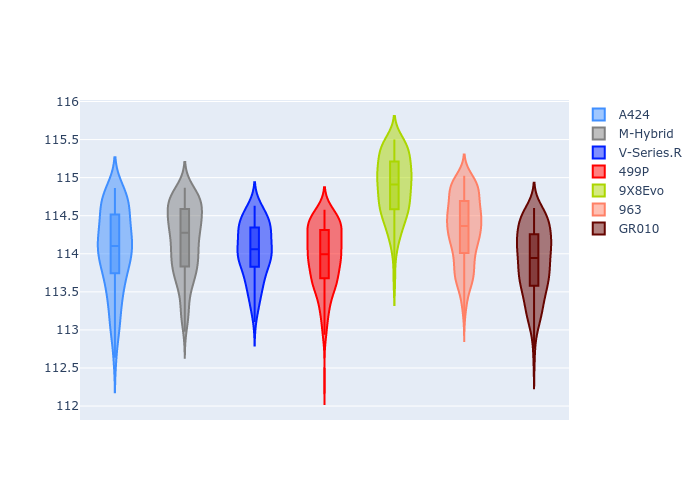
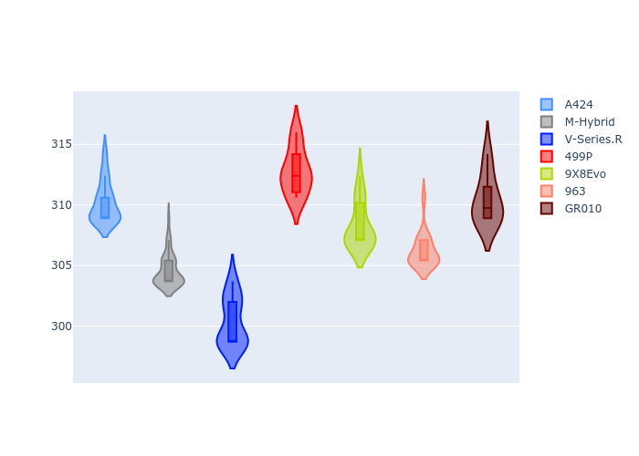

# Combined Plots

## Metadata

- BoP Accuracy: 90.01%
- Overall BoP Grade: A2
- Track: USA
- Threshhold: 250.0kph

## BoP Table
| Manufacturer   | Car        | Weight   | Power   | PINC   | E/Stint   | FDS    |
|:---------------|:-----------|:---------|:--------|:-------|:----------|:-------|
| Alpine         | A424       | 1041kg   | 515.0kw | -1.90% | 907MJ     | -      |
| BMW            | M-Hybrid   | 1037kg   | 513.0kw | -0.90% | 906MJ     | -      |
| Cadillac       | V-Series.R | 1037kg   | 518.0kw | -0.60% | 907MJ     | -      |
| Ferrari        | 499P       | 1055kg   | 500.0kw | +1.90% | 901MJ     | 190kph |
| Peugeot        | 9X8Evo     | 1037kg   | 509.0kw | -1.20% | 902MJ     | 190kph |
| Porsche        | 963        | 1053kg   | 509.0kw | +0.70% | 907MJ     | -      |
| Toyota         | GR010      | 1065kg   | 497.0kw | +4.60% | 906MJ     | 190kph |

## Performance Table
| Manufacturer   | Car        | RP      | QP      | Vavg      |   RDLC | BOP-Grade   | Match   |
|:---------------|:-----------|:--------|:--------|:----------|-------:|:------------|:--------|
| Alpine         | A424       | 1:54.05 | 1:50.82 | 310.17kph |   1.03 | ~A1         | 97.94%  |
| BMW            | M-Hybrid   | 1:54.18 | 1:50.97 | 304.57kph |   1.03 | ~A1         | 100.00% |
| Cadillac       | V-Series.R | 1:54.04 | 1:50.73 | 300.35kph |   1.03 | ~A1         | 100.00% |
| Ferrari        | 499P       | 1:53.96 | 1:50.49 | 312.78kph |   1.03 | ~A1         | 99.56%  |
| Peugeot        | 9X8Evo     | 1:54.88 | 1:51.80 | 308.27kph |   1.03 | +Ω1         | 46.82%  |
| Porsche        | 963        | 1:54.32 | 1:51.11 | 306.21kph |   1.03 | +B1         | 87.31%  |
| Toyota         | GR010      | 1:53.90 | 1:51.11 | 310.42kph |   1.03 | ~A1         | 98.44%  |

## Race Laptimes

## Quali Laptimes

## Topspeeds

## Laptimes Lineplot

