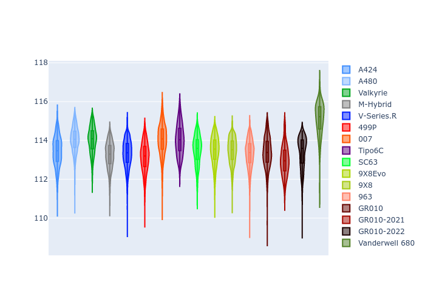
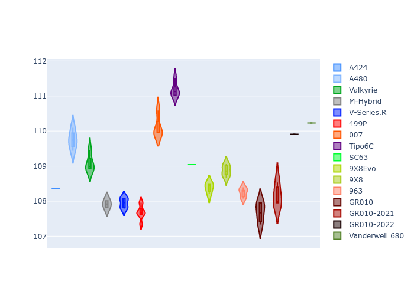
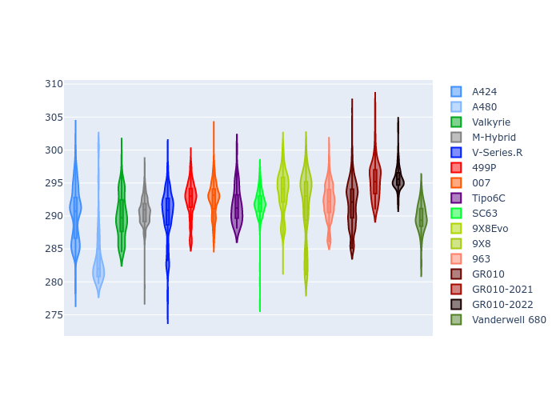
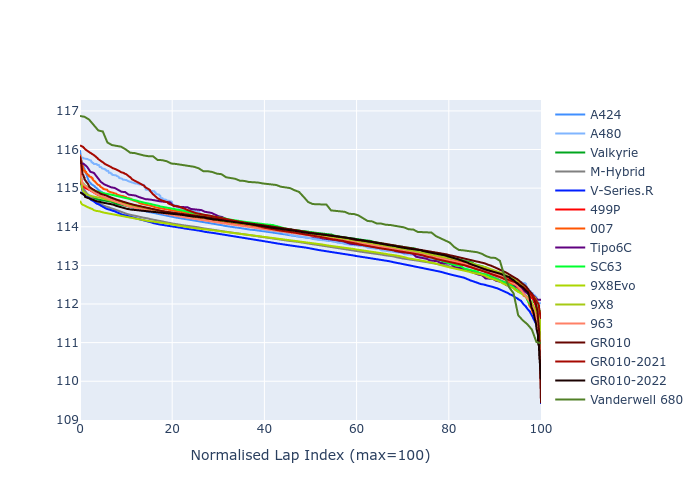

# Combined Plots

## Metadata

- BoP Accuracy: 96.29%
- Overall BoP Grade: A1
- Track: BAHRAIN
- Threshhold: 250.0kph
- Average Laptime: 1:53.61
- Average Quali Laptime: 1:48.91
- Laptime Std Dev: 0.50 seconds
- Filtered Average Topspeed: 291.46kph

## BoP Table
| Manufacturer     | Car            | Weight   | Power   | PINC   | E/Stint   | FDS    | RDP    | QDP    | TDP    |
|:-----------------|:---------------|:---------|:--------|:-------|:----------|:-------|:-------|:-------|:-------|
| Alpine           | A424           | 1066kg   | 511.0kw | +0.10% | 916MJ     | -      | 51.45% | 55.09% | 24.89% |
| Alpine           | A480           | 988kg    | 422.0kw | +0.10% | 785MJ     | -      | 54.77% | 76.19% | 54.04% |
| Aston Martin     | Valkyrie       | 1036kg   | 502.0kw | -      | 896MJ     | -      | 53.07% | 48.70% | 24.00% |
| BMW              | M-Hybrid       | 1060kg   | 513.0kw | +0.10% | 912MJ     | -      | 52.63% | 52.34% | 34.06% |
| Cadillac         | V-Series.R     | 1057kg   | 519.0kw | -      | 911MJ     | -      | 48.80% | 57.26% | 18.10% |
| Ferrari          | 499P           | 1072kg   | 503.0kw | -0.10% | 903MJ     | 190kph | 51.39% | 44.34% | 9.89%  |
| Glickenhaus      | 007            | 1032kg   | 509.0kw | -      | 900MJ     | -      | 46.14% | 49.30% | 41.45% |
| Isotta Fraschini | Tipo6C         | 1037kg   | 502.0kw | -      | 899MJ     | 190kph | 43.95% | 47.22% | 31.53% |
| Lamborghini      | SC63           | 1050kg   | 520.0kw | +0.10% | 912MJ     | -      | 48.32% | 60.95% | 28.65% |
| Peugeot          | 9X8Evo         | 1062kg   | 518.0kw | -0.10% | 919MJ     | 190kph | 49.16% | 50.25% | 18.00% |
| Peugeot          | 9X8            | 1056kg   | 524.0kw | -      | 913MJ     | 150kph | 54.54% | 58.39% | 9.69%  |
| Porsche          | 963            | 1066kg   | 511.0kw | +0.10% | 909MJ     | -      | 50.61% | 41.90% | 27.68% |
| Toyota           | GR010          | 1081kg   | 502.0kw | +0.10% | 901MJ     | 190kph | 51.33% | 51.71% | 14.89% |
| Toyota           | GR010-2021     | 1065kg   | 509.0kw | -0.10% | 902MJ     | 150kph | 54.02% | 52.67% | 26.37% |
| Toyota           | GR010-2022     | 1070kg   | 503.0kw | -0.10% | 897MJ     | 190kph | 53.24% | 64.49% | 9.72%  |
| Vanwall          | Vanderwell 680 | 1030kg   | 520.0kw | -      | 906MJ     | -      | 50.86% | 59.83% | 31.84% |

## Performance Table
| Manufacturer     | Car            | RP      | QP      | Vavg      |   RDLC | BOP-Grade   | Match   |
|:-----------------|:---------------|:--------|:--------|:----------|-------:|:------------|:--------|
| Alpine           | A424           | 1:53.44 | 1:48.36 | 290.23kph |   1.05 | ~A1         | 99.93%  |
| Alpine           | A480           | 1:54.02 | 1:49.75 | 283.76kph |   1.04 | ~A1         | 98.42%  |
| Aston Martin     | Valkyrie       | 1:54.02 | 1:49.08 | 289.87kph |   1.05 | ~A1         | 99.91%  |
| BMW              | M-Hybrid       | 1:53.25 | 1:47.92 | 290.71kph |   1.05 | ~A1         | 100.00% |
| Cadillac         | V-Series.R     | 1:53.32 | 1:47.95 | 290.10kph |   1.05 | ~A1         | 99.92%  |
| Ferrari          | 499P           | 1:53.15 | 1:47.68 | 292.49kph |   1.05 | ~A1         | 99.91%  |
| Glickenhaus      | 007            | 1:54.02 | 1:50.11 | 292.64kph |   1.04 | ~A1         | 95.15%  |
| Isotta Fraschini | Tipo6C         | 1:54.02 | 1:51.17 | 291.61kph |   1.03 | +A2         | 94.78%  |
| Lamborghini      | SC63           | 1:53.50 | 1:49.04 | 291.92kph |   1.04 | ~A1         | 100.00% |
| Peugeot          | 9X8Evo         | 1:53.48 | 1:48.38 | 293.62kph |   1.05 | ~A1         | 99.95%  |
| Peugeot          | 9X8            | 1:53.46 | 1:48.87 | 291.65kph |   1.04 | ~A1         | 100.00% |
| Porsche          | 963            | 1:53.31 | 1:48.24 | 292.11kph |   1.05 | ~A1         | 99.88%  |
| Toyota           | GR010          | 1:53.39 | 1:47.69 | 291.75kph |   1.05 | ~A1         | 99.78%  |
| Toyota           | GR010-2021     | 1:52.92 | 1:48.15 | 295.48kph |   1.04 | ~A1         | 100.00% |
| Toyota           | GR010-2022     | 1:53.38 | 1:49.91 | 295.73kph |   1.03 | ~A1         | 99.40%  |
| Vanwall          | Vanderwell 680 | 1:55.09 | 1:50.23 | 289.74kph |   1.04 | +E2         | 53.56%  |

## Race Laptimes

## Quali Laptimes

## Topspeeds

## Laptimes Lineplot

