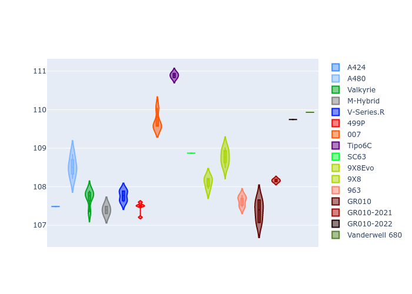
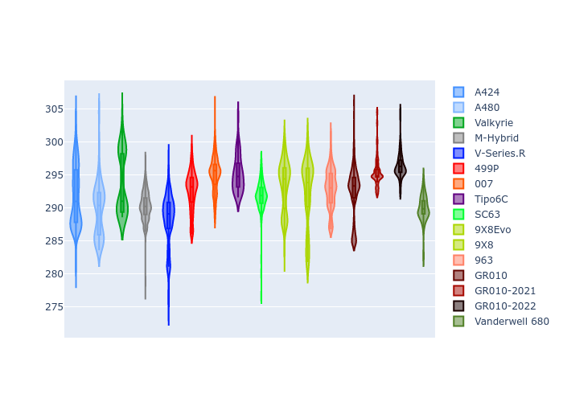

# Combined Plots

## Metadata

- BoP Accuracy: 95.08%
- Overall BoP Grade: A1
- Track: BAHRAIN
- Threshhold: 250.0kph
- Average Laptime: 1:53.21
- Average Quali Laptime: 1:48.47
- Average Topspeed: 292.59kph

## BoP Table
| Manufacturer     | Car            | Weight   | Power   | PINC   | E/Stint   | FDS    | RDP    | QDP    | TDP    |
|:-----------------|:---------------|:---------|:--------|:-------|:----------|:-------|:-------|:-------|:-------|
| Alpine           | A424           | 1067kg   | 520.0kw | -      | 924MJ     | -      | 51.64% | 59.31% | 26.80% |
| Alpine           | A480           | 952kg    | 432.0kw | +0.10% | 790MJ     | -      | 53.05% | 74.07% | 48.97% |
| Aston Martin     | Valkyrie       | 1041kg   | 519.0kw | -      | 911MJ     | -      | 53.50% | 53.33% | 21.51% |
| BMW              | M-Hybrid       | 1061kg   | 512.0kw | +0.10% | 911MJ     | -      | 52.89% | 56.22% | 33.41% |
| Cadillac         | V-Series.R     | 1054kg   | 510.0kw | +0.10% | 903MJ     | -      | 48.63% | 60.80% | 19.01% |
| Ferrari          | 499P           | 1083kg   | 508.0kw | +0.10% | 909MJ     | 190kph | 51.38% | 44.98% | 9.83%  |
| Glickenhaus      | 007            | 1030kg   | 520.0kw | -      | 910MJ     | -      | 46.15% | 49.30% | 41.45% |
| Isotta Fraschini | Tipo6C         | 1039kg   | 520.0kw | -      | 915MJ     | 190kph | 43.95% | 47.22% | 31.53% |
| Lamborghini      | SC63           | 1031kg   | 511.0kw | -      | 901MJ     | -      | 48.33% | 60.95% | 28.65% |
| Peugeot          | 9X8Evo         | 1048kg   | 511.0kw | -      | 911MJ     | 190kph | 48.87% | 52.78% | 15.41% |
| Peugeot          | 9X8            | 1038kg   | 519.0kw | -      | 907MJ     | 150kph | 54.54% | 58.39% | 9.69%  |
| Porsche          | 963            | 1067kg   | 516.0kw | -0.10% | 913MJ     | -      | 50.70% | 44.30% | 29.51% |
| Toyota           | GR010          | 1100kg   | 512.0kw | +0.10% | 912MJ     | 190kph | 51.09% | 52.71% | 11.46% |
| Toyota           | GR010-2021     | 1085kg   | 513.0kw | -0.10% | 907MJ     | 150kph | 54.08% | 54.81% | 9.72%  |
| Toyota           | GR010-2022     | 1084kg   | 512.0kw | -0.10% | 907MJ     | 190kph | 53.45% | 68.83% | 9.58%  |
| Vanwall          | Vanderwell 680 | 1030kg   | 520.0kw | -      | 906MJ     | -      | 49.68% | 60.93% | 34.43% |

## Performance Table
| Manufacturer     | Car            | RP      | QP      | Vavg      |   RDLC | BOP-Grade   | Match   |
|:-----------------|:---------------|:--------|:--------|:----------|-------:|:------------|:--------|
| Alpine           | A424           | 1:52.55 | 1:47.48 | 291.79kph |   1.05 | ~A1         | 99.97%  |
| Alpine           | A480           | 1:52.10 | 1:48.51 | 289.71kph |   1.03 | ~A1         | 97.87%  |
| Aston Martin     | Valkyrie       | 1:53.34 | 1:47.71 | 293.67kph |   1.05 | ~A1         | 100.00% |
| BMW              | M-Hybrid       | 1:52.86 | 1:47.40 | 290.27kph |   1.05 | ~A1         | 100.00% |
| Cadillac         | V-Series.R     | 1:53.21 | 1:47.76 | 288.16kph |   1.05 | ~A1         | 99.61%  |
| Ferrari          | 499P           | 1:52.99 | 1:47.47 | 292.57kph |   1.05 | ~A1         | 99.94%  |
| Glickenhaus      | 007            | 1:53.62 | 1:49.69 | 295.12kph |   1.04 | ~A1         | 95.07%  |
| Isotta Fraschini | Tipo6C         | 1:53.78 | 1:50.89 | 295.15kph |   1.03 | +B1         | 86.57%  |
| Lamborghini      | SC63           | 1:53.34 | 1:48.87 | 291.92kph |   1.04 | ~A1         | 100.00% |
| Peugeot          | 9X8Evo         | 1:53.37 | 1:48.12 | 293.49kph |   1.05 | ~A1         | 100.00% |
| Peugeot          | 9X8            | 1:53.34 | 1:48.77 | 292.45kph |   1.04 | ~A1         | 100.00% |
| Porsche          | 963            | 1:52.70 | 1:47.63 | 292.87kph |   1.05 | ~A1         | 99.70%  |
| Toyota           | GR010          | 1:53.04 | 1:47.38 | 292.46kph |   1.05 | ~A1         | 99.79%  |
| Toyota           | GR010-2021     | 1:52.84 | 1:48.16 | 295.49kph |   1.04 | ~A1         | 100.00% |
| Toyota           | GR010-2022     | 1:53.34 | 1:49.74 | 296.39kph |   1.03 | ~A1         | 99.66%  |
| Vanwall          | Vanderwell 680 | 1:54.89 | 1:49.93 | 289.92kph |   1.05 | +Ω1         | 43.13%  |

## Race Laptimes

## Quali Laptimes

## Topspeeds

## Laptimes Lineplot

