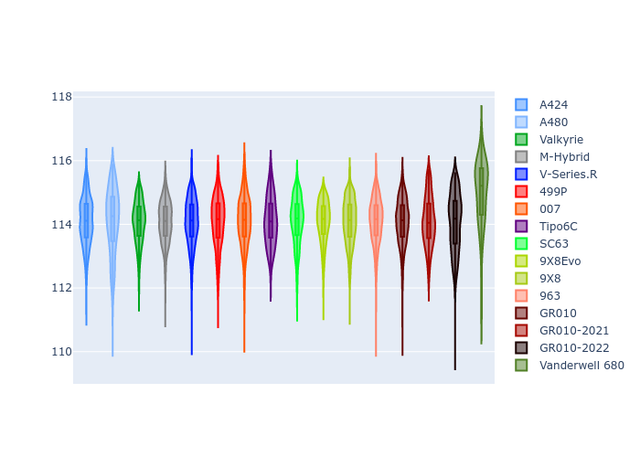
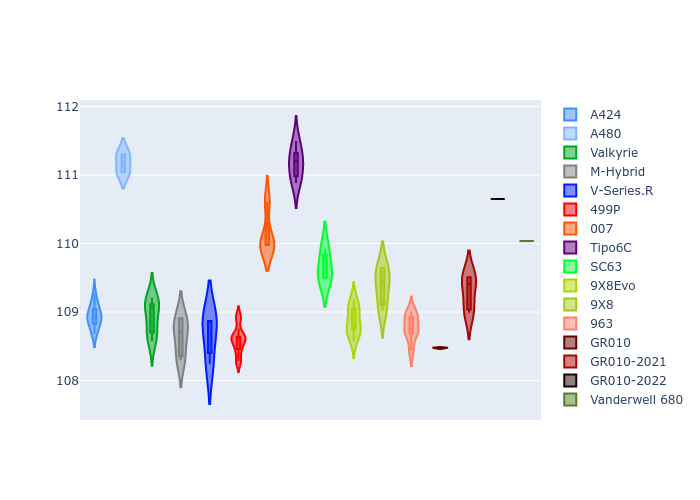
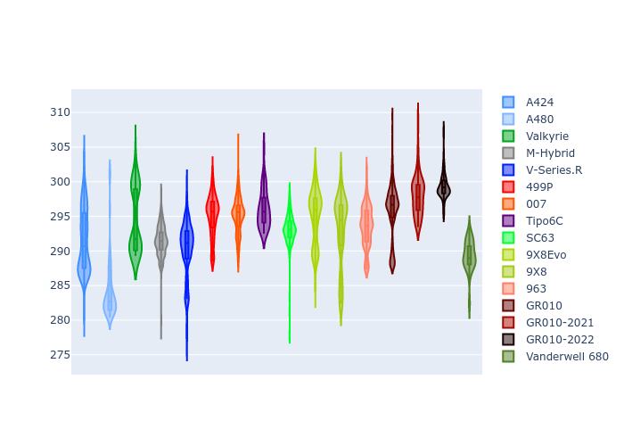
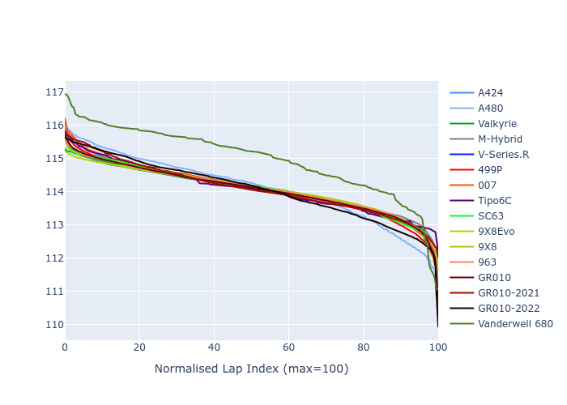

# Combined Plots

## Metadata

- BoP Accuracy: 97.71%
- Overall BoP Grade: A1
- Track: BAHRAIN
- Threshhold: 0.0kph
- Average Laptime: 1:53.96
- Average Quali Laptime: 1:49.24
- Laptime Std Dev: 0.29 seconds
- Filtered Average Topspeed: 288.64kph

## BoP Table
| Manufacturer     | Car            | Weight   | Power   | PINC   | E/Stint   | FDS    | RDP    | QDP    | TDP    |
|:-----------------|:---------------|:---------|:--------|:-------|:----------|:-------|:-------|:-------|:-------|
| Alpine           | A424           | 1046kg   | 480.0kw | -      | 886MJ     | -      | 51.45% | 55.09% | 24.89% |
| Alpine           | A480           | 970kg    | 410.0kw | -      | 771MJ     | -      | 54.77% | 76.19% | 54.04% |
| Aston Martin     | Valkyrie       | 1051kg   | 520.0kw | -      | 913MJ     | -      | 53.07% | 48.70% | 24.00% |
| BMW              | M-Hybrid       | 1044kg   | 480.0kw | -      | 880MJ     | -      | 52.63% | 52.34% | 34.06% |
| Cadillac         | V-Series.R     | 1043kg   | 489.0kw | -      | 883MJ     | -      | 48.80% | 57.26% | 18.10% |
| Ferrari          | 499P           | 1071kg   | 480.0kw | -      | 882MJ     | 200kph | 51.39% | 44.34% | 9.89%  |
| Glickenhaus      | 007            | 1038kg   | 520.0kw | -      | 911MJ     | -      | 46.14% | 49.30% | 41.45% |
| Isotta Fraschini | Tipo6C         | 1054kg   | 520.0kw | -      | 916MJ     | 190kph | 43.95% | 47.22% | 31.53% |
| Lamborghini      | SC63           | 1061kg   | 520.0kw | -      | 912MJ     | -      | 48.32% | 60.95% | 28.65% |
| Peugeot          | 9X8Evo         | 1034kg   | 480.0kw | -      | 882MJ     | 190kph | 49.16% | 50.25% | 18.00% |
| Peugeot          | 9X8            | 1033kg   | 490.0kw | -      | 881MJ     | 150kph | 54.54% | 58.39% | 9.69%  |
| Porsche          | 963            | 1051kg   | 480.0kw | -      | 879MJ     | -      | 50.61% | 41.90% | 27.68% |
| Toyota           | GR010          | 1072kg   | 480.0kw | -      | 880MJ     | 190kph | 51.33% | 51.71% | 14.89% |
| Toyota           | GR010-2021     | 1065kg   | 480.0kw | -      | 876MJ     | 200kph | 54.02% | 52.67% | 26.37% |
| Toyota           | GR010-2022     | 1061kg   | 480.0kw | -      | 876MJ     | 200kph | 53.24% | 64.49% | 9.72%  |
| Vanwall          | Vanderwell 680 | 1030kg   | 520.0kw | -      | 906MJ     | -      | 50.86% | 59.83% | 31.84% |

## Performance Table
| Manufacturer     | Car            | RP      | QP      | Vavg      |   RDLC | BOP-Grade   | Match   |
|:-----------------|:---------------|:--------|:--------|:----------|-------:|:------------|:--------|
| Alpine           | A424           | 1:53.89 | 1:48.78 | 285.59kph |   1.05 | ~A1         | 99.88%  |
| Alpine           | A480           | 1:53.89 | 1:49.63 | 282.61kph |   1.04 | ~A1         | 99.80%  |
| Aston Martin     | Valkyrie       | 1:53.89 | 1:48.96 | 292.07kph |   1.05 | ~A1         | 100.00% |
| BMW              | M-Hybrid       | 1:53.88 | 1:48.50 | 285.28kph |   1.05 | ~A1         | 100.00% |
| Cadillac         | V-Series.R     | 1:53.88 | 1:48.47 | 285.29kph |   1.05 | ~A1         | 99.92%  |
| Ferrari          | 499P           | 1:53.88 | 1:48.36 | 287.75kph |   1.05 | ~A1         | 99.96%  |
| Glickenhaus      | 007            | 1:53.89 | 1:49.98 | 294.29kph |   1.04 | ~A1         | 99.05%  |
| Isotta Fraschini | Tipo6C         | 1:53.90 | 1:51.06 | 293.62kph |   1.03 | ~A1         | 98.51%  |
| Lamborghini      | SC63           | 1:53.89 | 1:49.40 | 290.74kph |   1.04 | ~A1         | 100.00% |
| Peugeot          | 9X8Evo         | 1:53.89 | 1:48.77 | 288.48kph |   1.05 | ~A1         | 100.00% |
| Peugeot          | 9X8            | 1:53.89 | 1:49.27 | 286.92kph |   1.04 | ~A1         | 100.00% |
| Porsche          | 963            | 1:53.90 | 1:48.78 | 286.95kph |   1.05 | ~A1         | 99.93%  |
| Toyota           | GR010          | 1:53.89 | 1:48.14 | 287.84kph |   1.05 | ~A1         | 99.77%  |
| Toyota           | GR010-2021     | 1:53.88 | 1:49.05 | 289.35kph |   1.04 | ~A1         | 97.28%  |
| Toyota           | GR010-2022     | 1:53.89 | 1:50.40 | 291.73kph |   1.03 | ~A1         | 99.55%  |
| Vanwall          | Vanderwell 680 | 1:55.09 | 1:50.23 | 289.74kph |   1.04 | +D1         | 69.66%  |

## Race Laptimes

## Quali Laptimes

## Topspeeds

## Laptimes Lineplot

