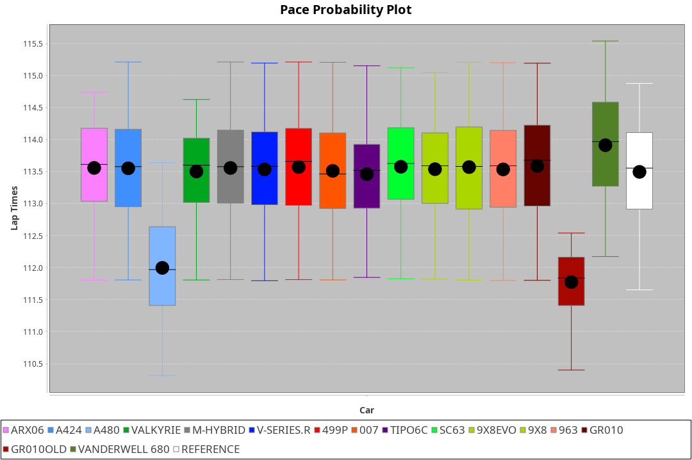
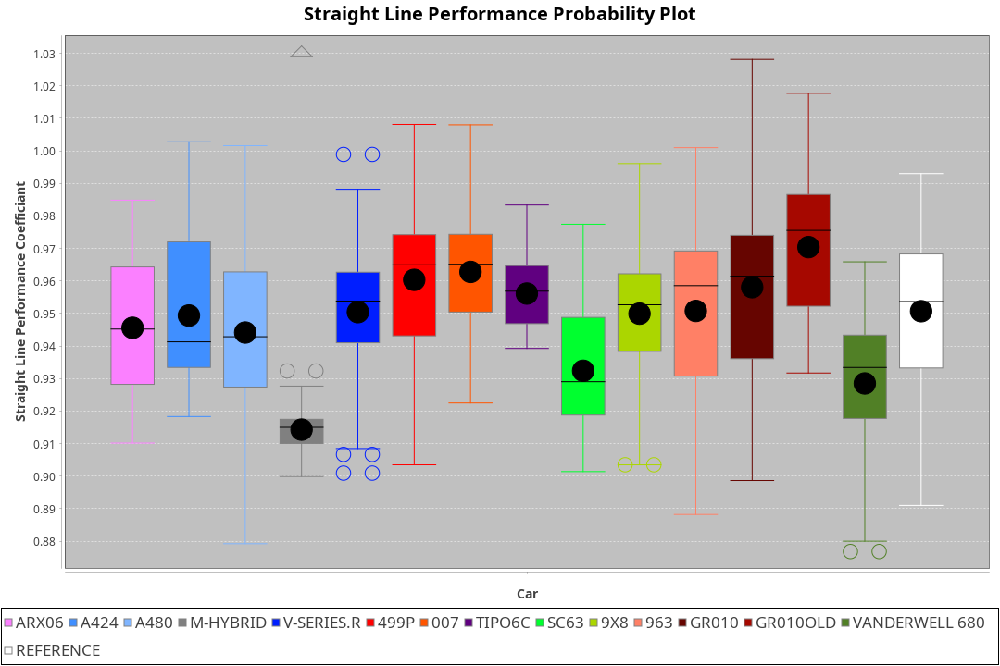

| Manufacturer     | Car            | Weight | Power   | PINC    | E/Stint | FDS     |
|:-|:-|:-|:-|:-|:-|:-|
| Toyota           | GR010          | 1100kg | 480.0kw |    -    | 884MJ   | 200kph  |
| Peugeot          | 9X8Evo         | 1080kg | 480.0kw |    -    | 886MJ   | 190kph  |
| Cadillac         | V-Series.R     | 1061kg | 480.0kw |    -    | 877MJ   |    -    |
| Porsche          | 963            | 1070kg | 480.0kw |    -    | 881MJ   |    -    |
| Ferrari          | 499P           | 1100kg | 480.0kw |    -    | 885MJ   | 200kph  |
| Alpine           | A424           | 1074kg | 480.0kw |    -    | 888MJ   |    -    |
| BMW              | M-Hybrid       | 1066kg | 480.0kw |    -    | 882MJ   |    -    |
| Aston Martin     | Valkyrie       | 1047kg | 480.0kw |    -    | 877MJ   |    -    |
| Lamborghini      | SC63           | 1075kg | 507.0kw |    -    | 901MJ   |    -    |
| Isotta Fraschini | Tipo6C         | 1086kg | 520.0kw |    -    | 920MJ   | 190kph  |
| Glickenhaus      | 007            | 1030kg | 481.0kw |    -    | 875MJ   |    -    |
| Vanwall          | Vanderwell 680 | 1030kg | 520.0kw |    -    | 906MJ   |    -    |
| Acura            | ARX06          | 1075kg | 480.0kw |    -    | 883MJ   |    -    |
| Toyota           | GR010OLD       | 1100kg | 480.0kw |    -    | 879MJ   | 200kph  |
| Alpine           | A480           | 952kg  | 410.0kw |    -    | 770MJ   |    -    |
| Peugeot          | 9X8            | 1046kg | 485.0kw |    -    | 877MJ   | 150kph  |

### BoP Accuracy: 88.61%; Overall BoP Grade: B1
| Manufacturer     | Car            | Type  | RP      | QP      | Weight | Power¹  | Threshhold | PINC    | Power²   | E/Stint | AVG Vmax  | FDS     | RDLC | L/Stint | BOP-Grade | Model Accuracy | Model Points | Match%  | SimDiff |
|:-|:-|:-|:-|:-|:-|:-|:-|:-|:-|:-|:-|:-|:-|:-|:-|:-|:-|:-|:-|
| Acura            | ARX06          | LMDH  | 1:53.54 | 1:48.41 | 1075kg | 480.0kw | 0.0kph     |    -    | 480.00kw |  883MJ  | 273.38kph |    -    | 0.99 | 34      | +B2       | 100.00%        | 996          | 83.81%  | #       |
| Alpine           | A424           | LMDH  | 1:53.55 | 1:48.67 | 1074kg | 480.0kw | 0.0kph     |    -    | 480.00kw |  888MJ  | 269.86kph |    -    | 1.00 | 34      | +A2       | 96.10%         | 2390         | 93.32%  | #       |
| Alpine           | A480           | LMP1  | 1:52.20 | 1:48.61 |  952kg | 410.0kw | 0.0kph     |    -    | 410.00kw |  770MJ  | 273.37kph |    -    | 0.98 | 32      | -Ω1       | 95.62%         | 1701         | 42.71%  | -0.33   |
| Aston Martin     | Valkyrie       | LMHNH | 1:53.53 | 1:48.14 | 1047kg | 480.0kw | 0.0kph     |    -    | 480.00kw |  877MJ  | 271.75kph |    -    | 1.03 | 34      | +C2       | 100.00%        | 466          | 74.36%  | #       |
| BMW              | M-Hybrid       | LMDH  | 1:53.53 | 1:48.38 | 1066kg | 480.0kw | 0.0kph     |    -    | 480.00kw |  882MJ  | 272.11kph |    -    | 1.01 | 34      | ~A1       | 100.00%        | 3339         | 100.00% | #       |
| Cadillac         | V-Series.R     | LMDH  | 1:53.55 | 1:48.55 | 1061kg | 480.0kw | 0.0kph     |    -    | 480.00kw |  877MJ  | 274.14kph |    -    | 1.01 | 34      | +A2       | 99.56%         | 5841         | 94.85%  | #       |
| Ferrari          | 499P           | LMHHU | 1:53.37 | 1:48.18 | 1100kg | 480.0kw | 0.0kph     |    -    | 480.00kw |  885MJ  | 271.30kph | 200kph  | 1.01 | 34      | ~A1       | 99.57%         | 7417         | 98.60%  | #       |
| Glickenhaus      | 007            | LMHNH | 1:53.54 | 1:49.61 | 1030kg | 481.0kw | 0.0kph     |    -    | 481.00kw |  875MJ  | 279.16kph |    -    | 0.97 | 34      | +A2       | 93.90%         | 2170         | 94.87%  | #       |
| Isotta Fraschini | Tipo6C         | LMHHU | 1:53.53 | 1:50.54 | 1086kg | 520.0kw | 0.0kph     |    -    | 520.00kw |  920MJ  | 279.95kph | 190kph  | 1.02 | 34      | +C1       | 100.00%        | 132          | 78.50%  | #       |
| Lamborghini      | SC63           | LMDH  | 1:53.53 | 1:49.61 | 1075kg | 507.0kw | 0.0kph     |    -    | 507.00kw |  901MJ  | 273.42kph |    -    | 1.03 | 34      | ~A1       | 100.00%        | 784          | 99.69%  | #       |
| Peugeot          | 9X8Evo         | LMHHU | 1:53.55 | 1:48.61 | 1080kg | 480.0kw | 0.0kph     |    -    | 480.00kw |  886MJ  | 279.32kph | 190kph  | 0.98 | 34      | +B1       | 100.00%        | 1891         | 86.73%  | #       |
| Peugeot          | 9X8            | LMHHE | 1:53.55 | 1:48.90 | 1046kg | 485.0kw | 0.0kph     |    -    | 485.00kw |  877MJ  | 272.21kph | 150kph  | 1.03 | 34      | ~A1       | 99.96%         | 4579         | 95.92%  | +1.63   |
| Porsche          | 963            | LMDH  | 1:53.54 | 1:48.25 | 1070kg | 480.0kw | 0.0kph     |    -    | 480.00kw |  881MJ  | 271.86kph |    -    | 1.00 | 34      | ~A1       | 98.39%         | 16118        | 100.00% | #       |
| Toyota           | GR010          | LMHHU | 1:53.30 | 1:48.23 | 1100kg | 480.0kw | 0.0kph     |    -    | 480.00kw |  884MJ  | 270.39kph | 200kph  | 1.01 | 34      | ~A1       | 99.90%         | 5196         | 95.52%  | #       |
| Toyota           | GR010OLD       | LMHHE | 1:53.59 | 1:49.79 | 1100kg | 480.0kw | 0.0kph     |    -    | 480.00kw |  879MJ  | 277.04kph | 200kph  | 1.00 | 34      | +B2       | 97.31%         | 905          | 80.90%  | +1.23   |
| Vanwall          | Vanderwell 680 | LMHNH | 1:53.75 | 1:48.63 | 1030kg | 520.0kw | 0.0kph     |    -    | 520.00kw |  906MJ  | 282.14kph |    -    | 1.02 | 34      | ~A1       | 98.91%         | 543          | 97.99%  | +2.10   |

## Power below Threshhold
| N/Nmax    | ARX06   | A424    | VALKYRIE | M-HYBRID | V-SERIES.R | 499P    | 007     | TIPO6C  | SC63    | 9X8EVO  | 9X8     | 963     | GR010   | GR010OLD | VANDERWELL 680 | ​     | RPM      | A480       |
|:-|:-|:-|:-|:-|:-|:-|:-|:-|:-|:-|:-|:-|:-|:-|:-|:-|:-|:-|
|  0.550    |  236    |  236    |  236     |  236     |  236       |  236    |  237    |  256    |  250    |  236    |  239    |  236    |  236    |  236     |  256           |  ​    |   --     |   -        |
|  0.575    |  258    |  258    |  258     |  258     |  258       |  258    |  259    |  279    |  273    |  258    |  261    |  258    |  258    |  258     |  279           |  ​    |   --     |   -        |
|  0.600    |  277    |  277    |  277     |  277     |  277       |  277    |  278    |  300    |  293    |  277    |  280    |  277    |  277    |  277     |  300           |  ​    |   --     |   -        |
|  0.625    |  297    |  297    |  297     |  297     |  297       |  297    |  298    |  322    |  314    |  297    |  300    |  297    |  297    |  297     |  322           |  ​    |   --     |   -        |
|  0.650    |  317    |  317    |  317     |  317     |  317       |  317    |  318    |  343    |  335    |  317    |  320    |  317    |  317    |  317     |  343           |  ​    |   --     |   -        |
|  0.675    |  337    |  337    |  337     |  337     |  337       |  337    |  338    |  365    |  356    |  337    |  341    |  337    |  337    |  337     |  365           |  ​    |   --     |   -        |
|  0.700    |  358    |  358    |  358     |  358     |  358       |  358    |  359    |  387    |  377    |  358    |  362    |  358    |  358    |  358     |  387           |  ​    |   --     |   -        |
|  0.725    |  378    |  378    |  378     |  378     |  378       |  378    |  379    |  409    |  399    |  378    |  382    |  378    |  378    |  378     |  409           |  ​    |   --     |   -        |
|  0.750    |  397    |  397    |  397     |  397     |  397       |  397    |  398    |  430    |  419    |  397    |  401    |  397    |  397    |  397     |  430           |  ​    |   --     |   -        |
|  0.775    |  415    |  415    |  415     |  415     |  415       |  415    |  416    |  449    |  438    |  415    |  419    |  415    |  415    |  415     |  449           |  ​    |  5000    |  -3213569  |
|  0.800    |  431    |  431    |  431     |  431     |  431       |  431    |  432    |  467    |  455    |  431    |  436    |  431    |  431    |  431     |  467           |  ​    |  5500    |  -3499979  |
|  0.825    |  445    |  445    |  445     |  445     |  445       |  445    |  446    |  482    |  470    |  445    |  450    |  445    |  445    |  445     |  482           |  ​    |  5999    |  -3800400  |
|  0.850    |  456    |  456    |  456     |  456     |  456       |  456    |  457    |  494    |  482    |  456    |  461    |  456    |  456    |  456     |  494           |  ​    |  6499    |  -4114832  |
|  0.875    |  466    |  466    |  466     |  466     |  466       |  466    |  467    |  505    |  492    |  466    |  471    |  466    |  466    |  466     |  505           |  ​    |  7000    |  -4443276  |
|  0.900    |  472    |  472    |  472     |  472     |  472       |  472    |  473    |  512    |  499    |  472    |  477    |  472    |  472    |  472     |  512           |  ​    |  7500    |  -4785730  |
|  0.925    |  477    |  477    |  477     |  477     |  477       |  477    |  478    |  517    |  504    |  477    |  482    |  477    |  477    |  477     |  517           |  ​    |  8000    |  407       |
| **0.950** | **480** | **480** | **480**  | **480**  | **480**    | **480** | **481** | **520** | **507** | **480** | **485** | **480** | **480** | **480**  | **520**        | **​** | **8499** | **410**    |
|  0.975    |  478    |  478    |  478     |  478     |  478       |  478    |  479    |  518    |  505    |  478    |  483    |  478    |  478    |  478     |  518           |  ​    |  9000    |  205       |
|  1.000    |  475    |  475    |  475     |  475     |  475       |  475    |  476    |  514    |  502    |  475    |  480    |  475    |  475    |  475     |  514           |  ​    |   --     |   -        |
|  1.025    |  410    |  410    |  410     |  410     |  410       |  410    |  411    |  444    |  433    |  410    |  414    |  410    |  410    |  410     |  444           |  ​    |   --     |   -        |

## Power above Threshhold
| N/Nmax    | ARX06   | A424    | VALKYRIE | M-HYBRID | V-SERIES.R | 499P    | 007     | TIPO6C  | SC63    | 9X8EVO  | 9X8     | 963     | GR010   | GR010OLD | VANDERWELL 680 | ​     | RPM      | A480       |
|:-|:-|:-|:-|:-|:-|:-|:-|:-|:-|:-|:-|:-|:-|:-|:-|:-|:-|:-|
|  0.550    |  236    |  236    |  236     |  236     |  236       |  236    |  237    |  256    |  250    |  236    |  239    |  236    |  236    |  236     |  256           |  ​    |   --     |   -        |
|  0.575    |  258    |  258    |  258     |  258     |  258       |  258    |  259    |  279    |  273    |  258    |  261    |  258    |  258    |  258     |  279           |  ​    |   --     |   -        |
|  0.600    |  277    |  277    |  277     |  277     |  277       |  277    |  278    |  300    |  293    |  277    |  280    |  277    |  277    |  277     |  300           |  ​    |   --     |   -        |
|  0.625    |  297    |  297    |  297     |  297     |  297       |  297    |  298    |  322    |  314    |  297    |  300    |  297    |  297    |  297     |  322           |  ​    |   --     |   -        |
|  0.650    |  317    |  317    |  317     |  317     |  317       |  317    |  318    |  343    |  335    |  317    |  320    |  317    |  317    |  317     |  343           |  ​    |   --     |   -        |
|  0.675    |  337    |  337    |  337     |  337     |  337       |  337    |  338    |  365    |  356    |  337    |  341    |  337    |  337    |  337     |  365           |  ​    |   --     |   -        |
|  0.700    |  358    |  358    |  358     |  358     |  358       |  358    |  359    |  387    |  377    |  358    |  362    |  358    |  358    |  358     |  387           |  ​    |   --     |   -        |
|  0.725    |  378    |  378    |  378     |  378     |  378       |  378    |  379    |  409    |  399    |  378    |  382    |  378    |  378    |  378     |  409           |  ​    |   --     |   -        |
|  0.750    |  397    |  397    |  397     |  397     |  397       |  397    |  398    |  430    |  419    |  397    |  401    |  397    |  397    |  397     |  430           |  ​    |   --     |   -        |
|  0.775    |  415    |  415    |  415     |  415     |  415       |  415    |  416    |  449    |  438    |  415    |  419    |  415    |  415    |  415     |  449           |  ​    |  5000    |  -3213569  |
|  0.800    |  431    |  431    |  431     |  431     |  431       |  431    |  432    |  467    |  455    |  431    |  436    |  431    |  431    |  431     |  467           |  ​    |  5500    |  -3499979  |
|  0.825    |  445    |  445    |  445     |  445     |  445       |  445    |  446    |  482    |  470    |  445    |  450    |  445    |  445    |  445     |  482           |  ​    |  5999    |  -3800400  |
|  0.850    |  456    |  456    |  456     |  456     |  456       |  456    |  457    |  494    |  482    |  456    |  461    |  456    |  456    |  456     |  494           |  ​    |  6499    |  -4114832  |
|  0.875    |  466    |  466    |  466     |  466     |  466       |  466    |  467    |  505    |  492    |  466    |  471    |  466    |  466    |  466     |  505           |  ​    |  7000    |  -4443276  |
|  0.900    |  472    |  472    |  472     |  472     |  472       |  472    |  473    |  512    |  499    |  472    |  477    |  472    |  472    |  472     |  512           |  ​    |  7500    |  -4785730  |
|  0.925    |  477    |  477    |  477     |  477     |  477       |  477    |  478    |  517    |  504    |  477    |  482    |  477    |  477    |  477     |  517           |  ​    |  8000    |  407       |
| **0.950** | **480** | **480** | **480**  | **480**  | **480**    | **480** | **481** | **520** | **507** | **480** | **485** | **480** | **480** | **480**  | **520**        | **​** | **8499** | **410**    |
|  0.975    |  478    |  478    |  478     |  478     |  478       |  478    |  479    |  518    |  505    |  478    |  483    |  478    |  478    |  478     |  518           |  ​    |  9000    |  205       |
|  1.000    |  475    |  475    |  475     |  475     |  475       |  475    |  476    |  514    |  502    |  475    |  480    |  475    |  475    |  475     |  514           |  ​    |   --     |   -        |
|  1.025    |  410    |  410    |  410     |  410     |  410       |  410    |  411    |  444    |  433    |  410    |  414    |  410    |  410    |  410     |  444           |  ​    |   --     |   -        |
