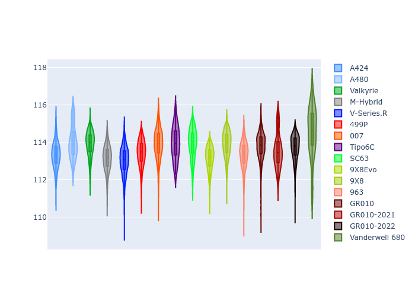
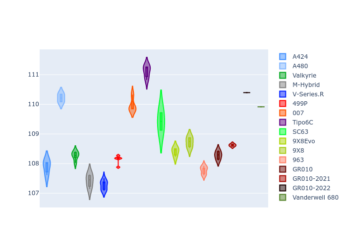
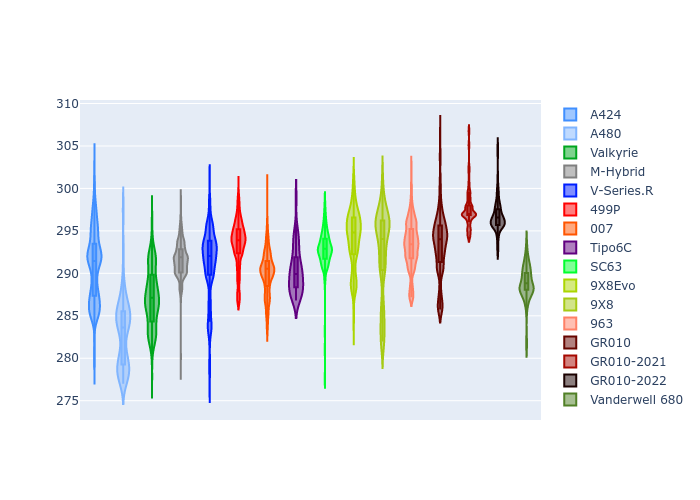
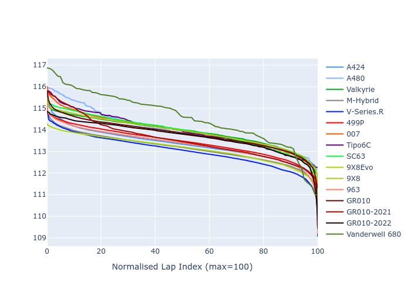

# Combined Plots

## Metadata

- BoP Accuracy: 97.11%
- Overall BoP Grade: A1
- Track: BAHRAIN
- Threshhold: 250.0kph
- Average Laptime: 1:53.64
- Average Quali Laptime: 1:48.99
- Laptime Std Dev: 0.39 seconds
- Filtered Average Topspeed: 292.13kph

## BoP Table
| Manufacturer     | Car            | Weight   | Power   | PINC   | E/Stint   | FDS    | RDP    | QDP    | TDP    |
|:-----------------|:---------------|:---------|:--------|:-------|:----------|:-------|:-------|:-------|:-------|
| Alpine           | A424           | 1056kg   | 511.0kw | +0.10% | 915MJ     | -      | 51.38% | 57.54% | 26.10% |
| Alpine           | A480           | 990kg    | 421.0kw | +0.10% | 784MJ     | -      | 54.81% | 80.56% | 55.69% |
| Aston Martin     | Valkyrie       | 1032kg   | 508.0kw | -      | 901MJ     | -      | 52.56% | 51.11% | 27.23% |
| BMW              | M-Hybrid       | 1050kg   | 513.0kw | +0.10% | 911MJ     | -      | 52.62% | 53.36% | 32.99% |
| Cadillac         | V-Series.R     | 1047kg   | 519.0kw | -      | 910MJ     | -      | 48.29% | 59.47% | 18.65% |
| Ferrari          | 499P           | 1062kg   | 503.0kw | +0.10% | 902MJ     | 190kph | 51.25% | 43.28% | 10.17% |
| Glickenhaus      | 007            | 1032kg   | 517.0kw | -      | 907MJ     | -      | 46.15% | 49.30% | 41.45% |
| Isotta Fraschini | Tipo6C         | 1030kg   | 510.0kw | -      | 905MJ     | 190kph | 43.95% | 47.22% | 31.53% |
| Lamborghini      | SC63           | 1039kg   | 511.0kw | -      | 902MJ     | -      | 48.33% | 60.95% | 28.65% |
| Peugeot          | 9X8Evo         | 1052kg   | 518.0kw | -0.10% | 918MJ     | 190kph | 48.70% | 50.83% | 18.68% |
| Peugeot          | 9X8            | 1040kg   | 509.0kw | -      | 898MJ     | 150kph | 54.54% | 58.39% | 9.69%  |
| Porsche          | 963            | 1056kg   | 511.0kw | +0.10% | 908MJ     | -      | 50.57% | 42.80% | 29.05% |
| Toyota           | GR010          | 1071kg   | 502.0kw | +0.10% | 900MJ     | 190kph | 51.03% | 51.78% | 14.64% |
| Toyota           | GR010-2021     | 1055kg   | 509.0kw | -0.10% | 901MJ     | 150kph | 53.89% | 50.91% | 25.87% |
| Toyota           | GR010-2022     | 1060kg   | 503.0kw | -0.10% | 896MJ     | 190kph | 53.24% | 64.49% | 9.72%  |
| Vanwall          | Vanderwell 680 | 1030kg   | 520.0kw | -      | 906MJ     | -      | 35.83% | 59.29% | 34.15% |

## Performance Table
| Manufacturer     | Car            | RP      | QP      | Vavg      |   RDLC | BOP-Grade   | Match   |
|:-----------------|:---------------|:--------|:--------|:----------|-------:|:------------|:--------|
| Alpine           | A424           | 1:53.31 | 1:48.38 | 291.18kph |   1.05 | ~A1         | 99.94%  |
| Alpine           | A480           | 1:53.91 | 1:50.20 | 282.28kph |   1.03 | +A2         | 91.75%  |
| Aston Martin     | Valkyrie       | 1:53.91 | 1:49.20 | 291.80kph |   1.04 | ~A1         | 100.00% |
| BMW              | M-Hybrid       | 1:53.15 | 1:47.88 | 291.71kph |   1.05 | ~A1         | 99.94%  |
| Cadillac         | V-Series.R     | 1:53.01 | 1:47.71 | 290.95kph |   1.05 | ~A1         | 99.70%  |
| Ferrari          | 499P           | 1:53.43 | 1:47.82 | 293.61kph |   1.05 | ~A1         | 99.93%  |
| Glickenhaus      | 007            | 1:53.91 | 1:49.98 | 294.29kph |   1.04 | ~A1         | 97.80%  |
| Isotta Fraschini | Tipo6C         | 1:53.91 | 1:51.08 | 294.00kph |   1.03 | ~A1         | 96.27%  |
| Lamborghini      | SC63           | 1:53.91 | 1:49.44 | 291.11kph |   1.04 | ~A1         | 99.81%  |
| Peugeot          | 9X8Evo         | 1:53.12 | 1:48.11 | 294.46kph |   1.05 | ~A1         | 99.86%  |
| Peugeot          | 9X8            | 1:53.91 | 1:49.27 | 290.19kph |   1.04 | ~A1         | 99.96%  |
| Porsche          | 963            | 1:53.33 | 1:48.00 | 293.18kph |   1.05 | ~A1         | 99.77%  |
| Toyota           | GR010          | 1:53.80 | 1:48.14 | 293.01kph |   1.05 | ~A1         | 99.41%  |
| Toyota           | GR010-2021     | 1:53.42 | 1:48.39 | 296.25kph |   1.05 | ~A1         | 96.40%  |
| Toyota           | GR010-2022     | 1:53.70 | 1:50.19 | 296.74kph |   1.03 | ~A1         | 99.63%  |
| Vanwall          | Vanderwell 680 | 1:54.50 | 1:50.00 | 289.32kph |   1.04 | +C2         | 73.53%  |

## Race Laptimes

## Quali Laptimes

## Topspeeds

## Laptimes Lineplot

