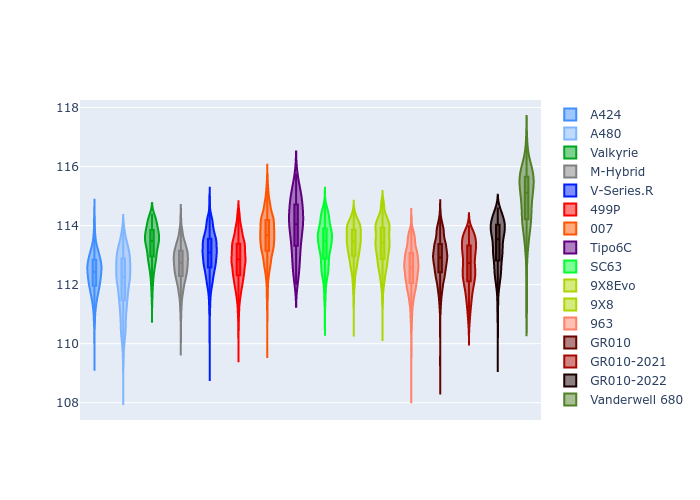
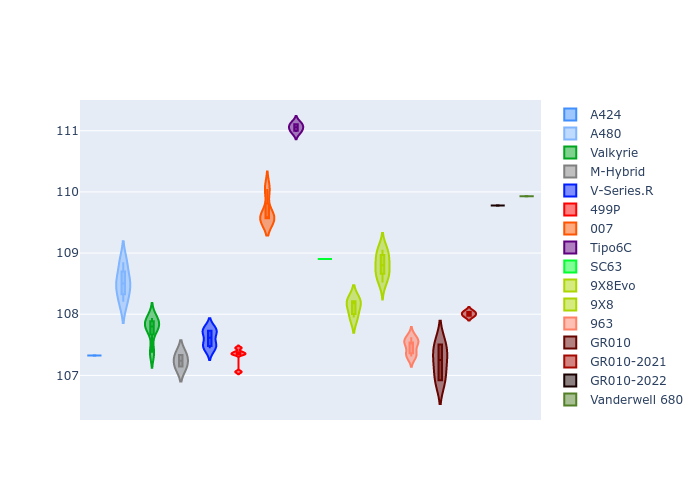

# Combined Plots

## Metadata

- BoP Accuracy: 93.05%
- Overall BoP Grade: A2
- Track: BAHRAIN
- Threshhold: 250.0kph

## BoP Table
| Manufacturer     | Car            | Weight   | Power   | PINC   | E/Stint   | FDS    | RDP    | QDP    | TDP    |
|:-----------------|:---------------|:---------|:--------|:-------|:----------|:-------|:-------|:-------|:-------|
| Alpine           | A424           | 1057kg   | 520.0kw | -0.10% | 922MJ     | -      | 52.35% | 61.85% | 27.84% |
| Alpine           | A480           | 952kg    | 432.0kw | +0.10% | 790MJ     | -      | 54.51% | 76.19% | 54.04% |
| Aston Martin     | Valkyrie       | 1052kg   | 504.0kw | +0.10% | 899MJ     | -      | 53.59% | 53.33% | 21.51% |
| BMW              | M-Hybrid       | 1051kg   | 512.0kw | -0.10% | 909MJ     | -      | 53.26% | 57.23% | 34.54% |
| Cadillac         | V-Series.R     | 1044kg   | 510.0kw | +0.10% | 902MJ     | -      | 47.80% | 56.73% | 19.63% |
| Ferrari          | 499P           | 1073kg   | 508.0kw | -0.10% | 907MJ     | 190kph | 53.02% | 42.32% | 9.88%  |
| Glickenhaus      | 007            | 1040kg   | 520.0kw | -      | 911MJ     | -      | 46.49% | 46.07% | 47.78% |
| Isotta Fraschini | Tipo6C         | 1059kg   | 520.0kw | -      | 917MJ     | 190kph | 43.95% | 47.22% | 31.53% |
| Lamborghini      | SC63           | 1052kg   | 519.0kw | -0.10% | 910MJ     | -      | 46.33% | 59.50% | 29.33% |
| Peugeot          | 9X8Evo         | 1060kg   | 510.0kw | -0.10% | 911MJ     | 190kph | 48.47% | 51.26% | 16.02% |
| Peugeot          | 9X8            | 1040kg   | 520.0kw | -      | 908MJ     | 150kph | 54.07% | 57.08% | 10.80% |
| Porsche          | 963            | 1057kg   | 516.0kw | -0.10% | 912MJ     | -      | 50.87% | 45.25% | 30.77% |
| Toyota           | GR010          | 1090kg   | 512.0kw | -0.10% | 911MJ     | 190kph | 52.43% | 57.12% | 12.82% |
| Toyota           | GR010-2021     | 1075kg   | 513.0kw | +0.10% | 907MJ     | 150kph | 54.09% | 52.67% | 26.37% |
| Toyota           | GR010-2022     | 1090kg   | 512.0kw | +0.10% | 908MJ     | 190kph | 53.48% | 69.44% | 7.86%  |
| Vanwall          | Vanderwell 680 | 1030kg   | 520.0kw | -      | 906MJ     | -      | 53.41% | 56.28% | 29.85% |

## Performance Table
| Manufacturer     | Car            | RP      | QP      | Vavg      |   RDLC | BOP-Grade   | Match   |
|:-----------------|:---------------|:--------|:--------|:----------|-------:|:------------|:--------|
| Alpine           | A424           | 1:51.41 | 1:47.01 | 290.88kph |   1.04 | ~A1         | 97.78%  |
| Alpine           | A480           | 1:50.52 | 1:47.17 | 283.13kph |   1.03 | -C1         | 75.79%  |
| Aston Martin     | Valkyrie       | 1:53.25 | 1:48.09 | 287.50kph |   1.05 | ~A1         | 96.08%  |
| BMW              | M-Hybrid       | 1:51.86 | 1:47.06 | 288.96kph |   1.04 | ~A1         | 99.60%  |
| Cadillac         | V-Series.R     | 1:52.04 | 1:47.26 | 286.02kph |   1.04 | ~A1         | 99.89%  |
| Ferrari          | 499P           | 1:52.13 | 1:46.80 | 289.48kph |   1.05 | ~A1         | 99.77%  |
| Glickenhaus      | 007            | 1:52.23 | 1:48.74 | 287.99kph |   1.03 | ~A1         | 97.68%  |
| Isotta Fraschini | Tipo6C         | 1:53.59 | 1:51.21 | 288.80kph |   1.02 | +C1         | 76.12%  |
| Lamborghini      | SC63           | 1:52.69 | 1:48.85 | 289.23kph |   1.04 | ~A1         | 98.55%  |
| Peugeot          | 9X8Evo         | 1:52.84 | 1:48.14 | 290.56kph |   1.04 | +A2         | 94.77%  |
| Peugeot          | 9X8            | 1:51.76 | 1:47.19 | 282.98kph |   1.04 | ~A1         | 99.15%  |
| Porsche          | 963            | 1:51.73 | 1:47.01 | 289.74kph |   1.04 | ~A1         | 99.53%  |
| Toyota           | GR010          | 1:52.26 | 1:46.81 | 289.64kph |   1.05 | ~A1         | 99.74%  |
| Toyota           | GR010-2021     | 1:52.10 | 1:47.71 | 282.32kph |   1.04 | ~A1         | 100.00% |
| Toyota           | GR010-2022     | 1:52.33 | 1:48.74 | 287.64kph |   1.03 | ~A1         | 100.00% |
| Vanwall          | Vanderwell 680 | 1:53.93 | 1:48.99 | 283.32kph |   1.05 | +E2         | 54.32%  |

## Race Laptimes

## Quali Laptimes

## Topspeeds

## Laptimes Lineplot

