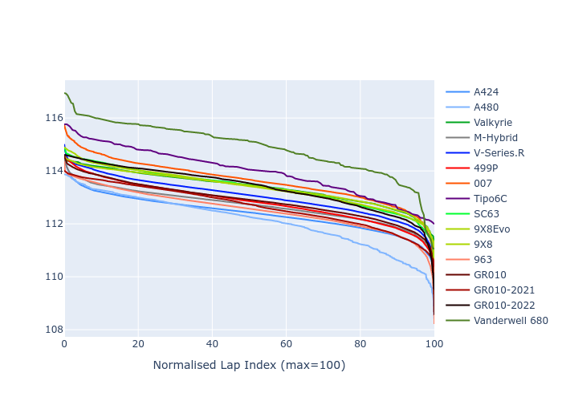

# Combined Plots

## Metadata

- BoP Accuracy: 92.49%
- Overall BoP Grade: A2
- Track: BAHRAIN
- Threshhold: 210.0kph

## BoP Table
| Manufacturer     | Car            | Weight   | Power   | PINC   | E/Stint   | FDS    |
|:-----------------|:---------------|:---------|:--------|:-------|:----------|:-------|
| Alpine           | A424           | 1057kg   | 520.0kw | -1.00% | 920MJ     | -      |
| Alpine           | A480           | 1052kg   | 432.0kw | +1.00% | 792MJ     | -      |
| Aston Martin     | Valkyrie       | 1052kg   | 504.0kw | +1.00% | 901MJ     | -      |
| BMW              | M-Hybrid       | 1051kg   | 512.0kw | -1.00% | 907MJ     | -      |
| Cadillac         | V-Series.R     | 1044kg   | 510.0kw | +1.00% | 904MJ     | -      |
| Ferrari          | 499P           | 1073kg   | 508.0kw | -1.00% | 905MJ     | 190kph |
| Glickenhaus      | 007            | 1040kg   | 520.0kw | -      | 911MJ     | -      |
| Isotta Fraschini | Tipo6C         | 1059kg   | 520.0kw | -      | 917MJ     | 190kph |
| Lamborghini      | SC63           | 1052kg   | 519.0kw | -1.00% | 908MJ     | -      |
| Peugeot          | 9X8Evo         | 1060kg   | 510.0kw | -1.00% | 909MJ     | 190kph |
| Peugeot          | 9X8            | 1040kg   | 520.0kw | -      | 908MJ     | 150kph |
| Porsche          | 963            | 1057kg   | 516.0kw | -1.00% | 910MJ     | -      |
| Toyota           | GR010          | 1090kg   | 512.0kw | -1.00% | 909MJ     | 190kph |
| Toyota           | GR010OLD       | 1075kg   | 513.0kw | +1.00% | 909MJ     | 150kph |
| Vanwall          | Vanderwell 680 | 1030kg   | 520.0kw | -      | 906MJ     | -      |

## Performance Table
| Manufacturer     | Car            | RP      | QP      | Vavg      |   RDLC | BOP-Grade   | Match   |
|:-----------------|:---------------|:--------|:--------|:----------|-------:|:------------|:--------|
| Alpine           | A424           | 1:50.72 | 1:46.52 | 290.37kph |   1.04 | ~A1         | 98.66%  |
| Alpine           | A480           | 1:50.69 | 1:47.59 | 282.14kph |   1.03 | ~A1         | 98.94%  |
| Aston Martin     | Valkyrie       | 1:52.16 | 1:47.11 | 288.20kph |   1.05 | ~A1         | 98.90%  |
| BMW              | M-Hybrid       | 1:51.14 | 1:46.56 | 288.30kph |   1.04 | ~A1         | 99.61%  |
| Cadillac         | V-Series.R     | 1:51.29 | 1:46.79 | 286.94kph |   1.04 | ~A1         | 99.92%  |
| Ferrari          | 499P           | 1:51.06 | 1:46.41 | 288.85kph |   1.04 | ~A1         | 99.40%  |
| Glickenhaus      | 007            | 1:51.96 | 1:48.49 | 287.99kph |   1.03 | +A2         | 93.38%  |
| Isotta Fraschini | Tipo6C         | 1:52.85 | 1:50.39 | 288.80kph |   1.02 | +B2         | 80.60%  |
| Lamborghini      | SC63           | 1:52.11 | 1:48.36 | 288.52kph |   1.03 | ~A1         | 97.23%  |
| Peugeot          | 9X8Evo         | 1:51.84 | 1:47.24 | 289.85kph |   1.04 | ~A1         | 97.57%  |
| Peugeot          | 9X8            | 1:51.92 | 1:47.70 | 284.34kph |   1.04 | ~A1         | 98.65%  |
| Porsche          | 963            | 1:50.96 | 1:46.47 | 288.69kph |   1.04 | ~A1         | 99.70%  |
| Toyota           | GR010          | 1:51.10 | 1:46.35 | 288.52kph |   1.04 | ~A1         | 99.71%  |
| Toyota           | GR010OLD       | 1:50.11 | 1:46.72 | 286.30kph |   1.03 | -A2         | 92.27%  |
| Vanwall          | Vanderwell 680 | 1:53.97 | 1:48.99 | 283.32kph |   1.05 | +Ω1         | 32.89%  |

## Race Laptimes

## Quali Laptimes

## Topspeeds

## Laptimes Lineplot

