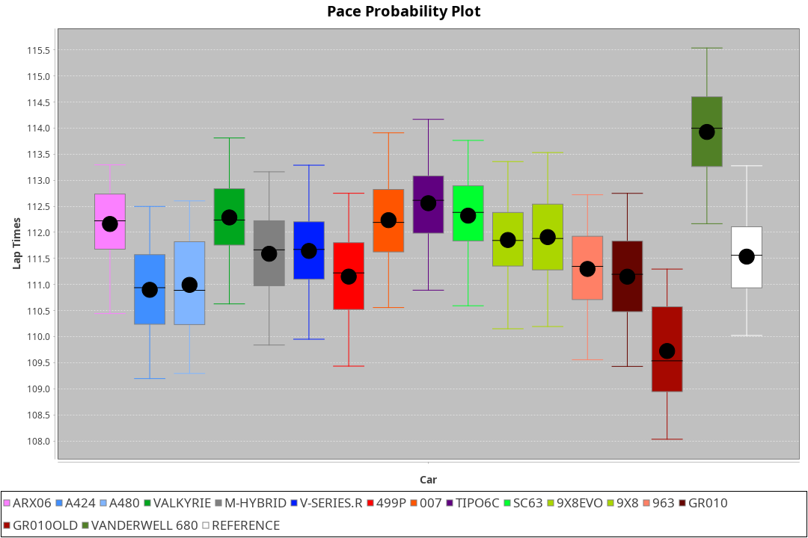
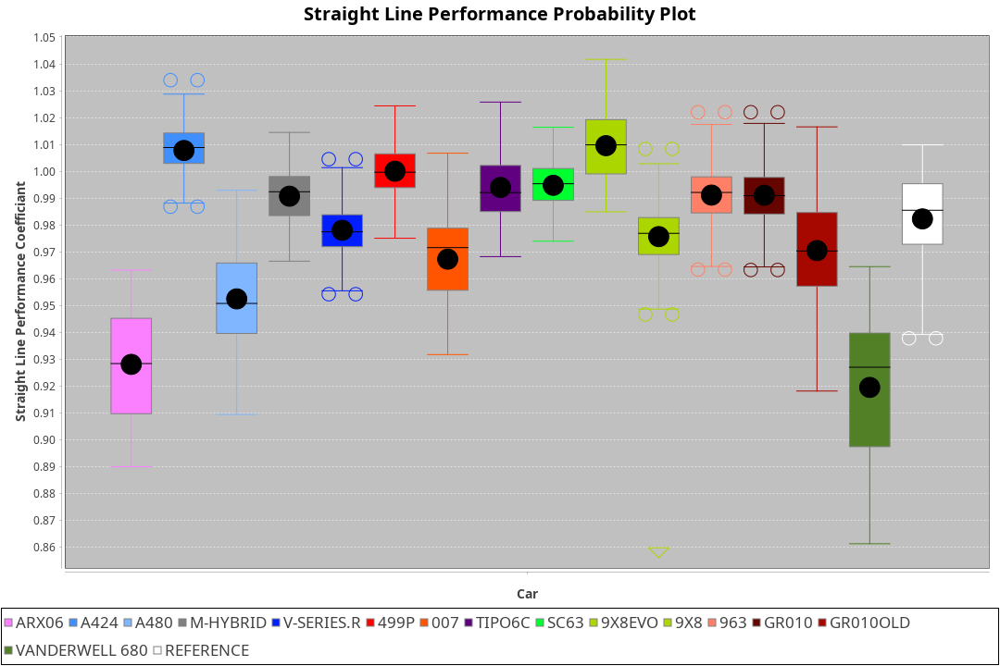
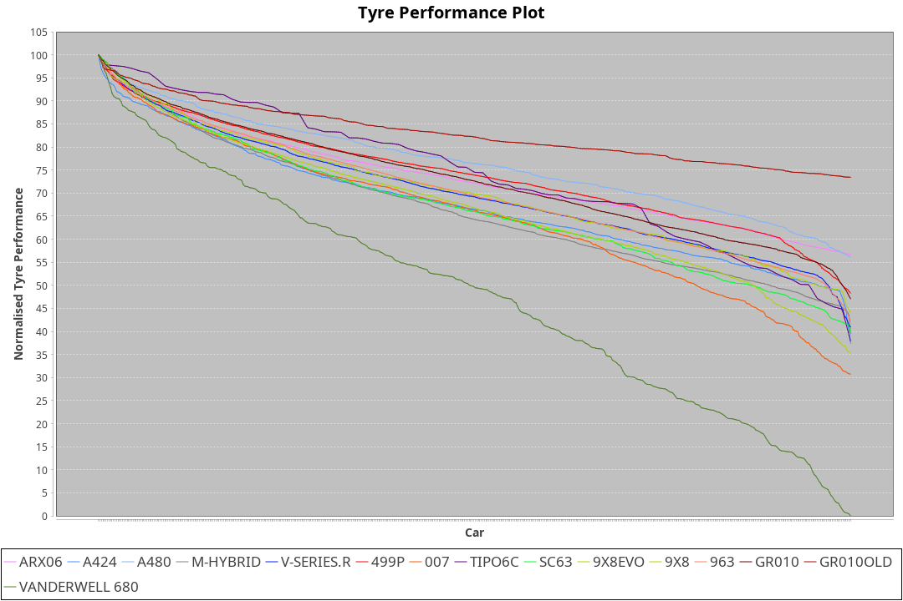

|Manufacturer|Car|Weight|Power|PINC|E/Stint|FDS|
|:-|:-|:-|:-|:-|:-|:-|
|Acura|ARX06|1080kg|510kw|1%|913MJ|-|
|Alpine|A424|1062kg|510kw|-1%|906MJ|-|
|Alpine|A480|952kg|413kw|1%|751MJ|-|
|BMW|M Hybrid V8 LMDh|1050kg|507kw|1%|903MJ|-|
|Cadillac|V-Series.R|1032kg|502kw|-1%|889MJ|-|
|Ferrari|499P|1075kg|501kw|-|894MJ|190kph|
|Glickenhaus|007|1031kg|517kw|-|907MJ|-|
|Issotta Fraschini|Tipo6C|1040kg|518kw|-|916MJ|190kph|
|Lamborghini|SC63|1055kg|511kw|1%|906MJ|-|
|Peugeot|9X8|1039kg|515kw|-|901MJ|150kph|
|Porsche|963|1048kg|508kw|-1%|893MJ|-|
|Toyota|GR010|1090kg|506kw|-1%|898MJ|190kph|
|Toyota|GR010OLD|1077kg|509kw|-1%|901MJ|190kph|
|Vanwall|Vanderwell 680|1030kg|520kw|-|903MJ|-|

### BoP Accuracy: 89.79%; Overall BoP Grade: B1
|Manufacturer|Car|Type|RP|QP|Weight|Power¹|Threshhold|PINC|Power²|E/Stint|AVG Vmax|FDS|RDLC|L/Stint|BOP-Grade|ModelAccuracy|ModelPoints|Match%|
|:-|:-|:-|:-|:-|:-|:-|:-|:-|:-|:-|:-|:-|:-|:-|:-|:-|:-|:-|
|Acura|ARX06|LMDH|1:53.13|1:47.01|1080kg|510kw|210.0kph|1%|515kw|913MJ|278.01kph|-|0.99|35|-C1|100.00%|995|77.27%|
|Alpine|A424|LMDH|1:53.37|1:49.59|1062kg|510kw|210.0kph|-1%|505kw|906MJ|277.73kph|-|1.01|35|~A1|81.15%|521|98.39%|
|Alpine|A480|LMP1|1:53.06|1:48.43|952kg|413kw|210.0kph|1%|417kw|751MJ|275.10kph|-|0.97|32|~A1|67.92%|957|100.00%|
|BMW|M Hybrid V8 LMDh|LMDH|1:53.10|1:47.91|1050kg|507kw|210.0kph|1%|512kw|903MJ|275.36kph|-|1.02|34|-B1|98.60%|1690|88.66%|
|Cadillac|V-Series.R|LMDH|1:53.45|1:47.96|1032kg|502kw|210.0kph|-1%|497kw|889MJ|279.05kph|-|1.03|35|+B1|91.10%|1770|89.93%|
|Ferrari|499P|LMHHU|1:53.20|1:47.89|1075kg|501kw|210.0kph|-|501kw|894MJ|279.33kph|190kph|1.02|35|~A1|84.26%|2292|100.00%|
|Glickenhaus|007|LMHNH|1:53.20|1:48.62|1031kg|517kw|210.0kph|-|517kw|907MJ|282.87kph|-|0.95|34|~A1|94.63%|1605|96.25%|
|Issotta Fraschini|Tipo6C|LMHHU|1:53.20|1:50.31|1040kg|518kw|210.0kph|-|518kw|916MJ|280.60kph|190kph|1.07|34|+B1|66.67%|96|86.46%|
|Lamborghini|SC63|LMDH|1:53.04|1:50.36|1055kg|511kw|210.0kph|1%|516kw|906MJ|277.09kph|-|1.04|34|-B1|96.77%|419|87.15%|
|Peugeot|9X8|LMHHE|1:53.20|1:48.17|1039kg|515kw|210.0kph|-|515kw|901MJ|279.28kph|150kph|1.02|34|~A1|83.63%|2468|100.00%|
|Porsche|963|LMDH|1:53.38|1:47.83|1048kg|508kw|210.0kph|-1%|503kw|893MJ|278.95kph|-|1.02|35|~A1|93.14%|5746|100.00%|
|Toyota|GR010|LMHHU|1:53.42|1:48.09|1090kg|506kw|210.0kph|-1%|501kw|898MJ|278.64kph|190kph|1.00|35|~A1|87.37%|3154|100.00%|
|Toyota|GR010OLD|LMHHE|1:53.46|1:48.00|1077kg|509kw|210.0kph|-1%|504kw|901MJ|281.20kph|190kph|1.01|35|~A1|89.81%|1393|100.00%|
|Vanwall|Vanderwell 680|LMHNH|1:55.09|1:49.08|1030kg|520kw|210.0kph|-|520kw|903MJ|276.96kph|-|1.01|34|+Ω1|90.28%|604|32.96%|

## Power below Threshhold
|N/Nmax|ARX06|A424|MHYBRIDV8LMDH|VSERIES.R|499P|007|TIPO6C|SC63|9X8|963|GR010|GR010OLD|VANDERWELL680|​|RPM|A480|
|:-|:-|:-|:-|:-|:-|:-|:-|:-|:-|:-|:-|:-|:-|:-|:-|:-|
|0.550|251|251|250|247|247|255|255|252|254|250|249|251|256|​|--|-|
|0.575|274|274|273|270|270|278|278|275|277|273|272|274|279|​|--|-|
|0.600|295|295|293|290|290|298|299|295|297|293|292|294|300|​|--|-|
|0.625|316|316|314|310|310|320|321|316|319|314|313|315|322|​|--|-|
|0.650|337|337|335|331|331|341|342|337|340|335|334|336|343|​|--|-|
|0.675|358|358|356|352|352|363|364|359|362|357|355|357|365|​|--|-|
|0.700|380|380|377|374|373|385|386|380|383|378|377|379|387|​|--|-|
|0.725|401|401|399|395|394|407|407|402|405|399|398|400|409|​|--|-|
|0.750|422|422|419|415|414|427|428|422|426|420|418|421|430|​|--|-|
|0.775|441|441|438|434|433|446|447|441|445|439|437|440|449|​|5000|244|
|0.800|458|458|455|451|450|464|465|459|463|456|454|457|467|​|5500|288|
|0.825|473|473|470|466|465|479|480|474|478|471|469|472|482|​|6000|321|
|0.850|485|485|482|477|476|491|492|485|489|483|481|484|494|​|6500|363|
|0.875|495|495|492|487|486|502|503|496|500|493|491|494|505|​|7000|406|
|0.900|502|502|499|494|493|509|510|503|507|500|498|501|512|​|7500|416|
|0.925|507|507|504|499|498|514|515|508|512|505|503|506|517|​|8000|412|
|**0.950**|**510**|**510**|**507**|**502**|**501**|**517**|**518**|**511**|**515**|**508**|**506**|**509**|**520**|**​**|**8500**|**415**|
|0.975|508|508|505|500|499|515|516|509|513|506|504|507|518|​|9000|208|
|1.000|505|505|502|497|496|511|512|505|509|503|501|504|514|​|--|-|
|1.025|436|436|433|429|428|441|442|436|440|434|432|435|444|​|--|-|

## Power above Threshhold
|N/Nmax|ARX06|A424|MHYBRIDV8LMDH|VSERIES.R|499P|007|TIPO6C|SC63|9X8|963|GR010|GR010OLD|VANDERWELL680|​|RPM|A480|
|:-|:-|:-|:-|:-|:-|:-|:-|:-|:-|:-|:-|:-|:-|:-|:-|:-|
|0.550|254|249|252|245|247|255|255|254|254|248|247|248|256|​|--|-|
|0.575|277|272|275|267|270|278|278|277|277|271|270|271|279|​|--|-|
|0.600|297|292|296|287|290|298|299|298|297|291|290|291|300|​|--|-|
|0.625|319|312|317|307|310|320|321|319|319|311|310|312|322|​|--|-|
|0.650|340|333|338|328|331|341|342|340|340|332|331|333|343|​|--|-|
|0.675|362|355|359|349|352|363|364|362|362|353|352|354|365|​|--|-|
|0.700|383|376|381|370|373|385|386|384|383|374|373|375|387|​|--|-|
|0.725|405|397|403|391|394|407|407|406|405|395|394|396|409|​|--|-|
|0.750|426|417|423|411|414|427|428|427|426|416|414|416|430|​|--|-|
|0.775|445|436|442|429|433|446|447|446|445|435|433|435|449|​|5000|244|
|0.800|463|454|460|446|450|464|465|463|463|452|450|453|467|​|5500|288|
|0.825|478|469|475|461|465|479|480|478|478|467|465|468|482|​|6000|321|
|0.850|489|480|486|472|476|491|492|490|489|478|476|479|494|​|6500|363|
|0.875|500|490|497|482|486|502|503|501|500|488|486|489|505|​|7000|406|
|0.900|507|497|504|489|493|509|510|508|507|495|493|496|512|​|7500|416|
|0.925|512|502|509|494|498|514|515|513|512|500|498|501|517|​|8000|412|
|**0.950**|**515**|**505**|**512**|**497**|**501**|**517**|**518**|**516**|**515**|**503**|**501**|**504**|**520**|**​**|**8500**|**415**|
|0.975|513|503|510|495|499|515|516|514|513|501|499|502|518|​|9000|208|
|1.000|509|500|506|492|496|511|512|510|509|498|496|499|514|​|--|-|
|1.025|440|431|437|424|428|441|442|441|440|430|428|430|444|​|--|-|
