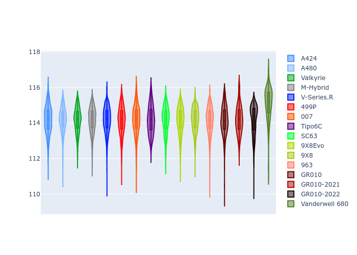
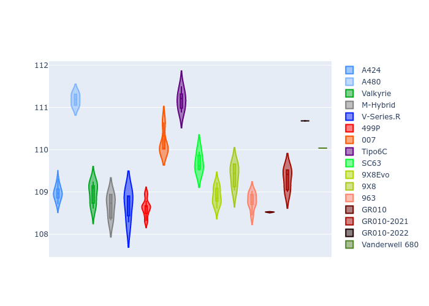
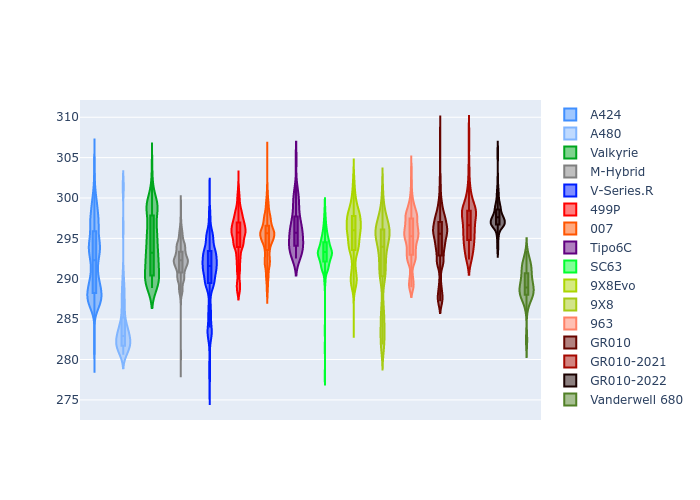
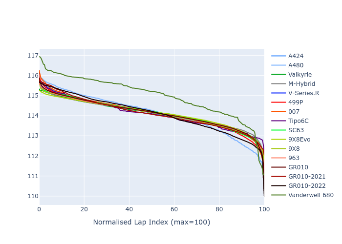

# Combined Plots

## Metadata

- BoP Accuracy: 98.65%
- Overall BoP Grade: A1
- Track: BAHRAIN
- Threshhold: 250.0kph
- Average Laptime: 1:54.17
- Average Quali Laptime: 1:49.49
- Laptime Std Dev: 0.21 seconds
- Filtered Average Topspeed: 291.32kph

## BoP Table
| Manufacturer     | Car            | Weight   | Power   | PINC   | E/Stint   | FDS    | RDP    | QDP    | TDP    |
|:-----------------|:---------------|:---------|:--------|:-------|:----------|:-------|:-------|:-------|:-------|
| Alpine           | A424           | 1042kg   | 480.0kw | +6.00% | 901MJ     | -      | 52.20% | 54.51% | 24.58% |
| Alpine           | A480           | 932kg    | 410.0kw | +0.10% | 768MJ     | -      | 53.05% | 74.07% | 48.97% |
| Aston Martin     | Valkyrie       | 1051kg   | 520.0kw | -      | 913MJ     | -      | 53.39% | 54.11% | 23.71% |
| BMW              | M-Hybrid       | 1042kg   | 480.0kw | +6.50% | 897MJ     | -      | 53.47% | 52.95% | 33.73% |
| Cadillac         | V-Series.R     | 1046kg   | 480.0kw | +8.20% | 897MJ     | -      | 49.22% | 60.31% | 18.04% |
| Ferrari          | 499P           | 1060kg   | 499.0kw | -1.30% | 895MJ     | 200kph | 51.56% | 44.72% | 9.86%  |
| Glickenhaus      | 007            | 1043kg   | 520.0kw | -      | 911MJ     | -      | 46.14% | 49.30% | 41.45% |
| Isotta Fraschini | Tipo6C         | 1056kg   | 520.0kw | -      | 917MJ     | 200kph | 43.95% | 47.22% | 31.53% |
| Lamborghini      | SC63           | 1063kg   | 520.0kw | -      | 913MJ     | -      | 48.25% | 60.95% | 28.65% |
| Peugeot          | 9X8Evo         | 1031kg   | 500.0kw | -1.00% | 897MJ     | 190kph | 50.17% | 49.36% | 17.73% |
| Peugeot          | 9X8            | 1035kg   | 480.0kw | +8.30% | 893MJ     | 200kph | 54.54% | 58.39% | 9.69%  |
| Porsche          | 963            | 1036kg   | 490.0kw | +1.10% | 890MJ     | -      | 50.78% | 41.25% | 27.61% |
| Toyota           | GR010          | 1059kg   | 507.0kw | -4.30% | 891MJ     | 190kph | 51.68% | 51.25% | 14.48% |
| Toyota           | GR010-2021     | 1056kg   | 508.0kw | -5.40% | 885MJ     | 150kph | 54.04% | 54.81% | 9.72%  |
| Toyota           | GR010-2022     | 1054kg   | 518.0kw | -7.30% | 889MJ     | 200kph | 53.24% | 64.49% | 9.72%  |
| Vanwall          | Vanderwell 680 | 1030kg   | 520.0kw | -      | 906MJ     | -      | 49.68% | 60.93% | 34.43% |

## Performance Table
| Manufacturer     | Car            | RP      | QP      | Vavg      |   RDLC | BOP-Grade   | Match   |
|:-----------------|:---------------|:--------|:--------|:----------|-------:|:------------|:--------|
| Alpine           | A424           | 1:54.13 | 1:48.97 | 290.57kph |   1.05 | ~A1         | 99.94%  |
| Alpine           | A480           | 1:54.09 | 1:51.18 | 286.47kph |   1.03 | ~A1         | 99.07%  |
| Aston Martin     | Valkyrie       | 1:54.10 | 1:48.97 | 290.52kph |   1.05 | ~A1         | 100.00% |
| BMW              | M-Hybrid       | 1:54.11 | 1:48.68 | 290.73kph |   1.05 | ~A1         | 100.00% |
| Cadillac         | V-Series.R     | 1:54.12 | 1:48.70 | 289.88kph |   1.05 | ~A1         | 99.86%  |
| Ferrari          | 499P           | 1:54.11 | 1:48.63 | 291.87kph |   1.05 | ~A1         | 99.75%  |
| Glickenhaus      | 007            | 1:54.13 | 1:50.17 | 293.78kph |   1.04 | ~A1         | 99.02%  |
| Isotta Fraschini | Tipo6C         | 1:54.10 | 1:51.17 | 293.42kph |   1.03 | ~A1         | 100.00% |
| Lamborghini      | SC63           | 1:54.13 | 1:49.69 | 290.54kph |   1.04 | ~A1         | 100.00% |
| Peugeot          | 9X8Evo         | 1:54.12 | 1:48.91 | 291.77kph |   1.05 | ~A1         | 100.00% |
| Peugeot          | 9X8            | 1:54.11 | 1:49.39 | 291.32kph |   1.04 | ~A1         | 100.00% |
| Porsche          | 963            | 1:54.12 | 1:48.79 | 291.78kph |   1.05 | ~A1         | 99.91%  |
| Toyota           | GR010          | 1:54.13 | 1:48.52 | 291.77kph |   1.05 | ~A1         | 99.85%  |
| Toyota           | GR010-2021     | 1:54.11 | 1:49.31 | 292.69kph |   1.04 | ~A1         | 100.00% |
| Toyota           | GR010-2022     | 1:54.11 | 1:50.68 | 294.10kph |   1.03 | ~A1         | 99.48%  |
| Vanwall          | Vanderwell 680 | 1:54.99 | 1:50.04 | 289.92kph |   1.04 | +B2         | 81.52%  |

## Race Laptimes

## Quali Laptimes

## Topspeeds

## Laptimes Lineplot

