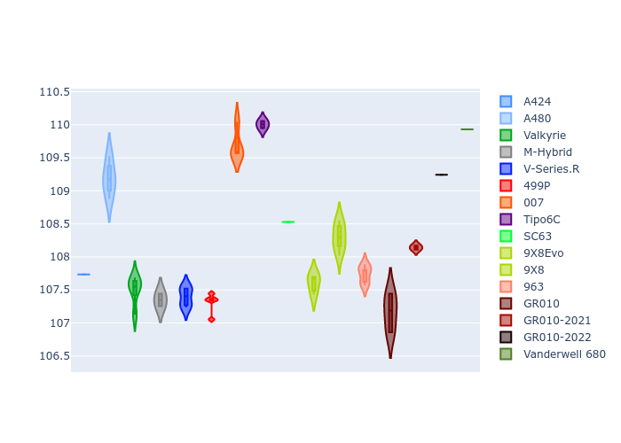

# Combined Plots

## Metadata

- BoP Accuracy: 97.68%
- Overall BoP Grade: A1
- Track: BAHRAIN
- Threshhold: 210.0kph

## BoP Table
| Manufacturer     | Car            | Weight   | Power   | PINC   | E/Stint   | FDS    |
|:-----------------|:---------------|:---------|:--------|:-------|:----------|:-------|
| Alpine           | A424           | 1100kg   | 480.0kw | +0.20% | 891MJ     | -      |
| Alpine           | A480           | 1051kg   | 410.0kw | -      | 769MJ     | -      |
| Aston Martin     | Valkyrie       | 1055kg   | 482.0kw | -0.40% | 879MJ     | -      |
| BMW              | M-Hybrid       | 1100kg   | 480.0kw | +1.80% | 890MJ     | -      |
| Cadillac         | V-Series.R     | 1100kg   | 480.0kw | +6.80% | 896MJ     | -      |
| Ferrari          | 499P           | 1100kg   | 480.0kw | +0.30% | 886MJ     | 200kph |
| Glickenhaus      | 007            | 1072kg   | 489.0kw | +2.50% | 892MJ     | -      |
| Isotta Fraschini | Tipo6C         | 1085kg   | 520.0kw | -2.20% | 915MJ     | 190kph |
| Lamborghini      | SC63           | 1081kg   | 482.0kw | +5.50% | 893MJ     | -      |
| Peugeot          | 9X8Evo         | 1089kg   | 480.0kw | -      | 887MJ     | 190kph |
| Peugeot          | 9X8            | 1100kg   | 496.0kw | +4.80% | 904MJ     | 170kph |
| Porsche          | 963            | 1100kg   | 480.0kw | +1.60% | 888MJ     | -      |
| Toyota           | GR010          | 1100kg   | 480.0kw | -      | 883MJ     | 200kph |
| Toyota           | GR010OLD       | 1100kg   | 480.0kw | +0.10% | 880MJ     | 200kph |
| Vanwall          | Vanderwell 680 | 1030kg   | 520.0kw | -      | 906MJ     | -      |

## Performance Table
| Manufacturer     | Car            | RP      | QP      | Vavg      |   RDLC | BOP-Grade   | Match   |
|:-----------------|:---------------|:--------|:--------|:----------|-------:|:------------|:--------|
| Alpine           | A424           | 1:52.83 | 1:48.49 | 278.93kph |   1.04 | ~A1         | 99.96%  |
| Alpine           | A480           | 1:51.97 | 1:48.81 | 276.20kph |   1.03 | ~A1         | 98.38%  |
| Aston Martin     | Valkyrie       | 1:53.40 | 1:48.25 | 282.21kph |   1.05 | ~A1         | 100.00% |
| BMW              | M-Hybrid       | 1:52.78 | 1:48.08 | 279.14kph |   1.04 | ~A1         | 99.96%  |
| Cadillac         | V-Series.R     | 1:52.60 | 1:48.01 | 279.71kph |   1.04 | ~A1         | 99.83%  |
| Ferrari          | 499P           | 1:52.62 | 1:47.86 | 281.44kph |   1.04 | ~A1         | 99.62%  |
| Glickenhaus      | 007            | 1:53.40 | 1:49.86 | 280.46kph |   1.03 | +A2         | 93.25%  |
| Isotta Fraschini | Tipo6C         | 1:53.40 | 1:50.92 | 284.55kph |   1.02 | ~A1         | 97.76%  |
| Lamborghini      | SC63           | 1:53.40 | 1:49.59 | 283.02kph |   1.03 | ~A1         | 97.71%  |
| Peugeot          | 9X8Evo         | 1:53.41 | 1:48.69 | 281.56kph |   1.04 | ~A1         | 96.95%  |
| Peugeot          | 9X8            | 1:53.45 | 1:49.13 | 277.43kph |   1.04 | ~A1         | 97.60%  |
| Porsche          | 963            | 1:52.74 | 1:48.12 | 279.15kph |   1.04 | ~A1         | 99.89%  |
| Toyota           | GR010          | 1:52.71 | 1:47.83 | 281.69kph |   1.05 | ~A1         | 99.88%  |
| Toyota           | GR010OLD       | 1:52.78 | 1:49.24 | 276.49kph |   1.03 | ~A1         | 100.00% |
| Vanwall          | Vanderwell 680 | 1:53.97 | 1:48.99 | 283.32kph |   1.05 | +B2         | 84.38%  |

## Race Laptimes

## Quali Laptimes

## Topspeeds

## Laptimes Lineplot

