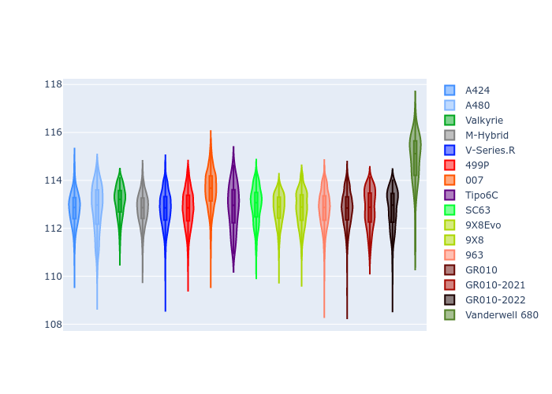
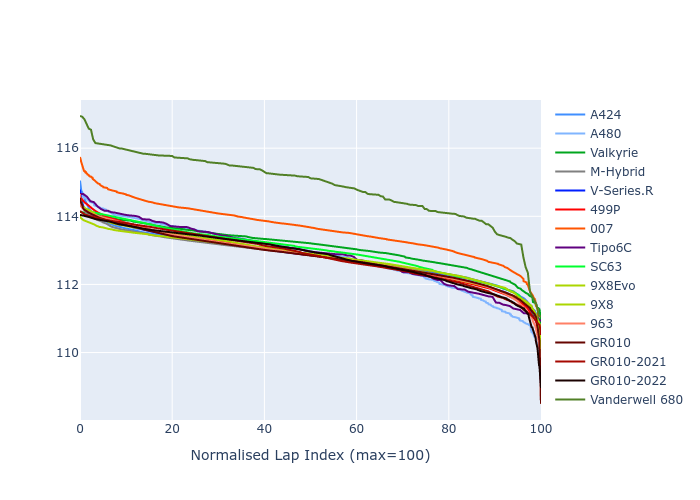

# Combined Plots

## Metadata

- BoP Accuracy: 95.49%
- Overall BoP Grade: A1
- Track: BAHRAIN
- Threshhold: 250.0kph
- Average Laptime: 1:53.03
- Average Quali Laptime: 1:48.30
- Average Topspeed: 293.61kph

## BoP Table
| Manufacturer     | Car            | Weight   | Power   | PINC   | E/Stint   | FDS    | RDP    | QDP    | TDP    |
|:-----------------|:---------------|:---------|:--------|:-------|:----------|:-------|:-------|:-------|:-------|
| Alpine           | A424           | 1050kg   | 481.0kw | +8.10% | 908MJ     | -      | 51.64% | 59.31% | 26.80% |
| Alpine           | A480           | 940kg    | 410.0kw | +0.10% | 769MJ     | -      | 53.05% | 74.07% | 48.97% |
| Aston Martin     | Valkyrie       | 1030kg   | 520.0kw | -      | 911MJ     | -      | 53.50% | 53.33% | 21.51% |
| BMW              | M-Hybrid       | 1050kg   | 491.0kw | +5.90% | 907MJ     | -      | 52.89% | 56.22% | 33.41% |
| Cadillac         | V-Series.R     | 1050kg   | 519.0kw | +0.10% | 911MJ     | -      | 48.63% | 60.80% | 19.01% |
| Ferrari          | 499P           | 1071kg   | 490.0kw | +5.90% | 907MJ     | 190kph | 51.38% | 44.98% | 9.83%  |
| Glickenhaus      | 007            | 1030kg   | 520.0kw | -      | 910MJ     | -      | 46.15% | 49.30% | 41.45% |
| Isotta Fraschini | Tipo6C         | 1030kg   | 520.0kw | -      | 914MJ     | 140kph | 43.95% | 47.22% | 31.53% |
| Lamborghini      | SC63           | 1030kg   | 520.0kw | -      | 909MJ     | -      | 48.33% | 60.95% | 28.65% |
| Peugeot          | 9X8Evo         | 1030kg   | 520.0kw | -0.80% | 915MJ     | 190kph | 48.87% | 52.78% | 15.41% |
| Peugeot          | 9X8            | 1030kg   | 520.0kw | -      | 907MJ     | 130kph | 54.54% | 58.39% | 9.69%  |
| Porsche          | 963            | 1046kg   | 480.0kw | +7.80% | 899MJ     | -      | 50.70% | 44.30% | 29.51% |
| Toyota           | GR010          | 1063kg   | 480.0kw | +7.60% | 899MJ     | 190kph | 51.09% | 52.71% | 11.46% |
| Toyota           | GR010-2021     | 1065kg   | 516.0kw | -3.70% | 898MJ     | 150kph | 54.08% | 54.81% | 9.72%  |
| Toyota           | GR010-2022     | 1054kg   | 520.0kw | -2.40% | 904MJ     | 190kph | 53.45% | 68.83% | 9.58%  |
| Vanwall          | Vanderwell 680 | 1030kg   | 520.0kw | -      | 906MJ     | -      | 49.68% | 60.93% | 34.43% |

## Performance Table
| Manufacturer     | Car            | RP      | QP      | Vavg      |   RDLC | BOP-Grade   | Match   |
|:-----------------|:---------------|:--------|:--------|:----------|-------:|:------------|:--------|
| Alpine           | A424           | 1:52.82 | 1:47.73 | 291.91kph |   1.05 | ~A1         | 99.48%  |
| Alpine           | A480           | 1:52.81 | 1:49.19 | 285.58kph |   1.03 | ~A1         | 99.73%  |
| Aston Martin     | Valkyrie       | 1:53.10 | 1:47.50 | 295.01kph |   1.05 | ~A1         | 100.00% |
| BMW              | M-Hybrid       | 1:52.81 | 1:47.35 | 291.75kph |   1.05 | ~A1         | 100.00% |
| Cadillac         | V-Series.R     | 1:52.81 | 1:47.39 | 290.39kph |   1.05 | ~A1         | 99.86%  |
| Ferrari          | 499P           | 1:52.82 | 1:47.31 | 294.76kph |   1.05 | ~A1         | 99.95%  |
| Glickenhaus      | 007            | 1:53.62 | 1:49.69 | 295.12kph |   1.04 | +A2         | 91.74%  |
| Isotta Fraschini | Tipo6C         | 1:52.86 | 1:50.00 | 296.08kph |   1.03 | ~A1         | 100.00% |
| Lamborghini      | SC63           | 1:52.97 | 1:48.53 | 293.88kph |   1.04 | ~A1         | 100.00% |
| Peugeot          | 9X8Evo         | 1:52.82 | 1:47.60 | 296.52kph |   1.05 | ~A1         | 100.00% |
| Peugeot          | 9X8            | 1:52.84 | 1:48.30 | 293.48kph |   1.04 | ~A1         | 100.00% |
| Porsche          | 963            | 1:52.81 | 1:47.74 | 293.84kph |   1.05 | ~A1         | 99.84%  |
| Toyota           | GR010          | 1:52.81 | 1:47.16 | 295.46kph |   1.05 | ~A1         | 99.76%  |
| Toyota           | GR010-2021     | 1:52.82 | 1:48.14 | 294.96kph |   1.04 | ~A1         | 100.00% |
| Toyota           | GR010-2022     | 1:52.81 | 1:49.24 | 299.07kph |   1.03 | ~A1         | 99.49%  |
| Vanwall          | Vanderwell 680 | 1:54.89 | 1:49.93 | 289.92kph |   1.05 | +Ω1         | 37.91%  |

## Race Laptimes

## Quali Laptimes

## Topspeeds

## Laptimes Lineplot

