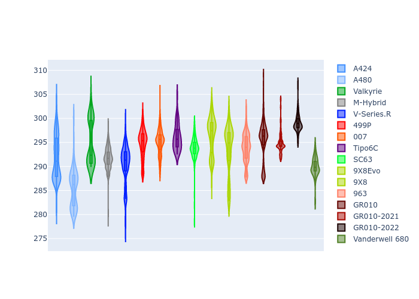

# Combined Plots

## Metadata

- BoP Accuracy: 96.46%
- Overall BoP Grade: A1
- Track: BAHRAIN
- Threshhold: 250.0kph

## BoP Table
| Manufacturer     | Car            | Weight   | Power   | PINC   | E/Stint   | FDS    | RDP    | QDP    | TDP    |
|:-----------------|:---------------|:---------|:--------|:-------|:----------|:-------|:-------|:-------|:-------|
| Alpine           | A424           | 1079kg   | 480.0kw | +0.30% | 889MJ     | -      | 52.35% | 61.85% | 27.84% |
| Alpine           | A480           | 952kg    | 410.0kw | -      | 770MJ     | -      | 54.51% | 76.19% | 54.04% |
| Aston Martin     | Valkyrie       | 1050kg   | 480.0kw | -      | 877MJ     | -      | 53.59% | 53.33% | 21.51% |
| BMW              | M-Hybrid       | 1083kg   | 480.0kw | +1.40% | 888MJ     | -      | 53.26% | 57.23% | 34.54% |
| Cadillac         | V-Series.R     | 1100kg   | 480.0kw | +6.40% | 897MJ     | -      | 47.80% | 56.73% | 19.63% |
| Ferrari          | 499P           | 1098kg   | 480.0kw | +0.10% | 885MJ     | 190kph | 53.02% | 42.32% | 9.88%  |
| Glickenhaus      | 007            | 1064kg   | 480.0kw | +4.50% | 889MJ     | -      | 46.49% | 46.07% | 47.78% |
| Isotta Fraschini | Tipo6C         | 1085kg   | 520.0kw | -2.40% | 913MJ     | 190kph | 43.95% | 47.22% | 31.53% |
| Lamborghini      | SC63           | 1085kg   | 508.0kw | -1.80% | 900MJ     | -      | 46.33% | 59.50% | 29.33% |
| Peugeot          | 9X8Evo         | 1059kg   | 480.0kw | -      | 884MJ     | 190kph | 48.47% | 51.26% | 16.02% |
| Peugeot          | 9X8            | 1100kg   | 488.0kw | +6.50% | 902MJ     | 160kph | 54.07% | 57.08% | 10.80% |
| Porsche          | 963            | 1080kg   | 480.0kw | +0.60% | 884MJ     | -      | 50.87% | 45.25% | 30.77% |
| Toyota           | GR010          | 1100kg   | 480.0kw | -      | 883MJ     | 200kph | 52.43% | 57.12% | 12.82% |
| Toyota           | GR010-2021     | 1100kg   | 484.0kw | +7.40% | 902MJ     | 200kph | 54.09% | 52.67% | 26.37% |
| Toyota           | GR010-2022     | 1100kg   | 480.0kw | +1.80% | 884MJ     | 200kph | 53.48% | 69.44% | 7.86%  |
| Vanwall          | Vanderwell 680 | 1059kg   | 520.0kw | -      | 909MJ     | -      | 53.41% | 56.28% | 29.85% |

## Performance Table
| Manufacturer     | Car            | RP      | QP      | Vavg      |   RDLC | BOP-Grade   | Match   |
|:-----------------|:---------------|:--------|:--------|:----------|-------:|:------------|:--------|
| Alpine           | A424           | 1:55.05 | 1:50.40 | 280.78kph |   1.04 | ~A1         | 98.94%  |
| Alpine           | A480           | 1:52.38 | 1:48.93 | 277.74kph |   1.03 | -D2         | 62.50%  |
| Aston Martin     | Valkyrie       | 1:55.07 | 1:49.76 | 282.58kph |   1.05 | ~A1         | 100.00% |
| BMW              | M-Hybrid       | 1:55.06 | 1:50.01 | 280.43kph |   1.05 | ~A1         | 98.69%  |
| Cadillac         | V-Series.R     | 1:54.94 | 1:49.93 | 279.44kph |   1.05 | ~A1         | 99.79%  |
| Ferrari          | 499P           | 1:55.05 | 1:49.47 | 281.40kph |   1.05 | ~A1         | 99.93%  |
| Glickenhaus      | 007            | 1:55.08 | 1:51.44 | 281.00kph |   1.03 | +A2         | 94.58%  |
| Isotta Fraschini | Tipo6C         | 1:55.06 | 1:52.63 | 284.29kph |   1.02 | ~A1         | 95.52%  |
| Lamborghini      | SC63           | 1:55.07 | 1:51.08 | 282.41kph |   1.04 | ~A1         | 99.52%  |
| Peugeot          | 9X8Evo         | 1:55.05 | 1:50.19 | 284.42kph |   1.04 | ~A1         | 98.62%  |
| Peugeot          | 9X8            | 1:55.05 | 1:50.24 | 275.95kph |   1.04 | ~A1         | 99.94%  |
| Porsche          | 963            | 1:55.07 | 1:50.09 | 280.62kph |   1.05 | ~A1         | 99.46%  |
| Toyota           | GR010          | 1:55.14 | 1:49.44 | 282.09kph |   1.05 | ~A1         | 99.58%  |
| Toyota           | GR010-2021     | 1:54.38 | 1:49.83 | 279.77kph |   1.04 | ~A1         | 99.78%  |
| Toyota           | GR010-2022     | 1:54.86 | 1:51.12 | 281.42kph |   1.03 | ~A1         | 100.00% |
| Vanwall          | Vanderwell 680 | 1:55.05 | 1:50.02 | 280.48kph |   1.05 | ~A1         | 96.58%  |

## Race Laptimes

## Quali Laptimes

## Topspeeds

## Laptimes Lineplot

