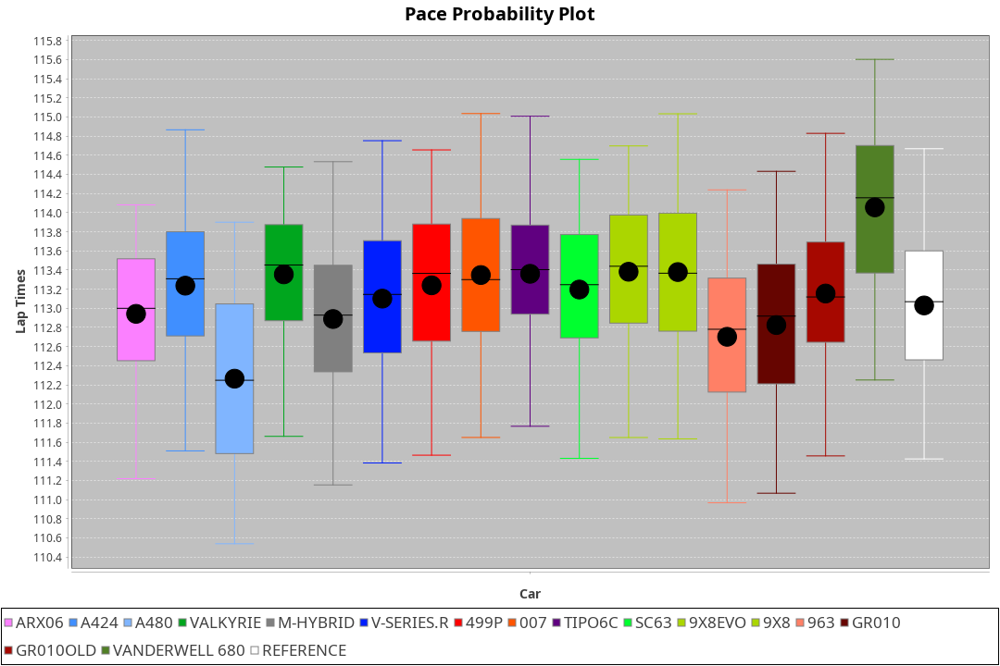
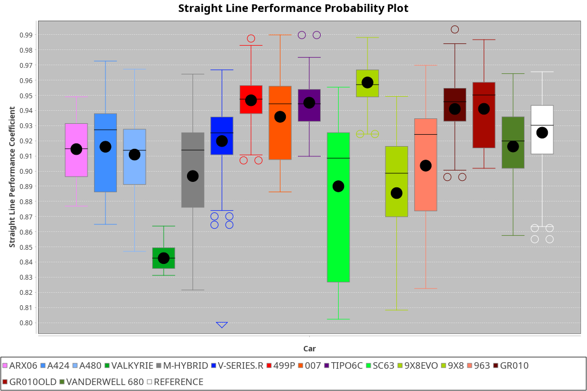
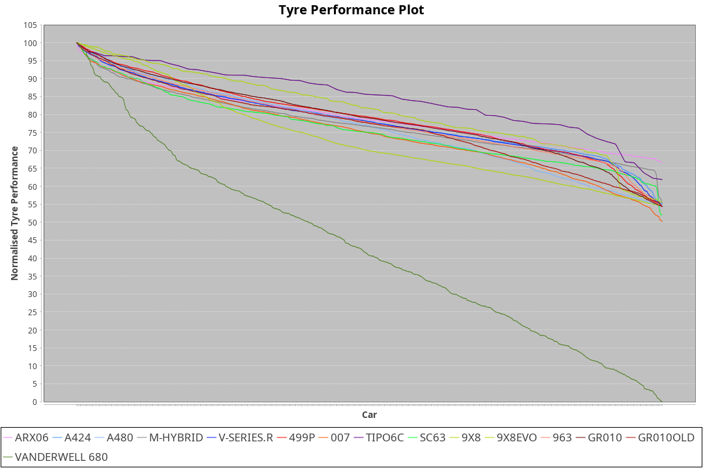

| Manufacturer     | Car            | Weight | Power   | PINC    | E/Stint | FDS     |
|:-|:-|:-|:-|:-|:-|:-|
| Acura            | ARX06          | 1100kg | 480.0kw | 8.30%   | 907MJ   |    -    |
| Alpine           | A424           | 1100kg | 483.0kw | 7.60%   | 913MJ   |    -    |
| Alpine           | A480           | 952kg  | 410.0kw | 2.30%   | 775MJ   |    -    |
| Aston Martin     | Valkyrie       | 1088kg | 481.0kw | 8.10%   | 902MJ   |    -    |
| BMW              | M-Hybrid       | 1100kg | 484.0kw | 7.40%   | 908MJ   |    -    |
| Cadillac         | V-Series.R     | 1100kg | 481.0kw | 8.10%   | 902MJ   |    -    |
| Ferrari          | 499P           | 1100kg | 480.0kw | 8.30%   | 906MJ   | 200kph  |
| Glickenhaus      | 007            | 1056kg | 488.0kw | 4.40%   | 895MJ   |    -    |
| Isotta Fraschini | Tipo6C         | 1101kg | 520.0kw |    -    | 921MJ   | 190kph  |
| Lamborghini      | SC63           | 1100kg | 507.0kw | 2.50%   | 910MJ   |    -    |
| Peugeot          | 9X8Evo         | 1069kg | 480.0kw |    -    | 885MJ   | 190kph  |
| Peugeot          | 9X8            | 1093kg | 495.0kw | 5.00%   | 904MJ   | 150kph  |
| Porsche          | 963            | 1100kg | 480.0kw | 8.30%   | 905MJ   |    -    |
| Toyota           | GR010          | 1100kg | 480.0kw | 8.30%   | 904MJ   | 200kph  |
| Toyota           | GR010OLD       | 1100kg | 480.0kw | 0.10%   | 880MJ   | 200kph  |
| Vanwall          | Vanderwell 680 | 1030kg | 520.0kw |    -    | 906MJ   |    -    |

### BoP Accuracy: 78.39%; Overall BoP Grade: C1
| Manufacturer     | Car            | Type  | RP      | QP      | Weight | Power¹  | Threshhold | PINC    | Power²   | E/Stint | AVG Vmax  | FDS     | RDLC | L/Stint | BOP-Grade | Model Accuracy | Model Points | Match% | SimDiff |
|:-|:-|:-|:-|:-|:-|:-|:-|:-|:-|:-|:-|:-|:-|:-|:-|:-|:-|:-|:-|
| Acura            | ARX06          | LMDH  | 1:52.93 | 1:47.93 | 1100kg | 480.0kw | 250.0kph   | 8.30%   | 519.80kw |  907MJ  | 277.41kph |    -    | 0.97 | 34      | -B2       | 100.00%        | 996          | 84.08% | #       |
| Alpine           | A424           | LMDH  | 1:53.13 | 1:48.55 | 1100kg | 483.0kw | 250.0kph   | 7.60%   | 519.70kw |  913MJ  | 273.84kph |    -    | 0.98 | 34      | ~A1       | 98.94%         | 2047         | 95.83% | #       |
| Alpine           | A480           | LMP1  | 1:51.92 | 1:48.54 |  952kg | 410.0kw | 250.0kph   | 2.30%   | 419.40kw |  775MJ  | 275.43kph |    -    | 0.98 | 32      | -E2       | 92.36%         | 1643         | 50.37% | -0.23   |
| Aston Martin     | Valkyrie       | LMHNH | 1:53.50 | 1:48.58 | 1088kg | 481.0kw | 250.0kph   | 8.10%   | 520.00kw |  902MJ  | 266.05kph |    -    | 1.00 | 34      | +D2       | 100.00%        | 247          | 62.21% | #       |
| BMW              | M-Hybrid       | LMDH  | 1:53.25 | 1:48.21 | 1100kg | 484.0kw | 250.0kph   | 7.40%   | 519.80kw |  908MJ  | 276.27kph |    -    | 0.97 | 34      | ~A1       | 98.84%         | 3070         | 99.55% | #       |
| Cadillac         | V-Series.R     | LMDH  | 1:53.24 | 1:48.24 | 1100kg | 481.0kw | 250.0kph   | 8.10%   | 520.00kw |  902MJ  | 277.70kph |    -    | 0.97 | 34      | +B1       | 98.94%         | 5427         | 88.03% | #       |
| Ferrari          | 499P           | LMHHU | 1:52.18 | 1:47.39 | 1100kg | 480.0kw | 250.0kph   | 8.30%   | 519.80kw |  906MJ  | 278.14kph | 200kph  | 1.01 | 34      | -E1       | 100.00%        | 6554         | 59.91% | #       |
| Glickenhaus      | 007            | LMHNH | 1:53.49 | 1:49.70 | 1056kg | 488.0kw | 250.0kph   | 4.40%   | 509.50kw |  895MJ  | 281.47kph |    -    | 0.94 | 34      | +C1       | 93.90%         | 2170         | 78.91% | #       |
| Isotta Fraschini | Tipo6C         | LMHHU | 1:53.49 | 1:50.69 | 1101kg | 520.0kw | 250.0kph   |    -    | 520.00kw |  921MJ  | 274.56kph | 190kph  | 1.02 | 34      | +E1       | 97.73%         | 129          | 57.56% | #       |
| Lamborghini      | SC63           | LMDH  | 1:53.44 | 1:49.68 | 1100kg | 507.0kw | 250.0kph   | 2.50%   | 519.70kw |  910MJ  | 273.01kph |    -    | 1.01 | 34      | +B2       | 100.00%        | 784          | 84.75% | #       |
| Peugeot          | 9X8Evo         | LMHHU | 1:53.50 | 1:48.91 | 1069kg | 480.0kw | 250.0kph   |    -    | 480.00kw |  885MJ  | 283.65kph | 190kph  | 0.98 | 34      | +B2       | 100.00%        | 1457         | 84.49% | #       |
| Peugeot          | 9X8            | LMHHE | 1:53.49 | 1:49.22 | 1093kg | 495.0kw | 250.0kph   | 5.00%   | 519.80kw |  904MJ  | 272.74kph | 150kph  | 0.99 | 34      | ~A1       | 99.16%         | 4816         | 97.34% | +1.61   |
| Porsche          | 963            | LMDH  | 1:53.00 | 1:48.02 | 1100kg | 480.0kw | 250.0kph   | 8.30%   | 519.80kw |  905MJ  | 275.61kph |    -    | 0.97 | 34      | ~A1       | 99.91%         | 14205        | 99.63% | #       |
| Toyota           | GR010          | LMHHU | 1:52.08 | 1:47.15 | 1100kg | 480.0kw | 250.0kph   | 8.30%   | 519.80kw |  904MJ  | 276.13kph | 200kph  | 1.01 | 34      | -E1       | 99.73%         | 4795         | 55.42% | #       |
| Toyota           | GR010OLD       | LMHHE | 1:52.57 | 1:48.59 | 1100kg | 480.0kw | 250.0kph   | 0.10%   | 480.50kw |  880MJ  | 277.52kph | 200kph  | 1.00 | 34      | -B2       | 94.52%         | 690          | 81.04% | +2.02   |
| Vanwall          | Vanderwell 680 | LMHNH | 1:53.84 | 1:48.69 | 1030kg | 520.0kw | 0.0kph     |    -    | 520.00kw |  906MJ  | 282.50kph |    -    | 1.02 | 34      | +C1       | 95.37%         | 639          | 75.11% | +1.95   |

## Power below Threshhold
| N/Nmax    | ARX06   | A424    | VALKYRIE | M-HYBRID | V-SERIES.R | 499P    | 007     | TIPO6C  | SC63    | 9X8EVO  | 9X8     | 963     | GR010   | GR010OLD | VANDERWELL 680 | ​     | RPM      | A480       |
|:-|:-|:-|:-|:-|:-|:-|:-|:-|:-|:-|:-|:-|:-|:-|:-|:-|:-|:-|
|  0.550    |  236    |  238    |  237     |  238     |  237       |  236    |  240    |  256    |  250    |  236    |  244    |  236    |  236    |  236     |  256           |  ​    |   --     |  0.00      |
|  0.575    |  258    |  260    |  259     |  260     |  259       |  258    |  262    |  279    |  273    |  258    |  266    |  258    |  258    |  258     |  279           |  ​    |   --     |  0.00      |
|  0.600    |  277    |  279    |  278     |  279     |  278       |  277    |  282    |  300    |  293    |  277    |  286    |  277    |  277    |  277     |  300           |  ​    |   --     |  0.00      |
|  0.625    |  297    |  299    |  298     |  299     |  298       |  297    |  302    |  322    |  314    |  297    |  306    |  297    |  297    |  297     |  322           |  ​    |   --     |  0.00      |
|  0.650    |  317    |  319    |  318     |  320     |  318       |  317    |  322    |  343    |  335    |  317    |  327    |  317    |  317    |  317     |  343           |  ​    |   --     |  0.00      |
|  0.675    |  337    |  339    |  338     |  340     |  338       |  337    |  343    |  365    |  356    |  337    |  348    |  337    |  337    |  337     |  365           |  ​    |   --     |  0.00      |
|  0.700    |  358    |  360    |  359     |  361     |  359       |  358    |  364    |  387    |  377    |  358    |  369    |  358    |  358    |  358     |  387           |  ​    |   --     |  0.00      |
|  0.725    |  378    |  380    |  379     |  381     |  379       |  378    |  384    |  409    |  399    |  378    |  389    |  378    |  378    |  378     |  409           |  ​    |   --     |  0.00      |
|  0.750    |  397    |  399    |  398     |  400     |  398       |  397    |  403    |  430    |  419    |  397    |  409    |  397    |  397    |  397     |  430           |  ​    |   --     |  0.00      |
|  0.775    |  415    |  418    |  416     |  418     |  416       |  415    |  422    |  449    |  438    |  415    |  428    |  415    |  415    |  415     |  449           |  ​    |  5000    |  244.26    |
|  0.800    |  431    |  434    |  432     |  435     |  432       |  431    |  438    |  467    |  455    |  431    |  445    |  431    |  431    |  431     |  467           |  ​    |  5500    |  288.30    |
|  0.825    |  445    |  448    |  446     |  449     |  446       |  445    |  453    |  482    |  470    |  445    |  459    |  445    |  445    |  445     |  482           |  ​    |  6000    |  322.34    |
|  0.850    |  456    |  459    |  457     |  460     |  457       |  456    |  464    |  494    |  482    |  456    |  470    |  456    |  456    |  456     |  494           |  ​    |  6500    |  364.38    |
|  0.875    |  466    |  469    |  467     |  470     |  467       |  466    |  474    |  505    |  492    |  466    |  480    |  466    |  466    |  466     |  505           |  ​    |  7000    |  406.43    |
|  0.900    |  472    |  475    |  473     |  476     |  473       |  472    |  480    |  512    |  499    |  472    |  487    |  472    |  472    |  472     |  512           |  ​    |  7500    |  416.44    |
|  0.925    |  477    |  480    |  478     |  481     |  478       |  477    |  485    |  517    |  504    |  477    |  492    |  477    |  477    |  477     |  517           |  ​    |  8000    |  413.43    |
| **0.950** | **480** | **483** | **481**  | **484**  | **481**    | **480** | **488** | **520** | **507** | **480** | **495** | **480** | **480** | **480**  | **520**        | **​** | **8500** | **415.44** |
|  0.975    |  478    |  481    |  479     |  482     |  479       |  478    |  486    |  518    |  505    |  478    |  493    |  478    |  478    |  478     |  518           |  ​    |  9000    |  208.22    |
|  1.000    |  475    |  478    |  476     |  479     |  476       |  475    |  483    |  514    |  502    |  475    |  490    |  475    |  475    |  475     |  514           |  ​    |   --     |  0.00      |
|  1.025    |  410    |  413    |  411     |  413     |  411       |  410    |  417    |  444    |  433    |  410    |  423    |  410    |  410    |  410     |  444           |  ​    |   --     |  0.00      |

## Power above Threshhold
| N/Nmax    | ARX06      | A424       | VALKYRIE   | M-HYBRID   | V-SERIES.R | 499P       | 007        | TIPO6C  | SC63       | 9X8EVO  | 9X8        | 963        | GR010      | GR010OLD   | VANDERWELL 680 | ​     | RPM      | A480       |
|:-|:-|:-|:-|:-|:-|:-|:-|:-|:-|:-|:-|:-|:-|:-|:-|:-|:-|:-|
|  0.550    |  256.41    |  256.35    |  256.47    |  256.40    |  256.47    |  256.41    |  251.23    |  256    |  256.33    |  236    |  256.37    |  256.41    |  256.41    |  236.24    |  256           |  ​    |   --     |  0.00      |
|  0.575    |  279.45    |  279.38    |  279.52    |  279.44    |  279.52    |  279.45    |  274.25    |  279    |  279.36    |  258    |  279.40    |  279.45    |  279.45    |  258.26    |  279           |  ​    |   --     |  0.00      |
|  0.600    |  299.48    |  299.41    |  299.55    |  299.47    |  299.55    |  299.48    |  294.27    |  300    |  299.39    |  277    |  299.43    |  299.48    |  299.48    |  277.28    |  300           |  ​    |   --     |  0.00      |
|  0.625    |  321.52    |  321.44    |  321.59    |  321.50    |  321.59    |  321.52    |  315.29    |  322    |  321.42    |  297    |  321.46    |  321.52    |  321.52    |  297.30    |  322           |  ​    |   --     |  0.00      |
|  0.650    |  342.55    |  342.47    |  342.63    |  342.54    |  342.63    |  342.55    |  336.31    |  343    |  342.44    |  317    |  342.49    |  342.55    |  342.55    |  317.32    |  343           |  ​    |   --     |  0.00      |
|  0.675    |  364.59    |  364.50    |  364.67    |  364.57    |  364.67    |  364.59    |  357.33    |  365    |  364.47    |  337    |  364.53    |  364.59    |  364.59    |  337.34    |  365           |  ​    |   --     |  0.00      |
|  0.700    |  386.62    |  386.53    |  386.71    |  386.61    |  386.71    |  386.62    |  379.35    |  387    |  386.50    |  358    |  386.56    |  386.62    |  386.62    |  358.36    |  387           |  ​    |   --     |  0.00      |
|  0.725    |  408.66    |  408.56    |  408.76    |  408.64    |  408.76    |  408.66    |  400.37    |  409    |  408.53    |  378    |  408.59    |  408.66    |  408.66    |  378.38    |  409           |  ​    |   --     |  0.00      |
|  0.750    |  429.69    |  429.59    |  429.79    |  429.67    |  429.79    |  429.69    |  421.39    |  430    |  429.56    |  397    |  429.62    |  429.69    |  429.69    |  397.40    |  430           |  ​    |   --     |  0.00      |
|  0.775    |  448.73    |  448.61    |  448.83    |  448.70    |  448.83    |  448.73    |  440.41    |  449    |  448.58    |  415    |  448.65    |  448.73    |  448.73    |  415.41    |  449           |  ​    |  5000    |  244.26    |
|  0.800    |  466.75    |  466.64    |  466.86    |  466.73    |  466.86    |  466.75    |  457.42    |  467    |  466.61    |  431    |  466.67    |  466.75    |  466.75    |  431.43    |  467           |  ​    |  5500    |  288.30    |
|  0.825    |  481.78    |  481.66    |  481.89    |  481.76    |  481.89    |  481.78    |  472.44    |  482    |  481.63    |  445    |  481.70    |  481.78    |  481.78    |  445.44    |  482           |  ​    |  6000    |  322.34    |
|  0.850    |  493.80    |  493.67    |  493.91    |  493.78    |  493.91    |  493.80    |  484.45    |  494    |  493.64    |  456    |  493.71    |  493.80    |  493.80    |  456.46    |  494           |  ​    |  6500    |  364.38    |
|  0.875    |  504.82    |  504.69    |  504.93    |  504.79    |  504.93    |  504.82    |  494.46    |  505    |  504.66    |  466    |  504.73    |  504.82    |  504.82    |  466.47    |  505           |  ​    |  7000    |  406.43    |
|  0.900    |  511.83    |  511.70    |  511.95    |  511.80    |  511.95    |  511.83    |  501.46    |  512    |  511.66    |  472    |  511.74    |  511.83    |  511.83    |  472.47    |  512           |  ​    |  7500    |  416.44    |
|  0.925    |  516.84    |  516.70    |  516.96    |  516.81    |  516.96    |  516.84    |  506.47    |  517    |  516.67    |  477    |  516.75    |  516.84    |  516.84    |  477.48    |  517           |  ​    |  8000    |  413.43    |
| **0.950** | **519.84** | **519.71** | **519.96** | **519.82** | **519.96** | **519.84** | **509.47** | **520** | **519.68** | **480** | **519.75** | **519.84** | **519.84** | **480.48** | **520**        | **​** | **8500** | **415.44** |
|  0.975    |  517.84    |  517.71    |  517.96    |  517.81    |  517.96    |  517.84    |  507.47    |  518    |  517.67    |  478    |  517.75    |  517.84    |  517.84    |  478.48    |  518           |  ​    |  9000    |  208.22    |
|  1.000    |  513.83    |  513.70    |  513.95    |  513.81    |  513.95    |  513.83    |  504.47    |  514    |  513.67    |  475    |  513.74    |  513.83    |  513.83    |  475.47    |  514           |  ​    |   --     |  0.00      |
|  1.025    |  443.72    |  443.60    |  443.82    |  443.70    |  443.82    |  443.72    |  435.40    |  444    |  443.58    |  410    |  443.64    |  443.72    |  443.72    |  410.41    |  444           |  ​    |   --     |  0.00      |
