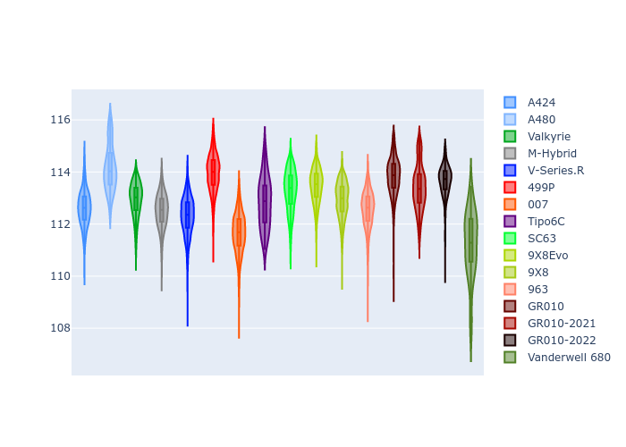
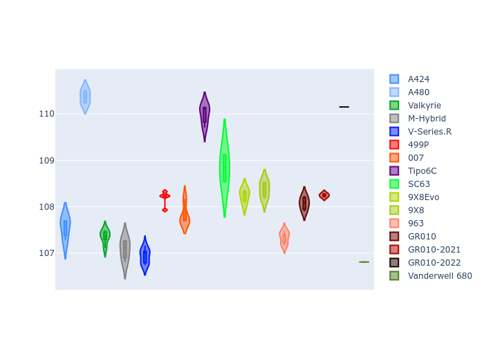
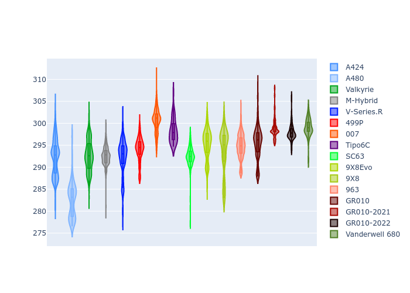
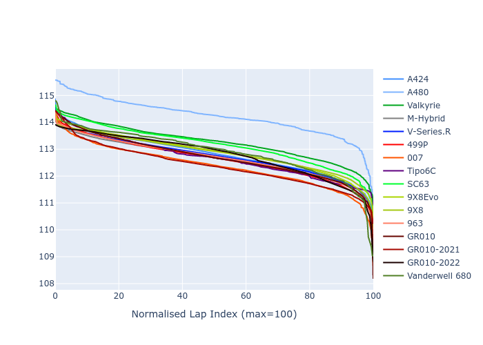

# Combined Plots

## Metadata

- BoP Accuracy: 96.74%
- Overall BoP Grade: A1
- Track: BAHRAIN
- Threshhold: 250.0kph
- Average Laptime: 1:52.80
- Average Quali Laptime: 1:48.20
- Laptime Std Dev: 0.65 seconds
- Filtered Average Topspeed: 294.49kph

## BoP Table
| Manufacturer     | Car            | Weight   | Power   | PINC   | E/Stint   | FDS    | RDP    | QDP    | TDP    |
|:-----------------|:---------------|:---------|:--------|:-------|:----------|:-------|:-------|:-------|:-------|
| Alpine           | A424           | 1046kg   | 511.0kw | +0.50% | 915MJ     | -      | 51.38% | 57.54% | 26.10% |
| Alpine           | A480           | 992kg    | 420.0kw | +0.10% | 783MJ     | -      | 54.81% | 80.56% | 55.69% |
| Aston Martin     | Valkyrie       | 1030kg   | 520.0kw | -      | 911MJ     | -      | 52.56% | 51.11% | 27.23% |
| BMW              | M-Hybrid       | 1040kg   | 513.0kw | -      | 910MJ     | -      | 52.62% | 53.36% | 32.99% |
| Cadillac         | V-Series.R     | 1037kg   | 519.0kw | -      | 909MJ     | -      | 48.29% | 59.47% | 18.65% |
| Ferrari          | 499P           | 1052kg   | 503.0kw | -0.60% | 899MJ     | 190kph | 51.25% | 43.28% | 10.17% |
| Glickenhaus      | 007            | 1003kg   | 533.0kw | -      | 918MJ     | -      | 46.15% | 49.30% | 41.45% |
| Isotta Fraschini | Tipo6C         | 1015kg   | 523.0kw | -      | 915MJ     | 190kph | 43.95% | 47.22% | 31.53% |
| Lamborghini      | SC63           | 1030kg   | 520.0kw | -1.60% | 905MJ     | -      | 48.33% | 60.95% | 28.65% |
| Peugeot          | 9X8Evo         | 1042kg   | 518.0kw | -      | 917MJ     | 190kph | 48.70% | 50.83% | 18.68% |
| Peugeot          | 9X8            | 1036kg   | 524.0kw | -      | 911MJ     | 150kph | 54.54% | 58.39% | 9.69%  |
| Porsche          | 963            | 1046kg   | 511.0kw | +0.60% | 908MJ     | -      | 50.57% | 42.80% | 29.05% |
| Toyota           | GR010          | 1061kg   | 502.0kw | +1.50% | 903MJ     | 190kph | 51.03% | 51.78% | 14.64% |
| Toyota           | GR010-2021     | 1045kg   | 509.0kw | +0.10% | 900MJ     | 150kph | 53.89% | 50.91% | 25.87% |
| Toyota           | GR010-2022     | 1050kg   | 503.0kw | +0.10% | 896MJ     | 190kph | 53.24% | 64.49% | 9.72%  |
| Vanwall          | Vanderwell 680 | 980kg    | 539.0kw | -      | 917MJ     | -      | 35.83% | 59.29% | 34.15% |

## Performance Table
| Manufacturer     | Car            | RP      | QP      | Vavg      |   RDLC | BOP-Grade   | Match   |
|:-----------------|:---------------|:--------|:--------|:----------|-------:|:------------|:--------|
| Alpine           | A424           | 1:52.86 | 1:47.96 | 292.53kph |   1.05 | ~A1         | 98.93%  |
| Alpine           | A480           | 1:54.07 | 1:50.36 | 281.83kph |   1.03 | +C2         | 72.75%  |
| Aston Martin     | Valkyrie       | 1:52.95 | 1:48.31 | 294.49kph |   1.04 | ~A1         | 100.00% |
| BMW              | M-Hybrid       | 1:52.81 | 1:47.56 | 292.64kph |   1.05 | ~A1         | 100.00% |
| Cadillac         | V-Series.R     | 1:52.64 | 1:47.36 | 291.96kph |   1.05 | ~A1         | 99.90%  |
| Ferrari          | 499P           | 1:53.24 | 1:47.65 | 294.02kph |   1.05 | ~A1         | 99.76%  |
| Glickenhaus      | 007            | 1:51.64 | 1:47.83 | 300.65kph |   1.04 | ~A1         | 97.89%  |
| Isotta Fraschini | Tipo6C         | 1:52.37 | 1:49.60 | 298.28kph |   1.03 | ~A1         | 100.00% |
| Lamborghini      | SC63           | 1:53.28 | 1:48.86 | 292.51kph |   1.04 | ~A1         | 99.04%  |
| Peugeot          | 9X8Evo         | 1:52.73 | 1:47.74 | 295.57kph |   1.05 | ~A1         | 100.00% |
| Peugeot          | 9X8            | 1:52.66 | 1:48.11 | 293.67kph |   1.04 | ~A1         | 99.92%  |
| Porsche          | 963            | 1:52.85 | 1:47.56 | 294.62kph |   1.05 | ~A1         | 99.88%  |
| Toyota           | GR010          | 1:53.14 | 1:47.53 | 295.20kph |   1.05 | ~A1         | 98.93%  |
| Toyota           | GR010-2021     | 1:53.02 | 1:48.01 | 297.45kph |   1.05 | +B1         | 89.77%  |
| Toyota           | GR010-2022     | 1:53.30 | 1:49.81 | 297.93kph |   1.03 | ~A1         | 99.85%  |
| Vanwall          | Vanderwell 680 | 1:51.18 | 1:46.89 | 298.44kph |   1.04 | -A2         | 91.18%  |

## Race Laptimes

## Quali Laptimes

## Topspeeds

## Laptimes Lineplot

