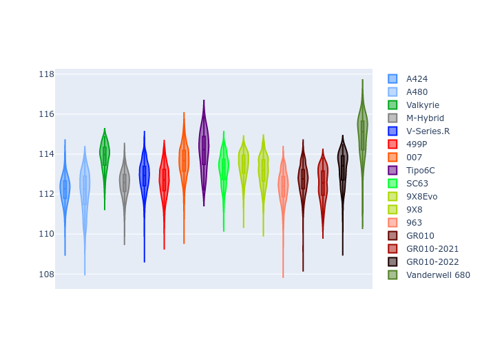
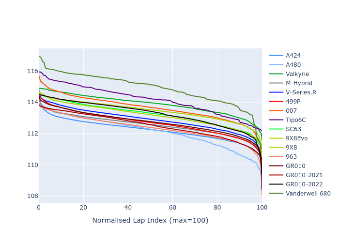

# Combined Plots

## Metadata

- BoP Accuracy: 92.32%
- Overall BoP Grade: A2
- Track: BAHRAIN
- Threshhold: 210.0kph

## BoP Table
| Manufacturer     | Car            | Weight   | Power   | PINC   | E/Stint   | FDS    | RDP    | QDP    | TDP    |
|:-----------------|:---------------|:---------|:--------|:-------|:----------|:-------|:-------|:-------|:-------|
| Alpine           | A424           | 1047kg   | 520.0kw | -      | 921MJ     | -      | 52.35% | 61.85% | 27.84% |
| Alpine           | A480           | 952kg    | 432.0kw | -      | 790MJ     | -      | 54.51% | 76.19% | 54.04% |
| Aston Martin     | Valkyrie       | 1042kg   | 504.0kw | +0.40% | 899MJ     | -      | 53.59% | 53.33% | 21.51% |
| BMW              | M-Hybrid       | 1041kg   | 512.0kw | -      | 909MJ     | -      | 53.26% | 57.23% | 34.54% |
| Cadillac         | V-Series.R     | 1034kg   | 510.0kw | -      | 901MJ     | -      | 47.80% | 56.73% | 19.63% |
| Ferrari          | 499P           | 1063kg   | 508.0kw | -      | 907MJ     | 190kph | 53.02% | 42.32% | 9.88%  |
| Glickenhaus      | 007            | 1030kg   | 520.0kw | -      | 910MJ     | -      | 46.49% | 46.07% | 47.78% |
| Isotta Fraschini | Tipo6C         | 1059kg   | 520.0kw | -      | 917MJ     | 190kph | 43.95% | 47.22% | 31.53% |
| Lamborghini      | SC63           | 1042kg   | 519.0kw | -      | 910MJ     | -      | 46.33% | 59.50% | 29.33% |
| Peugeot          | 9X8Evo         | 1050kg   | 510.0kw | -      | 910MJ     | 190kph | 48.47% | 51.26% | 16.02% |
| Peugeot          | 9X8            | 1030kg   | 520.0kw | -      | 907MJ     | 150kph | 54.07% | 57.08% | 10.80% |
| Porsche          | 963            | 1047kg   | 516.0kw | -      | 911MJ     | -      | 50.87% | 45.25% | 30.77% |
| Toyota           | GR010          | 1080kg   | 512.0kw | -      | 910MJ     | 190kph | 52.43% | 57.12% | 12.82% |
| Toyota           | GR010-2021     | 1065kg   | 513.0kw | -      | 906MJ     | 150kph | 54.09% | 52.67% | 26.37% |
| Toyota           | GR010-2022     | 1080kg   | 512.0kw | -      | 907MJ     | 190kph | 53.48% | 69.44% | 7.86%  |
| Vanwall          | Vanderwell 680 | 1030kg   | 520.0kw | -      | 906MJ     | -      | 53.41% | 56.28% | 29.85% |

## Performance Table
| Manufacturer     | Car            | RP      | QP      | Vavg      |   RDLC | BOP-Grade   | Match   |
|:-----------------|:---------------|:--------|:--------|:----------|-------:|:------------|:--------|
| Alpine           | A424           | 1:51.03 | 1:46.66 | 291.97kph |   1.04 | ~A1         | 97.32%  |
| Alpine           | A480           | 1:50.55 | 1:47.20 | 283.05kph |   1.03 | -B2         | 82.94%  |
| Aston Martin     | Valkyrie       | 1:52.83 | 1:47.70 | 288.74kph |   1.05 | ~A1         | 97.81%  |
| BMW              | M-Hybrid       | 1:51.49 | 1:46.71 | 290.05kph |   1.04 | ~A1         | 99.42%  |
| Cadillac         | V-Series.R     | 1:51.71 | 1:46.95 | 286.94kph |   1.04 | ~A1         | 99.85%  |
| Ferrari          | 499P           | 1:51.77 | 1:46.47 | 290.55kph |   1.05 | ~A1         | 99.74%  |
| Glickenhaus      | 007            | 1:51.83 | 1:48.37 | 289.00kph |   1.03 | ~A1         | 98.71%  |
| Isotta Fraschini | Tipo6C         | 1:53.59 | 1:51.21 | 288.80kph |   1.02 | +D2         | 64.18%  |
| Lamborghini      | SC63           | 1:52.32 | 1:48.49 | 290.31kph |   1.04 | ~A1         | 99.03%  |
| Peugeot          | 9X8Evo         | 1:52.46 | 1:47.79 | 291.64kph |   1.04 | ~A1         | 96.07%  |
| Peugeot          | 9X8            | 1:51.40 | 1:46.86 | 283.98kph |   1.04 | ~A1         | 99.06%  |
| Porsche          | 963            | 1:51.36 | 1:46.66 | 290.83kph |   1.04 | ~A1         | 99.26%  |
| Toyota           | GR010          | 1:51.90 | 1:46.48 | 290.69kph |   1.05 | ~A1         | 99.71%  |
| Toyota           | GR010-2021     | 1:51.79 | 1:47.41 | 283.20kph |   1.04 | ~A1         | 100.00% |
| Toyota           | GR010-2022     | 1:52.02 | 1:48.44 | 288.52kph |   1.03 | ~A1         | 100.00% |
| Vanwall          | Vanderwell 680 | 1:53.93 | 1:48.99 | 283.32kph |   1.05 | +Ω1         | 44.05%  |

## Race Laptimes

## Quali Laptimes

## Topspeeds

## Laptimes Lineplot

