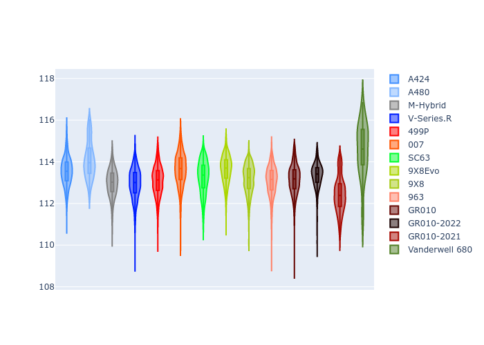
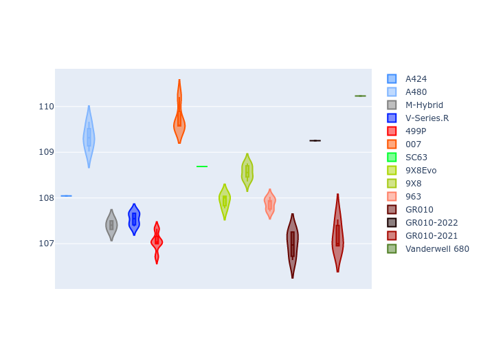
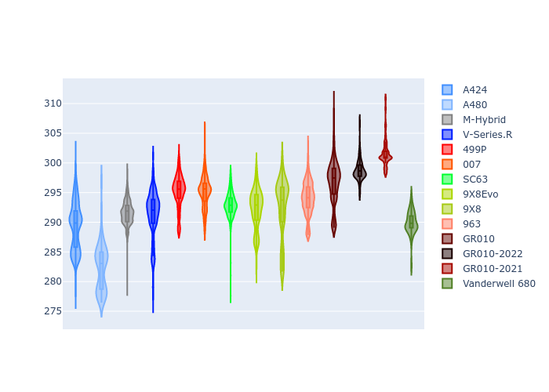
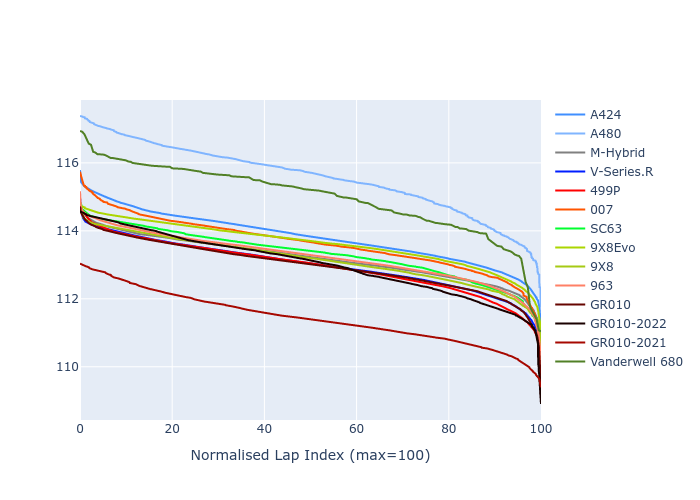

# Combined Plots

## Metadata

- BoP Accuracy: 94.26%
- Overall BoP Grade: A2
- Track: BAHRAIN
- Threshhold: 250.0kph
- Average Laptime: 1:53.05
- Average Quali Laptime: 1:48.27
- Laptime Std Dev: 0.71 seconds
- Filtered Average Topspeed: 293.04kph

## BoP Table
| Manufacturer   | Car            | Weight   | Power   | PINC   | E/Stint   | FDS    | RDP    | QDP    | TDP    |
|:---------------|:---------------|:---------|:--------|:-------|:----------|:-------|:-------|:-------|:-------|
| Alpine         | A424           | 1046kg   | 517.0kw | -4.30% | 907MJ     | -      | 51.45% | 55.09% | 24.89% |
| Alpine         | A480           | 952kg    | 403.0kw | -      | 763MJ     | -      | 54.77% | 76.19% | 54.04% |
| BMW            | M-Hybrid       | 1036kg   | 514.0kw | -1.80% | 905MJ     | -      | 52.63% | 52.34% | 34.06% |
| Cadillac       | V-Series.R     | 1038kg   | 517.0kw | -0.60% | 906MJ     | -      | 48.80% | 57.26% | 18.10% |
| Ferrari        | 499P           | 1053kg   | 510.0kw | -0.90% | 905MJ     | 190kph | 51.39% | 44.34% | 9.89%  |
| Glickenhaus    | 007            | 1030kg   | 520.0kw | -      | 910MJ     | -      | 46.14% | 49.30% | 41.45% |
| Lamborghini    | SC63           | 1030kg   | 515.0kw | +0.10% | 905MJ     | -      | 48.32% | 60.95% | 28.65% |
| Peugeot        | 9X8Evo         | 1031kg   | 520.0kw | -5.20% | 903MJ     | 190kph | 49.16% | 50.25% | 18.00% |
| Peugeot        | 9X8            | 1041kg   | 520.0kw | -      | 908MJ     | 135kph | 54.54% | 58.39% | 9.69%  |
| Porsche        | 963            | 1056kg   | 514.0kw | +0.20% | 911MJ     | -      | 50.61% | 41.90% | 27.68% |
| Toyota         | GR010          | 1065kg   | 499.0kw | +4.20% | 908MJ     | 190kph | 51.33% | 51.71% | 14.89% |
| Toyota         | GR010-2022     | 1053kg   | 509.0kw | -      | 901MJ     | 190kph | 53.24% | 64.49% | 9.72%  |
| Toyota         | GR010-2021     | 1040kg   | 520.0kw | -      | 909MJ     | 150kph | 54.02% | 52.67% | 26.37% |
| Vanwall        | Vanderwell 680 | 1030kg   | 520.0kw | -      | 906MJ     | -      | 50.86% | 59.83% | 31.84% |

## Performance Table
| Manufacturer   | Car            | RP      | QP      | Vavg      |   RDLC | BOP-Grade   | Match   |
|:---------------|:---------------|:--------|:--------|:----------|-------:|:------------|:--------|
| Alpine         | A424           | 1:53.10 | 1:48.05 | 289.66kph |   1.05 | ~A1         | 99.88%  |
| Alpine         | A480           | 1:53.57 | 1:49.33 | 282.76kph |   1.04 | ~A1         | 97.63%  |
| BMW            | M-Hybrid       | 1:52.69 | 1:47.41 | 291.71kph |   1.05 | ~A1         | 100.00% |
| Cadillac       | V-Series.R     | 1:52.87 | 1:47.54 | 291.10kph |   1.05 | ~A1         | 99.95%  |
| Ferrari        | 499P           | 1:52.46 | 1:47.06 | 295.18kph |   1.05 | ~A1         | 99.92%  |
| Glickenhaus    | 007            | 1:53.62 | 1:49.73 | 295.12kph |   1.04 | +A2         | 92.84%  |
| Lamborghini    | SC63           | 1:53.12 | 1:48.69 | 292.94kph |   1.04 | ~A1         | 100.00% |
| Peugeot        | 9X8Evo         | 1:53.00 | 1:47.94 | 292.72kph |   1.05 | ~A1         | 100.00% |
| Peugeot        | 9X8            | 1:53.14 | 1:48.57 | 292.35kph |   1.04 | ~A1         | 100.00% |
| Porsche        | 963            | 1:52.91 | 1:47.87 | 293.82kph |   1.05 | ~A1         | 99.94%  |
| Toyota         | GR010          | 1:52.64 | 1:47.00 | 296.15kph |   1.05 | ~A1         | 99.77%  |
| Toyota         | GR010-2022     | 1:52.69 | 1:49.25 | 298.82kph |   1.03 | ~A1         | 99.40%  |
| Toyota         | GR010-2021     | 1:51.85 | 1:47.16 | 300.44kph |   1.04 | ~A1         | 100.00% |
| Vanwall        | Vanderwell 680 | 1:55.09 | 1:50.23 | 289.74kph |   1.04 | +Ω1         | 30.34%  |

## Race Laptimes

## Quali Laptimes

## Topspeeds

## Laptimes Lineplot

