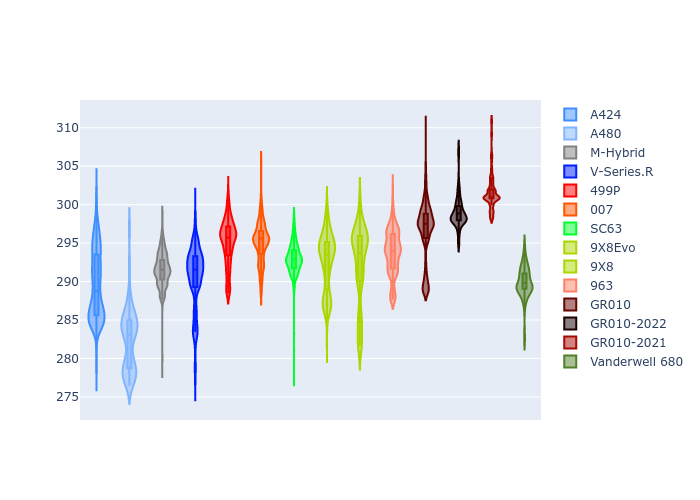

# Combined Plots

## Metadata

- BoP Accuracy: 94.46%
- Overall BoP Grade: A2
- Track: BAHRAIN
- Threshhold: 250.0kph
- Average Laptime: 1:53.00
- Average Quali Laptime: 1:48.20
- Average Topspeed: 293.09kph

## BoP Table
| Manufacturer   | Car            | Weight   | Power   | PINC   | E/Stint   | FDS    | RDP    | QDP    | TDP    |
|:---------------|:---------------|:---------|:--------|:-------|:----------|:-------|:-------|:-------|:-------|
| Alpine         | A424           | 1046kg   | 517.0kw | -4.30% | 907MJ     | -      | 51.64% | 59.31% | 26.80% |
| Alpine         | A480           | 952kg    | 403.0kw | -      | 763MJ     | -      | 53.05% | 74.07% | 48.97% |
| BMW            | M-Hybrid       | 1036kg   | 514.0kw | -1.80% | 905MJ     | -      | 52.89% | 56.22% | 33.41% |
| Cadillac       | V-Series.R     | 1038kg   | 517.0kw | -0.60% | 906MJ     | -      | 48.63% | 60.80% | 19.01% |
| Ferrari        | 499P           | 1053kg   | 510.0kw | -0.90% | 905MJ     | 190kph | 51.38% | 44.98% | 9.83%  |
| Glickenhaus    | 007            | 1030kg   | 520.0kw | -      | 910MJ     | -      | 46.15% | 49.30% | 41.45% |
| Lamborghini    | SC63           | 1030kg   | 515.0kw | +0.10% | 905MJ     | -      | 48.33% | 60.95% | 28.65% |
| Peugeot        | 9X8Evo         | 1031kg   | 520.0kw | -5.20% | 903MJ     | 190kph | 48.87% | 52.78% | 15.41% |
| Peugeot        | 9X8            | 1041kg   | 520.0kw | -      | 908MJ     | 135kph | 54.54% | 58.39% | 9.69%  |
| Porsche        | 963            | 1056kg   | 514.0kw | +0.20% | 911MJ     | -      | 50.70% | 44.30% | 29.51% |
| Toyota         | GR010          | 1065kg   | 499.0kw | +4.20% | 908MJ     | 190kph | 51.09% | 52.71% | 11.46% |
| Toyota         | GR010-2022     | 1053kg   | 509.0kw | -      | 901MJ     | 190kph | 53.45% | 68.83% | 9.58%  |
| Toyota         | GR010-2021     | 1040kg   | 520.0kw | -      | 909MJ     | 150kph | 54.08% | 54.81% | 9.72%  |
| Vanwall        | Vanderwell 680 | 1030kg   | 520.0kw | -      | 906MJ     | -      | 49.68% | 60.93% | 34.43% |

## Performance Table
| Manufacturer   | Car            | RP      | QP      | Vavg      |   RDLC | BOP-Grade   | Match   |
|:---------------|:---------------|:--------|:--------|:----------|-------:|:------------|:--------|
| Alpine         | A424           | 1:52.80 | 1:47.71 | 289.57kph |   1.05 | ~A1         | 99.63%  |
| Alpine         | A480           | 1:53.36 | 1:49.71 | 282.42kph |   1.03 | +A2         | 94.01%  |
| BMW            | M-Hybrid       | 1:52.58 | 1:47.13 | 291.57kph |   1.05 | ~A1         | 100.00% |
| Cadillac       | V-Series.R     | 1:52.75 | 1:47.34 | 290.60kph |   1.05 | ~A1         | 99.89%  |
| Ferrari        | 499P           | 1:52.53 | 1:47.05 | 295.12kph |   1.05 | ~A1         | 99.94%  |
| Glickenhaus    | 007            | 1:53.62 | 1:49.69 | 295.12kph |   1.04 | +A2         | 92.01%  |
| Lamborghini    | SC63           | 1:53.15 | 1:48.70 | 292.94kph |   1.04 | ~A1         | 100.00% |
| Peugeot        | 9X8Evo         | 1:53.36 | 1:48.10 | 292.55kph |   1.05 | ~A1         | 100.00% |
| Peugeot        | 9X8            | 1:53.11 | 1:48.56 | 292.35kph |   1.04 | ~A1         | 100.00% |
| Porsche        | 963            | 1:52.55 | 1:47.49 | 293.82kph |   1.05 | ~A1         | 99.84%  |
| Toyota         | GR010          | 1:52.49 | 1:46.87 | 296.63kph |   1.05 | ~A1         | 99.74%  |
| Toyota         | GR010-2022     | 1:52.92 | 1:49.35 | 298.97kph |   1.03 | ~A1         | 99.66%  |
| Toyota         | GR010-2021     | 1:51.82 | 1:47.21 | 301.63kph |   1.04 | ~A1         | 99.83%  |
| Vanwall        | Vanderwell 680 | 1:54.89 | 1:49.93 | 289.92kph |   1.05 | +Ω1         | 37.91%  |

## Race Laptimes

## Quali Laptimes

## Topspeeds

## Laptimes Lineplot

