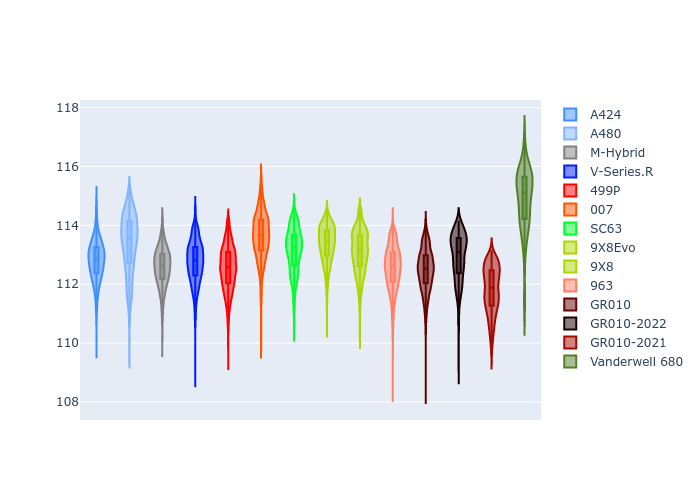
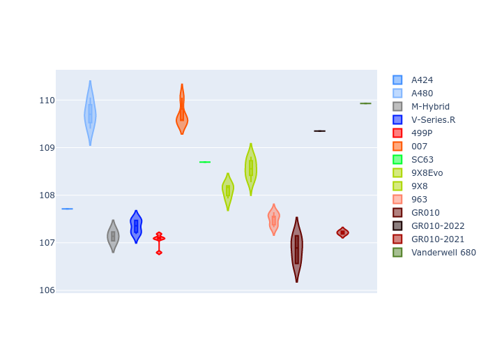

# Combined Plots

## Metadata

- BoP Accuracy: 93.32%
- Overall BoP Grade: A2
- Track: BAHRAIN
- Threshhold: 250.0kph

## BoP Table
| Manufacturer   | Car            | Weight   | Power   | PINC   | E/Stint   | FDS    | RDP    | QDP    | TDP    |
|:---------------|:---------------|:---------|:--------|:-------|:----------|:-------|:-------|:-------|:-------|
| Alpine         | A424           | 1046kg   | 517.0kw | -4.30% | 907MJ     | -      | 52.35% | 61.85% | 27.84% |
| Alpine         | A480           | 952kg    | 403.0kw | -      | 763MJ     | -      | 54.51% | 76.19% | 54.04% |
| BMW            | M-Hybrid       | 1036kg   | 514.0kw | -1.80% | 905MJ     | -      | 53.26% | 57.23% | 34.54% |
| Cadillac       | V-Series.R     | 1038kg   | 517.0kw | -0.60% | 906MJ     | -      | 47.80% | 56.73% | 19.63% |
| Ferrari        | 499P           | 1053kg   | 510.0kw | -0.90% | 905MJ     | 190kph | 53.02% | 42.32% | 9.88%  |
| Glickenhaus    | 007            | 1030kg   | 520.0kw | -      | 910MJ     | -      | 46.49% | 46.07% | 47.78% |
| Lamborghini    | SC63           | 1030kg   | 515.0kw | +0.10% | 905MJ     | -      | 46.33% | 59.50% | 29.33% |
| Peugeot        | 9X8Evo         | 1031kg   | 520.0kw | -5.20% | 903MJ     | 190kph | 48.47% | 51.26% | 16.02% |
| Peugeot        | 9X8            | 1041kg   | 520.0kw | -      | 908MJ     | 135kph | 54.07% | 57.08% | 10.80% |
| Porsche        | 963            | 1056kg   | 514.0kw | +0.20% | 911MJ     | -      | 50.87% | 45.25% | 30.77% |
| Toyota         | GR010          | 1065kg   | 499.0kw | +4.20% | 908MJ     | 190kph | 52.43% | 57.12% | 12.82% |
| Toyota         | GR010-2022     | 1053kg   | 509.0kw | -      | 901MJ     | 190kph | 53.48% | 69.44% | 7.86%  |
| Toyota         | GR010-2021     | 1040kg   | 520.0kw | -      | 909MJ     | 150kph | 54.09% | 52.67% | 26.37% |
| Vanwall        | Vanderwell 680 | 1030kg   | 520.0kw | -      | 906MJ     | -      | 53.41% | 56.28% | 29.85% |

## Performance Table
| Manufacturer   | Car            | RP      | QP      | Vavg      |   RDLC | BOP-Grade   | Match   |
|:---------------|:---------------|:--------|:--------|:----------|-------:|:------------|:--------|
| Alpine         | A424           | 1:52.13 | 1:47.69 | 287.82kph |   1.04 | ~A1         | 98.91%  |
| Alpine         | A480           | 1:53.00 | 1:49.52 | 276.01kph |   1.03 | +B2         | 80.75%  |
| BMW            | M-Hybrid       | 1:51.55 | 1:46.77 | 289.45kph |   1.04 | ~A1         | 100.00% |
| Cadillac       | V-Series.R     | 1:51.48 | 1:46.73 | 287.46kph |   1.04 | ~A1         | 99.85%  |
| Ferrari        | 499P           | 1:51.48 | 1:46.21 | 291.21kph |   1.05 | ~A1         | 99.71%  |
| Glickenhaus    | 007            | 1:51.83 | 1:48.37 | 289.00kph |   1.03 | ~A1         | 97.68%  |
| Lamborghini    | SC63           | 1:52.16 | 1:48.35 | 290.80kph |   1.04 | ~A1         | 99.16%  |
| Peugeot        | 9X8Evo         | 1:52.19 | 1:47.54 | 291.18kph |   1.04 | ~A1         | 98.03%  |
| Peugeot        | 9X8            | 1:51.56 | 1:47.00 | 282.88kph |   1.04 | ~A1         | 99.77%  |
| Porsche        | 963            | 1:51.78 | 1:47.04 | 289.68kph |   1.04 | ~A1         | 99.83%  |
| Toyota         | GR010          | 1:51.45 | 1:46.07 | 292.91kph |   1.05 | ~A1         | 99.80%  |
| Toyota         | GR010-2022     | 1:51.32 | 1:47.78 | 290.56kph |   1.03 | ~A1         | 100.00% |
| Toyota         | GR010-2021     | 1:50.43 | 1:46.15 | 287.05kph |   1.04 | -A2         | 91.84%  |
| Vanwall        | Vanderwell 680 | 1:53.93 | 1:48.99 | 283.32kph |   1.05 | +Ω1         | 41.22%  |

## Race Laptimes

## Quali Laptimes

## Topspeeds

## Laptimes Lineplot

