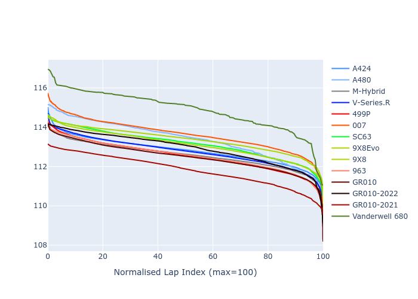

# Combined Plots

## Metadata

- BoP Accuracy: 91.17%
- Overall BoP Grade: A2
- Track: BAHRAIN
- Threshhold: 250.0kph

## BoP Table
| Manufacturer   | Car            | Weight   | Power   | PINC   | E/Stint   | FDS    |
|:---------------|:---------------|:---------|:--------|:-------|:----------|:-------|
| Alpine         | A424           | 1046kg   | 517.0kw | -4.30% | 907MJ     | -      |
| Alpine         | A480           | 1052kg   | 403.0kw | -      | 763MJ     | -      |
| BMW            | M-Hybrid       | 1036kg   | 514.0kw | -1.80% | 905MJ     | -      |
| Cadillac       | V-Series.R     | 1038kg   | 517.0kw | -0.60% | 906MJ     | -      |
| Ferrari        | 499P           | 1053kg   | 510.0kw | -0.90% | 905MJ     | 190kph |
| Glickenhaus    | 007            | 1030kg   | 520.0kw | -      | 910MJ     | -      |
| Lamborghini    | SC63           | 1030kg   | 515.0kw | +0.10% | 905MJ     | -      |
| Peugeot        | 9X8Evo         | 1031kg   | 520.0kw | -5.20% | 903MJ     | 190kph |
| Peugeot        | 9X8            | 1041kg   | 520.0kw | -      | 908MJ     | 135kph |
| Porsche        | 963            | 1056kg   | 514.0kw | +0.20% | 911MJ     | -      |
| Toyota         | GR010          | 1065kg   | 499.0kw | +4.20% | 908MJ     | 190kph |
| Toyota         | GR010OLD       | 1040kg   | 520.0kw | -      | 909MJ     | 150kph |
| Vanwall        | Vanderwell 680 | 1030kg   | 520.0kw | -      | 906MJ     | -      |

## Performance Table
| Manufacturer   | Car            | RP      | QP      | Vavg      |   RDLC | BOP-Grade   | Match   |
|:---------------|:---------------|:--------|:--------|:----------|-------:|:------------|:--------|
| Alpine         | A424           | 1:51.20 | 1:46.96 | 288.02kph |   1.04 | ~A1         | 100.00% |
| Alpine         | A480           | 1:52.35 | 1:49.17 | 274.38kph |   1.03 | -B2         | 80.69%  |
| BMW            | M-Hybrid       | 1:51.01 | 1:46.44 | 289.50kph |   1.04 | ~A1         | 99.96%  |
| Cadillac       | V-Series.R     | 1:51.10 | 1:46.62 | 287.69kph |   1.04 | ~A1         | 99.96%  |
| Ferrari        | 499P           | 1:50.77 | 1:46.14 | 291.28kph |   1.04 | ~A1         | 99.31%  |
| Glickenhaus    | 007            | 1:51.83 | 1:48.37 | 289.00kph |   1.03 | +A2         | 93.38%  |
| Lamborghini    | SC63           | 1:51.92 | 1:48.19 | 290.80kph |   1.03 | ~A1         | 97.71%  |
| Peugeot        | 9X8Evo         | 1:51.67 | 1:47.08 | 291.18kph |   1.04 | ~A1         | 97.87%  |
| Peugeot        | 9X8            | 1:51.70 | 1:47.49 | 284.24kph |   1.04 | ~A1         | 99.96%  |
| Porsche        | 963            | 1:50.90 | 1:46.41 | 289.33kph |   1.04 | ~A1         | 99.88%  |
| Toyota         | GR010          | 1:50.77 | 1:46.04 | 292.50kph |   1.04 | ~A1         | 99.50%  |
| Toyota         | GR010OLD       | 1:49.55 | 1:46.19 | 290.39kph |   1.03 | -B1         | 85.73%  |
| Vanwall        | Vanderwell 680 | 1:53.97 | 1:48.99 | 283.32kph |   1.05 | +Ω1         | 31.25%  |

## Race Laptimes

## Quali Laptimes

## Topspeeds

## Laptimes Lineplot

