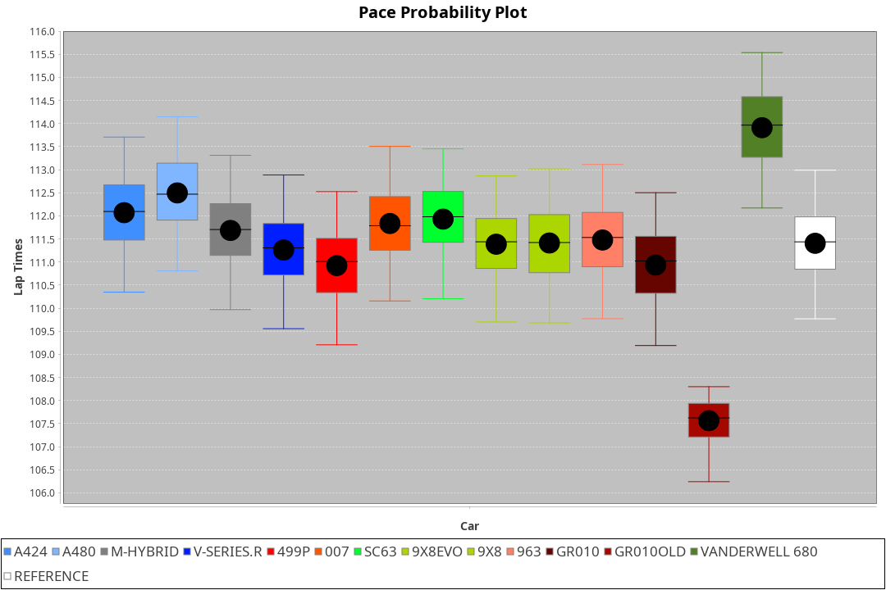
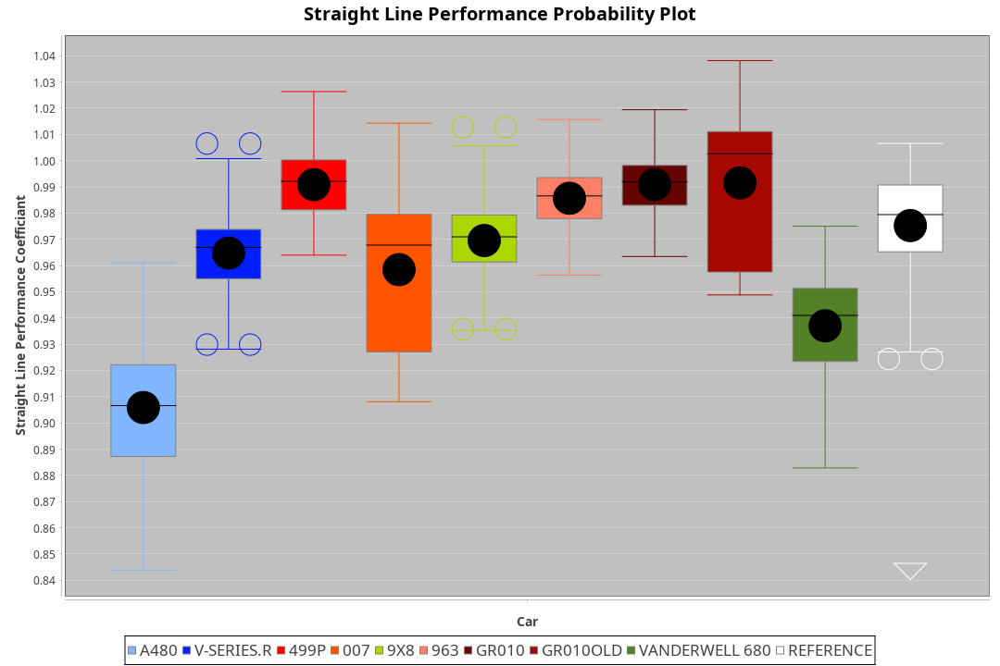
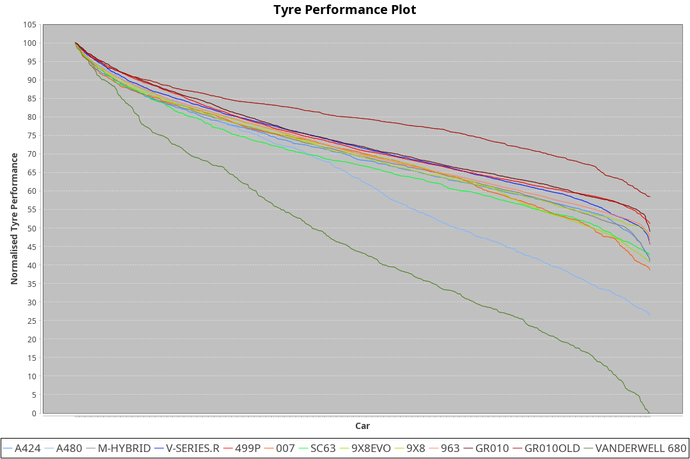

|Manufacturer|Car|Type|RP|QP|Weight|Power¹|Threshhold|PINC|Power²|E/Stint|AVG Vmax|FDS|RDLC|L/Stint|BOP-Grade|ModelAccuracy|ModelPoints|Match%|
|:-|:-|:-|:-|:-|:-|:-|:-|:-|:-|:-|:-|:-|:-|:-|:-|:-|:-|:-|
|Cadillac|V-Series.R|LMDH|1:53.03|1:47.61|1037kg|504kw|0.0kph|0%|504kw|878MJ|279.94kph|-|1.03|35|+A2|98.38%|1765|90.89%|
|Ferrari|499P|LMHHU|1:52.13|1:46.75|1075kg|509kw|0.0kph|0%|509kw|892MJ|281.12kph|190kph|1.01|35|-D2|92.24%|2247|63.00%|
|Glickenhaus|007|LMHNH|1:53.34|1:48.52|1030kg|520kw|0.0kph|0%|520kw|913MJ|284.99kph|-|0.95|34|+D1|96.18%|554|69.41%|
|Peugeot|9X8|LMHHE|1:52.93|1:47.73|1041kg|520kw|0.0kph|0%|520kw|911MJ|281.12kph|135kph|1.02|34|~A1|87.65%|1795|100.00%|
|Porsche|963|LMDH|1:52.44|1:47.09|1053kg|514kw|0.0kph|0%|514kw|898MJ|280.51kph|-|1.01|34|-C1|96.81%|5438|76.29%|
|Toyota|GR010 - Hybrid|LMHHU|1:52.05|1:46.50|1080kg|514kw|0.0kph|0%|514kw|907MJ|279.32kph|190kph|1.01|35|-D2|86.04%|1751|61.62%|
|Vanwall|Vanderwell 680|LMHNH|1:54.87|1:49.43|1030kg|520kw|0.0kph|0%|520kw|901MJ|276.90kph|-|1.01|34|+Ω1|91.42%|501|20.40%|

### BoP Accuracy: 68.80%; Overall BoP Grade: D1

## Power below Threshhold
|N/Nmax|TOY|PEU|GLI|CAD|FER|POR|VAN|
|:-|:-|:-|:-|:-|:-|:-|:-|
|0.550|253|256|256|248|251|253|256|
|0.575|276|279|279|271|274|276|279|
|0.600|297|300|300|291|294|297|300|
|0.625|318|322|322|312|315|318|322|
|0.650|339|343|343|333|336|339|343|
|0.675|361|365|365|354|357|361|365|
|0.700|383|387|387|375|379|383|387|
|0.725|404|409|409|396|400|404|409|
|0.750|425|430|430|416|421|425|430|
|0.775|444|449|449|435|440|444|449|
|0.800|462|467|467|453|457|462|467|
|0.825|477|482|482|468|472|477|482|
|0.850|488|494|494|479|484|488|494|
|0.875|499|505|505|489|494|499|505|
|0.900|506|512|512|496|501|506|512|
|0.925|511|517|517|501|506|511|517|
|**0.950**|**514**|**520**|**520**|**504**|**509**|**514**|**520**|
|0.975|512|518|518|502|507|512|518|
|1.000|508|514|514|499|504|508|514|
|1.025|439|444|444|430|435|439|444|

## Power above Threshhold
|N/Nmax|TOY|PEU|GLI|CAD|FER|POR|VAN|
|:-|:-|:-|:-|:-|:-|:-|:-|
|0.550|253|256|256|248|251|253|256|
|0.575|276|279|279|271|274|276|279|
|0.600|297|300|300|291|294|297|300|
|0.625|318|322|322|312|315|318|322|
|0.650|339|343|343|333|336|339|343|
|0.675|361|365|365|354|357|361|365|
|0.700|383|387|387|375|379|383|387|
|0.725|404|409|409|396|400|404|409|
|0.750|425|430|430|416|421|425|430|
|0.775|444|449|449|435|440|444|449|
|0.800|462|467|467|453|457|462|467|
|0.825|477|482|482|468|472|477|482|
|0.850|488|494|494|479|484|488|494|
|0.875|499|505|505|489|494|499|505|
|0.900|506|512|512|496|501|506|512|
|0.925|511|517|517|501|506|511|517|
|**0.950**|**514**|**520**|**520**|**504**|**509**|**514**|**520**|
|0.975|512|518|518|502|507|512|518|
|1.000|508|514|514|499|504|508|514|
|1.025|439|444|444|430|435|439|444|
