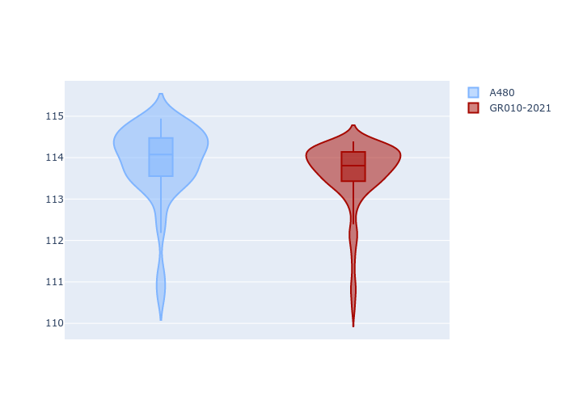
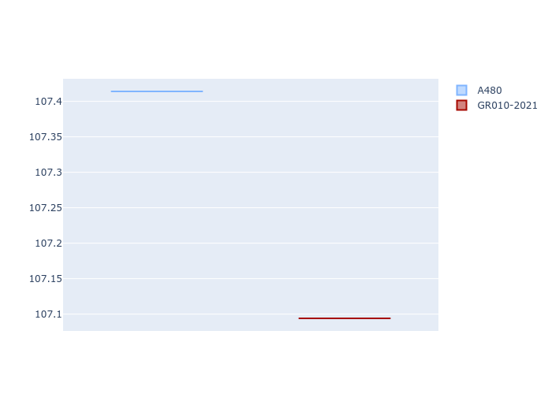
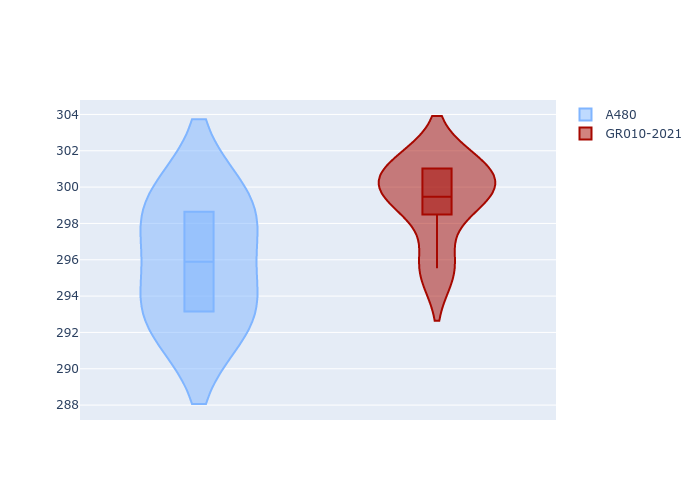
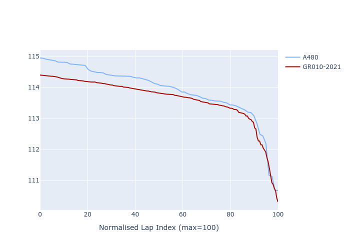

# Combined Plots

## Metadata

- BoP Accuracy: 89.49%
- Overall BoP Grade: B1
- Track: BAHRAIN
- Threshhold: 0.0kph

## BoP Table
| Manufacturer   | Car      | Weight   | Power   | PINC   | E/Stint   | FDS    |
|:---------------|:---------|:---------|:--------|:-------|:----------|:-------|
| Alpine         | A480     | 1030kg   | 454.0kw | -      | 816MJ     | -      |
| Toyota         | GR010OLD | 1040kg   | 520.0kw | -      | 909MJ     | 150kph |

## Performance Table
| Manufacturer   | Car      | RP      | QP      | Vavg      |   RDLC | BOP-Grade   | Match   |
|:---------------|:---------|:--------|:--------|:----------|-------:|:------------|:--------|
| Alpine         | A480     | 1:52.53 | 1:46.93 | 275.57kph |   1.05 | +C1         | 80.00%  |
| Toyota         | GR010OLD | 1:52.25 | 1:46.57 | 278.74kph |   1.05 | ~A1         | 98.97%  |

## Race Laptimes

## Quali Laptimes

## Topspeeds

## Laptimes Lineplot

