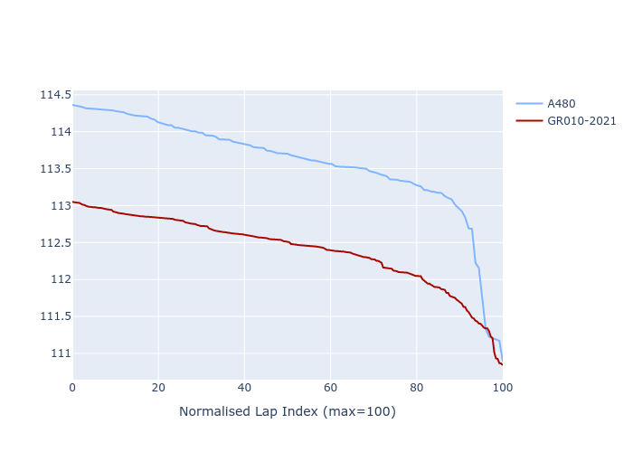

# Combined Plots

## Metadata

- BoP Accuracy: 76.18%
- Overall BoP Grade: C1
- Track: BAHRAIN
- Threshhold: 0.0kph

## BoP Table
| Manufacturer   | Car      | Weight   | Power   | PINC   | E/Stint   | FDS    |
|:---------------|:---------|:---------|:--------|:-------|:----------|:-------|
| Alpine         | A480     | 1030kg   | 454.0kw | -      | 816MJ     | -      |
| Toyota         | GR010OLD | 1040kg   | 520.0kw | -      | 909MJ     | 150kph |

## Performance Table
| Manufacturer   | Car      | RP      | QP      | Vavg      |   RDLC | BOP-Grade   | Match   |
|:---------------|:---------|:--------|:--------|:----------|-------:|:------------|:--------|
| Alpine         | A480     | 1:52.21 | 1:46.49 | 273.04kph |   1.05 | +E2         | 52.76%  |
| Toyota         | GR010OLD | 1:51.06 | 1:45.79 | 286.67kph |   1.05 | ~A1         | 99.61%  |

## Race Laptimes

## Quali Laptimes

## Topspeeds

## Laptimes Lineplot

