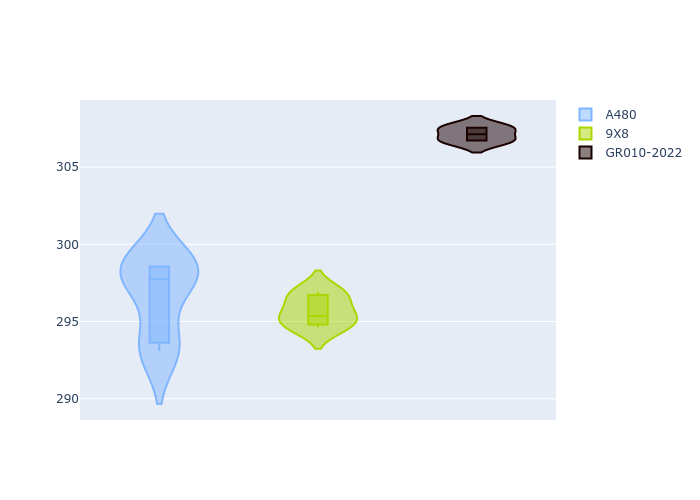

# Combined Plots

## Metadata

- BoP Accuracy: 90.26%
- Overall BoP Grade: A2
- Track: BAHRAIN
- Threshhold: 0.0kph

## BoP Table
| Manufacturer   | Car        | Weight   | Power   | PINC   | E/Stint   | FDS    | RDP    | QDP     | TDP   |
|:---------------|:-----------|:---------|:--------|:-------|:----------|:-------|:-------|:--------|:------|
| Alpine         | A480       | 952kg    | 403.0kw | -      | 763MJ     | -      | 55.97% | 100.00% | 3.57% |
| Peugeot        | 9X8        | 1049kg   | 515.0kw | -      | 908MJ     | 150kph | 52.93% | 66.67%  | 1.65% |
| Toyota         | GR010-2022 | 1053kg   | 509.0kw | -      | 901MJ     | 190kph | 56.53% | 50.00%  | 0.80% |

## Performance Table
| Manufacturer   | Car        | RP      | QP      | Vavg      |   RDLC | BOP-Grade   | Match   |
|:---------------|:-----------|:--------|:--------|:----------|-------:|:------------|:--------|
| Alpine         | A480       | 1:51.61 | 1:47.85 | 277.94kph |   1.03 | +C2         | 72.06%  |
| Peugeot        | 9X8        | 1:51.14 | 1:47.12 | 277.08kph |   1.04 | ~A1         | 99.08%  |
| Toyota         | GR010-2022 | 1:51.03 | 1:46.14 | 287.78kph |   1.05 | ~A1         | 99.64%  |

## Race Laptimes

## Quali Laptimes

## Topspeeds

## Laptimes Lineplot

