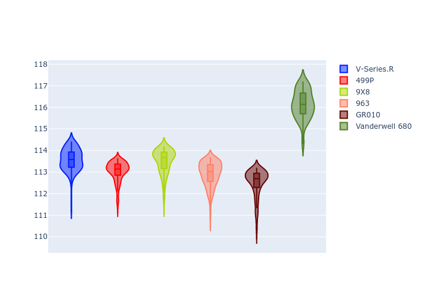
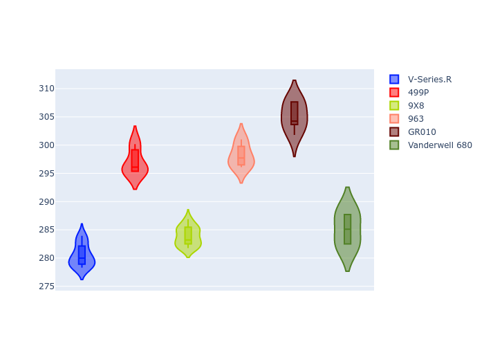

# Combined Plots

## Metadata

- BoP Accuracy: 80.98%
- Overall BoP Grade: B2
- Track: BAHRAIN
- Threshhold: 0.0kph

## BoP Table
| Manufacturer   | Car            | Weight   | Power   | PINC   | E/Stint   | FDS    |
|:---------------|:---------------|:---------|:--------|:-------|:----------|:-------|
| Cadillac       | V-Series.R     | 1037kg   | 504.0kw | -      | 895MJ     | -      |
| Ferrari        | 499P           | 1075kg   | 509.0kw | -      | 901MJ     | 190kph |
| Peugeot        | 9X8            | 1041kg   | 520.0kw | -      | 908MJ     | 135kph |
| Porsche        | 963            | 1053kg   | 514.0kw | -      | 909MJ     | -      |
| Toyota         | GR010          | 1080kg   | 514.0kw | -      | 912MJ     | 190kph |
| Vanwall        | Vanderwell 680 | 1030kg   | 520.0kw | -      | 906MJ     | -      |

## Performance Table
| Manufacturer   | Car            | RP      | QP      | Vavg      |   RDLC | BOP-Grade   | Match   |
|:---------------|:---------------|:--------|:--------|:----------|-------:|:------------|:--------|
| Cadillac       | V-Series.R     | 1:52.40 | 1:46.12 | 268.48kph |   1.06 | ~A1         | 95.97%  |
| Ferrari        | 499P           | 1:51.87 | 1:46.52 | 284.27kph |   1.05 | ~A1         | 99.30%  |
| Peugeot        | 9X8            | 1:52.32 | 1:47.76 | 271.74kph |   1.04 | ~A1         | 99.65%  |
| Porsche        | 963            | 1:51.75 | 1:46.53 | 285.41kph |   1.05 | ~A1         | 98.36%  |
| Toyota         | GR010          | 1:51.33 | 1:45.51 | 292.10kph |   1.06 | -A2         | 90.12%  |
| Vanwall        | Vanderwell 680 | 1:54.94 | 1:49.28 | 272.93kph |   1.05 | +Ω1         | 2.48%   |

## Race Laptimes

## Quali Laptimes

## Topspeeds

## Laptimes Lineplot

