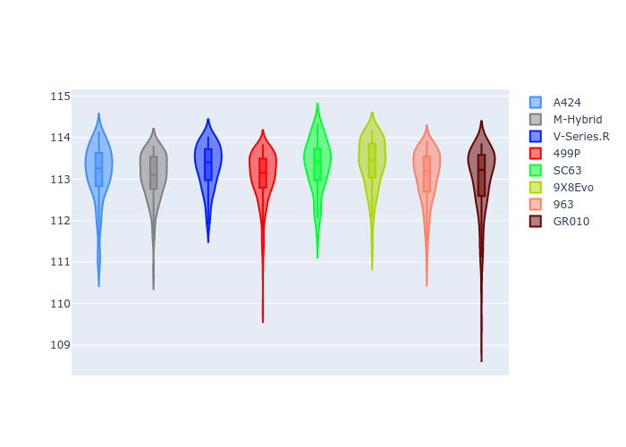
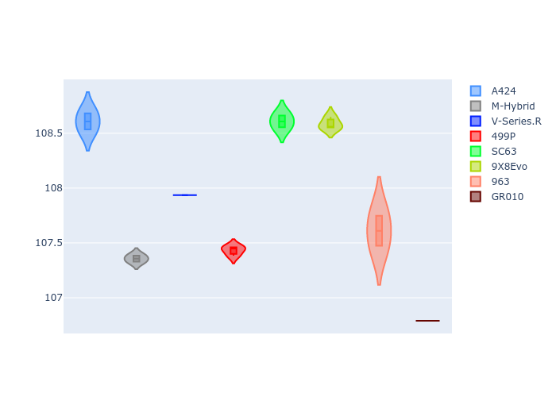
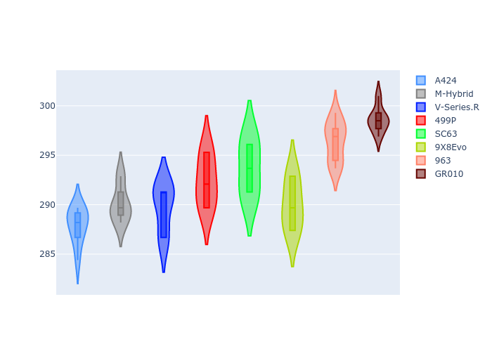
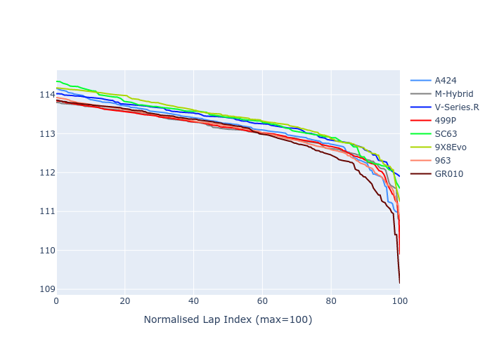

# Combined Plots

## Metadata

- BoP Accuracy: 95.10%
- Overall BoP Grade: A1
- Track: BAHRAIN
- Threshhold: 250.0kph

## BoP Table
| Manufacturer   | Car        | Weight   | Power   | PINC   | E/Stint   | FDS    |
|:---------------|:-----------|:---------|:--------|:-------|:----------|:-------|
| Alpine         | A424       | 1046kg   | 517.0kw | -4.30% | 907MJ     | -      |
| BMW            | M-Hybrid   | 1036kg   | 514.0kw | -1.80% | 905MJ     | -      |
| Cadillac       | V-Series.R | 1038kg   | 517.0kw | -0.60% | 906MJ     | -      |
| Ferrari        | 499P       | 1053kg   | 510.0kw | -0.90% | 905MJ     | 190kph |
| Lamborghini    | SC63       | 1030kg   | 515.0kw | +0.10% | 905MJ     | -      |
| Peugeot        | 9X8Evo     | 1031kg   | 520.0kw | -5.20% | 903MJ     | 190kph |
| Porsche        | 963        | 1056kg   | 514.0kw | +0.20% | 911MJ     | -      |
| Toyota         | GR010      | 1065kg   | 499.0kw | +4.20% | 908MJ     | 190kph |

## Performance Table
| Manufacturer   | Car        | RP      | QP      | Vavg      |   RDLC | BOP-Grade   | Match   |
|:---------------|:-----------|:--------|:--------|:----------|-------:|:------------|:--------|
| Alpine         | A424       | 1:52.79 | 1:47.81 | 287.97kph |   1.05 | +A2         | 94.40%  |
| BMW            | M-Hybrid   | 1:52.71 | 1:46.55 | 290.14kph |   1.06 | ~A1         | 99.48%  |
| Cadillac       | V-Series.R | 1:52.95 | 1:47.11 | 289.78kph |   1.05 | ~A1         | 97.67%  |
| Ferrari        | 499P       | 1:52.70 | 1:46.55 | 292.38kph |   1.06 | ~A1         | 99.72%  |
| Lamborghini    | SC63       | 1:52.98 | 1:47.78 | 293.71kph |   1.05 | +B1         | 87.63%  |
| Peugeot        | 9X8Evo     | 1:53.03 | 1:47.76 | 290.01kph |   1.05 | +B2         | 83.81%  |
| Porsche        | 963        | 1:52.71 | 1:46.70 | 296.43kph |   1.06 | ~A1         | 100.00% |
| Toyota         | GR010      | 1:52.61 | 1:45.93 | 298.64kph |   1.06 | ~A1         | 98.09%  |

## Race Laptimes

## Quali Laptimes

## Topspeeds

## Laptimes Lineplot

