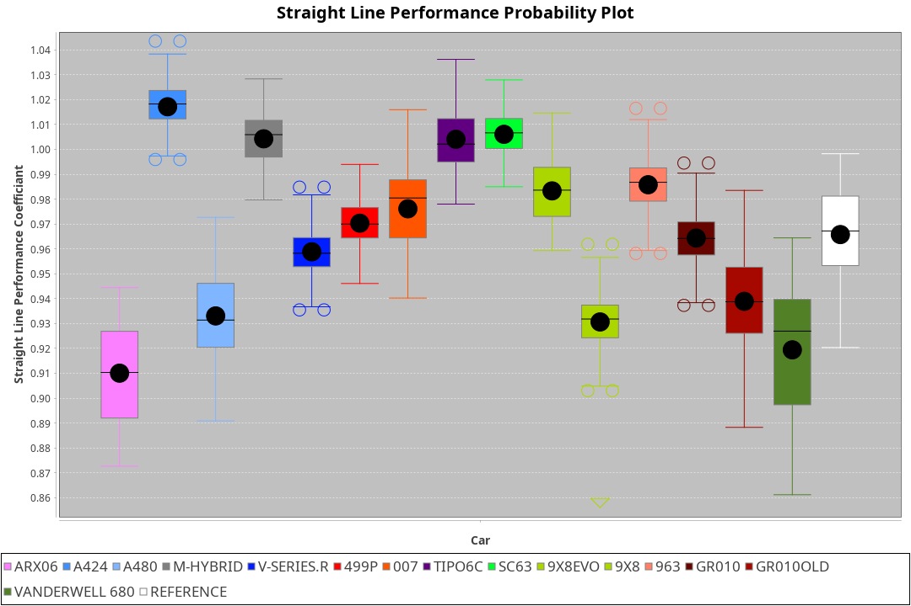
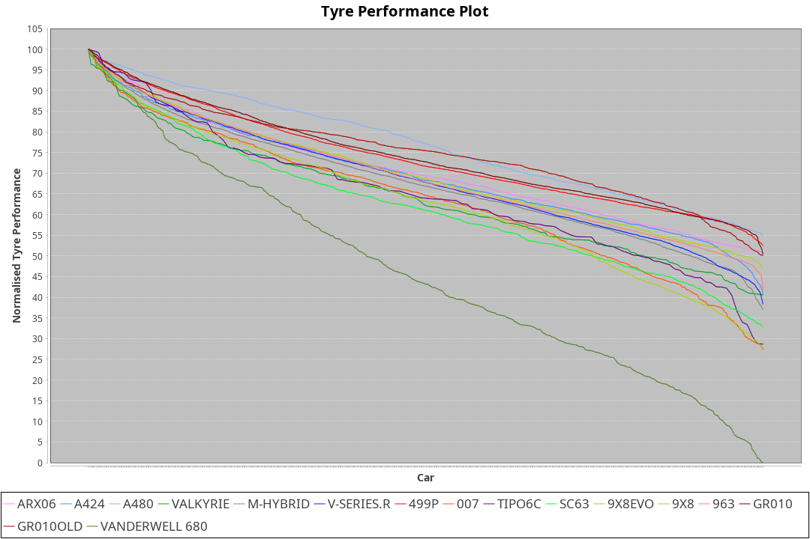

|Manufacturer|Car|Weight|Power|PINC|E/Stint|FDS|
|:-|:-|:-|:-|:-|:-|:-|
|Acura|ARX06|1041kg|510kw|-|904MJ|-|
|Alpine|A424|1032kg|510kw|-|900MJ|-|
|BMW|M Hybrid V8 LMDh|1050kg|514kw|-|898MJ|-|
|Cadillac|V-Series.R|1040kg|508kw|-|882MJ|-|
|Ferrari|499P|1069kg|502kw|-|885MJ|190kph|
|Glickenhaus|007|1030kg|520kw|-|913MJ|-|
|Issotta Fraschini|Tipo6C|1030kg|520kw|-|917MJ|150kph|
|Lamborghini|SC63|1066kg|520kw|-|902MJ|-|
|Peugeot|9X8|1030kg|520kw|-|910MJ|100kph|
|Porsche|963|1041kg|511kw|-|894MJ|-|
|Toyota|GR010 - Hybrid|1073kg|507kw|-|900MJ|190kph|
|Vanwall|Vanderwell 680|1030kg|520kw|-|908MJ|-|

### BoP Accuracy: 78.78%; Overall BoP Grade: C1
|Manufacturer|Car|Type|RP|QP|Weight|Power¹|Threshhold|PINC|Power²|E/Stint|AVG Vmax|FDS|RDLC|L/Stint|BOP-Grade|ModelAccuracy|ModelPoints|Match%|
|:-|:-|:-|:-|:-|:-|:-|:-|:-|:-|:-|:-|:-|:-|:-|:-|:-|:-|:-|
|Acura|ARX06|LMDH|1:37.70|1:33.09|1041kg|510kw|210.0kph|-|510kw|904MJ|315.07kph|-|1.02|29|-C2|100.00%|995|72.56%|
|Alpine|A424|LMDH|1:37.71|1:32.74|1032kg|510kw|210.0kph|-|510kw|900MJ|316.45kph|-|1.03|29|~A1|81.46%|523|96.69%|
|BMW|M Hybrid V8 LMDh|LMDH|1:37.71|1:32.72|1050kg|514kw|210.0kph|-|514kw|898MJ|311.12kph|-|1.02|29|-B1|98.60%|1690|86.71%|
|Cadillac|V-Series.R|LMDH|1:37.71|1:32.97|1040kg|508kw|210.0kph|-|508kw|882MJ|315.37kph|-|1.02|29|-B1|98.38%|1765|87.93%|
|Ferrari|499P|LMHHU|1:37.71|1:32.96|1069kg|502kw|210.0kph|-|502kw|885MJ|315.64kph|190kph|1.02|29|-A2|92.24%|2247|91.26%|
|Glickenhaus|007|LMHNH|1:38.60|1:34.34|1030kg|520kw|210.0kph|-|520kw|913MJ|320.65kph|-|0.96|29|+E2|96.18%|554|53.26%|
|Issotta Fraschini|Tipo6C|LMHHU|1:37.74|1:33.50|1030kg|520kw|210.0kph|-|520kw|917MJ|317.30kph|150kph|1.08|29|+A2|66.67%|96|92.71%|
|Lamborghini|SC63|LMDH|1:37.71|1:32.64|1066kg|520kw|210.0kph|-|520kw|902MJ|312.70kph|-|1.02|29|-B1|96.77%|419|88.24%|
|Peugeot|9X8|LMHHE|1:37.70|1:33.15|1030kg|520kw|210.0kph|-|520kw|910MJ|317.14kph|100kph|1.04|29|-A2|87.65%|1795|92.58%|
|Porsche|963|LMDH|1:37.70|1:32.99|1041kg|511kw|210.0kph|-|511kw|894MJ|316.05kph|-|1.02|29|-B1|96.81%|5438|88.28%|
|Toyota|GR010 - Hybrid|LMHHU|1:37.71|1:32.79|1073kg|507kw|210.0kph|-|507kw|900MJ|313.70kph|190kph|1.02|29|-A2|86.04%|1751|94.20%|
|Vanwall|Vanderwell 680|LMHNH|1:39.93|1:35.13|1030kg|520kw|210.0kph|-|520kw|908MJ|311.55kph|-|1.02|29|+Ω1|91.42%|501|0.89%|

## Power below Threshhold
|N/Nmax|ACU|ALP|BMW|CAD|FER|GLI|IF|LBG|PEU|POR|TOY|VAN|
|:-|:-|:-|:-|:-|:-|:-|:-|:-|:-|:-|:-|:-|
|0.550|251|251|253|250|247|256|256|256|256|252|250|256|
|0.575|274|274|276|273|270|279|279|279|279|275|273|279|
|0.600|295|295|297|293|290|300|300|300|300|295|293|300|
|0.625|316|316|318|314|310|322|322|322|322|316|314|322|
|0.650|337|337|339|335|331|343|343|343|343|337|335|343|
|0.675|358|358|361|357|352|365|365|365|365|359|356|365|
|0.700|380|380|383|378|374|387|387|387|387|380|377|387|
|0.725|401|401|404|399|395|409|409|409|409|402|399|409|
|0.750|422|422|425|420|415|430|430|430|430|422|419|430|
|0.775|441|441|444|439|434|449|449|449|449|441|438|449|
|0.800|458|458|462|456|451|467|467|467|467|459|455|467|
|0.825|473|473|477|471|466|482|482|482|482|474|470|482|
|0.850|485|485|488|483|477|494|494|494|494|485|482|494|
|0.875|495|495|499|493|487|505|505|505|505|496|492|505|
|0.900|502|502|506|500|494|512|512|512|512|503|499|512|
|0.925|507|507|511|505|499|517|517|517|517|508|504|517|
|**0.950**|**510**|**510**|**514**|**508**|**502**|**520**|**520**|**520**|**520**|**511**|**507**|**520**|
|0.975|508|508|512|506|500|518|518|518|518|509|505|518|
|1.000|505|505|508|503|497|514|514|514|514|505|502|514|
|1.025|436|436|439|434|429|444|444|444|444|436|433|444|

## Power above Threshhold
|N/Nmax|ACU|ALP|BMW|CAD|FER|GLI|IF|LBG|PEU|POR|TOY|VAN|
|:-|:-|:-|:-|:-|:-|:-|:-|:-|:-|:-|:-|:-|
|0.550|251|251|253|250|247|256|256|256|256|252|250|256|
|0.575|274|274|276|273|270|279|279|279|279|275|273|279|
|0.600|295|295|297|293|290|300|300|300|300|295|293|300|
|0.625|316|316|318|314|310|322|322|322|322|316|314|322|
|0.650|337|337|339|335|331|343|343|343|343|337|335|343|
|0.675|358|358|361|357|352|365|365|365|365|359|356|365|
|0.700|380|380|383|378|374|387|387|387|387|380|377|387|
|0.725|401|401|404|399|395|409|409|409|409|402|399|409|
|0.750|422|422|425|420|415|430|430|430|430|422|419|430|
|0.775|441|441|444|439|434|449|449|449|449|441|438|449|
|0.800|458|458|462|456|451|467|467|467|467|459|455|467|
|0.825|473|473|477|471|466|482|482|482|482|474|470|482|
|0.850|485|485|488|483|477|494|494|494|494|485|482|494|
|0.875|495|495|499|493|487|505|505|505|505|496|492|505|
|0.900|502|502|506|500|494|512|512|512|512|503|499|512|
|0.925|507|507|511|505|499|517|517|517|517|508|504|517|
|**0.950**|**510**|**510**|**514**|**508**|**502**|**520**|**520**|**520**|**520**|**511**|**507**|**520**|
|0.975|508|508|512|506|500|518|518|518|518|509|505|518|
|1.000|505|505|508|503|497|514|514|514|514|505|502|514|
|1.025|436|436|439|434|429|444|444|444|444|436|433|444|
