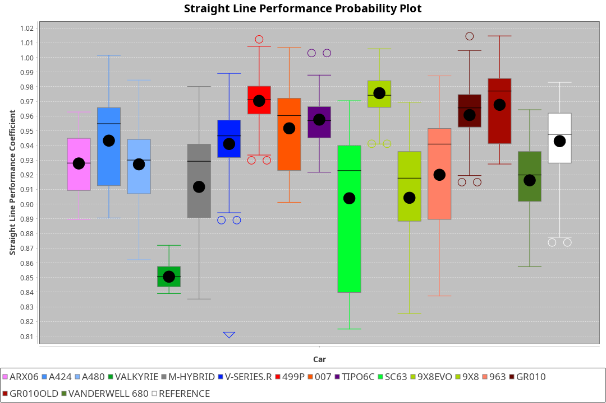
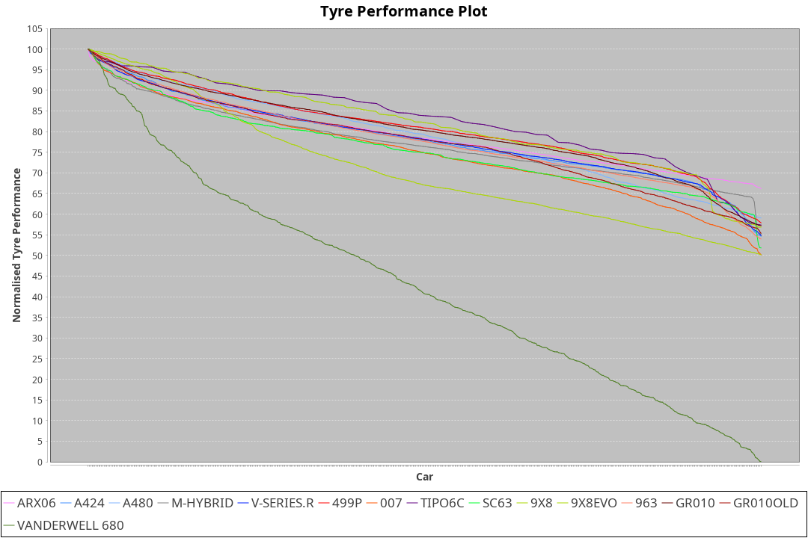

| Manufacturer     | Car            | Weight | Power   | PINC    | E/Stint | FDS     |
|:-|:-|:-|:-|:-|:-|:-|
| Acura            | ARX06          | 1073kg | 511.0kw | 1.00%   | 913MJ   |    -    |
| Alpine           | A424           | 1039kg | 518.0kw |    -    | 912MJ   |    -    |
| Alpine           | A480           | 952kg  | 429.0kw | 1.00%   | 765MJ   |    -    |
| BMW              | M-Hybrid       | 1041kg | 512.0kw |    -    | 905MJ   |    -    |
| Cadillac         | V-Series.R     | 1044kg | 507.0kw | 1.00%   | 898MJ   |    -    |
| Ferrari          | 499P           | 1073kg | 505.0kw | -1.00%  | 896MJ   | 190kph  |
| Glickenhaus      | 007            | 1030kg | 520.0kw |    -    | 910MJ   |    -    |
| Isotta Fraschini | Tipo6C         | 1049kg | 520.0kw |    -    | 916MJ   | 190kph  |
| Lamborghini      | SC63           | 1032kg | 520.0kw |    -    | 910MJ   |    -    |
| Peugeot          | 9X8            | 1030kg | 520.0kw |    -    | 904MJ   | 150kph  |
| Peugeot          | 9X8Evo         | 1060kg | 507.0kw | -1.00%  | 902MJ   | 190kph  |
| Porsche          | 963            | 1052kg | 513.0kw | -1.00%  | 898MJ   |    -    |
| Toyota           | GR010          | 1090kg | 509.0kw | 1.00%   | 904MJ   | 190kph  |
| Toyota           | GR010OLD       | 1075kg | 510.0kw | 1.00%   | 905MJ   | 190kph  |
| Vanwall          | Vanderwell 680 | 1030kg | 520.0kw |    -    | 903MJ   |    -    |

### BoP Accuracy: 74.01%; Overall BoP Grade: C2
| Manufacturer     | Car            | Type  | RP      | QP      | Weight | Power¹  | Threshhold | PINC    | Power²   | E/Stint | AVG Vmax  | FDS     | RDLC | L/Stint | BOP-Grade | Model Accuracy | Model Points | Match%  | SimDiff |
|:-|:-|:-|:-|:-|:-|:-|:-|:-|:-|:-|:-|:-|:-|:-|:-|:-|:-|:-|:-|
| Acura            | ARX06          | LMDH  | 1:37.64 | 1:32.09 | 1073kg | 511.0kw | 210.0kph   | 1.00%   | 516.10kw |  913MJ  | 308.04kph |    -    | 1.00 | 29      | +D1       | 100.00%        | 995          | 68.79%  | ±0.04s  |
| Alpine           | A424           | LMDH  | 1:37.64 | 1:32.70 | 1039kg | 518.0kw | 210.0kph   |    -    | 518.00kw |  912MJ  | 323.54kph |    -    | 1.01 | 29      | ~A1       | 86.43%         | 618          | 95.58%  | #       |
| Alpine           | A480           | LMP1  | 1:36.88 | 1:32.56 |  952kg | 429.0kw | 210.0kph   | 1.00%   | 433.30kw |  765MJ  | 308.23kph |    -    | 0.98 | 27      | -E1       | 68.63%         | 967          | 59.20%  | #       |
| BMW              | M-Hybrid       | LMDH  | 1:37.64 | 1:32.28 | 1041kg | 512.0kw | 210.0kph   |    -    | 512.00kw |  905MJ  | 318.99kph |    -    | 1.02 | 29      | +A2       | 93.77%         | 1672         | 90.00%  | ±0.07s  |
| Cadillac         | V-Series.R     | LMDH  | 1:37.52 | 1:32.57 | 1044kg | 507.0kw | 210.0kph   | 1.00%   | 512.10kw |  898MJ  | 315.16kph |    -    | 1.02 | 29      | -A2       | 83.12%         | 1921         | 92.55%  | ±0.23s  |
| Ferrari          | 499P           | LMHHU | 1:37.07 | 1:32.03 | 1073kg | 505.0kw | 210.0kph   | -1.00%  | 500.00kw |  896MJ  | 316.28kph | 190kph  | 1.01 | 29      | -C2       | 69.49%         | 1950         | 71.34%  | #       |
| Glickenhaus      | 007            | LMHNH | 1:38.11 | 1:33.84 | 1030kg | 520.0kw | 210.0kph   |    -    | 520.00kw |  910MJ  | 318.14kph |    -    | 0.96 | 29      | ~A1       | 89.50%         | 1518         | 100.00% | #       |
| Isotta Fraschini | Tipo6C         | LMHHU | 1:38.20 | 1:34.60 | 1049kg | 520.0kw | 210.0kph   |    -    | 520.00kw |  916MJ  | 317.77kph | 190kph  | 1.05 | 29      | +E2       | 73.56%         | 64           | 54.27%  | #       |
| Lamborghini      | SC63           | LMDH  | 1:37.96 | 1:34.50 | 1032kg | 520.0kw | 210.0kph   |    -    | 520.00kw |  910MJ  | 320.75kph |    -    | 1.05 | 29      | +B1       | 95.82%         | 459          | 85.31%  | #       |
| Peugeot          | 9X8            | LMHHE | 1:38.10 | 1:33.20 | 1030kg | 520.0kw | 210.0kph   |    -    | 520.00kw |  904MJ  | 317.08kph | 150kph  | 1.04 | 29      | ~A1       | 88.75%         | 2383         | 100.00% | #       |
| Peugeot          | 9X8Evo         | LMHHU | 1:37.42 | 1:32.38 | 1060kg | 507.0kw | 210.0kph   | -1.00%  | 501.90kw |  902MJ  | 316.42kph | 190kph  | 1.00 | 29      | -A2       | 66.97%         | 221          | 94.25%  | #       |
| Porsche          | 963            | LMDH  | 1:37.63 | 1:32.49 | 1052kg | 513.0kw | 210.0kph   | -1.00%  | 507.90kw |  898MJ  | 317.21kph |    -    | 1.01 | 29      | ~A1       | 81.02%         | 5243         | 100.00% | ±0.12s  |
| Toyota           | GR010          | LMHHU | 1:37.18 | 1:32.26 | 1090kg | 509.0kw | 210.0kph   | 1.00%   | 514.10kw |  904MJ  | 315.59kph | 190kph  | 1.00 | 29      | -C1       | 73.70%         | 2701         | 76.55%  | #       |
| Toyota           | GR010OLD       | LMHHE | 1:37.45 | 1:32.16 | 1075kg | 510.0kw | 210.0kph   | 1.00%   | 515.10kw |  905MJ  | 313.93kph | 190kph  | 1.02 | 29      | -B2       | 99.03%         | 1536         | 80.82%  | #       |
| Vanwall          | Vanderwell 680 | LMHNH | 1:41.02 | 1:35.07 | 1030kg | 520.0kw | 210.0kph   |    -    | 520.00kw |  903MJ  | 310.54kph |    -    | 1.02 | 29      | +Ω2       | 97.01%         | 649          | -58.48% | #       |

## Power below Threshhold
| N/Nmax    | ARX06   | A424    | M-HYBRID | V-SERIES.R | 499P    | 007     | TIPO6C  | SC63    | 9X8     | 9X8EVO  | 963     | GR010   | GR010OLD | VANDERWELL 680 | ​     | RPM      | A480       |
|:-|:-|:-|:-|:-|:-|:-|:-|:-|:-|:-|:-|:-|:-|:-|:-|:-|:-|
|  0.550    |  252    |  255    |  252     |  250       |  249    |  256    |  256    |  256    |  256    |  250    |  253    |  251    |  251     |  256           |  ​    |   --     |  0.00      |
|  0.575    |  275    |  278    |  275     |  273       |  272    |  279    |  279    |  279    |  279    |  273    |  276    |  274    |  274     |  279           |  ​    |   --     |  0.00      |
|  0.600    |  295    |  299    |  296     |  293       |  292    |  300    |  300    |  300    |  300    |  293    |  296    |  294    |  295     |  300           |  ​    |   --     |  0.00      |
|  0.625    |  316    |  321    |  317     |  314       |  312    |  322    |  322    |  322    |  322    |  314    |  317    |  315    |  316     |  322           |  ​    |   --     |  0.00      |
|  0.650    |  337    |  342    |  338     |  335       |  333    |  343    |  343    |  343    |  343    |  335    |  338    |  336    |  337     |  343           |  ​    |   --     |  0.00      |
|  0.675    |  359    |  364    |  359     |  356       |  355    |  365    |  365    |  365    |  365    |  356    |  360    |  357    |  358     |  365           |  ​    |   --     |  0.00      |
|  0.700    |  380    |  386    |  381     |  377       |  376    |  387    |  387    |  387    |  387    |  377    |  382    |  379    |  380     |  387           |  ​    |   --     |  0.00      |
|  0.725    |  402    |  407    |  403     |  399       |  397    |  409    |  409    |  409    |  409    |  399    |  403    |  400    |  401     |  409           |  ​    |   --     |  0.00      |
|  0.750    |  422    |  428    |  423     |  419       |  417    |  430    |  430    |  430    |  430    |  419    |  424    |  421    |  422     |  430           |  ​    |   --     |  0.00      |
|  0.775    |  441    |  447    |  442     |  438       |  436    |  449    |  449    |  449    |  449    |  438    |  443    |  440    |  441     |  449           |  ​    |  5000    |  253.25    |
|  0.800    |  459    |  465    |  460     |  455       |  454    |  467    |  467    |  467    |  467    |  455    |  461    |  457    |  458     |  467           |  ​    |  5500    |  298.29    |
|  0.825    |  474    |  480    |  475     |  470       |  469    |  482    |  482    |  482    |  482    |  470    |  476    |  472    |  473     |  482           |  ​    |  6000    |  333.33    |
|  0.850    |  485    |  492    |  486     |  482       |  480    |  494    |  494    |  494    |  494    |  482    |  487    |  484    |  485     |  494           |  ​    |  6500    |  377.37    |
|  0.875    |  496    |  503    |  497     |  492       |  490    |  505    |  505    |  505    |  505    |  492    |  498    |  494    |  495     |  505           |  ​    |  7000    |  421.41    |
|  0.900    |  503    |  510    |  504     |  499       |  497    |  512    |  512    |  512    |  512    |  499    |  505    |  501    |  502     |  512           |  ​    |  7500    |  431.42    |
|  0.925    |  508    |  515    |  509     |  504       |  502    |  517    |  517    |  517    |  517    |  504    |  510    |  506    |  507     |  517           |  ​    |  8000    |  427.42    |
| **0.950** | **511** | **518** | **512**  | **507**    | **505** | **520** | **520** | **520** | **520** | **507** | **513** | **509** | **510**  | **520**        | **​** | **8500** | **430.42** |
|  0.975    |  509    |  516    |  510     |  505       |  503    |  518    |  518    |  518    |  518    |  505    |  511    |  507    |  508     |  518           |  ​    |  9000    |  215.21    |
|  1.000    |  505    |  512    |  506     |  502       |  500    |  514    |  514    |  514    |  514    |  502    |  507    |  504    |  505     |  514           |  ​    |   --     |  0.00      |
|  1.025    |  436    |  442    |  437     |  433       |  431    |  444    |  444    |  444    |  444    |  433    |  438    |  435    |  436     |  444           |  ​    |   --     |  0.00      |

## Power above Threshhold
| N/Nmax    | ARX06      | A424    | M-HYBRID | V-SERIES.R | 499P       | 007     | TIPO6C  | SC63    | 9X8     | 9X8EVO     | 963        | GR010      | GR010OLD   | VANDERWELL 680 | ​     | RPM      | A480       |
|:-|:-|:-|:-|:-|:-|:-|:-|:-|:-|:-|:-|:-|:-|:-|:-|:-|:-|
|  0.550    |  254.05    |  255    |  252     |  252.03    |  246.47    |  256    |  256    |  256    |  256    |  247.46    |  250.43    |  253.04    |  254.05    |  256           |  ​    |   --     |  0.00      |
|  0.575    |  277.06    |  278    |  275     |  275.04    |  268.51    |  279    |  279    |  279    |  279    |  270.50    |  273.47    |  276.05    |  277.05    |  279           |  ​    |   --     |  0.00      |
|  0.600    |  298.06    |  299    |  296     |  296.04    |  288.55    |  300    |  300    |  300    |  300    |  290.54    |  293.50    |  297.05    |  297.06    |  300           |  ​    |   --     |  0.00      |
|  0.625    |  319.07    |  321    |  317     |  317.04    |  308.59    |  322    |  322    |  322    |  322    |  310.58    |  314.54    |  318.06    |  319.06    |  322           |  ​    |   --     |  0.00      |
|  0.650    |  340.07    |  342    |  338     |  338.05    |  329.63    |  343    |  343    |  343    |  343    |  331.61    |  335.57    |  339.06    |  340.07    |  343           |  ​    |   --     |  0.00      |
|  0.675    |  362.08    |  364    |  359     |  359.05    |  350.67    |  365    |  365    |  365    |  365    |  352.65    |  356.61    |  361.06    |  362.07    |  365           |  ​    |   --     |  0.00      |
|  0.700    |  384.08    |  386    |  381     |  381.05    |  371.71    |  387    |  387    |  387    |  387    |  373.69    |  377.65    |  383.07    |  383.07    |  387           |  ​    |   --     |  0.00      |
|  0.725    |  406.09    |  407    |  403     |  403.06    |  392.75    |  409    |  409    |  409    |  409    |  394.73    |  399.68    |  404.07    |  405.08    |  409           |  ​    |   --     |  0.00      |
|  0.750    |  427.09    |  428    |  423     |  423.06    |  412.78    |  430    |  430    |  430    |  430    |  414.77    |  419.72    |  425.07    |  426.08    |  430           |  ​    |   --     |  0.00      |
|  0.775    |  446.10    |  447    |  442     |  442.06    |  431.82    |  449    |  449    |  449    |  449    |  433.80    |  438.75    |  444.08    |  445.09    |  449           |  ​    |  5000    |  253.25    |
|  0.800    |  463.10    |  465    |  460     |  460.06    |  448.85    |  467    |  467    |  467    |  467    |  450.84    |  455.78    |  462.08    |  463.09    |  467           |  ​    |  5500    |  298.29    |
|  0.825    |  478.10    |  480    |  475     |  475.06    |  463.88    |  482    |  482    |  482    |  482    |  465.86    |  470.81    |  477.08    |  478.09    |  482           |  ​    |  6000    |  333.33    |
|  0.850    |  490.10    |  492    |  486     |  486.07    |  474.90    |  494    |  494    |  494    |  494    |  476.88    |  482.83    |  488.09    |  489.09    |  494           |  ​    |  6500    |  377.37    |
|  0.875    |  501.11    |  503    |  497     |  497.07    |  484.92    |  505    |  505    |  505    |  505    |  486.90    |  492.84    |  499.09    |  500.10    |  505           |  ​    |  7000    |  421.41    |
|  0.900    |  508.11    |  510    |  504     |  504.07    |  491.93    |  512    |  512    |  512    |  512    |  493.92    |  499.86    |  506.09    |  507.10    |  512           |  ​    |  7500    |  431.42    |
|  0.925    |  513.11    |  515    |  509     |  509.07    |  496.94    |  517    |  517    |  517    |  517    |  498.92    |  504.86    |  511.09    |  512.10    |  517           |  ​    |  8000    |  427.42    |
| **0.950** | **516.11** | **518** | **512**  | **512.07** | **499.95** | **520** | **520** | **520** | **520** | **501.93** | **507.87** | **514.09** | **515.10** | **520**        | **​** | **8500** | **430.42** |
|  0.975    |  514.11    |  516    |  510     |  510.07    |  497.95    |  518    |  518    |  518    |  518    |  499.93    |  505.87    |  512.09    |  513.10    |  518           |  ​    |  9000    |  215.21    |
|  1.000    |  510.11    |  512    |  506     |  506.07    |  494.94    |  514    |  514    |  514    |  514    |  496.92    |  502.86    |  508.09    |  509.10    |  514           |  ​    |   --     |  0.00      |
|  1.025    |  441.09    |  442    |  437     |  437.06    |  426.81    |  444    |  444    |  444    |  444    |  428.79    |  433.74    |  439.08    |  440.09    |  444           |  ​    |   --     |  0.00      |
