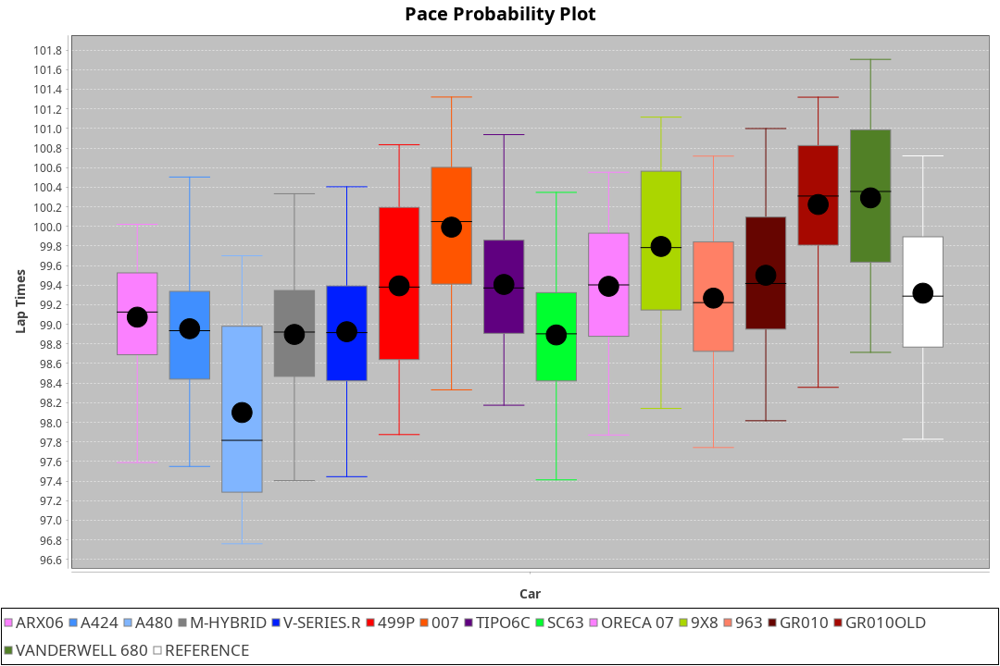
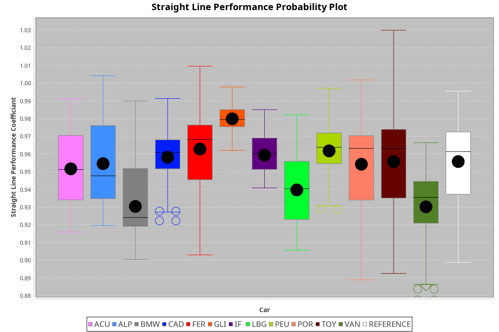
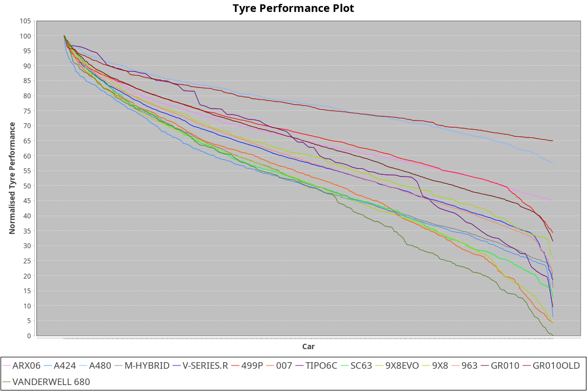

| Manufacturer     | Car            | Weight | Power   | PINC    | E/Stint | FDS     |
|:-|:-|:-|:-|:-|:-|:-|
| Acura            | ARX06          | 1100kg | 480.0kw | 7.30%   | 897MJ   |    -    |
| Alpine           | A424           | 1100kg | 480.0kw | 8.30%   | 895MJ   |    -    |
| Alpine           | A480           | 952kg  | 410.0kw | 0.20%   | 747MJ   |    -    |
| Aston Martin     | Valkyrie       | 1086kg | 480.0kw | 8.30%   | 893MJ   |    -    |
| BMW              | M-Hybrid       | 1100kg | 480.0kw | 8.30%   | 897MJ   |    -    |
| Cadillac         | V-Series.R     | 1100kg | 480.0kw | 8.30%   | 894MJ   |    -    |
| Ferrari          | 499P           | 1100kg | 480.0kw | 8.30%   | 886MJ   | 200kph  |
| Glickenhaus      | 007            | 1060kg | 480.0kw | 2.70%   | 881MJ   |    -    |
| Isotta Fraschini | Tipo6C         | 1089kg | 520.0kw |    -    | 920MJ   | 190kph  |
| Lamborghini      | SC63           | 1085kg | 494.0kw | 5.20%   | 898MJ   |    -    |
| Peugeot          | 9X8Evo         | 1100kg | 480.0kw |    -    | 877MJ   | 200kph  |
| Peugeot          | 9X8            | 1082kg | 480.0kw | 8.30%   | 886MJ   | 150kph  |
| Porsche          | 963            | 1100kg | 480.0kw | 8.30%   | 887MJ   |    -    |
| Toyota           | GR010          | 1100kg | 480.0kw | 8.30%   | 890MJ   | 200kph  |
| Toyota           | GR010OLD       | 1100kg | 480.0kw | 1.00%   | 934MJ   | 200kph  |
| Vanwall          | Vanderwell 680 | 1030kg | 520.0kw |    -    | 903MJ   |    -    |

### BoP Accuracy: 70.58%; Overall BoP Grade: C2
| Manufacturer     | Car            | Type  | RP      | QP      | Weight | Power¹  | Threshhold | PINC    | Power²   | E/Stint | AVG Vmax  | FDS     | RDLC | L/Stint | BOP-Grade | Model Accuracy | Model Points | Match% | SimDiff |
|:-|:-|:-|:-|:-|:-|:-|:-|:-|:-|:-|:-|:-|:-|:-|:-|:-|:-|:-|:-|
| Acura            | ARX06          | LMDH  | 1:38.51 | 1:33.22 | 1100kg | 480.0kw | 210.0kph   | 7.30%   | 515.00kw |  897MJ  | 302.88kph |    -    | 0.97 | 29      | -D1       | 100.00%        | 996          | 65.98% | +0.15   |
| Alpine           | A424           | LMDH  | 1:38.88 | 1:33.82 | 1100kg | 480.0kw | 210.0kph   | 8.30%   | 519.80kw |  895MJ  | 299.42kph |    -    | 0.98 | 29      | ~A1       | 98.45%         | 2220         | 99.33% | #       |
| Alpine           | A480           | LMP1  | 1:37.34 | 1:33.30 |  952kg | 410.0kw | 210.0kph   | 0.20%   | 410.80kw |  747MJ  | 300.39kph |    -    | 0.98 | 27      | -Ω1       | 95.90%         | 1706         | 17.32% | #       |
| Aston Martin     | Valkyrie       | LMHNH | 1:39.39 | 1:33.78 | 1086kg | 480.0kw | 210.0kph   | 8.30%   | 519.80kw |  893MJ  | 300.29kph |    -    | 0.99 | 29      | +E1       | 100.00%        | 466          | 57.04% | #       |
| BMW              | M-Hybrid       | LMDH  | 1:39.06 | 1:33.70 | 1100kg | 480.0kw | 210.0kph   | 8.30%   | 519.80kw |  897MJ  | 301.29kph |    -    | 0.98 | 29      | ~A1       | 100.00%        | 3339         | 95.26% | #       |
| Cadillac         | V-Series.R     | LMDH  | 1:39.16 | 1:33.72 | 1100kg | 480.0kw | 210.0kph   | 8.30%   | 519.80kw |  894MJ  | 302.80kph |    -    | 0.98 | 29      | +B1       | 99.03%         | 6041         | 85.04% | #       |
| Ferrari          | 499P           | LMHHU | 1:38.16 | 1:32.71 | 1100kg | 480.0kw | 210.0kph   | 8.30%   | 519.80kw |  886MJ  | 304.09kph | 200kph  | 1.00 | 29      | -D2       | 99.97%         | 7286         | 61.71% | #       |
| Glickenhaus      | 007            | LMHNH | 1:39.39 | 1:35.03 | 1060kg | 480.0kw | 210.0kph   | 2.70%   | 493.00kw |  881MJ  | 305.16kph |    -    | 0.94 | 29      | +C2       | 93.90%         | 2170         | 72.92% | #       |
| Isotta Fraschini | Tipo6C         | LMHHU | 1:39.40 | 1:35.88 | 1089kg | 520.0kw | 210.0kph   |    -    | 520.00kw |  920MJ  | 307.25kph | 190kph  | 1.02 | 30      | +E2       | 98.48%         | 130          | 52.55% | #       |
| Lamborghini      | SC63           | LMDH  | 1:39.40 | 1:35.08 | 1085kg | 494.0kw | 210.0kph   | 5.20%   | 519.70kw |  898MJ  | 300.19kph |    -    | 1.02 | 29      | +C1       | 100.00%        | 784          | 78.82% | #       |
| Peugeot          | 9X8Evo         | LMHHU | 1:39.18 | 1:33.93 | 1100kg | 480.0kw | 210.0kph   |    -    | 480.00kw |  877MJ  | 304.79kph | 200kph  | 0.96 | 29      | +C1       | 100.00%        | 1890         | 75.60% | #       |
| Peugeot          | 9X8            | LMHHE | 1:39.41 | 1:34.29 | 1082kg | 480.0kw | 210.0kph   | 8.30%   | 519.80kw |  886MJ  | 300.67kph | 150kph  | 1.00 | 29      | +B1       | 98.18%         | 4753         | 88.00% | #       |
| Porsche          | 963            | LMDH  | 1:38.86 | 1:33.48 | 1100kg | 480.0kw | 210.0kph   | 8.30%   | 519.80kw |  887MJ  | 301.20kph |    -    | 0.98 | 29      | ~A1       | 99.89%         | 15174        | 99.48% | #       |
| Toyota           | GR010          | LMHHU | 1:38.10 | 1:32.75 | 1100kg | 480.0kw | 210.0kph   | 8.30%   | 519.80kw |  890MJ  | 303.10kph | 200kph  | 1.01 | 29      | -E1       | 99.82%         | 5457         | 58.32% | #       |
| Toyota           | GR010OLD       | LMHHE | 1:38.22 | 1:33.99 | 1100kg | 480.0kw | 210.0kph   | 1.00%   | 484.80kw |  934MJ  | 304.96kph | 200kph  | 0.99 | 29      | -D2       | 100.00%        | 930          | 64.08% | #       |
| Vanwall          | Vanderwell 680 | LMHNH | 1:39.92 | 1:34.34 | 1030kg | 520.0kw | 0.0kph     |    -    | 520.00kw |  903MJ  | 308.22kph |    -    | 1.02 | 30      | +E1       | 96.27%         | 645          | 57.77% | #       |

## Power below Threshhold
| N/Nmax    | ARX06   | A424    | VALKYRIE | M-HYBRID | V-SERIES.R | 499P    | 007     | TIPO6C  | SC63    | 9X8EVO  | 9X8     | 963     | GR010   | GR010OLD | VANDERWELL 680 | ​     | RPM      | A480            |
|:-|:-|:-|:-|:-|:-|:-|:-|:-|:-|:-|:-|:-|:-|:-|:-|:-|:-|:-|
|  0.550    |  236    |  236    |  236     |  236     |  236       |  236    |  236    |  256    |  243    |  236    |  236    |  236    |  236    |  236     |  256           |  ​    |   --     |  0.00           |
|  0.575    |  258    |  258    |  258     |  258     |  258       |  258    |  258    |  279    |  266    |  258    |  258    |  258    |  258    |  258     |  279           |  ​    |   --     |  0.00           |
|  0.600    |  277    |  277    |  277     |  277     |  277       |  277    |  277    |  300    |  285    |  277    |  277    |  277    |  277    |  277     |  300           |  ​    |   --     |  0.00           |
|  0.625    |  297    |  297    |  297     |  297     |  297       |  297    |  297    |  322    |  305    |  297    |  297    |  297    |  297    |  297     |  322           |  ​    |   --     |  0.00           |
|  0.650    |  317    |  317    |  317     |  317     |  317       |  317    |  317    |  343    |  326    |  317    |  317    |  317    |  317    |  317     |  343           |  ​    |   --     |  0.00           |
|  0.675    |  337    |  337    |  337     |  337     |  337       |  337    |  337    |  365    |  347    |  337    |  337    |  337    |  337    |  337     |  365           |  ​    |   --     |  0.00           |
|  0.700    |  358    |  358    |  358     |  358     |  358       |  358    |  358    |  387    |  368    |  358    |  358    |  358    |  358    |  358     |  387           |  ​    |   --     |  0.00           |
|  0.725    |  378    |  378    |  378     |  378     |  378       |  378    |  378    |  409    |  389    |  378    |  378    |  378    |  378    |  378     |  409           |  ​    |   --     |  0.00           |
|  0.750    |  397    |  397    |  397     |  397     |  397       |  397    |  397    |  430    |  408    |  397    |  397    |  397    |  397    |  397     |  430           |  ​    |   --     |  0.00           |
|  0.775    |  415    |  415    |  415     |  415     |  415       |  415    |  415    |  449    |  427    |  415    |  415    |  415    |  415    |  415     |  449           |  ​    |  5000    |  -3,217,829.96  |
|  0.800    |  431    |  431    |  431     |  431     |  431       |  431    |  431    |  467    |  444    |  431    |  431    |  431    |  431    |  431     |  467           |  ​    |  5500    |  -3,504,619.88  |
|  0.825    |  445    |  445    |  445     |  445     |  445       |  445    |  445    |  482    |  458    |  445    |  445    |  445    |  445    |  445     |  482           |  ​    |  5999    |  -3,805,439.09  |
|  0.850    |  456    |  456    |  456     |  456     |  456       |  456    |  456    |  494    |  469    |  456    |  456    |  456    |  456    |  456     |  494           |  ​    |  6499    |  -4,120,287.60  |
|  0.875    |  466    |  466    |  466     |  466     |  466       |  466    |  466    |  505    |  479    |  466    |  466    |  466    |  466    |  466     |  505           |  ​    |  7000    |  -4,449,166.39  |
|  0.900    |  472    |  472    |  472     |  472     |  472       |  472    |  472    |  512    |  486    |  472    |  472    |  472    |  472    |  472     |  512           |  ​    |  7500    |  -4,792,074.48  |
|  0.925    |  477    |  477    |  477     |  477     |  477       |  477    |  477    |  517    |  491    |  477    |  477    |  477    |  477    |  477     |  517           |  ​    |  8000    |  407.27         |
| **0.950** | **480** | **480** | **480**  | **480**  | **480**    | **480** | **480** | **520** | **494** | **480** | **480** | **480** | **480** | **480**  | **520**        | **​** | **8499** | **410.27**      |
|  0.975    |  478    |  478    |  478     |  478     |  478       |  478    |  478    |  518    |  492    |  478    |  478    |  478    |  478    |  478     |  518           |  ​    |  9000    |  205.14         |
|  1.000    |  475    |  475    |  475     |  475     |  475       |  475    |  475    |  514    |  489    |  475    |  475    |  475    |  475    |  475     |  514           |  ​    |   --     |  0.00           |
|  1.025    |  410    |  410    |  410     |  410     |  410       |  410    |  410    |  444    |  422    |  410    |  410    |  410    |  410    |  410     |  444           |  ​    |   --     |  0.00           |

## Power above Threshhold
| N/Nmax    | ARX06      | A424       | VALKYRIE   | M-HYBRID   | V-SERIES.R | 499P       | 007        | TIPO6C  | SC63       | 9X8EVO  | 9X8        | 963        | GR010      | GR010OLD   | VANDERWELL 680 | ​     | RPM      | A480            |
|:-|:-|:-|:-|:-|:-|:-|:-|:-|:-|:-|:-|:-|:-|:-|:-|:-|:-|:-|
|  0.550    |  254.02    |  256.41    |  256.41    |  256.41    |  256.41    |  256.41    |  242.47    |  256    |  256.34    |  236    |  256.41    |  256.41    |  256.41    |  238.39    |  256           |  ​    |   --     |  0.00           |
|  0.575    |  277.02    |  279.45    |  279.45    |  279.45    |  279.45    |  279.45    |  265.52    |  279    |  279.37    |  258    |  279.45    |  279.45    |  279.45    |  260.43    |  279           |  ​    |   --     |  0.00           |
|  0.600    |  297.02    |  299.48    |  299.48    |  299.48    |  299.48    |  299.48    |  284.55    |  300    |  299.40    |  277    |  299.48    |  299.48    |  299.48    |  279.46    |  300           |  ​    |   --     |  0.00           |
|  0.625    |  319.02    |  321.52    |  321.52    |  321.52    |  321.52    |  321.52    |  304.59    |  322    |  321.43    |  297    |  321.52    |  321.52    |  321.52    |  299.49    |  322           |  ​    |   --     |  0.00           |
|  0.650    |  340.03    |  342.55    |  342.55    |  342.55    |  342.55    |  342.55    |  325.63    |  343    |  342.45    |  317    |  342.55    |  342.55    |  342.55    |  320.53    |  343           |  ​    |   --     |  0.00           |
|  0.675    |  362.03    |  364.59    |  364.59    |  364.59    |  364.59    |  364.59    |  345.67    |  365    |  364.48    |  337    |  364.59    |  364.59    |  364.59    |  340.56    |  365           |  ​    |   --     |  0.00           |
|  0.700    |  383.03    |  386.62    |  386.62    |  386.62    |  386.62    |  386.62    |  366.71    |  387    |  386.51    |  358    |  386.62    |  386.62    |  386.62    |  361.60    |  387           |  ​    |   --     |  0.00           |
|  0.725    |  405.03    |  408.66    |  408.66    |  408.66    |  408.66    |  408.66    |  387.76    |  409    |  408.54    |  378    |  408.66    |  408.66    |  408.66    |  381.63    |  409           |  ​    |   --     |  0.00           |
|  0.750    |  426.03    |  429.69    |  429.69    |  429.69    |  429.69    |  429.69    |  407.79    |  430    |  429.57    |  397    |  429.69    |  429.69    |  429.69    |  400.66    |  430           |  ​    |   --     |  0.00           |
|  0.775    |  445.03    |  448.73    |  448.73    |  448.73    |  448.73    |  448.73    |  425.83    |  449    |  448.59    |  415    |  448.73    |  448.73    |  448.73    |  418.69    |  449           |  ​    |  5000    |  -3,217,829.96  |
|  0.800    |  463.04    |  466.75    |  466.75    |  466.75    |  466.75    |  466.75    |  442.86    |  467    |  466.62    |  431    |  466.75    |  466.75    |  466.75    |  435.72    |  467           |  ​    |  5500    |  -3,504,619.88  |
|  0.825    |  478.04    |  481.78    |  481.78    |  481.78    |  481.78    |  481.78    |  456.89    |  482    |  481.64    |  445    |  481.78    |  481.78    |  481.78    |  449.74    |  482           |  ​    |  5999    |  -3,805,439.09  |
|  0.850    |  489.04    |  493.80    |  493.80    |  493.80    |  493.80    |  493.80    |  467.91    |  494    |  493.65    |  456    |  493.80    |  493.80    |  493.80    |  460.76    |  494           |  ​    |  6499    |  -4,120,287.60  |
|  0.875    |  500.04    |  504.82    |  504.82    |  504.82    |  504.82    |  504.82    |  477.93    |  505    |  504.67    |  466    |  504.82    |  504.82    |  504.82    |  470.78    |  505           |  ​    |  7000    |  -4,449,166.39  |
|  0.900    |  507.04    |  511.83    |  511.83    |  511.83    |  511.83    |  511.83    |  484.94    |  512    |  511.68    |  472    |  511.83    |  511.83    |  511.83    |  476.79    |  512           |  ​    |  7500    |  -4,792,074.48  |
|  0.925    |  512.04    |  516.84    |  516.84    |  516.84    |  516.84    |  516.84    |  489.95    |  517    |  516.68    |  477    |  516.84    |  516.84    |  516.84    |  481.80    |  517           |  ​    |  8000    |  407.27         |
| **0.950** | **515.04** | **519.84** | **519.84** | **519.84** | **519.84** | **519.84** | **492.96** | **520** | **519.69** | **480** | **519.84** | **519.84** | **519.84** | **484.80** | **520**        | **​** | **8499** | **410.27**      |
|  0.975    |  513.04    |  517.84    |  517.84    |  517.84    |  517.84    |  517.84    |  490.96    |  518    |  517.69    |  478    |  517.84    |  517.84    |  517.84    |  482.80    |  518           |  ​    |  9000    |  205.14         |
|  1.000    |  509.04    |  513.83    |  513.83    |  513.83    |  513.83    |  513.83    |  487.95    |  514    |  513.68    |  475    |  513.83    |  513.83    |  513.83    |  479.79    |  514           |  ​    |   --     |  0.00           |
|  1.025    |  440.03    |  443.72    |  443.72    |  443.72    |  443.72    |  443.72    |  420.82    |  444    |  443.59    |  410    |  443.72    |  443.72    |  443.72    |  413.68    |  444           |  ​    |   --     |  0.00           |
