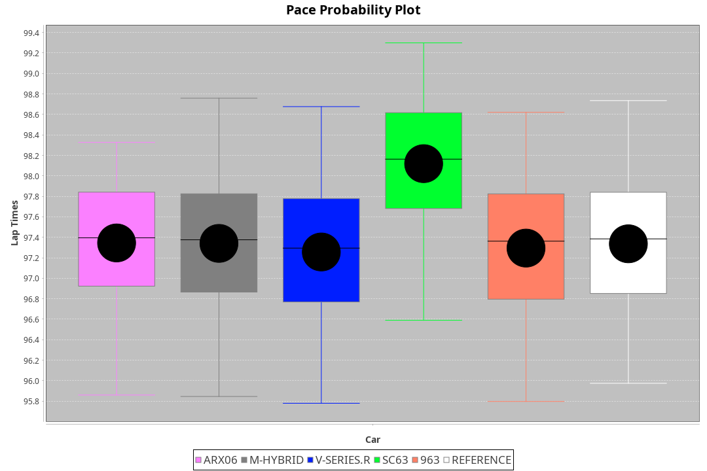
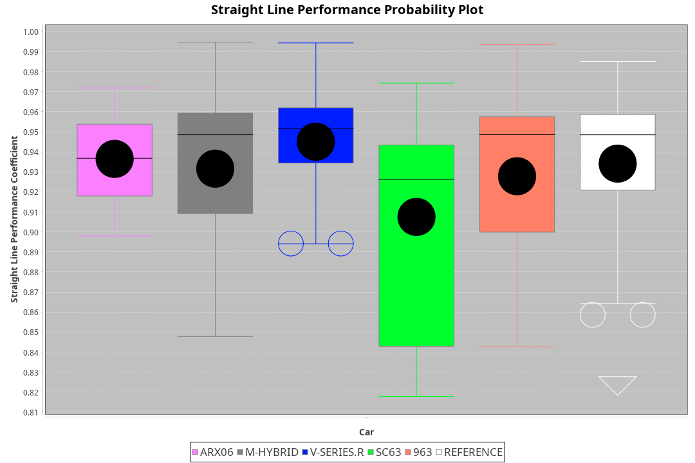
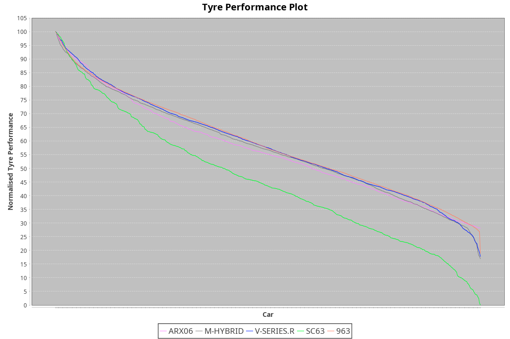

|Manufacturer|Car|Type|RP|QP|Weight|Power¹|Threshhold|PINC|Power²|E/Stint|AVG Vmax|FDS|RDLC|L/Stint|BOP-Grade|ModelAccuracy|ModelPoints|Match%|
|:-|:-|:-|:-|:-|:-|:-|:-|:-|:-|:-|:-|:-|:-|:-|:-|:-|:-|:-|
|Acura|ARX06|LMDH|1:37.40|1:32.82|1072kg|520kw|0.0kph|0%|520kw|915MJ|310.31kph-327.35kph|-|0.99|29|+B1|100.00%|995|86.07%|
|BMW|M Hybrid V8 LMDh|LMDH|1:37.41|1:32.45|1031kg|514kw|0.0kph|0%|514kw|896MJ|309.16kph-332.56kph|-|1.04|29|~A1|98.60%|1690|100.00%|
|Cadillac|V-Series.R|LMDH|1:37.40|1:32.69|1030kg|510kw|0.0kph|0%|510kw|882MJ|307.65kph-331.74kph|-|1.04|29|~A1|98.38%|1765|95.51%|
|Lamborghini|SC63|LMDH|1:37.65|1:32.59|1042kg|516kw|0.0kph|0%|516kw|896MJ|310.03kph-328.02kph|-|1.05|29|+C1|96.77%|419|79.76%|
|Porsche|963|LMDH|1:37.22|1:32.54|1051kg|519kw|0.0kph|0%|519kw|902MJ|309.13kph-332.31kph|-|1.01|29|-A2|96.81%|5438|93.18%|

### BoP Accuracy: 90.90%; Overall BoP Grade: A2

## Power below Threshhold
|N/Nmax|CAD|POR|BMW|LBG|ACU|
|:-|:-|:-|:-|:-|:-|
|0.550|251|256|253|254|256|
|0.575|274|279|276|277|279|
|0.600|295|299|297|298|300|
|0.625|316|321|318|319|322|
|0.650|337|342|339|340|343|
|0.675|358|364|361|362|365|
|0.700|380|386|383|384|387|
|0.725|401|408|404|406|409|
|0.750|422|429|425|427|430|
|0.775|441|448|444|446|449|
|0.800|458|466|462|463|467|
|0.825|473|481|477|478|482|
|0.850|485|493|488|490|494|
|0.875|495|504|499|501|505|
|0.900|502|511|506|508|512|
|0.925|507|516|511|513|517|
|**0.950**|**510**|**519**|**514**|**516**|**520**|
|0.975|508|517|512|514|518|
|1.000|505|513|508|510|514|
|1.025|436|443|439|441|444|

## Power above Threshhold
|N/Nmax|CAD|POR|BMW|LBG|ACU|
|:-|:-|:-|:-|:-|:-|
|0.550|251|256|253|254|256|
|0.575|274|279|276|277|279|
|0.600|295|299|297|298|300|
|0.625|316|321|318|319|322|
|0.650|337|342|339|340|343|
|0.675|358|364|361|362|365|
|0.700|380|386|383|384|387|
|0.725|401|408|404|406|409|
|0.750|422|429|425|427|430|
|0.775|441|448|444|446|449|
|0.800|458|466|462|463|467|
|0.825|473|481|477|478|482|
|0.850|485|493|488|490|494|
|0.875|495|504|499|501|505|
|0.900|502|511|506|508|512|
|0.925|507|516|511|513|517|
|**0.950**|**510**|**519**|**514**|**516**|**520**|
|0.975|508|517|512|514|518|
|1.000|505|513|508|510|514|
|1.025|436|443|439|441|444|
