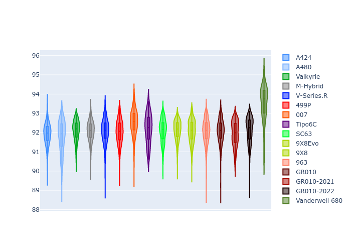
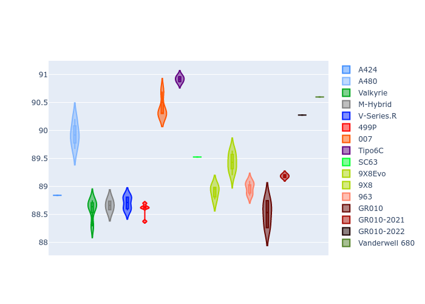

# Combined Plots

## Metadata

- BoP Accuracy: 93.47%
- Overall BoP Grade: A2
- Track: FUJI
- Threshhold: 250.0kph

## BoP Table
| Manufacturer     | Car            | Weight   | Power   | PINC   | E/Stint   | FDS    | RDP    | QDP    | TDP    |
|:-----------------|:---------------|:---------|:--------|:-------|:----------|:-------|:-------|:-------|:-------|
| Alpine           | A424           | 1067kg   | 520.0kw | -0.10% | 921MJ     | -      | 52.35% | 61.85% | 27.84% |
| Alpine           | A480           | 952kg    | 432.0kw | +0.10% | 783MJ     | -      | 54.51% | 76.19% | 54.04% |
| Aston Martin     | Valkyrie       | 1060kg   | 504.0kw | +0.10% | 900MJ     | -      | 53.59% | 53.33% | 21.51% |
| BMW              | M-Hybrid       | 1061kg   | 512.0kw | -0.10% | 910MJ     | -      | 53.26% | 57.23% | 34.54% |
| Cadillac         | V-Series.R     | 1054kg   | 510.0kw | +0.10% | 904MJ     | -      | 47.80% | 56.73% | 19.63% |
| Ferrari          | 499P           | 1083kg   | 508.0kw | -0.10% | 908MJ     | 190kph | 53.02% | 42.32% | 9.88%  |
| Glickenhaus      | 007            | 1050kg   | 520.0kw | -      | 912MJ     | -      | 46.49% | 46.07% | 47.78% |
| Isotta Fraschini | Tipo6C         | 1059kg   | 520.0kw | -      | 917MJ     | 190kph | 43.95% | 47.22% | 31.53% |
| Lamborghini      | SC63           | 1062kg   | 519.0kw | -0.10% | 913MJ     | -      | 46.33% | 59.50% | 29.33% |
| Peugeot          | 9X8Evo         | 1070kg   | 510.0kw | -0.10% | 918MJ     | 190kph | 48.47% | 51.26% | 16.02% |
| Peugeot          | 9X8            | 1050kg   | 520.0kw | -      | 908MJ     | 150kph | 54.07% | 57.08% | 10.80% |
| Porsche          | 963            | 1067kg   | 516.0kw | -0.10% | 913MJ     | -      | 50.87% | 45.25% | 30.77% |
| Toyota           | GR010          | 1100kg   | 512.0kw | -0.10% | 914MJ     | 190kph | 52.43% | 57.12% | 12.82% |
| Toyota           | GR010-2021     | 1085kg   | 513.0kw | +0.10% | 908MJ     | 150kph | 54.09% | 52.67% | 26.37% |
| Toyota           | GR010-2022     | 1100kg   | 512.0kw | +0.10% | 909MJ     | 190kph | 53.48% | 69.44% | 7.86%  |
| Vanwall          | Vanderwell 680 | 1030kg   | 520.0kw | -      | 903MJ     | -      | 53.41% | 56.28% | 29.85% |

## Performance Table
| Manufacturer     | Car            | RP      | QP      | Vavg      |   RDLC | BOP-Grade   | Match   |
|:-----------------|:---------------|:--------|:--------|:----------|-------:|:------------|:--------|
| Alpine           | A424           | 1:30.31 | 1:28.80 | 308.72kph |   1.02 | ~A1         | 98.66%  |
| Alpine           | A480           | 1:29.25 | 1:28.60 | 301.52kph |   1.01 | -D1         | 69.84%  |
| Aston Martin     | Valkyrie       | 1:31.70 | 1:29.60 | 305.33kph |   1.02 | ~A1         | 95.14%  |
| BMW              | M-Hybrid       | 1:30.66 | 1:28.82 | 306.67kph |   1.02 | ~A1         | 99.60%  |
| Cadillac         | V-Series.R     | 1:30.82 | 1:28.99 | 303.55kph |   1.02 | ~A1         | 99.96%  |
| Ferrari          | 499P           | 1:30.72 | 1:28.46 | 307.25kph |   1.03 | ~A1         | 99.74%  |
| Glickenhaus      | 007            | 1:31.03 | 1:30.29 | 305.64kph |   1.01 | ~A1         | 95.48%  |
| Isotta Fraschini | Tipo6C         | 1:31.71 | 1:31.91 | 307.56kph |   1    | +B2         | 84.33%  |
| Lamborghini      | SC63           | 1:31.36 | 1:30.33 | 306.96kph |   1.01 | ~A1         | 97.71%  |
| Peugeot          | 9X8Evo         | 1:31.34 | 1:29.61 | 308.38kph |   1.02 | ~A1         | 95.15%  |
| Peugeot          | 9X8            | 1:30.55 | 1:28.90 | 300.32kph |   1.02 | ~A1         | 99.30%  |
| Porsche          | 963            | 1:30.56 | 1:28.78 | 307.51kph |   1.02 | ~A1         | 99.68%  |
| Toyota           | GR010          | 1:30.82 | 1:28.46 | 307.43kph |   1.03 | ~A1         | 99.67%  |
| Toyota           | GR010-2021     | 1:30.73 | 1:29.24 | 299.65kph |   1.02 | ~A1         | 100.00% |
| Toyota           | GR010-2022     | 1:30.88 | 1:30.06 | 305.31kph |   1.01 | ~A1         | 100.00% |
| Vanwall          | Vanderwell 680 | 1:32.13 | 1:30.22 | 301.72kph |   1.02 | +D2         | 61.31%  |

## Race Laptimes

## Quali Laptimes

## Topspeeds

## Laptimes Lineplot

