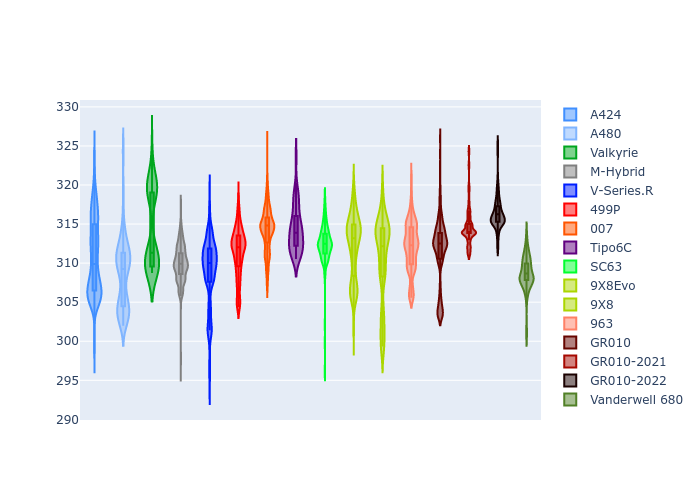
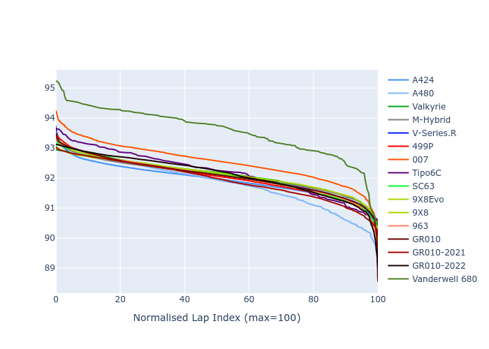

# Combined Plots

## Metadata

- BoP Accuracy: 95.85%
- Overall BoP Grade: A1
- Track: FUJI
- Threshhold: 250.0kph
- Average Laptime: 1:32.17
- Average Quali Laptime: 1:29.38
- Average Topspeed: 311.96kph

## BoP Table
| Manufacturer     | Car            | Weight   | Power   | PINC   | E/Stint   | FDS    | RDP    | QDP    | TDP    |
|:-----------------|:---------------|:---------|:--------|:-------|:----------|:-------|:-------|:-------|:-------|
| Alpine           | A424           | 1067kg   | 520.0kw | -      | 922MJ     | -      | 51.64% | 59.31% | 26.80% |
| Alpine           | A480           | 952kg    | 432.0kw | +0.10% | 783MJ     | -      | 53.05% | 74.07% | 48.97% |
| Aston Martin     | Valkyrie       | 1030kg   | 520.0kw | -      | 911MJ     | -      | 53.50% | 53.33% | 21.51% |
| BMW              | M-Hybrid       | 1053kg   | 512.0kw | +0.10% | 910MJ     | -      | 52.89% | 56.22% | 33.41% |
| Cadillac         | V-Series.R     | 1036kg   | 511.0kw | +0.10% | 904MJ     | -      | 48.63% | 60.80% | 19.01% |
| Ferrari          | 499P           | 1083kg   | 508.0kw | -0.10% | 907MJ     | 190kph | 51.38% | 44.98% | 9.83%  |
| Glickenhaus      | 007            | 1030kg   | 520.0kw | -      | 910MJ     | -      | 46.15% | 49.30% | 41.45% |
| Isotta Fraschini | Tipo6C         | 1039kg   | 520.0kw | -      | 915MJ     | 190kph | 43.95% | 47.22% | 31.53% |
| Lamborghini      | SC63           | 1034kg   | 520.0kw | -      | 911MJ     | -      | 48.33% | 60.95% | 28.65% |
| Peugeot          | 9X8Evo         | 1050kg   | 510.0kw | +0.10% | 917MJ     | 190kph | 48.87% | 52.78% | 15.41% |
| Peugeot          | 9X8            | 1031kg   | 512.0kw | -      | 899MJ     | 150kph | 54.54% | 58.39% | 9.69%  |
| Porsche          | 963            | 1065kg   | 516.0kw | -0.10% | 912MJ     | -      | 50.70% | 44.30% | 29.51% |
| Toyota           | GR010          | 1098kg   | 512.0kw | -      | 914MJ     | 190kph | 51.09% | 52.71% | 11.46% |
| Toyota           | GR010-2021     | 1085kg   | 513.0kw | -0.10% | 907MJ     | 150kph | 54.08% | 54.81% | 9.72%  |
| Toyota           | GR010-2022     | 1078kg   | 512.0kw | -      | 907MJ     | 190kph | 53.45% | 68.83% | 9.58%  |
| Vanwall          | Vanderwell 680 | 1030kg   | 520.0kw | -      | 903MJ     | -      | 49.68% | 60.93% | 34.43% |

## Performance Table
| Manufacturer     | Car            | RP      | QP      | Vavg      |   RDLC | BOP-Grade   | Match   |
|:-----------------|:---------------|:--------|:--------|:----------|-------:|:------------|:--------|
| Alpine           | A424           | 1:31.93 | 1:28.84 | 310.74kph |   1.03 | ~A1         | 99.76%  |
| Alpine           | A480           | 1:31.81 | 1:29.93 | 308.52kph |   1.02 | ~A1         | 99.60%  |
| Aston Martin     | Valkyrie       | 1:32.11 | 1:28.60 | 314.17kph |   1.04 | ~A1         | 100.00% |
| BMW              | M-Hybrid       | 1:32.08 | 1:28.66 | 309.97kph |   1.04 | ~A1         | 100.00% |
| Cadillac         | V-Series.R     | 1:32.08 | 1:28.70 | 309.02kph |   1.04 | ~A1         | 99.79%  |
| Ferrari          | 499P           | 1:32.03 | 1:28.59 | 311.39kph |   1.04 | ~A1         | 99.98%  |
| Glickenhaus      | 007            | 1:32.53 | 1:30.40 | 314.29kph |   1.02 | -A2         | 94.86%  |
| Isotta Fraschini | Tipo6C         | 1:32.17 | 1:30.92 | 314.32kph |   1.01 | ~A1         | 97.76%  |
| Lamborghini      | SC63           | 1:32.09 | 1:29.52 | 312.53kph |   1.03 | ~A1         | 100.00% |
| Peugeot          | 9X8Evo         | 1:32.11 | 1:28.91 | 312.21kph |   1.04 | ~A1         | 100.00% |
| Peugeot          | 9X8            | 1:32.08 | 1:29.43 | 310.68kph |   1.03 | ~A1         | 100.00% |
| Porsche          | 963            | 1:32.07 | 1:28.97 | 312.10kph |   1.03 | ~A1         | 99.85%  |
| Toyota           | GR010          | 1:32.08 | 1:28.51 | 311.57kph |   1.04 | ~A1         | 99.79%  |
| Toyota           | GR010-2021     | 1:31.94 | 1:29.18 | 314.68kph |   1.03 | ~A1         | 100.00% |
| Toyota           | GR010-2022     | 1:32.12 | 1:30.27 | 316.36kph |   1.02 | ~A1         | 99.49%  |
| Vanwall          | Vanderwell 680 | 1:33.57 | 1:30.60 | 308.75kph |   1.03 | +Ω1         | 42.65%  |

## Race Laptimes

## Quali Laptimes

## Topspeeds

## Laptimes Lineplot

