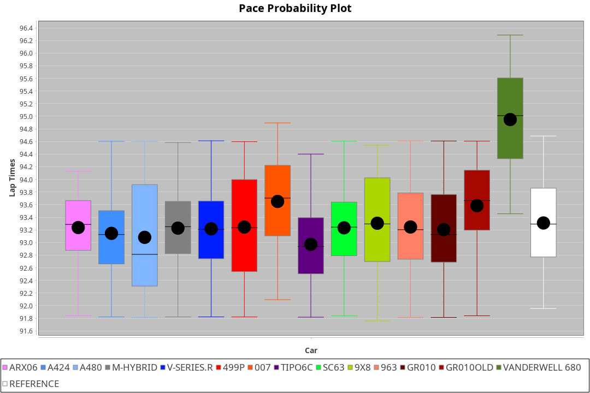
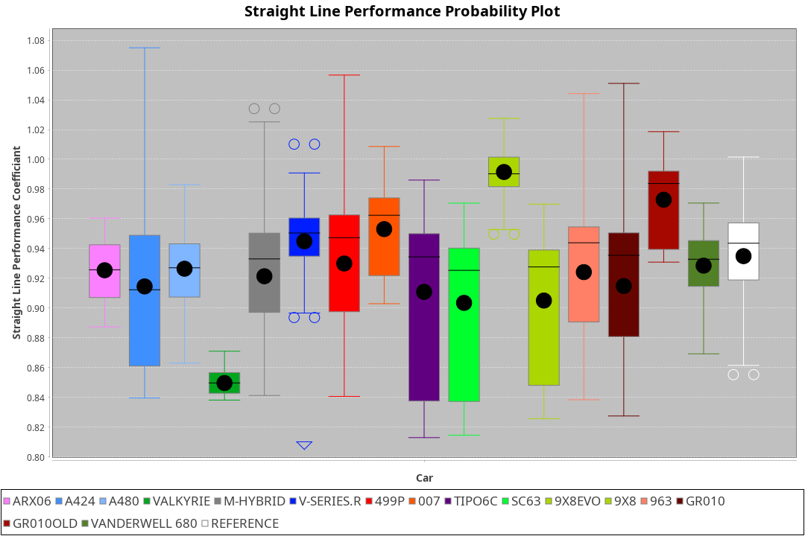
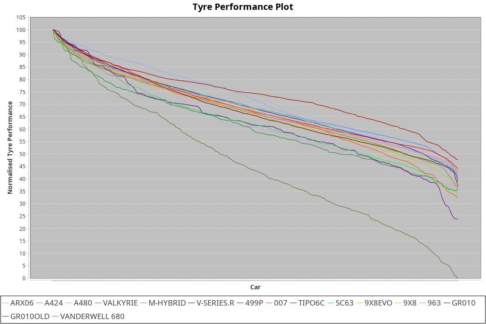

| Manufacturer     | Car            | Weight | Power   | PINC    | E/Stint | FDS     |
|:-|:-|:-|:-|:-|:-|:-|
| Acura            | ARX06          | 1082kg | 508.0kw |    -    | 909MJ   |    -    |
| Alpine           | A424           | 1057kg | 517.0kw |    -    | 918MJ   |    -    |
| Alpine           | A480           | 952kg  | 429.0kw |    -    | 780MJ   |    -    |
| Aston Martin     | Valkyrie       | 1032kg | 520.0kw |    -    | 911MJ   |    -    |
| BMW              | M-Hybrid       | 1051kg | 509.0kw |    -    | 906MJ   |    -    |
| Cadillac         | V-Series.R     | 1044kg | 507.0kw |    -    | 901MJ   |    -    |
| Ferrari          | 499P           | 1073kg | 505.0kw |    -    | 904MJ   | 190kph  |
| Glickenhaus      | 007            | 1040kg | 517.0kw |    -    | 908MJ   |    -    |
| Isotta Fraschini | Tipo6C         | 1059kg | 520.0kw |    -    | 917MJ   | 190kph  |
| Lamborghini      | SC63           | 1052kg | 516.0kw |    -    | 906MJ   |    -    |
| Peugeot          | 9X8Evo         | 1060kg | 507.0kw |    -    | 915MJ   | 190kph  |
| Peugeot          | 9X8            | 1040kg | 517.0kw |    -    | 905MJ   | 150kph  |
| Porsche          | 963            | 1057kg | 513.0kw |    -    | 909MJ   |    -    |
| Toyota           | GR010          | 1090kg | 509.0kw |    -    | 910MJ   | 190kph  |
| Toyota           | GR010OLD       | 1075kg | 510.0kw |    -    | 958MJ   | 150kph  |
| Vanwall          | Vanderwell 680 | 1030kg | 520.0kw |    -    | 903MJ   |    -    |

### BoP Accuracy: 73.56%; Overall BoP Grade: C2
| Manufacturer     | Car            | Type  | RP      | QP      | Weight | Power¹  | Threshhold | PINC    | Power²   | E/Stint | AVG Vmax  | FDS     | RDLC | L/Stint | BOP-Grade | Model Accuracy | Model Points | Match% | SimDiff |
|:-|:-|:-|:-|:-|:-|:-|:-|:-|:-|:-|:-|:-|:-|:-|:-|:-|:-|:-|:-|
| Acura            | ARX06          | LMDH  | 1:31.00 | 1:29.03 | 1082kg | 508.0kw | 210.0kph   |    -    | 508.00kw |  909MJ  | 308.63kph |    -    | 1.00 | 40      | +B2       | 100.00%        | 996          | 82.94% | #       |
| Alpine           | A424           | LMDH  | 1:30.54 | 1:29.44 | 1057kg | 517.0kw | 210.0kph   |    -    | 517.00kw |  918MJ  | 324.85kph |    -    | 0.99 | 40      | -B2       | 99.49%         | 1360         | 84.63% | #       |
| Alpine           | A480           | LMP1  | 1:29.79 | 1:29.14 |  952kg | 429.0kw | 210.0kph   |    -    | 429.00kw |  780MJ  | 311.16kph |    -    | 0.97 | 37      | -Ω1       | 97.75%         | 1567         | 40.14% | +0.32   |
| Aston Martin     | Valkyrie       | LMHNH | 1:32.35 | 1:30.55 | 1032kg | 520.0kw | 210.0kph   |    -    | 520.00kw |  911MJ  | 317.85kph |    -    | 1.03 | 40      | +Ω1       | 100.00%        | 312          | 29.04% | #       |
| BMW              | M-Hybrid       | LMDH  | 1:30.71 | 1:28.82 | 1051kg | 509.0kw | 210.0kph   |    -    | 509.00kw |  906MJ  | 322.34kph |    -    | 1.01 | 40      | ~A1       | 98.62%         | 2363         | 95.12% | #       |
| Cadillac         | V-Series.R     | LMDH  | 1:30.34 | 1:28.78 | 1044kg | 507.0kw | 210.0kph   |    -    | 507.00kw |  901MJ  | 317.80kph |    -    | 1.02 | 40      | -C2       | 98.50%         | 4201         | 73.04% | #       |
| Ferrari          | 499P           | LMHHU | 1:30.60 | 1:28.89 | 1073kg | 505.0kw | 210.0kph   |    -    | 505.00kw |  904MJ  | 321.15kph | 190kph  | 1.01 | 40      | -B2       | 100.00%        | 4441         | 84.89% | #       |
| Glickenhaus      | 007            | LMHNH | 1:30.86 | 1:29.89 | 1040kg | 517.0kw | 210.0kph   |    -    | 517.00kw |  908MJ  | 316.47kph |    -    | 0.95 | 40      | ~A1       | 94.07%         | 2174         | 95.01% | #       |
| Isotta Fraschini | Tipo6C         | LMHHU | 1:31.53 | 1:31.24 | 1059kg | 520.0kw | 210.0kph   |    -    | 520.00kw |  917MJ  | 319.96kph | 190kph  | 1.05 | 40      | +Ω1       | 98.48%         | 130          | 38.79% | #       |
| Lamborghini      | SC63           | LMDH  | 1:30.96 | 1:29.93 | 1052kg | 516.0kw | 210.0kph   |    -    | 516.00kw |  906MJ  | 318.89kph |    -    | 1.04 | 40      | ~A1       | 100.00%        | 784          | 96.74% | #       |
| Peugeot          | 9X8Evo         | LMHHU | 1:30.78 | 1:29.40 | 1060kg | 507.0kw | 210.0kph   |    -    | 507.00kw |  915MJ  | 322.65kph | 190kph  | 0.99 | 40      | +B2       | 100.00%        | 808          | 84.91% | #       |
| Peugeot          | 9X8            | LMHHE | 1:30.90 | 1:29.37 | 1040kg | 517.0kw | 210.0kph   |    -    | 517.00kw |  905MJ  | 317.75kph | 150kph  | 1.02 | 40      | ~A1       | 98.79%         | 5064         | 97.93% | +1.68   |
| Porsche          | 963            | LMDH  | 1:30.36 | 1:28.46 | 1057kg | 513.0kw | 210.0kph   |    -    | 513.00kw |  909MJ  | 321.43kph |    -    | 1.01 | 40      | -C2       | 99.87%         | 12613        | 72.04% | #       |
| Toyota           | GR010          | LMHHU | 1:30.76 | 1:28.88 | 1090kg | 509.0kw | 210.0kph   |    -    | 509.00kw |  910MJ  | 317.59kph | 190kph  | 1.00 | 40      | ~A1       | 99.73%         | 2956         | 96.73% | #       |
| Toyota           | GR010OLD       | LMHHE | 1:30.09 | 1:29.30 | 1075kg | 510.0kw | 210.0kph   |    -    | 510.00kw |  958MJ  | 316.57kph | 150kph  | 1.02 | 40      | -E1       | 94.62%         | 880          | 59.38% | #       |
| Vanwall          | Vanderwell 680 | LMHNH | 1:31.95 | 1:29.96 | 1030kg | 520.0kw | 210.0kph   |    -    | 520.00kw |  903MJ  | 314.61kph |    -    | 1.01 | 40      | +Ω1       | 99.09%         | 544          | 45.65% | +1.69   |

## Power below Threshhold
| N/Nmax    | ARX06   | A424    | VALKYRIE | M-HYBRID | V-SERIES.R | 499P    | 007     | TIPO6C  | SC63    | 9X8EVO  | 9X8     | 963     | GR010   | GR010OLD | VANDERWELL 680 | ​     | RPM      | A480    |
|:-|:-|:-|:-|:-|:-|:-|:-|:-|:-|:-|:-|:-|:-|:-|:-|:-|:-|:-|
|  0.550    |  250    |  255    |  256     |  251     |  250       |  249    |  255    |  256    |  254    |  250    |  255    |  253    |  251    |  251     |  256           |  ​    |   --     |   -     |
|  0.575    |  273    |  278    |  279     |  274     |  273       |  272    |  278    |  279    |  277    |  273    |  278    |  276    |  274    |  274     |  279           |  ​    |   --     |   -     |
|  0.600    |  293    |  298    |  300     |  294     |  293       |  292    |  298    |  300    |  298    |  293    |  298    |  296    |  294    |  295     |  300           |  ​    |   --     |   -     |
|  0.625    |  314    |  320    |  322     |  315     |  314       |  312    |  320    |  322    |  319    |  314    |  320    |  317    |  315    |  316     |  322           |  ​    |   --     |   -     |
|  0.650    |  335    |  341    |  343     |  336     |  335       |  333    |  341    |  343    |  340    |  335    |  341    |  338    |  336    |  337     |  343           |  ​    |   --     |   -     |
|  0.675    |  357    |  363    |  365     |  357     |  356       |  355    |  363    |  365    |  362    |  356    |  363    |  360    |  357    |  358     |  365           |  ​    |   --     |   -     |
|  0.700    |  378    |  385    |  387     |  379     |  377       |  376    |  385    |  387    |  384    |  377    |  385    |  382    |  379    |  380     |  387           |  ​    |   --     |   -     |
|  0.725    |  399    |  407    |  409     |  400     |  399       |  397    |  407    |  409    |  406    |  399    |  407    |  403    |  400    |  401     |  409           |  ​    |   --     |   -     |
|  0.750    |  420    |  427    |  430     |  421     |  419       |  417    |  427    |  430    |  427    |  419    |  427    |  424    |  421    |  422     |  430           |  ​    |   --     |   -     |
|  0.775    |  439    |  446    |  449     |  440     |  438       |  436    |  446    |  449    |  446    |  438    |  446    |  443    |  440    |  441     |  449           |  ​    |  5000    |  252    |
|  0.800    |  456    |  464    |  467     |  457     |  455       |  454    |  464    |  467    |  463    |  455    |  464    |  461    |  457    |  458     |  467           |  ​    |  5500    |  297    |
|  0.825    |  471    |  479    |  482     |  472     |  470       |  469    |  479    |  482    |  478    |  470    |  479    |  476    |  472    |  473     |  482           |  ​    |  6000    |  332    |
|  0.850    |  483    |  491    |  494     |  484     |  482       |  480    |  491    |  494    |  490    |  482    |  491    |  487    |  484    |  485     |  494           |  ​    |  6500    |  375    |
|  0.875    |  493    |  502    |  505     |  494     |  492       |  490    |  502    |  505    |  501    |  492    |  502    |  498    |  494    |  495     |  505           |  ​    |  7000    |  419    |
|  0.900    |  500    |  509    |  512     |  501     |  499       |  497    |  509    |  512    |  508    |  499    |  509    |  505    |  501    |  502     |  512           |  ​    |  7500    |  430    |
|  0.925    |  505    |  514    |  517     |  506     |  504       |  502    |  514    |  517    |  513    |  504    |  514    |  510    |  506    |  507     |  517           |  ​    |  8000    |  426    |
| **0.950** | **508** | **517** | **520**  | **509**  | **507**    | **505** | **517** | **520** | **516** | **507** | **517** | **513** | **509** | **510**  | **520**        | **​** | **8500** | **429** |
|  0.975    |  506    |  515    |  518     |  507     |  505       |  503    |  515    |  518    |  514    |  505    |  515    |  511    |  507    |  508     |  518           |  ​    |  9000    |  214    |
|  1.000    |  503    |  511    |  514     |  504     |  502       |  500    |  511    |  514    |  510    |  502    |  511    |  507    |  504    |  505     |  514           |  ​    |   --     |   -     |
|  1.025    |  434    |  441    |  444     |  435     |  433       |  431    |  441    |  444    |  441    |  433    |  441    |  438    |  435    |  436     |  444           |  ​    |   --     |   -     |

## Power above Threshhold
| N/Nmax    | ARX06   | A424    | VALKYRIE | M-HYBRID | V-SERIES.R | 499P    | 007     | TIPO6C  | SC63    | 9X8EVO  | 9X8     | 963     | GR010   | GR010OLD | VANDERWELL 680 | ​     | RPM      | A480    |
|:-|:-|:-|:-|:-|:-|:-|:-|:-|:-|:-|:-|:-|:-|:-|:-|:-|:-|:-|
|  0.550    |  250    |  255    |  256     |  251     |  250       |  249    |  255    |  256    |  254    |  250    |  255    |  253    |  251    |  251     |  256           |  ​    |   --     |   -     |
|  0.575    |  273    |  278    |  279     |  274     |  273       |  272    |  278    |  279    |  277    |  273    |  278    |  276    |  274    |  274     |  279           |  ​    |   --     |   -     |
|  0.600    |  293    |  298    |  300     |  294     |  293       |  292    |  298    |  300    |  298    |  293    |  298    |  296    |  294    |  295     |  300           |  ​    |   --     |   -     |
|  0.625    |  314    |  320    |  322     |  315     |  314       |  312    |  320    |  322    |  319    |  314    |  320    |  317    |  315    |  316     |  322           |  ​    |   --     |   -     |
|  0.650    |  335    |  341    |  343     |  336     |  335       |  333    |  341    |  343    |  340    |  335    |  341    |  338    |  336    |  337     |  343           |  ​    |   --     |   -     |
|  0.675    |  357    |  363    |  365     |  357     |  356       |  355    |  363    |  365    |  362    |  356    |  363    |  360    |  357    |  358     |  365           |  ​    |   --     |   -     |
|  0.700    |  378    |  385    |  387     |  379     |  377       |  376    |  385    |  387    |  384    |  377    |  385    |  382    |  379    |  380     |  387           |  ​    |   --     |   -     |
|  0.725    |  399    |  407    |  409     |  400     |  399       |  397    |  407    |  409    |  406    |  399    |  407    |  403    |  400    |  401     |  409           |  ​    |   --     |   -     |
|  0.750    |  420    |  427    |  430     |  421     |  419       |  417    |  427    |  430    |  427    |  419    |  427    |  424    |  421    |  422     |  430           |  ​    |   --     |   -     |
|  0.775    |  439    |  446    |  449     |  440     |  438       |  436    |  446    |  449    |  446    |  438    |  446    |  443    |  440    |  441     |  449           |  ​    |  5000    |  252    |
|  0.800    |  456    |  464    |  467     |  457     |  455       |  454    |  464    |  467    |  463    |  455    |  464    |  461    |  457    |  458     |  467           |  ​    |  5500    |  297    |
|  0.825    |  471    |  479    |  482     |  472     |  470       |  469    |  479    |  482    |  478    |  470    |  479    |  476    |  472    |  473     |  482           |  ​    |  6000    |  332    |
|  0.850    |  483    |  491    |  494     |  484     |  482       |  480    |  491    |  494    |  490    |  482    |  491    |  487    |  484    |  485     |  494           |  ​    |  6500    |  375    |
|  0.875    |  493    |  502    |  505     |  494     |  492       |  490    |  502    |  505    |  501    |  492    |  502    |  498    |  494    |  495     |  505           |  ​    |  7000    |  419    |
|  0.900    |  500    |  509    |  512     |  501     |  499       |  497    |  509    |  512    |  508    |  499    |  509    |  505    |  501    |  502     |  512           |  ​    |  7500    |  430    |
|  0.925    |  505    |  514    |  517     |  506     |  504       |  502    |  514    |  517    |  513    |  504    |  514    |  510    |  506    |  507     |  517           |  ​    |  8000    |  426    |
| **0.950** | **508** | **517** | **520**  | **509**  | **507**    | **505** | **517** | **520** | **516** | **507** | **517** | **513** | **509** | **510**  | **520**        | **​** | **8500** | **429** |
|  0.975    |  506    |  515    |  518     |  507     |  505       |  503    |  515    |  518    |  514    |  505    |  515    |  511    |  507    |  508     |  518           |  ​    |  9000    |  214    |
|  1.000    |  503    |  511    |  514     |  504     |  502       |  500    |  511    |  514    |  510    |  502    |  511    |  507    |  504    |  505     |  514           |  ​    |   --     |   -     |
|  1.025    |  434    |  441    |  444     |  435     |  433       |  431    |  441    |  444    |  441    |  433    |  441    |  438    |  435    |  436     |  444           |  ​    |   --     |   -     |
