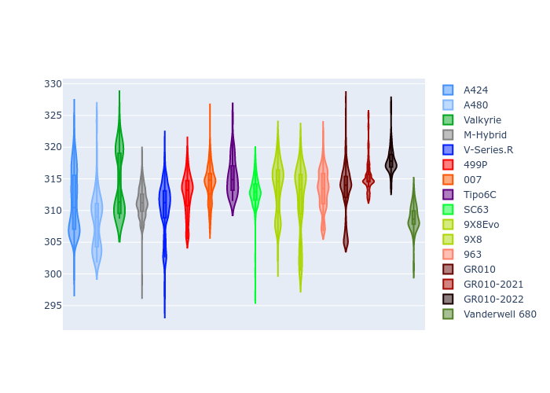

# Combined Plots

## Metadata

- BoP Accuracy: 97.17%
- Overall BoP Grade: A1
- Track: FUJI
- Threshhold: 0.0kph

## BoP Table
| Manufacturer     | Car            | Weight   | Power   | PINC   | E/Stint   | FDS    | RDP    | QDP    | TDP    |
|:-----------------|:---------------|:---------|:--------|:-------|:----------|:-------|:-------|:-------|:-------|
| Alpine           | A424           | 1063kg   | 480.0kw | -      | 885MJ     | -      | 52.35% | 61.85% | 27.84% |
| Alpine           | A480           | 952kg    | 410.0kw | -      | 762MJ     | -      | 54.51% | 76.19% | 54.04% |
| Aston Martin     | Valkyrie       | 1034kg   | 480.0kw | -      | 876MJ     | -      | 53.59% | 53.33% | 21.51% |
| BMW              | M-Hybrid       | 1059kg   | 480.0kw | -      | 881MJ     | -      | 53.26% | 57.23% | 34.54% |
| Cadillac         | V-Series.R     | 1048kg   | 480.0kw | -      | 877MJ     | -      | 47.80% | 56.73% | 19.63% |
| Ferrari          | 499P           | 1087kg   | 480.0kw | -      | 883MJ     | 190kph | 53.02% | 42.32% | 9.88%  |
| Glickenhaus      | 007            | 1031kg   | 484.0kw | -      | 878MJ     | -      | 46.49% | 46.07% | 47.78% |
| Isotta Fraschini | Tipo6C         | 1085kg   | 520.0kw | -      | 920MJ     | 190kph | 43.95% | 47.22% | 31.53% |
| Lamborghini      | SC63           | 1064kg   | 501.0kw | -      | 897MJ     | -      | 46.33% | 59.50% | 29.33% |
| Peugeot          | 9X8Evo         | 1047kg   | 480.0kw | -      | 889MJ     | 190kph | 48.47% | 51.26% | 16.02% |
| Peugeot          | 9X8            | 1047kg   | 486.0kw | -      | 878MJ     | 150kph | 54.07% | 57.08% | 10.80% |
| Porsche          | 963            | 1061kg   | 480.0kw | -      | 880MJ     | -      | 50.87% | 45.25% | 30.77% |
| Toyota           | GR010          | 1092kg   | 480.0kw | -      | 885MJ     | 190kph | 52.43% | 57.12% | 12.82% |
| Toyota           | GR010-2021     | 1080kg   | 482.0kw | -      | 879MJ     | 150kph | 54.09% | 52.67% | 26.37% |
| Toyota           | GR010-2022     | 1088kg   | 480.0kw | -      | 879MJ     | 190kph | 53.48% | 69.44% | 7.86%  |
| Vanwall          | Vanderwell 680 | 1040kg   | 520.0kw | -      | 904MJ     | -      | 53.41% | 56.28% | 29.85% |

## Performance Table
| Manufacturer     | Car            | RP      | QP      | Vavg      |   RDLC | BOP-Grade   | Match   |
|:-----------------|:---------------|:--------|:--------|:----------|-------:|:------------|:--------|
| Alpine           | A424           | 1:32.43 | 1:30.82 | 300.39kph |   1.02 | ~A1         | 99.08%  |
| Alpine           | A480           | 1:30.65 | 1:29.96 | 295.78kph |   1.01 | -C2         | 70.83%  |
| Aston Martin     | Valkyrie       | 1:32.42 | 1:30.27 | 302.61kph |   1.02 | ~A1         | 100.00% |
| BMW              | M-Hybrid       | 1:32.42 | 1:30.48 | 299.88kph |   1.02 | ~A1         | 99.42%  |
| Cadillac         | V-Series.R     | 1:32.41 | 1:30.50 | 297.48kph |   1.02 | ~A1         | 99.79%  |
| Ferrari          | 499P           | 1:32.42 | 1:30.04 | 300.69kph |   1.03 | ~A1         | 99.84%  |
| Glickenhaus      | 007            | 1:32.40 | 1:31.62 | 299.77kph |   1.01 | ~A1         | 96.04%  |
| Isotta Fraschini | Tipo6C         | 1:32.41 | 1:32.61 | 304.87kph |   1    | ~A1         | 95.52%  |
| Lamborghini      | SC63           | 1:32.43 | 1:31.36 | 302.94kph |   1.01 | ~A1         | 99.76%  |
| Peugeot          | 9X8Evo         | 1:32.41 | 1:30.62 | 304.15kph |   1.02 | ~A1         | 98.95%  |
| Peugeot          | 9X8            | 1:32.42 | 1:30.68 | 293.35kph |   1.02 | ~A1         | 99.94%  |
| Porsche          | 963            | 1:32.42 | 1:30.53 | 300.26kph |   1.02 | ~A1         | 99.84%  |
| Toyota           | GR010          | 1:32.41 | 1:29.95 | 301.21kph |   1.03 | ~A1         | 99.71%  |
| Toyota           | GR010-2021     | 1:32.42 | 1:30.85 | 293.37kph |   1.02 | ~A1         | 98.75%  |
| Toyota           | GR010-2022     | 1:32.41 | 1:31.53 | 299.35kph |   1.01 | ~A1         | 100.00% |
| Vanwall          | Vanderwell 680 | 1:32.42 | 1:30.50 | 300.66kph |   1.02 | ~A1         | 97.17%  |

## Race Laptimes

## Quali Laptimes

## Topspeeds

## Laptimes Lineplot

