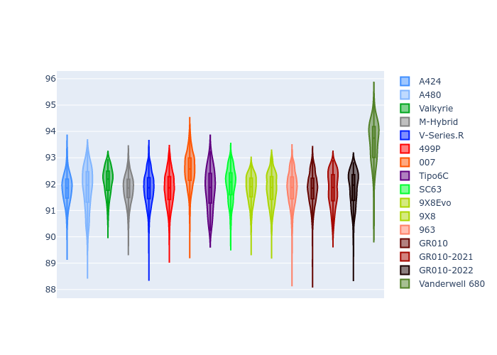
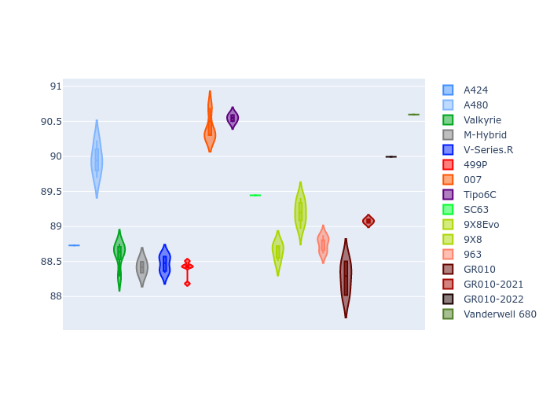

# Combined Plots

## Metadata

- BoP Accuracy: 95.36%
- Overall BoP Grade: A1
- Track: FUJI
- Threshhold: 0.0kph
- Average Laptime: 1:32.00
- Average Quali Laptime: 1:29.22
- Average Topspeed: 312.78kph

## BoP Table
| Manufacturer     | Car            | Weight   | Power   | PINC   | E/Stint   | FDS    | RDP    | QDP    | TDP    |
|:-----------------|:---------------|:---------|:--------|:-------|:----------|:-------|:-------|:-------|:-------|
| Alpine           | A424           | 1037kg   | 508.0kw | -      | 908MJ     | -      | 51.64% | 59.31% | 26.80% |
| Alpine           | A480           | 931kg    | 422.0kw | -      | 771MJ     | -      | 53.05% | 74.07% | 48.97% |
| Aston Martin     | Valkyrie       | 1030kg   | 520.0kw | -      | 911MJ     | -      | 53.50% | 53.33% | 21.51% |
| BMW              | M-Hybrid       | 1038kg   | 511.0kw | -      | 907MJ     | -      | 52.89% | 56.22% | 33.41% |
| Cadillac         | V-Series.R     | 1042kg   | 520.0kw | -      | 912MJ     | -      | 48.63% | 60.80% | 19.01% |
| Ferrari          | 499P           | 1060kg   | 502.0kw | -      | 900MJ     | 190kph | 51.38% | 44.98% | 9.83%  |
| Glickenhaus      | 007            | 1030kg   | 520.0kw | -      | 910MJ     | -      | 46.15% | 49.30% | 41.45% |
| Isotta Fraschini | Tipo6C         | 1030kg   | 520.0kw | -      | 914MJ     | 170kph | 43.95% | 47.22% | 31.53% |
| Lamborghini      | SC63           | 1030kg   | 520.0kw | -      | 910MJ     | -      | 48.33% | 60.95% | 28.65% |
| Peugeot          | 9X8Evo         | 1032kg   | 508.0kw | -      | 913MJ     | 190kph | 48.87% | 52.78% | 15.41% |
| Peugeot          | 9X8            | 1036kg   | 520.0kw | -      | 907MJ     | 150kph | 54.54% | 58.39% | 9.69%  |
| Porsche          | 963            | 1034kg   | 506.0kw | -      | 900MJ     | -      | 50.70% | 44.30% | 29.51% |
| Toyota           | GR010          | 1056kg   | 499.0kw | -      | 897MJ     | 190kph | 51.09% | 52.71% | 11.46% |
| Toyota           | GR010-2021     | 1054kg   | 501.0kw | -      | 894MJ     | 150kph | 54.08% | 54.81% | 9.72%  |
| Toyota           | GR010-2022     | 1053kg   | 507.0kw | -      | 900MJ     | 190kph | 53.45% | 68.83% | 9.58%  |
| Vanwall          | Vanderwell 680 | 1030kg   | 520.0kw | -      | 903MJ     | -      | 49.68% | 60.93% | 34.43% |

## Performance Table
| Manufacturer     | Car            | RP      | QP      | Vavg      |   RDLC | BOP-Grade   | Match   |
|:-----------------|:---------------|:--------|:--------|:----------|-------:|:------------|:--------|
| Alpine           | A424           | 1:31.81 | 1:28.73 | 311.32kph |   1.03 | ~A1         | 99.63%  |
| Alpine           | A480           | 1:31.83 | 1:29.95 | 308.31kph |   1.02 | ~A1         | 99.73%  |
| Aston Martin     | Valkyrie       | 1:32.11 | 1:28.60 | 314.17kph |   1.04 | ~A1         | 100.00% |
| BMW              | M-Hybrid       | 1:31.81 | 1:28.42 | 311.27kph |   1.04 | ~A1         | 100.00% |
| Cadillac         | V-Series.R     | 1:31.82 | 1:28.47 | 310.24kph |   1.04 | ~A1         | 99.86%  |
| Ferrari          | 499P           | 1:31.83 | 1:28.40 | 312.57kph |   1.04 | ~A1         | 99.94%  |
| Glickenhaus      | 007            | 1:32.53 | 1:30.40 | 314.29kph |   1.02 | +A2         | 90.08%  |
| Isotta Fraschini | Tipo6C         | 1:31.80 | 1:30.55 | 315.31kph |   1.01 | ~A1         | 100.00% |
| Lamborghini      | SC63           | 1:32.00 | 1:29.44 | 312.97kph |   1.03 | ~A1         | 100.00% |
| Peugeot          | 9X8Evo         | 1:31.83 | 1:28.64 | 313.63kph |   1.04 | ~A1         | 100.00% |
| Peugeot          | 9X8            | 1:31.83 | 1:29.20 | 311.88kph |   1.03 | ~A1         | 100.00% |
| Porsche          | 963            | 1:31.83 | 1:28.75 | 313.33kph |   1.03 | ~A1         | 99.84%  |
| Toyota           | GR010          | 1:31.82 | 1:28.27 | 313.08kph |   1.04 | ~A1         | 99.76%  |
| Toyota           | GR010-2021     | 1:31.82 | 1:29.08 | 315.38kph |   1.03 | ~A1         | 100.00% |
| Toyota           | GR010-2022     | 1:31.83 | 1:29.99 | 317.93kph |   1.02 | ~A1         | 99.49%  |
| Vanwall          | Vanderwell 680 | 1:33.57 | 1:30.60 | 308.75kph |   1.03 | +Ω1         | 37.44%  |

## Race Laptimes

## Quali Laptimes

## Topspeeds

## Laptimes Lineplot

