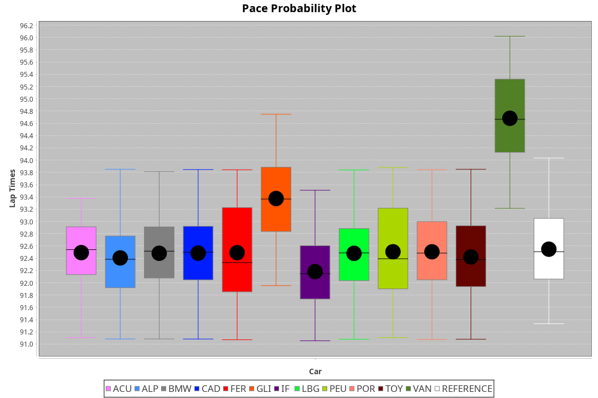
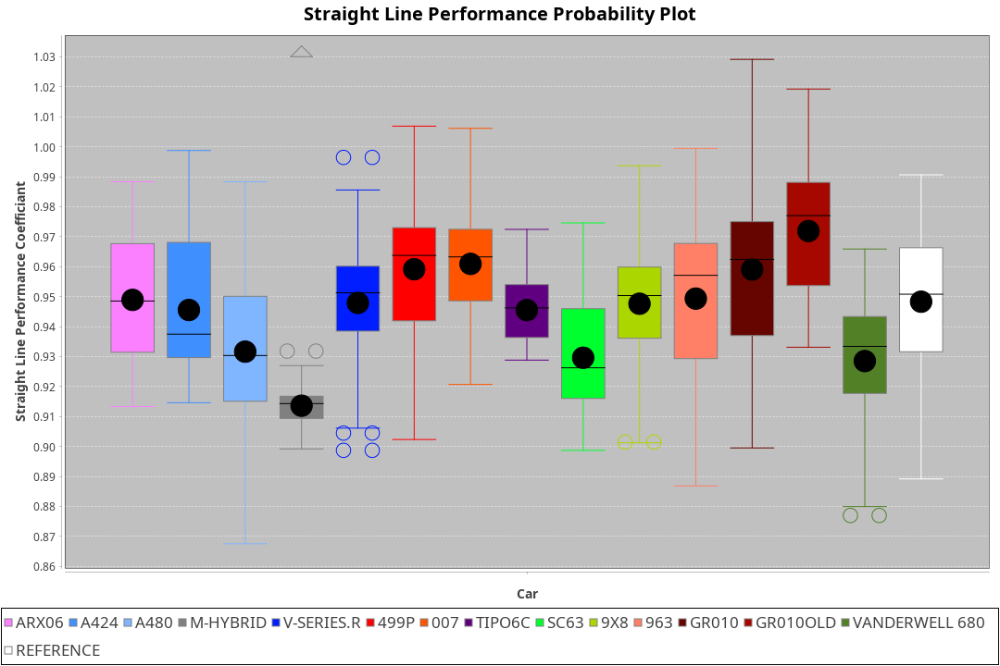
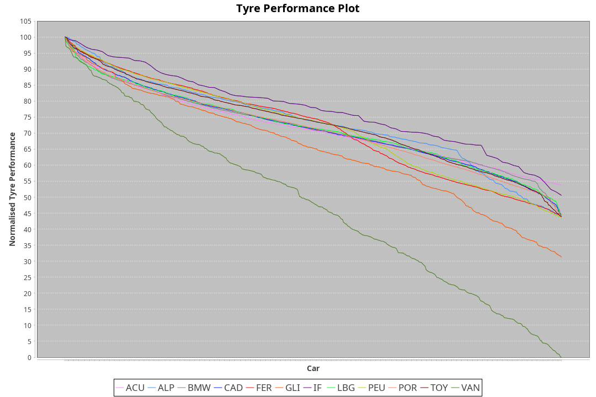

|Manufacturer|Car|Weight|Power|PINC|E/Stint|FDS|
|:-|:-|:-|:-|:-|:-|:-|
|Acura|ARX06|1037kg|510kw|-|906MJ|-|
|Alpine|A424|1035kg|511kw|-|906MJ|-|
|Alpine|A480|932kg|416kw|-|750MJ|-|
|BMW|M Hybrid V8 LMDh|1045kg|514kw|-|907MJ|-|
|Cadillac|V-Series.R|1033kg|508kw|-|896MJ|-|
|Ferrari|499P|1058kg|504kw|-|895MJ|190kph|
|Glickenhaus|007|1030kg|520kw|-|910MJ|-|
|Issotta Fraschini|Tipo6C|1030kg|520kw|-|916MJ|160kph|
|Lamborghini|SC63|1060kg|520kw|-|913MJ|-|
|Peugeot|9X8|1030kg|520kw|-|904MJ|140kph|
|Porsche|963|1037kg|512kw|-|897MJ|-|
|Toyota|GR010|1061kg|507kw|-|898MJ|190kph|
|Toyota|GR010OLD|1060kg|513kw|-|905MJ|190kph|
|Vanwall|Vanderwell 680|1030kg|520kw|-|903MJ|-|

### BoP Accuracy: 86.93%; Overall BoP Grade: B1
|Manufacturer|Car|Type|RP|QP|Weight|Power¹|Threshhold|PINC|Power²|E/Stint|AVG Vmax|FDS|RDLC|L/Stint|BOP-Grade|ModelAccuracy|ModelPoints|Match%|
|:-|:-|:-|:-|:-|:-|:-|:-|:-|:-|:-|:-|:-|:-|:-|:-|:-|:-|:-|
|Acura|ARX06|LMDH|1:32.54|1:27.69|1037kg|510kw|0.0kph|-|510kw|906MJ|326.87kph|-|1.03|41|-C1|100.00%|995|77.95%|
|Alpine|A424|LMDH|1:32.55|1:29.61|1035kg|511kw|0.0kph|-|511kw|906MJ|326.60kph|-|1.03|41|~A1|81.15%|521|99.59%|
|Alpine|A480|LMP1|1:32.53|1:28.90|932kg|416kw|0.0kph|-|416kw|750MJ|322.52kph|-|1.00|38|~A1|67.92%|957|100.00%|
|BMW|M Hybrid V8 LMDh|LMDH|1:32.55|1:28.45|1045kg|514kw|0.0kph|-|514kw|907MJ|321.97kph|-|1.03|41|-A2|98.60%|1690|91.05%|
|Cadillac|V-Series.R|LMDH|1:32.54|1:28.23|1033kg|508kw|0.0kph|-|508kw|896MJ|326.79kph|-|1.03|41|+A2|91.10%|1770|94.58%|
|Ferrari|499P|LMHHU|1:32.54|1:28.35|1058kg|504kw|0.0kph|-|504kw|895MJ|327.53kph|190kph|1.03|41|~A1|84.26%|2292|98.93%|
|Glickenhaus|007|LMHNH|1:32.95|1:29.33|1030kg|520kw|0.0kph|-|520kw|910MJ|330.43kph|-|0.96|40|~A1|94.63%|1605|100.00%|
|Issotta Fraschini|Tipo6C|LMHHU|1:32.59|1:30.36|1030kg|520kw|0.0kph|-|520kw|916MJ|328.33kph|160kph|1.08|40|+B1|66.67%|96|86.45%|
|Lamborghini|SC63|LMDH|1:32.54|1:30.48|1060kg|520kw|0.0kph|-|520kw|913MJ|323.53kph|-|1.03|40|+B1|96.77%|419|88.30%|
|Peugeot|9X8|LMHHE|1:32.50|1:28.54|1030kg|520kw|0.0kph|-|520kw|904MJ|327.19kph|140kph|1.04|40|~A1|83.63%|2468|97.33%|
|Porsche|963|LMDH|1:32.55|1:28.18|1037kg|512kw|0.0kph|-|512kw|897MJ|327.29kph|-|1.03|41|-A2|93.14%|5746|94.74%|
|Toyota|GR010|LMHHU|1:32.54|1:28.36|1061kg|507kw|0.0kph|-|507kw|898MJ|327.78kph|190kph|1.03|41|~A1|87.37%|3154|97.24%|
|Toyota|GR010OLD|LMHHE|1:32.54|1:28.25|1060kg|513kw|0.0kph|-|513kw|905MJ|330.36kph|190kph|1.03|41|~A1|89.81%|1393|95.64%|
|Vanwall|Vanderwell 680|LMHNH|1:34.79|1:29.98|1030kg|520kw|0.0kph|-|520kw|903MJ|322.98kph|-|1.02|40|+Ω2|90.28%|604|-4.72%|

## Power below Threshhold
|N/Nmax|ARX06|A424|MHYBRIDV8LMDH|VSERIES.R|499P|007|TIPO6C|SC63|9X8|963|GR010|GR010OLD|VANDERWELL680|​|RPM|A480|
|:-|:-|:-|:-|:-|:-|:-|:-|:-|:-|:-|:-|:-|:-|:-|:-|:-|
|0.550|251|252|253|250|248|256|256|256|256|252|250|253|256|​|--|-|
|0.575|274|275|276|273|271|279|279|279|279|275|273|276|279|​|--|-|
|0.600|295|295|297|293|291|300|300|300|300|296|293|296|300|​|--|-|
|0.625|316|316|318|314|312|322|322|322|322|317|314|317|322|​|--|-|
|0.650|337|337|339|335|333|343|343|343|343|338|335|338|343|​|--|-|
|0.675|358|359|361|357|354|365|365|365|365|359|356|360|365|​|--|-|
|0.700|380|380|383|378|375|387|387|387|387|381|377|382|387|​|--|-|
|0.725|401|402|404|399|396|409|409|409|409|403|399|403|409|​|--|-|
|0.750|422|422|425|420|416|430|430|430|430|423|419|424|430|​|--|-|
|0.775|441|441|444|439|435|449|449|449|449|442|438|443|449|​|5000|244|
|0.800|458|459|462|456|453|467|467|467|467|460|455|461|467|​|5500|288|
|0.825|473|474|477|471|468|482|482|482|482|475|470|476|482|​|6000|322|
|0.850|485|485|488|483|479|494|494|494|494|486|482|487|494|​|6500|364|
|0.875|495|496|499|493|489|505|505|505|505|497|492|498|505|​|7000|407|
|0.900|502|503|506|500|496|512|512|512|512|504|499|505|512|​|7500|417|
|0.925|507|508|511|505|501|517|517|517|517|509|504|510|517|​|8000|413|
|**0.950**|**510**|**511**|**514**|**508**|**504**|**520**|**520**|**520**|**520**|**512**|**507**|**513**|**520**|**​**|**8500**|**416**|
|0.975|508|509|512|506|502|518|518|518|518|510|505|511|518|​|9000|208|
|1.000|505|505|508|503|499|514|514|514|514|506|502|507|514|​|--|-|
|1.025|436|436|439|434|430|444|444|444|444|437|433|438|444|​|--|-|

## Power above Threshhold
|N/Nmax|ARX06|A424|MHYBRIDV8LMDH|VSERIES.R|499P|007|TIPO6C|SC63|9X8|963|GR010|GR010OLD|VANDERWELL680|​|RPM|A480|
|:-|:-|:-|:-|:-|:-|:-|:-|:-|:-|:-|:-|:-|:-|:-|:-|:-|
|0.550|251|252|253|250|248|256|256|256|256|252|250|253|256|​|--|-|
|0.575|274|275|276|273|271|279|279|279|279|275|273|276|279|​|--|-|
|0.600|295|295|297|293|291|300|300|300|300|296|293|296|300|​|--|-|
|0.625|316|316|318|314|312|322|322|322|322|317|314|317|322|​|--|-|
|0.650|337|337|339|335|333|343|343|343|343|338|335|338|343|​|--|-|
|0.675|358|359|361|357|354|365|365|365|365|359|356|360|365|​|--|-|
|0.700|380|380|383|378|375|387|387|387|387|381|377|382|387|​|--|-|
|0.725|401|402|404|399|396|409|409|409|409|403|399|403|409|​|--|-|
|0.750|422|422|425|420|416|430|430|430|430|423|419|424|430|​|--|-|
|0.775|441|441|444|439|435|449|449|449|449|442|438|443|449|​|5000|244|
|0.800|458|459|462|456|453|467|467|467|467|460|455|461|467|​|5500|288|
|0.825|473|474|477|471|468|482|482|482|482|475|470|476|482|​|6000|322|
|0.850|485|485|488|483|479|494|494|494|494|486|482|487|494|​|6500|364|
|0.875|495|496|499|493|489|505|505|505|505|497|492|498|505|​|7000|407|
|0.900|502|503|506|500|496|512|512|512|512|504|499|505|512|​|7500|417|
|0.925|507|508|511|505|501|517|517|517|517|509|504|510|517|​|8000|413|
|**0.950**|**510**|**511**|**514**|**508**|**504**|**520**|**520**|**520**|**520**|**512**|**507**|**513**|**520**|**​**|**8500**|**416**|
|0.975|508|509|512|506|502|518|518|518|518|510|505|511|518|​|9000|208|
|1.000|505|505|508|503|499|514|514|514|514|506|502|507|514|​|--|-|
|1.025|436|436|439|434|430|444|444|444|444|437|433|438|444|​|--|-|
