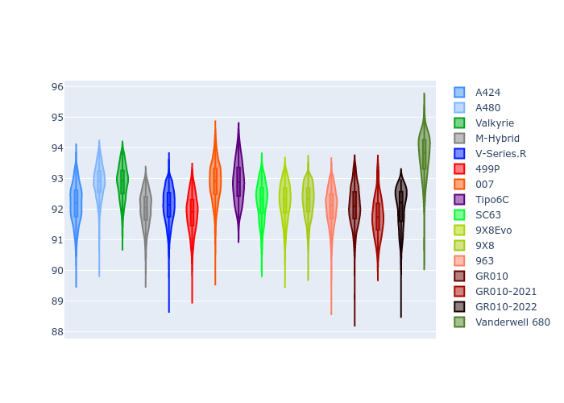
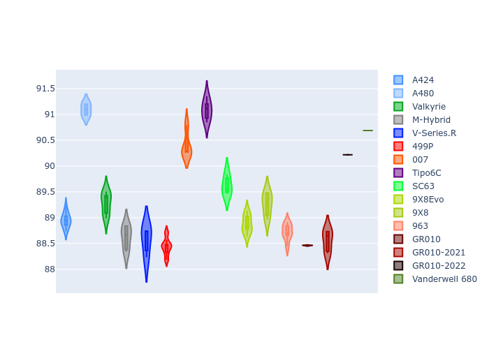
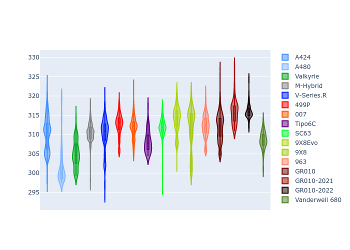
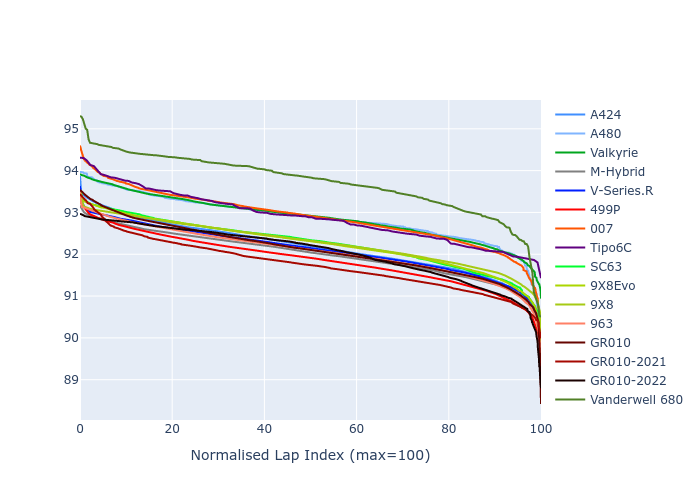

# Combined Plots

## Metadata

- BoP Accuracy: 96.74%
- Overall BoP Grade: A1
- Track: FUJI
- Threshhold: 250.0kph
- Average Laptime: 1:32.42
- Average Quali Laptime: 1:29.60
- Average Topspeed: 311.66kph

## BoP Table
| Manufacturer     | Car            | Weight   | Power   | PINC   | E/Stint   | FDS    | RDP    | QDP    | TDP    |
|:-----------------|:---------------|:---------|:--------|:-------|:----------|:-------|:-------|:-------|:-------|
| Alpine           | A424           | 1058kg   | 515.0kw | +0.70% | 918MJ     | -      | 51.64% | 59.31% | 26.80% |
| Alpine           | A480           | 990kg    | 421.0kw | +0.10% | 776MJ     | -      | 54.81% | 80.56% | 55.69% |
| Aston Martin     | Valkyrie       | 1037kg   | 513.0kw | -      | 905MJ     | -      | 53.50% | 53.33% | 21.51% |
| BMW              | M-Hybrid       | 1050kg   | 517.0kw | -      | 913MJ     | -      | 52.89% | 56.22% | 33.41% |
| Cadillac         | V-Series.R     | 1040kg   | 520.0kw | -      | 912MJ     | -      | 48.63% | 60.80% | 19.01% |
| Ferrari          | 499P           | 1068kg   | 503.0kw | +0.10% | 902MJ     | 190kph | 51.38% | 44.98% | 9.83%  |
| Glickenhaus      | 007            | 1031kg   | 520.0kw | -      | 910MJ     | -      | 46.15% | 49.30% | 41.45% |
| Isotta Fraschini | Tipo6C         | 1037kg   | 520.0kw | -      | 915MJ     | 190kph | 43.95% | 47.22% | 31.53% |
| Lamborghini      | SC63           | 1040kg   | 514.0kw | -      | 906MJ     | -      | 48.33% | 60.95% | 28.65% |
| Peugeot          | 9X8Evo         | 1055kg   | 516.0kw | -0.10% | 922MJ     | 190kph | 48.87% | 52.78% | 15.41% |
| Peugeot          | 9X8            | 1046kg   | 524.0kw | -      | 911MJ     | 150kph | 54.54% | 58.39% | 9.69%  |
| Porsche          | 963            | 1053kg   | 514.0kw | -0.10% | 909MJ     | -      | 50.70% | 44.30% | 29.51% |
| Toyota           | GR010          | 1069kg   | 501.0kw | +0.10% | 901MJ     | 190kph | 51.09% | 52.71% | 11.46% |
| Toyota           | GR010-2021     | 1055kg   | 509.0kw | -0.10% | 901MJ     | 150kph | 53.89% | 50.91% | 25.87% |
| Toyota           | GR010-2022     | 1055kg   | 503.0kw | -0.10% | 896MJ     | 190kph | 53.24% | 64.49% | 9.72%  |
| Vanwall          | Vanderwell 680 | 1030kg   | 520.0kw | -      | 903MJ     | -      | 35.83% | 59.29% | 34.15% |

## Performance Table
| Manufacturer     | Car            | RP      | QP      | Vavg      |   RDLC | BOP-Grade   | Match   |
|:-----------------|:---------------|:--------|:--------|:----------|-------:|:------------|:--------|
| Alpine           | A424           | 1:31.95 | 1:28.88 | 311.23kph |   1.03 | ~A1         | 99.88%  |
| Alpine           | A480           | 1:32.57 | 1:30.64 | 300.61kph |   1.02 | +A2         | 93.75%  |
| Aston Martin     | Valkyrie       | 1:32.57 | 1:29.03 | 311.87kph |   1.04 | ~A1         | 100.00% |
| BMW              | M-Hybrid       | 1:31.89 | 1:28.50 | 311.29kph |   1.04 | ~A1         | 99.94%  |
| Cadillac         | V-Series.R     | 1:31.75 | 1:28.39 | 310.45kph |   1.04 | ~A1         | 99.60%  |
| Ferrari          | 499P           | 1:32.58 | 1:28.96 | 312.03kph |   1.04 | ~A1         | 99.36%  |
| Glickenhaus      | 007            | 1:32.56 | 1:30.44 | 314.18kph |   1.02 | ~A1         | 98.63%  |
| Isotta Fraschini | Tipo6C         | 1:32.57 | 1:31.38 | 314.54kph |   1.01 | +A2         | 94.03%  |
| Lamborghini      | SC63           | 1:32.58 | 1:30.00 | 310.57kph |   1.03 | ~A1         | 100.00% |
| Peugeot          | 9X8Evo         | 1:32.42 | 1:29.22 | 312.81kph |   1.04 | ~A1         | 100.00% |
| Peugeot          | 9X8            | 1:32.20 | 1:29.53 | 311.66kph |   1.03 | ~A1         | 99.92%  |
| Porsche          | 963            | 1:32.01 | 1:28.78 | 312.95kph |   1.04 | ~A1         | 99.74%  |
| Toyota           | GR010          | 1:32.71 | 1:29.06 | 312.24kph |   1.04 | ~A1         | 98.35%  |
| Toyota           | GR010-2021     | 1:32.50 | 1:29.39 | 315.49kph |   1.03 | ~A1         | 96.20%  |
| Toyota           | GR010-2022     | 1:32.57 | 1:30.79 | 316.55kph |   1.02 | ~A1         | 99.85%  |
| Vanwall          | Vanderwell 680 | 1:33.24 | 1:30.59 | 308.12kph |   1.03 | +D1         | 68.63%  |

## Race Laptimes

## Quali Laptimes

## Topspeeds

## Laptimes Lineplot

