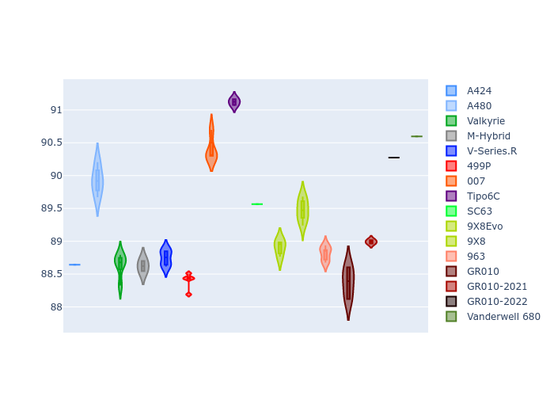
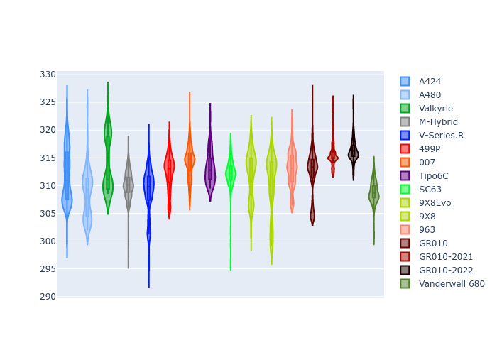

# Combined Plots

## Metadata

- BoP Accuracy: 92.55%
- Overall BoP Grade: A2
- Track: FUJI
- Threshhold: 210.0kph

## BoP Table
| Manufacturer     | Car            | Weight   | Power   | PINC   | E/Stint   | FDS    |
|:-----------------|:---------------|:---------|:--------|:-------|:----------|:-------|
| Alpine           | A424           | 1057kg   | 520.0kw | -1.00% | 918MJ     | -      |
| Alpine           | A480           | 1052kg   | 432.0kw | +1.00% | 784MJ     | -      |
| Aston Martin     | Valkyrie       | 1052kg   | 504.0kw | +1.00% | 901MJ     | -      |
| BMW              | M-Hybrid       | 1051kg   | 512.0kw | -1.00% | 907MJ     | -      |
| Cadillac         | V-Series.R     | 1044kg   | 510.0kw | +1.00% | 905MJ     | -      |
| Ferrari          | 499P           | 1073kg   | 508.0kw | -1.00% | 904MJ     | 190kph |
| Glickenhaus      | 007            | 1040kg   | 520.0kw | -      | 911MJ     | -      |
| Isotta Fraschini | Tipo6C         | 1059kg   | 520.0kw | -      | 917MJ     | 190kph |
| Lamborghini      | SC63           | 1052kg   | 519.0kw | -1.00% | 910MJ     | -      |
| Peugeot          | 9X8Evo         | 1060kg   | 510.0kw | -1.00% | 915MJ     | 190kph |
| Peugeot          | 9X8            | 1040kg   | 520.0kw | -      | 907MJ     | 150kph |
| Porsche          | 963            | 1057kg   | 516.0kw | -1.00% | 910MJ     | -      |
| Toyota           | GR010          | 1090kg   | 512.0kw | -1.00% | 911MJ     | 190kph |
| Toyota           | GR010OLD       | 1075kg   | 513.0kw | +1.00% | 964MJ     | 150kph |
| Vanwall          | Vanderwell 680 | 1030kg   | 520.0kw | -      | 903MJ     | -      |

## Performance Table
| Manufacturer     | Car            | RP      | QP      | Vavg      |   RDLC | BOP-Grade   | Match   |
|:-----------------|:---------------|:--------|:--------|:----------|-------:|:------------|:--------|
| Alpine           | A424           | 1:29.64 | 1:28.28 | 309.23kph |   1.02 | ~A1         | 99.77%  |
| Alpine           | A480           | 1:29.49 | 1:29.04 | 300.46kph |   1.01 | ~A1         | 98.99%  |
| Aston Martin     | Valkyrie       | 1:30.71 | 1:28.68 | 306.91kph |   1.02 | ~A1         | 97.81%  |
| BMW              | M-Hybrid       | 1:29.90 | 1:28.24 | 307.03kph |   1.02 | ~A1         | 99.96%  |
| Cadillac         | V-Series.R     | 1:30.01 | 1:28.42 | 305.57kph |   1.02 | ~A1         | 99.96%  |
| Ferrari          | 499P           | 1:29.53 | 1:27.82 | 307.62kph |   1.02 | ~A1         | 98.58%  |
| Glickenhaus      | 007            | 1:30.58 | 1:29.86 | 306.70kph |   1.01 | +A2         | 90.92%  |
| Isotta Fraschini | Tipo6C         | 1:31.00 | 1:31.13 | 307.56kph |   1    | +B1         | 86.57%  |
| Lamborghini      | SC63           | 1:30.73 | 1:29.78 | 307.27kph |   1.01 | +A2         | 94.93%  |
| Peugeot          | 9X8Evo         | 1:30.11 | 1:28.46 | 308.68kph |   1.02 | ~A1         | 99.41%  |
| Peugeot          | 9X8            | 1:30.23 | 1:28.89 | 302.81kph |   1.02 | ~A1         | 99.96%  |
| Porsche          | 963            | 1:29.81 | 1:28.22 | 307.44kph |   1.02 | ~A1         | 99.83%  |
| Toyota           | GR010          | 1:29.67 | 1:27.87 | 307.27kph |   1.02 | ~A1         | 99.31%  |
| Toyota           | GR010OLD       | 1:28.91 | 1:28.21 | 304.88kph |   1.01 | -A2         | 90.99%  |
| Vanwall          | Vanderwell 680 | 1:32.16 | 1:30.22 | 301.72kph |   1.02 | +Ω1         | 31.25%  |

## Race Laptimes

## Quali Laptimes

## Topspeeds

## Laptimes Lineplot

