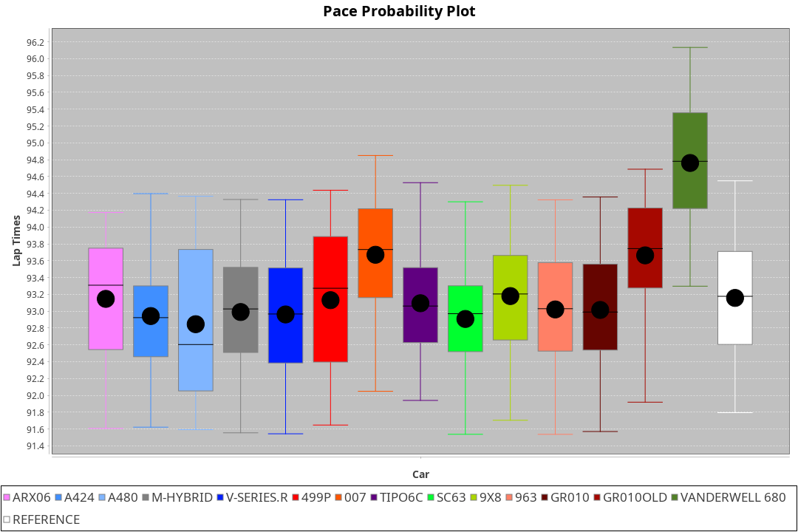
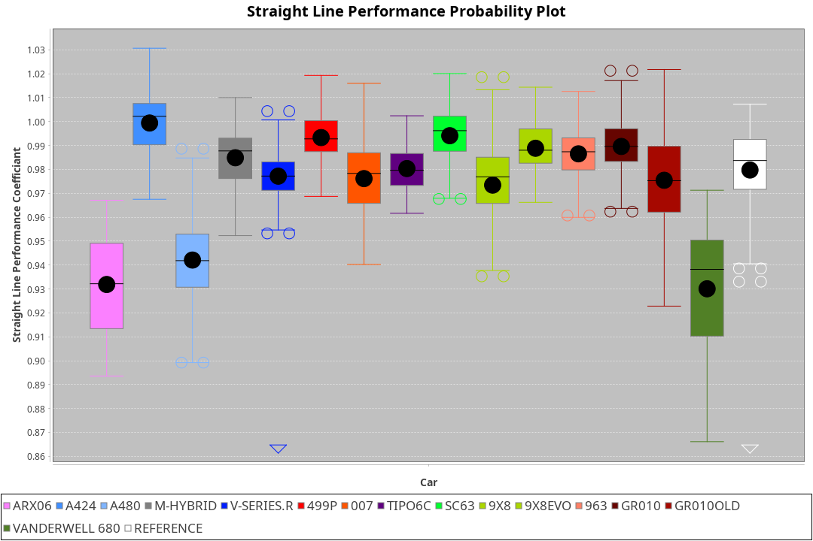
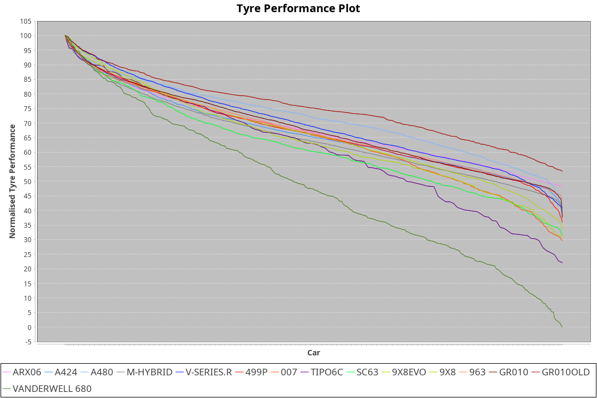

| Manufacturer     | Car            | Weight | Power   | PINC    | E/Stint | FDS     |
|:-|:-|:-|:-|:-|:-|:-|
| Acura            | ARX06          | 1100kg | 480.0kw | 1.00%   | 888MJ   |    -    |
| Alpine           | A424           | 1100kg | 480.0kw | 8.30%   | 907MJ   |    -    |
| Alpine           | A480           | 952kg  | 410.0kw | 1.00%   | 764MJ   |    -    |
| Aston Martin     | Valkyrie       | 1088kg | 480.0kw | 8.30%   | 900MJ   |    -    |
| BMW              | M-Hybrid       | 1100kg | 480.0kw | 8.30%   | 904MJ   |    -    |
| Cadillac         | V-Series.R     | 1100kg | 480.0kw | 8.30%   | 900MJ   |    -    |
| Ferrari          | 499P           | 1100kg | 480.0kw | -1.00%  | 882MJ   | 200kph  |
| Glickenhaus      | 007            | 1032kg | 484.0kw | -1.00%  | 876MJ   |    -    |
| Isotta Fraschini | Tipo6C         | 1095kg | 520.0kw | -1.00%  | 919MJ   | 190kph  |
| Lamborghini      | SC63           | 1100kg | 506.0kw | 2.70%   | 909MJ   |    -    |
| Peugeot          | 9X8Evo         | 1077kg | 480.0kw |    -    | 892MJ   | 200kph  |
| Peugeot          | 9X8            | 1077kg | 518.0kw |    -    | 909MJ   | 200kph  |
| Porsche          | 963            | 1100kg | 480.0kw | 8.30%   | 902MJ   |    -    |
| Toyota           | GR010          | 1100kg | 480.0kw | -1.00%  | 883MJ   | 200kph  |
| Toyota           | GR010OLD       | 1100kg | 480.0kw |    -    | 932MJ   | 200kph  |
| Vanwall          | Vanderwell 680 | 1030kg | 520.0kw |    -    | 903MJ   |    -    |

### BoP Accuracy: 82.93%; Overall BoP Grade: B2
| Manufacturer     | Car            | Type  | RP      | QP      | Weight | Power¹  | Threshhold | PINC    | Power²   | E/Stint | AVG Vmax  | FDS     | RDLC | L/Stint | BOP-Grade | Model Accuracy | Model Points | Match%  | SimDiff |
|:-|:-|:-|:-|:-|:-|:-|:-|:-|:-|:-|:-|:-|:-|:-|:-|:-|:-|:-|:-|
| Acura            | ARX06          | LMDH  | 1:31.31 | 1:29.44 | 1100kg | 480.0kw | 210.0kph   | 1.00%   | 484.80kw |  888MJ  | 301.37kph |    -    | 0.98 | 40      | +B2       | 100.00%        | 996          | 80.20%  | #       |
| Alpine           | A424           | LMDH  | 1:31.05 | 1:29.45 | 1100kg | 480.0kw | 210.0kph   | 8.30%   | 519.80kw |  907MJ  | 303.02kph |    -    | 0.98 | 40      | -B2       | 98.45%         | 2220         | 83.24%  | #       |
| Alpine           | A480           | LMP1  | 1:30.49 | 1:29.78 |  952kg | 410.0kw | 210.0kph   | 1.00%   | 414.10kw |  764MJ  | 303.93kph |    -    | 0.98 | 37      | -E2       | 95.90%         | 1706         | 50.21%  | +0.59   |
| Aston Martin     | Valkyrie       | LMHNH | 1:31.63 | 1:29.51 | 1088kg | 480.0kw | 210.0kph   | 8.30%   | 519.80kw |  900MJ  | 303.70kph |    -    | 0.99 | 40      | +D1       | 100.00%        | 466          | 69.51%  | #       |
| BMW              | M-Hybrid       | LMDH  | 1:31.23 | 1:29.34 | 1100kg | 480.0kw | 210.0kph   | 8.30%   | 519.80kw |  904MJ  | 304.91kph |    -    | 0.98 | 40      | -A2       | 100.00%        | 3339         | 92.21%  | #       |
| Cadillac         | V-Series.R     | LMDH  | 1:31.32 | 1:29.36 | 1100kg | 480.0kw | 210.0kph   | 8.30%   | 519.80kw |  900MJ  | 306.44kph |    -    | 0.98 | 40      | ~A1       | 99.03%         | 6041         | 99.27%  | #       |
| Ferrari          | 499P           | LMHHU | 1:31.36 | 1:29.31 | 1100kg | 480.0kw | 210.0kph   | -1.00%  | 475.20kw |  882MJ  | 300.24kph | 200kph  | 1.01 | 40      | ~A1       | 99.97%         | 7286         | 100.00% | #       |
| Glickenhaus      | 007            | LMHNH | 1:31.76 | 1:30.84 | 1032kg | 484.0kw | 210.0kph   | -1.00%  | 479.20kw |  876MJ  | 309.15kph |    -    | 0.96 | 40      | +C1       | 93.90%         | 2170         | 77.59%  | #       |
| Isotta Fraschini | Tipo6C         | LMHHU | 1:31.64 | 1:31.52 | 1095kg | 520.0kw | 210.0kph   | -1.00%  | 514.80kw |  919MJ  | 308.71kph | 190kph  | 1.02 | 40      | +D1       | 98.48%         | 130          | 65.03%  | #       |
| Lamborghini      | SC63           | LMDH  | 1:31.55 | 1:30.66 | 1100kg | 506.0kw | 210.0kph   | 2.70%   | 519.70kw |  909MJ  | 302.65kph |    -    | 1.01 | 40      | ~A1       | 100.00%        | 784          | 96.67%  | #       |
| Peugeot          | 9X8Evo         | LMHHU | 1:31.63 | 1:29.84 | 1077kg | 480.0kw | 210.0kph   |    -    | 480.00kw |  892MJ  | 310.06kph | 200kph  | 0.98 | 40      | +C1       | 100.00%        | 1890         | 76.86%  | #       |
| Peugeot          | 9X8            | LMHHE | 1:31.63 | 1:29.98 | 1077kg | 518.0kw | 210.0kph   |    -    | 518.00kw |  909MJ  | 306.52kph | 200kph  | 1.00 | 40      | ~A1       | 98.18%         | 4753         | 100.00% | +1.96   |
| Porsche          | 963            | LMDH  | 1:31.04 | 1:29.14 | 1100kg | 480.0kw | 210.0kph   | 8.30%   | 519.80kw |  902MJ  | 304.82kph |    -    | 0.98 | 40      | -B2       | 99.89%         | 15174        | 81.06%  | #       |
| Toyota           | GR010          | LMHHU | 1:31.31 | 1:29.35 | 1100kg | 480.0kw | 210.0kph   | -1.00%  | 475.20kw |  883MJ  | 299.26kph | 200kph  | 1.01 | 40      | ~A1       | 99.82%         | 5457         | 98.03%  | #       |
| Toyota           | GR010OLD       | LMHHE | 1:31.13 | 1:30.27 | 1100kg | 480.0kw | 210.0kph   |    -    | 480.00kw |  932MJ  | 307.12kph | 200kph  | 1.00 | 40      | -B1       | 100.00%        | 930          | 86.30%  | #       |
| Vanwall          | Vanderwell 680 | LMHNH | 1:32.11 | 1:30.05 | 1030kg | 520.0kw | 210.0kph   |    -    | 520.00kw |  903MJ  | 311.15kph |    -    | 1.02 | 40      | +C2       | 96.27%         | 645          | 70.67%  | +1.50   |

## Power below Threshhold
| N/Nmax    | ARX06   | A424    | VALKYRIE | M-HYBRID | V-SERIES.R | 499P    | 007     | TIPO6C  | SC63    | 9X8EVO  | 9X8     | 963     | GR010   | GR010OLD | VANDERWELL 680 | ​     | RPM      | A480            |
|:-|:-|:-|:-|:-|:-|:-|:-|:-|:-|:-|:-|:-|:-|:-|:-|:-|:-|:-|
|  0.550    |  236    |  236    |  236     |  236     |  236       |  236    |  238    |  256    |  249    |  236    |  255    |  236    |  236    |  236     |  256           |  ​    |   --     |  0.00           |
|  0.575    |  258    |  258    |  258     |  258     |  258       |  258    |  260    |  279    |  272    |  258    |  278    |  258    |  258    |  258     |  279           |  ​    |   --     |  0.00           |
|  0.600    |  277    |  277    |  277     |  277     |  277       |  277    |  279    |  300    |  292    |  277    |  299    |  277    |  277    |  277     |  300           |  ​    |   --     |  0.00           |
|  0.625    |  297    |  297    |  297     |  297     |  297       |  297    |  299    |  322    |  313    |  297    |  321    |  297    |  297    |  297     |  322           |  ​    |   --     |  0.00           |
|  0.650    |  317    |  317    |  317     |  317     |  317       |  317    |  320    |  343    |  334    |  317    |  342    |  317    |  317    |  317     |  343           |  ​    |   --     |  0.00           |
|  0.675    |  337    |  337    |  337     |  337     |  337       |  337    |  340    |  365    |  355    |  337    |  364    |  337    |  337    |  337     |  365           |  ​    |   --     |  0.00           |
|  0.700    |  358    |  358    |  358     |  358     |  358       |  358    |  361    |  387    |  377    |  358    |  386    |  358    |  358    |  358     |  387           |  ​    |   --     |  0.00           |
|  0.725    |  378    |  378    |  378     |  378     |  378       |  378    |  381    |  409    |  398    |  378    |  407    |  378    |  378    |  378     |  409           |  ​    |   --     |  0.00           |
|  0.750    |  397    |  397    |  397     |  397     |  397       |  397    |  400    |  430    |  418    |  397    |  428    |  397    |  397    |  397     |  430           |  ​    |   --     |  0.00           |
|  0.775    |  415    |  415    |  415     |  415     |  415       |  415    |  418    |  449    |  437    |  415    |  447    |  415    |  415    |  415     |  449           |  ​    |  5000    |  -3,230,388.94  |
|  0.800    |  431    |  431    |  431     |  431     |  431       |  431    |  435    |  467    |  454    |  431    |  465    |  431    |  431    |  431     |  467           |  ​    |  5500    |  -3,518,297.92  |
|  0.825    |  445    |  445    |  445     |  445     |  445       |  445    |  449    |  482    |  469    |  445    |  480    |  445    |  445    |  445     |  482           |  ​    |  5999    |  -3,820,291.39  |
|  0.850    |  456    |  456    |  456     |  456     |  456       |  456    |  460    |  494    |  481    |  456    |  492    |  456    |  456    |  456     |  494           |  ​    |  6499    |  -4,136,369.35  |
|  0.875    |  466    |  466    |  466     |  466     |  466       |  466    |  470    |  505    |  491    |  466    |  503    |  466    |  466    |  466     |  505           |  ​    |  7000    |  -4,466,531.81  |
|  0.900    |  472    |  472    |  472     |  472     |  472       |  472    |  476    |  512    |  498    |  472    |  510    |  472    |  472    |  472     |  512           |  ​    |  7500    |  -4,810,778.75  |
|  0.925    |  477    |  477    |  477     |  477     |  477       |  477    |  481    |  517    |  503    |  477    |  515    |  477    |  477    |  477     |  517           |  ​    |  8000    |  409.07         |
| **0.950** | **480** | **480** | **480**  | **480**  | **480**    | **480** | **484** | **520** | **506** | **480** | **518** | **480** | **480** | **480**  | **520**        | **​** | **8499** | **412.07**      |
|  0.975    |  478    |  478    |  478     |  478     |  478       |  478    |  482    |  518    |  504    |  478    |  516    |  478    |  478    |  478     |  518           |  ​    |  9000    |  206.04         |
|  1.000    |  475    |  475    |  475     |  475     |  475       |  475    |  479    |  514    |  501    |  475    |  512    |  475    |  475    |  475     |  514           |  ​    |   --     |  0.00           |
|  1.025    |  410    |  410    |  410     |  410     |  410       |  410    |  413    |  444    |  432    |  410    |  442    |  410    |  410    |  410     |  444           |  ​    |   --     |  0.00           |

## Power above Threshhold
| N/Nmax    | ARX06      | A424       | VALKYRIE   | M-HYBRID   | V-SERIES.R | 499P          | 007           | TIPO6C     | SC63       | 9X8EVO  | 9X8     | 963        | GR010         | GR010OLD | VANDERWELL 680 | ​     | RPM      | A480            |
|:-|:-|:-|:-|:-|:-|:-|:-|:-|:-|:-|:-|:-|:-|:-|:-|:-|:-|:-|
|  0.550    |  238.39    |  256.41    |  256.41    |  256.41    |  256.41    |  234.10       |  236.08       |  253.39    |  256.33    |  236    |  255    |  256.41    |  234.10       |  236     |  256           |  ​    |   --     |  0.00           |
|  0.575    |  260.43    |  279.45    |  279.45    |  279.45    |  279.45    |  255.11       |  257.09       |  276.43    |  279.36    |  258    |  278    |  279.45    |  255.11       |  258     |  279           |  ​    |   --     |  0.00           |
|  0.600    |  279.46    |  299.48    |  299.48    |  299.48    |  299.48    |  274.12       |  277.09       |  297.46    |  299.38    |  277    |  299    |  299.48    |  274.12       |  277     |  300           |  ​    |   --     |  0.00           |
|  0.625    |  299.49    |  321.52    |  321.52    |  321.52    |  321.52    |  294.12       |  296.10       |  318.49    |  321.41    |  297    |  321    |  321.52    |  294.12       |  297     |  322           |  ​    |   --     |  0.00           |
|  0.650    |  320.53    |  342.55    |  342.55    |  342.55    |  342.55    |  314.13       |  316.11       |  339.53    |  342.44    |  317    |  342    |  342.55    |  314.13       |  317     |  343           |  ​    |   --     |  0.00           |
|  0.675    |  340.56    |  364.59    |  364.59    |  364.59    |  364.59    |  334.14       |  337.11       |  361.56    |  364.46    |  337    |  364    |  364.59    |  334.14       |  337     |  365           |  ​    |   --     |  0.00           |
|  0.700    |  361.60    |  386.62    |  386.62    |  386.62    |  386.62    |  354.15       |  357.12       |  383.60    |  386.49    |  358    |  386    |  386.62    |  354.15       |  358     |  387           |  ​    |   --     |  0.00           |
|  0.725    |  381.63    |  408.66    |  408.66    |  408.66    |  408.66    |  374.16       |  377.13       |  404.63    |  408.52    |  378    |  407    |  408.66    |  374.16       |  378     |  409           |  ​    |   --     |  0.00           |
|  0.750    |  400.66    |  429.69    |  429.69    |  429.69    |  429.69    |  393.17       |  396.13       |  425.66    |  429.55    |  397    |  428    |  429.69    |  393.17       |  397     |  430           |  ​    |   --     |  0.00           |
|  0.775    |  418.69    |  448.73    |  448.73    |  448.73    |  448.73    |  410.17       |  414.14       |  444.69    |  448.57    |  415    |  447    |  448.73    |  410.17       |  415     |  449           |  ​    |  5000    |  -3,230,388.94  |
|  0.800    |  435.72    |  466.75    |  466.75    |  466.75    |  466.75    |  427.18       |  430.14       |  462.72    |  466.59    |  431    |  465    |  466.75    |  427.18       |  431     |  467           |  ​    |  5500    |  -3,518,297.92  |
|  0.825    |  449.74    |  481.78    |  481.78    |  481.78    |  481.78    |  441.19       |  444.15       |  477.74    |  481.61    |  445    |  480    |  481.78    |  441.19       |  445     |  482           |  ​    |  5999    |  -3,820,291.39  |
|  0.850    |  460.76    |  493.80    |  493.80    |  493.80    |  493.80    |  452.19       |  456.15       |  488.76    |  493.63    |  456    |  492    |  493.80    |  452.19       |  456     |  494           |  ​    |  6499    |  -4,136,369.35  |
|  0.875    |  470.78    |  504.82    |  504.82    |  504.82    |  504.82    |  461.19       |  465.16       |  499.78    |  504.64    |  466    |  503    |  504.82    |  461.19       |  466     |  505           |  ​    |  7000    |  -4,466,531.81  |
|  0.900    |  476.79    |  511.83    |  511.83    |  511.83    |  511.83    |  468.20       |  472.16       |  506.79    |  511.65    |  472    |  510    |  511.83    |  468.20       |  472     |  512           |  ​    |  7500    |  -4,810,778.75  |
|  0.925    |  481.80    |  516.84    |  516.84    |  516.84    |  516.84    |  472.20       |  476.16       |  511.80    |  516.66    |  477    |  515    |  516.84    |  472.20       |  477     |  517           |  ​    |  8000    |  409.07         |
| **0.950** | **484.80** | **519.84** | **519.84** | **519.84** | **519.84** | **475.20**    | **479.16**    | **514.80** | **519.66** | **480** | **518** | **519.84** | **475.20**    | **480**  | **520**        | **​** | **8499** | **412.07**      |
|  0.975    |  482.80    |  517.84    |  517.84    |  517.84    |  517.84    |  -576,041.44  |  -580,790.94  |  512.80    |  517.66    |  478    |  516    |  517.84    |  -576,041.44  |  478     |  518           |  ​    |  9000    |  206.04         |
|  1.000    |  479.79    |  513.83    |  513.83    |  513.83    |  513.83    |  -610,817.08  |  -615,853.64  |  508.79    |  513.65    |  475    |  512    |  513.83    |  -610,817.08  |  475     |  514           |  ​    |   --     |  0.00           |
|  1.025    |  413.68    |  443.72    |  443.72    |  443.72    |  443.72    |  405.17       |  409.14       |  439.68    |  443.57    |  410    |  442    |  443.72    |  405.17       |  410     |  444           |  ​    |   --     |  0.00           |
