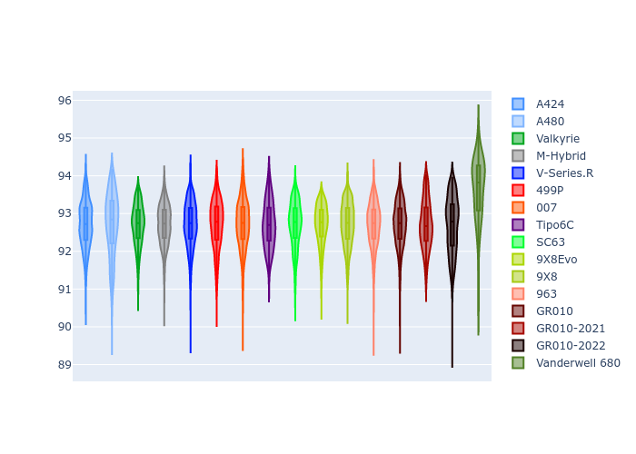
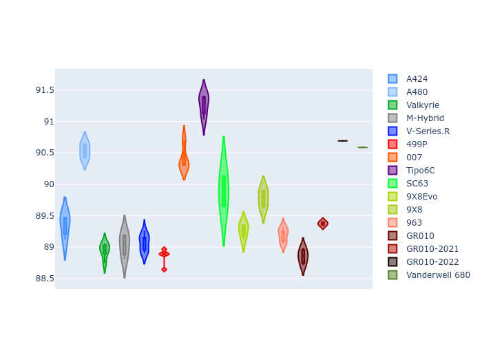
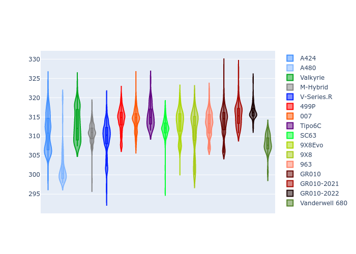
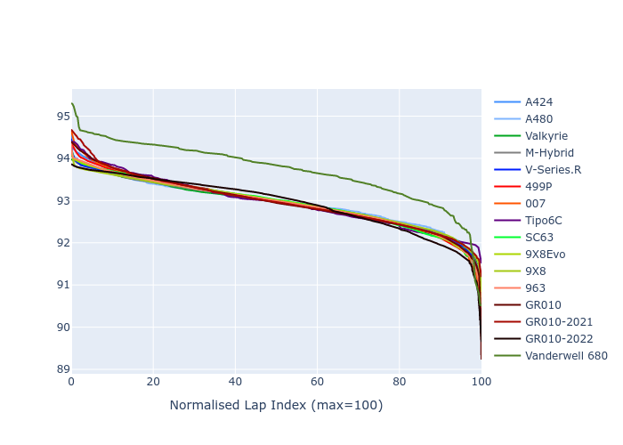

# Combined Plots

## Metadata

- BoP Accuracy: 97.73%
- Overall BoP Grade: A1
- Track: FUJI
- Threshhold: 250.0kph
- Average Laptime: 1:32.52
- Average Quali Laptime: 1:29.69
- Average Topspeed: 311.50kph

## BoP Table
| Manufacturer     | Car            | Weight   | Power   | PINC   | E/Stint   | FDS    | RDP    | QDP    | TDP    |
|:-----------------|:---------------|:---------|:--------|:-------|:----------|:-------|:-------|:-------|:-------|
| Alpine           | A424           | 1070kg   | 506.0kw | +2.70% | 917MJ     | -      | 51.64% | 59.31% | 26.80% |
| Alpine           | A480           | 963kg    | 410.0kw | +0.10% | 764MJ     | -      | 54.81% | 80.56% | 55.69% |
| Aston Martin     | Valkyrie       | 1047kg   | 520.0kw | -      | 913MJ     | -      | 53.50% | 53.33% | 21.51% |
| BMW              | M-Hybrid       | 1067kg   | 509.0kw | +2.10% | 914MJ     | -      | 52.89% | 56.22% | 33.41% |
| Cadillac         | V-Series.R     | 1062kg   | 517.0kw | +0.50% | 913MJ     | -      | 48.63% | 60.80% | 19.01% |
| Ferrari          | 499P           | 1069kg   | 484.0kw | +7.40% | 904MJ     | 190kph | 51.38% | 44.98% | 9.83%  |
| Glickenhaus      | 007            | 1030kg   | 520.0kw | -      | 910MJ     | -      | 46.15% | 49.30% | 41.45% |
| Isotta Fraschini | Tipo6C         | 1033kg   | 520.0kw | -      | 914MJ     | 190kph | 43.95% | 47.22% | 31.53% |
| Lamborghini      | SC63           | 1048kg   | 520.0kw | -      | 912MJ     | -      | 48.33% | 60.95% | 28.65% |
| Peugeot          | 9X8Evo         | 1046kg   | 498.0kw | +4.00% | 916MJ     | 190kph | 48.87% | 52.78% | 15.41% |
| Peugeot          | 9X8            | 1047kg   | 520.0kw | -      | 908MJ     | 150kph | 54.54% | 58.39% | 9.69%  |
| Porsche          | 963            | 1060kg   | 497.0kw | +4.10% | 906MJ     | -      | 50.70% | 44.30% | 29.51% |
| Toyota           | GR010          | 1065kg   | 488.0kw | +5.20% | 902MJ     | 190kph | 51.09% | 52.71% | 11.46% |
| Toyota           | GR010-2021     | 1058kg   | 519.0kw | -2.70% | 903MJ     | 150kph | 53.89% | 50.91% | 25.87% |
| Toyota           | GR010-2022     | 1052kg   | 520.0kw | -5.40% | 896MJ     | 190kph | 53.24% | 64.49% | 9.72%  |
| Vanwall          | Vanderwell 680 | 1030kg   | 520.0kw | -      | 903MJ     | -      | 35.83% | 59.29% | 34.15% |

## Performance Table
| Manufacturer     | Car            | RP      | QP      | Vavg      |   RDLC | BOP-Grade   | Match   |
|:-----------------|:---------------|:--------|:--------|:----------|-------:|:------------|:--------|
| Alpine           | A424           | 1:32.45 | 1:29.35 | 309.76kph |   1.03 | ~A1         | 99.36%  |
| Alpine           | A480           | 1:32.45 | 1:30.53 | 300.74kph |   1.02 | ~A1         | 97.50%  |
| Aston Martin     | Valkyrie       | 1:32.47 | 1:28.94 | 312.32kph |   1.04 | ~A1         | 100.00% |
| BMW              | M-Hybrid       | 1:32.47 | 1:29.03 | 309.61kph |   1.04 | ~A1         | 100.00% |
| Cadillac         | V-Series.R     | 1:32.47 | 1:29.06 | 307.91kph |   1.04 | ~A1         | 99.86%  |
| Ferrari          | 499P           | 1:32.47 | 1:28.86 | 314.01kph |   1.04 | ~A1         | 99.96%  |
| Glickenhaus      | 007            | 1:32.53 | 1:30.41 | 314.29kph |   1.02 | ~A1         | 99.17%  |
| Isotta Fraschini | Tipo6C         | 1:32.46 | 1:31.27 | 314.98kph |   1.01 | ~A1         | 96.27%  |
| Lamborghini      | SC63           | 1:32.46 | 1:29.89 | 311.01kph |   1.03 | ~A1         | 100.00% |
| Peugeot          | 9X8Evo         | 1:32.47 | 1:29.27 | 313.43kph |   1.04 | ~A1         | 100.00% |
| Peugeot          | 9X8            | 1:32.45 | 1:29.77 | 310.69kph |   1.03 | ~A1         | 99.96%  |
| Porsche          | 963            | 1:32.45 | 1:29.19 | 312.15kph |   1.04 | ~A1         | 99.91%  |
| Toyota           | GR010          | 1:32.48 | 1:28.85 | 314.23kph |   1.04 | ~A1         | 99.66%  |
| Toyota           | GR010-2021     | 1:32.48 | 1:29.37 | 314.98kph |   1.03 | ~A1         | 98.84%  |
| Toyota           | GR010-2022     | 1:32.47 | 1:30.69 | 315.70kph |   1.02 | ~A1         | 99.70%  |
| Vanwall          | Vanderwell 680 | 1:33.24 | 1:30.59 | 308.12kph |   1.03 | +C2         | 73.53%  |

## Race Laptimes

## Quali Laptimes

## Topspeeds

## Laptimes Lineplot

