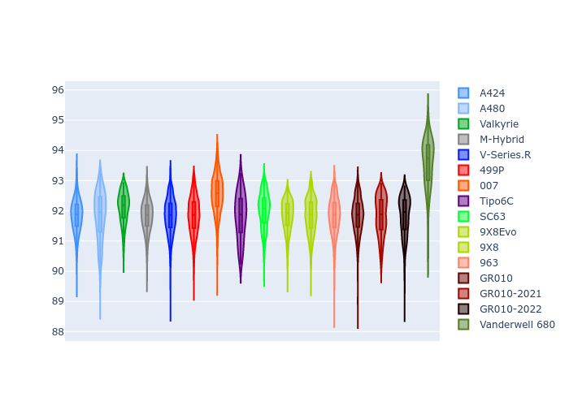
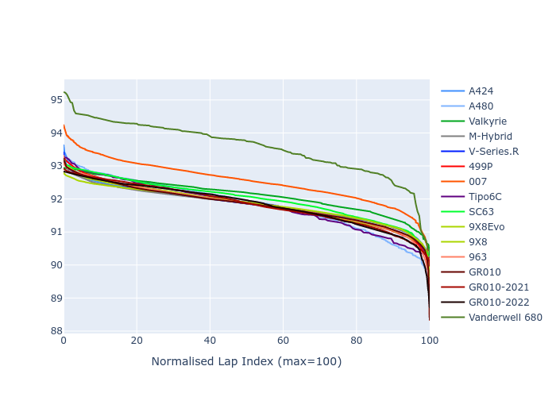

# Combined Plots

## Metadata

- BoP Accuracy: 96.51%
- Overall BoP Grade: A1
- Track: FUJI
- Threshhold: 250.0kph

## BoP Table
| Manufacturer     | Car            | Weight   | Power   | PINC   | E/Stint   | FDS    | RDP    | QDP    | TDP    |
|:-----------------|:---------------|:---------|:--------|:-------|:----------|:-------|:-------|:-------|:-------|
| Alpine           | A424           | 1077kg   | 480.0kw | +0.10% | 886MJ     | -      | 52.35% | 61.85% | 27.84% |
| Alpine           | A480           | 952kg    | 410.0kw | +0.10% | 763MJ     | -      | 54.51% | 76.19% | 54.04% |
| Aston Martin     | Valkyrie       | 1047kg   | 480.0kw | -      | 877MJ     | -      | 53.59% | 53.33% | 21.51% |
| BMW              | M-Hybrid       | 1081kg   | 480.0kw | +1.40% | 887MJ     | -      | 53.26% | 57.23% | 34.54% |
| Cadillac         | V-Series.R     | 1100kg   | 480.0kw | +6.40% | 898MJ     | -      | 47.80% | 56.73% | 19.63% |
| Ferrari          | 499P           | 1100kg   | 480.0kw | -      | 884MJ     | 190kph | 53.02% | 42.32% | 9.88%  |
| Glickenhaus      | 007            | 1062kg   | 483.0kw | +3.90% | 890MJ     | -      | 46.49% | 46.07% | 47.78% |
| Isotta Fraschini | Tipo6C         | 1084kg   | 520.0kw | -2.30% | 914MJ     | 190kph | 43.95% | 47.22% | 31.53% |
| Lamborghini      | SC63           | 1077kg   | 501.0kw | -0.10% | 898MJ     | -      | 46.33% | 59.50% | 29.33% |
| Peugeot          | 9X8Evo         | 1061kg   | 480.0kw | -      | 890MJ     | 190kph | 48.47% | 51.26% | 16.02% |
| Peugeot          | 9X8            | 1100kg   | 485.0kw | +7.20% | 900MJ     | 150kph | 54.07% | 57.08% | 10.80% |
| Porsche          | 963            | 1078kg   | 480.0kw | +0.60% | 883MJ     | -      | 50.87% | 45.25% | 30.77% |
| Toyota           | GR010          | 1100kg   | 480.0kw | -      | 885MJ     | 200kph | 52.43% | 57.12% | 12.82% |
| Toyota           | GR010-2021     | 1100kg   | 481.0kw | +8.10% | 901MJ     | 200kph | 54.09% | 52.67% | 26.37% |
| Toyota           | GR010-2022     | 1100kg   | 480.0kw | +1.70% | 884MJ     | 200kph | 53.48% | 69.44% | 7.86%  |
| Vanwall          | Vanderwell 680 | 1052kg   | 520.0kw | -      | 905MJ     | -      | 53.41% | 56.28% | 29.85% |

## Performance Table
| Manufacturer     | Car            | RP      | QP      | Vavg      |   RDLC | BOP-Grade   | Match   |
|:-----------------|:---------------|:--------|:--------|:----------|-------:|:------------|:--------|
| Alpine           | A424           | 1:32.78 | 1:31.15 | 299.05kph |   1.02 | ~A1         | 98.91%  |
| Alpine           | A480           | 1:30.63 | 1:29.94 | 295.86kph |   1.01 | -D2         | 63.29%  |
| Aston Martin     | Valkyrie       | 1:32.78 | 1:30.61 | 301.24kph |   1.02 | ~A1         | 100.00% |
| BMW              | M-Hybrid       | 1:32.77 | 1:30.81 | 298.84kph |   1.02 | ~A1         | 98.73%  |
| Cadillac         | V-Series.R     | 1:32.76 | 1:30.83 | 297.56kph |   1.02 | ~A1         | 99.62%  |
| Ferrari          | 499P           | 1:32.74 | 1:30.35 | 299.40kph |   1.03 | ~A1         | 99.93%  |
| Glickenhaus      | 007            | 1:32.77 | 1:31.98 | 299.61kph |   1.01 | +A2         | 94.88%  |
| Isotta Fraschini | Tipo6C         | 1:32.78 | 1:32.97 | 302.96kph |   1    | ~A1         | 95.52%  |
| Lamborghini      | SC63           | 1:32.79 | 1:31.71 | 301.52kph |   1.01 | ~A1         | 99.52%  |
| Peugeot          | 9X8Evo         | 1:32.79 | 1:30.99 | 302.69kph |   1.02 | ~A1         | 98.41%  |
| Peugeot          | 9X8            | 1:32.73 | 1:30.97 | 293.75kph |   1.02 | ~A1         | 99.94%  |
| Porsche          | 963            | 1:32.77 | 1:30.87 | 299.04kph |   1.02 | ~A1         | 99.57%  |
| Toyota           | GR010          | 1:32.74 | 1:30.25 | 300.41kph |   1.03 | ~A1         | 99.71%  |
| Toyota           | GR010-2021     | 1:32.31 | 1:30.74 | 297.80kph |   1.02 | ~A1         | 99.85%  |
| Toyota           | GR010-2022     | 1:32.55 | 1:31.68 | 299.61kph |   1.01 | ~A1         | 100.00% |
| Vanwall          | Vanderwell 680 | 1:32.78 | 1:30.84 | 299.42kph |   1.02 | ~A1         | 96.28%  |

## Race Laptimes

## Quali Laptimes

## Topspeeds

## Laptimes Lineplot

